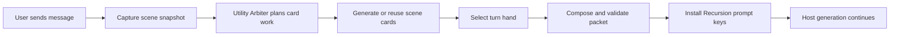
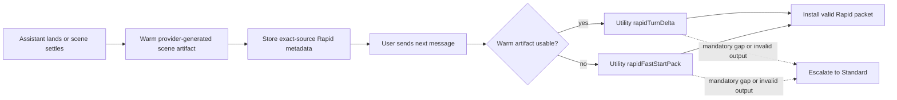
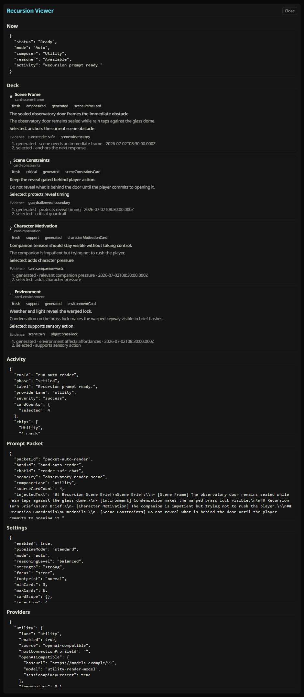

# Recursion

Recursion is a SillyTavern extension for roleplay sessions where the model has the context, but still misses what matters in the next reply.

It reads the active chat, reasons over the immediate scene, builds a compact deck of scene cards, and chooses the cards that matter right now. Before generation, it turns that work into an inspectable prompt packet so the next response has a sharper sense of pressure, intent, constraints, consequences, hidden boundaries, environmental affordances, and unresolved threads.

Recursion is a focused scene reasoning layer for the moment in front of you.

## Why Use It

LLMs can lose the practical shape of a scene even when the relevant text is still in context. They remember that a room exists, but miss the locked door. They know a character is angry, but fail to let that anger change the exchange. They know a secret, but reveal it too early.

Recursion is built for that gap. It helps the model notice what the scene is asking for before it writes.

| What Recursion adds | Why it matters |
| --- | --- |
| Scene cards | Breaks the current situation into usable reasoning pieces: motivations, social subtext, consequences, knowledge, environment, items, and open threads. |
| Turn hand selection | Chooses the cards that matter for this reply, so the prompt does not become a pile of every possible note. |
| Utility and Reasoner lanes | Uses a reliable Utility lane for planning, with an optional Reasoner lane when you want deeper synthesis. |
| Auto and Manual modes | Lets you choose whether Recursion prepares replies automatically or only when you ask it to. |
| Inspectable prompt packet | Shows what Recursion injected, why cards were selected, what was left out, and where fallback behavior occurred. |
| SillyTavern-native UI | Keeps controls, progress, Last Brief, settings, and the Full Viewer close to the chat instead of hiding them in a separate workflow. |

## Stepped Thinking vs Recursion

Stepped Thinking and Recursion both improve a reply before it is generated, but they solve different problems.

Stepped Thinking gives a character a private pre-generation pass. It asks the model to generate inner thoughts, plans, emotions, or other user-defined material before the visible reply. If the missing piece is character interiority, that is the right category: what a character feels, intends, hides, or thinks before speaking. It also runs the risk of inadvertently injecting secrets, mind reading, and inner thoughts that shouldn't be public.

Recursion goes after a broader failure mode. In long or complex roleplay, the model can have the right text in context and still miss what the scene demands next. It forgets the locked door, ignores the implied threat, reveals a secret too early, treats a major emotional shift as flavor, or misses that an item, relationship, or environmental detail should change the reply.

Instead of generating one stream of character thoughts, Recursion builds a scene deck across motivations, social subtext, consequences, knowledge, environment, items, and open threads. It then selects a turn hand, giving the prompt details that matter now, helping the model focus on what is important given the context.

## What It Does

On a run, Recursion turns the active SillyTavern chat into a short-lived reasoning brief for the next generation:

1. It builds a bounded snapshot of the current scene.
2. It runs either the Standard or Rapid pipeline, depending on the selected pipeline mode.
3. It uses the Utility provider to plan, update scene cards, select the turn hand, or run a Rapid foreground delta.
4. It can use the Reasoner provider for deeper synthesis at higher reasoning levels.
5. It composes a prompt packet with a Scene Brief, Turn Brief, guardrails, card references, omissions, and metadata.
6. It injects the packet through Recursion-owned SillyTavern prompt entries.

## Standard vs Rapid Pipelines

Pipeline controls are separate from Auto and Manual. Auto and Manual decide when Recursion prepares guidance; Standard and Rapid decide how much scene work happens in the send path.

Standard is the default reference pipeline. When you send a message, Recursion performs the full foreground sequence: snapshot, Utility Arbiter planning, card generation or reuse, hand selection, composition, validation, and prompt install. Use Standard when you want maximum coverage, when a scene has shifted, or when you want the most debuggable behavior.

Rapid is the lower-latency pipeline. It warms provider-generated scene guidance in the background after an assistant message lands or the scene settles, then uses a short Utility `rapidTurnDelta` on the next send. If no exact warm artifact is ready, Rapid asks Utility for a compact `rapidFastStartPack`. If Rapid output is invalid or the provider marks a mandatory gap, Recursion escalates that turn to Standard rather than inventing local Rapid guidance.

## Fast Start

1. Install as a SillyTavern extension and refresh your browser.
2. Configure and test the Utility provider, and add the optional Reasoner provider if you want a deeper synthesis lane.
3. Start with the `Standard` pipeline while you confirm behavior in a scene.
4. Use `Auto` when you want Recursion to prepare the next reply on its own. Use `Manual` for explicit card selection.
5. Switch to `Rapid` when you want warmed scene guidance plus a shorter send-time delta.
6. Open `Last Brief` or the Full Viewer whenever you want to see what Recursion prepared.

For a guided first session, start with [First Run Workflow](docs/user/FIRST_RUN_WORKFLOW.md). For the full surface-by-surface guide, use the [Operator Manual](docs/user/RECURSION_OPERATOR_MANUAL.md).

## Key Surfaces

| Surface | Purpose |
| --- | --- |
| Recursion Bar | Chat-attached controls for power, Standard/Rapid pipeline, Auto/Manual mode, Cards scope, Hero Pixel Array progress, reasoning level, Last Brief, settings, and viewer access. |
| Hero Pixel Array | Compact progress menu for snapshot reading, Utility planning, card generation, prompt composition, prompt install, fallback, and ready states. |
| Last Brief | Quick inspection surface for the latest scene and turn brief without leaving the chat. |
| Full Viewer | Detailed view of Now, Deck, Activity, Prompt Packet, Settings, Providers, and diagnostics. |
| Provider controls | Utility and Reasoner setup, provider tests, session-only direct keys, fallback visibility, and lane health. |
| Prompt Packet viewer | Redaction-aware inspection of the Recursion-owned prompt material prepared for the next generation. |

## Documentation

- [Documentation Index](docs/DOCUMENTATION_INDEX.md) - Canonical map for user, technical, design, testing, release, and planning docs.
- [Release Notes](docs/release/0.1.0-pre-alpha.1.md) - Current pre-alpha scope, verification, and known constraints.
- [First Run Workflow](docs/user/FIRST_RUN_WORKFLOW.md) - First-session path from installation through Manual, Auto, inspection, and cleanup.
- [Operator Manual](docs/user/RECURSION_OPERATOR_MANUAL.md) - Complete guide for UI surfaces, modes, settings, operation, diagnostics, storage, mobile behavior, and smoke checks.
- [Provider Setup](docs/user/PROVIDER_SETUP.md) - Utility and Reasoner setup, provider tests, fallback behavior, and safe verification.
- [Prompt Privacy And Safety](docs/user/PROMPT_PRIVACY_AND_SAFETY.md) - Prompt packet contents, injection boundary, storage limits, redaction, and coexistence with other SillyTavern context systems.
- [Technical Manuals](docs/technical/README.md) - Runtime, card, prompt, provider, storage, diagnostics, and host integration manuals.
- [Testing Strategy](docs/testing/TESTING_STRATEGY.md) - Deterministic gates, Playwright readiness, guarded live smoke, artifacts, and documentation render checks.

## Security And Privacy

Recursion treats provider secrets and raw model I/O as sensitive. OpenAI-compatible direct keys are session-only and don't persist to settings, scene cache, prompt packets, run journals, diagnostics, browser local storage, SillyTavern file storage, or test artifacts.

Normal diagnostics use hashes, compact statuses, bounded metadata, and sanitized activity instead of raw prompts, raw provider responses, hidden reasoning, or full transcript text.

## License

See [LICENSE](LICENSE).
