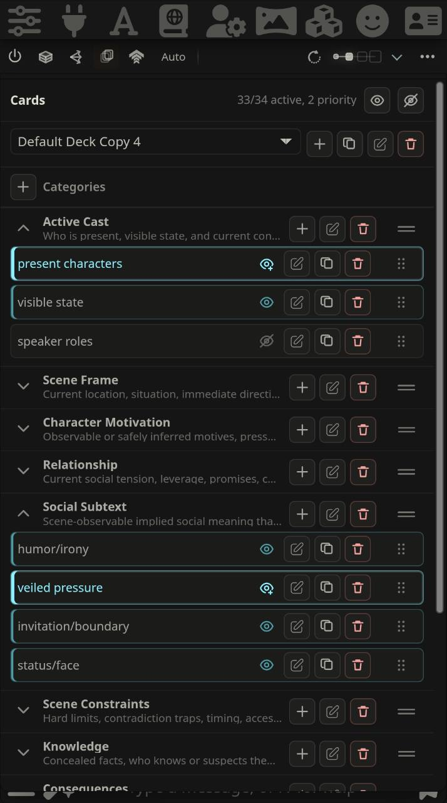

  

# Recursion

Recursion is a SillyTavern extension that helps a roleplay model notice what matters before it writes.

It reads the active chat, reasons over the immediate scene, builds a compact deck of scene cards, and selects the cards that matter for the next reply. The result is an inspectable prompt packet with guidance, card evidence, and guardrails for the current moment: pressure, intent, constraints, consequences, hidden boundaries, environmental affordances, and unresolved threads.

Recursion is a scene reasoning layer for the reply in front of you.

## At A Glance

- Builds scene cards for motivations, social subtext, consequences, knowledge, environment, items, and open threads.
- Lets you use the bundled card catalog or build custom decks with categories, authored cards, ordering, and card Assist.
- Gives every editable card `off`, `active`, and `priority` states so you can control focus without rewriting the scene.
- Selects a focused turn hand so the prompt gets what matters now, not every possible note.
- Uses separate Utility and optional Reasoner lanes, so fast planning and deeper synthesis can be tuned independently.
- Supports Auto mode for hands-off preparation and Manual mode for explicit operator control.
- Lets you leave tense and point of view on Auto or force the active story form when the Arbiter needs correction.
- Installs Recursion-owned SillyTavern prompt entries, then shows exactly what was prepared through Last Brief, progress states, and the Full Viewer.
- Keeps provider secrets and raw model I/O out of saved settings, prompt packets, run journals, diagnostics, browser storage, and SillyTavern file storage.

## Feature Surfaces

<table>
  <tr>
    <td width="50%">
       
      <strong>Pipelines</strong> 
      Pick Standard, Rapid, or Fused depending on whether you want maximum clarity, lower send-time latency, or one larger structured card pass.
    </td>
    <td width="50%">
       
      <strong>Modes</strong> 
      Use Auto when Recursion should prepare the next reply on its own, or Manual when you want to choose when scene work runs.
    </td>
  </tr>
  <tr>
    <td width="50%">
       
      <strong>Cards &amp; Decks</strong> 
      Start with the fixed scene-card catalog, then duplicate it into an editable deck with categories, authored cards, drag ordering, priority states, and card Assist.
    </td>
    <td width="50%">
       
      <strong>Card Hand</strong> 
      Recursion selects a bounded hand for the next reply. Last Brief and the Full Viewer show the selected cards, omissions, evidence, and packet metadata.
    </td>
  </tr>
  <tr>
    <td width="50%">
       
      <strong>Enhancements</strong> 
      Clean up the reply that just landed by improving prose, dialogue, or both, then keep the improved version as a swipe or replace the original.
    </td>
    <td width="50%">
       
      <strong>Tense &amp; PoV</strong> 
      Let Recursion match the chat automatically, or force a past/present tense and point of view when the scene needs a steadier form.
    </td>
  </tr>
  <tr>
    <td width="50%">
       
      <strong>Progress Dropdown</strong> 
      Watch snapshot, planning, card work, prompt composition, install, fallback, and ready states without leaving the chat.
    </td>
    <td width="50%">
       
      <strong>Last Brief</strong> 
      Inspect the latest selected hand, card evidence, guidance, guardrails, omissions, and packet metadata from the compact viewer.
    </td>
  </tr>
</table>

## Why Use It

LLMs can lose the practical shape of a scene even when the relevant text is still in context. They remember that a room exists, but miss the locked door. They know a character is angry, but fail to let that anger change the exchange. They know a secret, but reveal it too early.

Recursion is built for that gap. It helps the model read the scene like an operator would: what changed, what is under pressure, what should stay hidden, what consequences are now active, and what details should shape the next reply.

That makes it useful for long-running roleplay, scenes with layered motives, social tension, investigations, hidden information, object continuity, environmental constraints, and any setup where the next reply should respond to more than the last line of dialogue.

## Recursion vs Stepped Thinking

Stepped Thinking gives a character a private pre-generation pass. It is useful when the missing piece is character interiority: what a character feels, intends, hides, or thinks before speaking.

Recursion works at the scene level, building a card deck across the live situation, choosing the most relevant cards for this turn, and turning that into prompt evidence the next reply can use. Recursion addresses the problem of scene awareness: missed constraints, unresolved threads, hidden knowledge, social pressure, consequences, items, environment, and continuity that should affect the reply right now.

To that effect, it's a structured scene-reasoning and prompt-packet tool. It doesn't delve into character thoughts like Stepped Thinking, but instead acts as a dedicated thinking layer to ask: *What needs to be tracked and expanded upon to make the next generation feel like a rich continuation of the scene?*

## Pipelines

Pipeline controls decide how Recursion schedules scene work. Auto and Manual decide when it runs.

| Pipeline | Best Fit | Tradeoff |
| --- | --- | --- |
| Standard | Cheap and fast models such as Gemma, GPT OSS, o3-mini, Flash-style variants from DeepSeek, Gemini, Qwen, and similar. | Most debuggable and reliable path, but it does the full foreground pass before generation continues. |
| Rapid | Stable scenes where you want a shorter send-time pass after Recursion has warmed exact-source card evidence in the background. | Lower latency when warm, but escalates to Standard if the warm artifact is missing, stale, invalid, empty, or marked with a mandatory gap. |
| Fused | Lower-cost models with stronger structured reasoning, such as DeepSeek, MiniMax, MiMo, Nemotron, Qwen, and similar. | Fewer card calls through one larger bundle, but depends on the model returning trustworthy structured card output. |

### Cost Shape

Recursion adds provider work before the host model writes: Arbiter planning, card generation or a Fused bundle, Utility guidance composition, optional Reasoner synthesis, and optional post-generation Enhancements for prose, dialogue, or both. It also injects a bounded prompt packet into the normal SillyTavern generation, so Prompt Footprint affects the final host context size.

Cost depends most on pipeline, Reasoning Level, card count, footprint, cache reuse, provider hidden reasoning, and any external model multiplier. For the detailed call breakdown and planning estimates, see [Recursion Cost Research](docs/technical/RECURSION_COST_RESEARCH.md).

Under the medium-reasoning Standard example in that research, Recursion adds roughly 1-1.5 cents per turn on top of normal SillyTavern generation.

## What You Can Inspect

- Last Brief: the latest selected card hand and prepared prompt packet.
- Full Viewer: Now, Deck, Activity, Prompt Packet, Settings, Providers, and diagnostics.
- Prompt Packet: guidance, card evidence, guardrails, references, omissions, fallbacks, and metadata.
- Progress States: live pass status, fallback paths, repair work, install state, and readiness.
- Tense & PoV: Auto story-form detection or a forced past/present first-, second-, third-person, or mixed POV form for the next prompt contract.
- Provider Health: Utility and Reasoner tests, session-only direct keys, fallback visibility, and lane status.

## Fast Start

1. Install Recursion as a SillyTavern extension and refresh your browser.
2. Configure and test the Utility provider.
3. Add the optional Reasoner provider if you want deeper synthesis at higher reasoning levels.
4. Start with the Standard pipeline while you confirm behavior in a scene.
5. Use Auto for normal hands-off preparation, or Manual when you want explicit control.
6. Open Last Brief after generation to inspect what Recursion prepared.

For a guided first session, start with [First Run Workflow](docs/user/FIRST_RUN_WORKFLOW.md). For the full surface-by-surface guide, use the [Operator Manual](docs/user/RECURSION_OPERATOR_MANUAL.md).

## Documentation

- [Documentation Index](docs/DOCUMENTATION_INDEX.md) - Canonical map for user, technical, design, testing, release, and planning docs.
- [Post-alpha.1 Feature Highlights](docs/release/post-alpha.1-feature-highlights.md) - Postable summary of the Enhancements work added after the first pre-alpha checkpoint.
- [Release Notes](docs/release/README.md) - Current pre-alpha checkpoints, verification, and known constraints.
- [First Run Workflow](docs/user/FIRST_RUN_WORKFLOW.md) - First-session path from installation through Manual, Auto, inspection, and cleanup.
- [Operator Manual](docs/user/RECURSION_OPERATOR_MANUAL.md) - Complete guide for UI surfaces, modes, settings, operation, diagnostics, storage, mobile behavior, and smoke checks.
- [Provider Setup](docs/user/PROVIDER_SETUP.md) - Utility and Reasoner setup, provider tests, fallback behavior, and safe verification.
- [Prompt Privacy And Safety](docs/user/PROMPT_PRIVACY_AND_SAFETY.md) - Prompt packet contents, injection boundary, storage limits, redaction, and coexistence with other SillyTavern context systems.
- [Technical Manuals](docs/technical/README.md) - Runtime, card, prompt, provider, storage, diagnostics, and host integration manuals.
- [Recursion Cost Research](docs/technical/RECURSION_COST_RESEARCH.md) - Provider call counts, token-budget ranges, example estimates, and cost-tuning levers.
- [Testing Strategy](docs/testing/TESTING_STRATEGY.md) - Deterministic gates, Playwright readiness, guarded live smoke, artifacts, and documentation render checks.

## Security And Privacy

Recursion treats provider secrets and raw model I/O as sensitive. OpenAI-compatible direct keys are session-only and do not persist to settings, scene cache, prompt packets, run journals, diagnostics, browser local storage, SillyTavern file storage, or test artifacts.

Normal diagnostics use hashes, compact statuses, bounded metadata, and sanitized activity instead of raw prompts, raw provider responses, hidden reasoning, or full transcript text.

## License

See [LICENSE](LICENSE).
