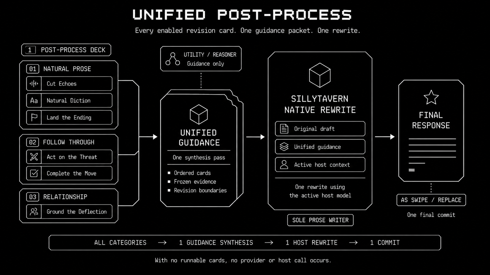
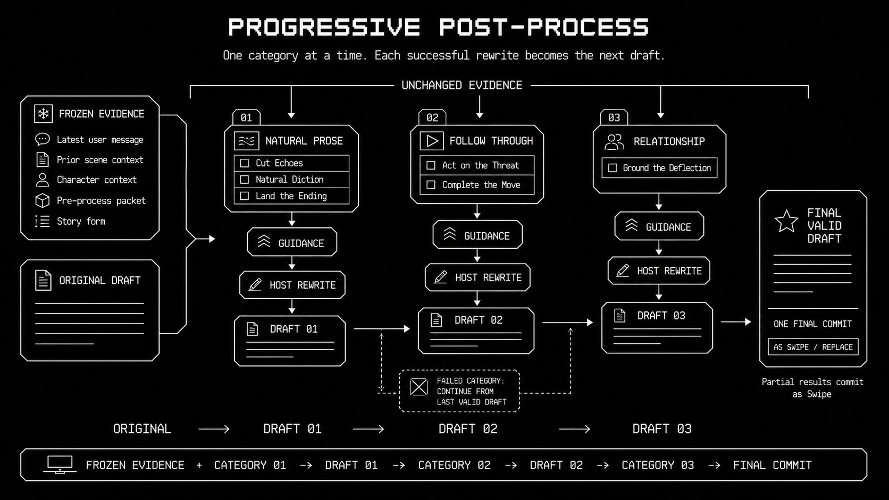

# Post-process Cards Runtime Boundary

**Status:** V1 implementation boundary
**Approved design:** [Post-process Cards Design](../superpowers/specs/2026-07-18-recursion-post-process-cards-design.md)
**Implementation plan:** [Post-process Cards Implementation Plan](../superpowers/plans/2026-07-18-recursion-post-process-cards.md)

The dated design remains the product origin, but its fixed two-attempt and
ephemeral-intermediate claims are superseded by this runtime boundary and the
[resumable execution design](../superpowers/specs/2026-07-29-recursion-resumable-pipeline-execution-design.md).

## Supersession Boundary

Post-process Cards replace the old Generation Review, Enhancements, Dialogue
Enhancement, Prose Enhancement, and Editorial Transformation feature family.
They are not a renamed setting or an adapter over that runtime.  Recursion is
pre-alpha: the replacement uses one V1 contract and does not migrate old
Enhancement settings, modes, markers, prompt keys, provider roles, or UI
selectors.

The existing Card system becomes **Pre-process Cards**.  Its deck model,
selection, and prompt packet remain independent from Post-process Decks.  An
operation uses a frozen Post-process deck snapshot; changing either deck or
settings while it runs affects the next operation only.

## Evidence and Writer Boundary

At the point the original assistant response has fully landed, Recursion
captures an immutable operation snapshot: chat/source/swipe identity and hash,
original draft, reasoning level and assigned lane, apply mode, rewrite flow,
ordered runnable Post-process categories, and bounded supporting evidence.
Supporting evidence contains the latest user message, bounded prior messages,
character context, the Pre-process prompt packet, and story form.

`postProcess.contextMessages` bounds only this Recursion evidence.  It never
limits, recreates, or substitutes for the writer's context.

Utility or Reasoner synthesizes concise structured guidance from the frozen
evidence, current writable draft, and selected cards.  It returns
`recursion.postProcessGuidance.v1`, never revised prose.  Lane assignment is
frozen for the operation: Low/Medium use `postProcessGuidanceUtility` on
Utility; High/Ultra use `postProcessGuidanceReasoner` on Reasoner.

SillyTavern is the sole prose writer.  Recursion installs a transient
Post-process system packet and calls the native host path:

```js
await context.generate("quiet", {
  automatic_trigger: true,
  quiet_prompt: writerDirective,
  quietToLoud: true,
  signal
});
```

That quiet generation retains the user's active preset, character, lore, World
Info, Author's Note, host-managed context, token budget, and active host model.
It returns text before `saveReply`, so it does not itself create or replace a
chat message.  Recursion must not use `generateRaw`, `generateQuietPrompt`,
`host.generation.generate`, a connection profile, Utility, or Reasoner as the
prose writer.

## Operation Sequences

### Unified



```text
ordered runnable categories/cards
  -> one same-lane guidance model stage
  -> one native quiet host rewrite model stage
  -> one final commit
```

All runnable categories and cards are supplied in deck order.  With no runnable
cards, there is no provider or host call.  The host rewrite receives the
original draft, the ordered cards, synthesized guidance, and immutable writer
boundaries; it returns only the revised assistant response.

### Progressive



```text
frozen evidence + original draft + category 1
  -> guidance -> quiet rewrite -> latest valid draft

frozen evidence + latest valid draft + category 2
  -> guidance -> quiet rewrite -> latest valid draft

latest valid draft -> one final commit
```

Each category receives unchanged frozen evidence and only its enabled cards.
After a successful category, its host result is the writable draft for the next
category; the original draft is not reintroduced. Progressive is per category,
not per card. Guidance and drafts are isolated durable artifacts while the
operation is resumable, then intermediate artifacts are deleted after commit.

## Retries, Failure, and Cancellation

Guidance and native quiet rewrite are model stages. Each receives the configured
`Attempts per step` total window, from one through five, and preserves its frozen
role/lane or identical host packet across attempts. There is no cross-lane
fallback. An accepted guidance checkpoint is reused while its rewrite stage
retries or resumes; guidance is not synthesized again. Empty, exact-no-op, and
invalid host results consume attempts. Abort or stale source ends the window
immediately.

Exhausting Unified leaves the original unchanged and pauses at the blocking
stage for explicit Retry. A failed Progressive category preserves the prior
valid draft and may allow later categories under the graph's continue policy.
If every Progressive category fails, there is no final mutation. Recursion sets
no default deadline for either guidance or quiet rewrite; the user may Stop a
stalled call.

The operation is stale, and therefore cannot commit, when chat, source message,
selected swipe, source hash, active character, or active group changes. The
unified Stop action aborts the active guidance request or quiet generation,
checkpoints the paused frontier, and preserves completed guidance and drafts for
Resume.
While quiet generation runs, its internal host events belong to the active
Post-process operation: they cannot arm or recurse into another operation.
Host controls stay locked, normal Pre-process cleanup settles safely, and the
transient prompt key is cleared in `finally`.

Control ownership begins before guidance synthesis, not only when the quiet
writer starts. SillyTavern's native `#mes_stop` therefore remains visible for
guidance attempts, native rewrite attempts, source validation, and final
commit. Its native `GENERATION_STOPPED` event is the authoritative cancellation
input for both Recursion provider work and the host writer.
If native control acquisition fails, Post-process cancels before guidance and
performs one best-effort unlock. Switching Post-process Off after a generation
was queued for Post-process also cancels before control acquisition. Terminal
progress settles any running pixel blocks.

SillyTavern emits scalar `GENERATION_ENDED` with `chat.length`. Recursion
normalizes that count to the current latest assistant identity before final
target validation. Explicit object message ids are preserved. Valid,
invalid, and duplicate terminal events all settle host-generation state;
only one verified target may claim the queued Post-process operation.

## Final Output, Marker, and Privacy

Only the final result persists.  Unified success and fully successful
Progressive runs commit once using the requested mode: **As Swipe** appends and
selects exactly one distinct swipe; **Replace** updates the selected source in
place without changing swipe count.  A partial Progressive result is always
committed As Swipe, even when Replace was requested.  A stale, canceled,
all-failed, empty, or exact-no-op operation creates no final mutation.

The final result stores one `recursion.postProcessMarker.v1` containing only
structural evidence: operation/source/candidate hashes, deck id, flow, requested
and committed modes, lane, partial state, and per-category status plus attempt
counts.  It must not persist raw card prompts, guidance text, provider output,
transcript excerpts, intermediate drafts, hidden reasoning, or provider
secrets.  Generation-enabled proof likewise stores only safe metadata and no
screenshots, traces, or raw text.

Durable execution keeps Post-process bodies only in isolated artifact records.
After the host-commit receipt is safely checkpointed, runtime deletes the frozen
source artifact, guidance artifacts, and earlier Progressive drafts while
retaining the final accepted draft and receipt. Resume checks the receipt and
the source-bound host marker before mutation; if the commit is already present,
`resume-commit-already-applied` completes without creating a duplicate swipe or
replacement.

## Dependency Classification

The required dependency scan was classified before implementation.  The old
feature-only runtime family is deleted with the old feature rather than
preserved as compatibility: `generation-review.mjs`, `editorial-transform.mjs`,
`dialogue-enhancement.mjs`, `prose-enhancement.mjs`,
`enhancement-context.mjs`, `enhancement-metrics.mjs`, and their old roles,
schemas, markers, progress rows, selectors, tests, proof scripts, and settings.

`runtime.mjs`, `providers.mjs`, `settings.mjs`, `ui.mjs`,
`extension/index.js`, and `hosts/sillytavern/host.mjs` contain mixed ownership.
Their old Enhancement/Editorial branches are deleted and replaced by
Post-process branches; their generic runtime, provider routing, settings, UI,
event ownership, chat mutation, prompt lifecycle, and host adapter helpers are
retained only after their non-Enhancement consumers remain proven by search and
tests.  Generic structured-output recovery, source hashing, cancellation,
activity/journal, and host message helpers are retained; they are not an old
feature contract.

The scan's historical documentation matches—including old Enhancement,
Generation Review, Editorial Transformation, and Redirect designs/plans,
release notes, operator manuals, technical manuals, provider specifications,
and proof descriptions—are historical rather than current Post-process
authority.  They are marked superseded from the documentation index until Task
11 removes or rewrites their affected material.  Broad uses of words such as
“repair” that describe JSON recovery or generic failure handling remain current
when they have a non-Enhancement consumer.
