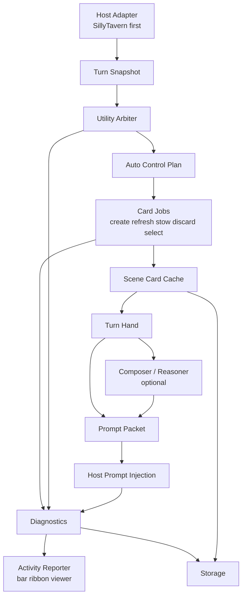

# Runtime Architecture

Recursion is a mostly automatic runtime layer for compiling current-scene writing context into a compact prompt packet for the next SillyTavern generation. It observes the active chat, uses the Utility Arbiter to decide what work is worth doing, updates a bounded scene card cache, selects a turn hand, optionally runs a Composer or Reasoner pass, installs prompt guidance, and records diagnostics.

Recursion should stay host-adapter based. SillyTavern is the first host, but runtime internals should remain host-neutral where that keeps the model, cache, and prompt-planning logic clean.

Related specs:

- Product scope: [RECURSION_PRODUCT_SCOPE.md](../design/RECURSION_PRODUCT_SCOPE.md)
- Card system: [CARD_SYSTEM_SPEC.md](../design/CARD_SYSTEM_SPEC.md)
- Provider and generation: [PROVIDER_AND_GENERATION_SPEC.md](PROVIDER_AND_GENERATION_SPEC.md)
- Prompt composition: [PROMPT_COMPOSITION_SPEC.md](PROMPT_COMPOSITION_SPEC.md)
- Storage and diagnostics: [STORAGE_AND_DIAGNOSTICS.md](STORAGE_AND_DIAGNOSTICS.md)
- Implementation plan: [IMPLEMENTATION_PLAN.md](../testing/IMPLEMENTATION_PLAN.md)

## System Boundary

Recursion owns the short-lived runtime loop that improves the next model response. It does not own durable story truth, campaign saves, transcript branching, player state, long-term memory, vector recall, World Info, or Summaryception-style history compression.

The runtime boundary is:

- Inbound: host chat state, current user message, generation lifecycle events, extension settings, provider availability, and stored Recursion cache metadata.
- Internal: turn snapshots, Utility Arbiter decisions, card job scheduling, scene cache maintenance, turn hand selection, prompt packet composition, and diagnostics.
- Outbound: prompt injection instructions, inspector/status data, bounded diagnostics, and storage writes for settings/cache metadata.

Pre-alpha status allows Recursion to replace internal schemas and cache layouts in place when the V1 shape improves. It should still keep explicit contracts between host adapters, runtime orchestration, provider calls, storage, and prompt injection so changes do not spread through the whole extension.

Recursion should not import Directive's campaign save engine, accepted-state model, state-delta journal, or branch mechanics. The useful lesson from Directive is runtime discipline: structured calls, clean provider lanes, prompt packet install/clear behavior, bounded diagnostics, and fail-soft orchestration.

## Component Map



Primary components:

- Host Adapter: translates host-specific chat, generation, prompt, storage, and UI events into Recursion interfaces.
- Runtime Coordinator: owns extension mode, lifecycle hooks, turn processing locks, cancellation, and sequencing.
- Snapshot Builder: captures a stable observe-time view of the active chat and pending turn.
- Utility Arbiter: returns an Auto Control Plan for action, scene status, prompt footprint, card jobs, Reasoner decision, and budgets.
- Card Job Runner: executes the plan by creating, refreshing, stowing, discarding, and selecting scene cards according to Arbiter decisions.
- Scene Cache: stores bounded, per-chat and per-scene card state plus fingerprints and prompt-plan metadata.
- Hand Selector: selects the small card set that should influence the next generation.
- Composer: deterministic prompt assembly and optional model-mediated synthesis.
- Reasoner: optional deeper synthesis lane that is never required for generation to continue.
- Prompt Injector: installs, updates, and clears host prompt entries through the adapter.
- Diagnostics Recorder: records structured, sanitized runtime events for the status and inspector surfaces.
- Activity Reporter: aggregates runtime, provider, storage, and prompt events into concise user-visible phases for the Recursion Bar, Hero Pixel Array progress menu, and Full Viewer.

## Turn Pipeline

The core pipeline is:

1. Observe chat and turn snapshot.
2. Run Utility Arbiter.
3. Execute card jobs and cache updates.
4. Select turn hand.
5. Optionally run Composer or Reasoner.
6. Build prompt packet.
7. Install through SillyTavern injection.
8. Emit user-visible activity updates for status, fallbacks, and prompt readiness.
9. Record diagnostics.

Mode controls change how much of the pipeline runs:

- Off: remove or avoid installing Recursion prompt entries. The runtime may keep minimal UI/provider status, but it should not inspect or influence active generations.
- Observe: build snapshots, run safe diagnostics, and optionally preview decisions. It must not inject prompt packets.
- Auto: run the full automatic pipeline and install prompt packets when the Auto Control Plan says a pass is useful.

The Runtime Coordinator should serialize work per chat/generation attempt. A newer turn snapshot supersedes older pending work. If a late provider result arrives after the active snapshot changed, the result is discarded or recorded as stale and must not overwrite the current prompt packet.

The injection point should be as close as practical to host generation start, after the snapshot and prompt packet are valid. If Recursion cannot complete optional work before generation, it should reuse a valid cache-backed packet or continue without injection rather than block the host indefinitely.

## Auto Control Plan

The Utility Arbiter returns an Auto Control Plan. Runtime code treats this as advice that must pass schema validation and safety limits before use.

Primary control fields:

- `action`: one of `skip`, `reuse-cache`, `refresh-cards`, or `compose-brief`.
- `sceneStatus`: one of `same-scene`, `soft-shift`, `hard-shift`, or `unknown`.
- `promptFootprint`: `compact`, `normal`, or `rich` size class for the next prompt packet.
- `cardJobs`: bounded Utility card requests using the fixed V1 catalog.
- `reasonerDecision`: `skip` or `use`, with compact trigger reasons and signals.
- `budgets`: runtime-limited target brief tokens and maximum selected cards.

The plan may also include card lifecycle suggestions and diagnostics labels. It must not include hidden plot plans, chain-of-thought, durable canon updates, arbitrary provider endpoints, or host-specific prompt instructions that bypass the Prompt Composer.

Runtime enforcement:

- Invalid plans fall back to local `compose-brief`, cache reuse, or `skip`, depending on mode and cache state.
- Token and card count caps are enforced after the Arbiter returns.
- `promptFootprint` is sanitized to `compact`, `normal`, or `rich`; invalid or missing Arbiter values fall back to the stored setting. A valid Arbiter footprint overrides only the current turn's Prompt Composition settings and does not mutate the stored user setting.
- Provider lane choices are resolved through the provider spec, not trusted as raw endpoints.
- Reasoner triggers are advisory. If Reasoner is off, unavailable, too slow, or over budget, generation continues through the deterministic or Utility composer path.

## Plan Actions

Plan action controls runtime cost and cache churn.

`skip` means no new provider or prompt work for this turn. Runtime clears or avoids installing Recursion prompt entries for the generation.

`reuse-cache` means use the existing scene cache and lifecycle selection when the cache is current enough for the next turn. It avoids new card generation and fails soft if no reusable hand is available.

`refresh-cards` means execute the Arbiter's card jobs against the current snapshot, merge accepted cards into the scene cache, apply lifecycle decisions, then select a fresh hand.

`compose-brief` means compose a packet from the current hand after any requested cache/card work. Local fallback also uses this action when the Arbiter is unavailable and safe fallback cards can be built from the snapshot.

Action choice should be automatic by default. User controls should stay high level, such as Off/Observe only/Auto, refresh, intensity, provider setup, prompt footprint fallback, and optional Reasoner enablement.

## Scene Shift Handling

Scene status is the Arbiter's view of how much the active scene changed:

- `same-scene`: continue using the existing scene cache when the hand still matches the visible moment.
- `soft-shift`: keep the scene lineage but refresh affected cards. Examples include a new immediate objective, changed emotional posture, or a character entering the scene.
- `hard-shift`: begin a new scene cache segment and avoid carrying stale scene-frame cards forward. Examples include a location jump, time jump, cast reset, or clear narrative break.
- `unknown`: use conservative behavior when the Arbiter cannot classify the shift. Prefer a bounded validation pass, lower prompt footprint, and visible diagnostics rather than aggressive cache reuse or hard deletion.

Hard shifts should not erase useful diagnostics or previous bounded cache history, but they should prevent stale cards from entering the next turn hand. Soft shifts should preserve continuity risks and open threads only when they still apply to the visible scene.

When local heuristics and model judgment disagree, runtime safety wins. The runtime may ask the Utility Arbiter for a scene validation pass, but it should not install contradictory scene guidance while scene status is unresolved.

## Failure Modes

Recursion must be fail-soft. Provider, schema, storage, and injection failures should not corrupt prompt state or prevent normal SillyTavern generation.

Expected failure behavior:

- Utility provider unavailable: skip new Arbiter work, reuse a valid packet if safe, or clear Recursion injection and continue.
- Arbiter schema invalid: reject the plan, record diagnostics, and fall back to a conservative local action.
- Card job failure: keep the last valid cache segment, omit failed cards from the hand, and record omission reasons.
- Reasoner failure: continue with deterministic or Utility-composed prompt packets.
- Prompt composition over budget: trim by lane priority and record budget omissions.
- Injection failure: clear or leave untouched according to host adapter safety rules, then record the failed install attempt.
- Storage failure or host-storage memory fallback: keep in-memory runtime state for the current turn if possible, show a storage warning, disable persistence-dependent reuse, and continue generation.
- Stale async result: record as stale and do not apply it to cache or prompt injection.

No failure path should write partial prompt packets that mix old and new scene identities. Prompt packet installation should be atomic from Recursion's perspective: either the adapter confirms the current packet metadata, or runtime treats the install as failed.

## Activity Reporting

Recursion must make invisible work visible without turning the UI into a log console. The Runtime Coordinator should expose one Activity Reporter interface that receives normalized events from the Arbiter, card jobs, provider router, cache repository, composer, prompt injector, and storage layer.

Recommended event shape:

```ts
type RecursionActivityEvent = {
  runId: string;
  phase: string;
  mode: "foreground" | "background" | "review";
  severity: "info" | "success" | "warning" | "error";
  label: string;
  detail?: string;
  chips?: string[];
  providerLane?: "utility" | "reasoner";
  composerLane?: "utility" | "reasoner" | "local";
  cardCounts?: {
    requested?: number;
    accepted?: number;
    omitted?: number;
    selected?: number;
  };
  fallbackReason?: string;
};
```

The Activity Reporter is not a persistence boundary by itself. It is a user-facing aggregation boundary:

- many internal events become one visible stage;
- foreground, background, and review activity render differently;
- stale run ids cannot update the current ribbon after a newer run starts;
- slow work reveals after a short delay, while quick no-op work may only update the bar chip;
- success settles briefly, while warning and error states persist until dismissed or superseded;
- activity text is friendly and bounded, while detailed sanitized records belong in the run journal.

Core activity phases should cover:

- snapshot capture and scene-shift review;
- Utility Arbiter planning;
- cache reuse, scene refresh, and card batch execution;
- hand selection;
- Utility and Reasoner composition;
- prompt packet build, install, skip, and clear;
- storage save, repair, and prune stages;
- retry, fallback, stale-result discard, and provider issue states.

Activity text must not expose raw provider prompts, raw provider responses, full transcript text, hidden reasoning, private story plans, physical file paths, or unbounded error text.

## Runtime State

Runtime state should be minimal, bounded, and inspectable.

In memory:

- active mode: Off, Observe only, or Auto;
- active host and chat identifiers;
- current turn snapshot id and message fingerprint;
- scene fingerprint and scene status;
- active Auto Control Plan;
- pending run lock and cancellation marker;
- provider health and resolved lane status;
- last prompt packet metadata;
- last diagnostics summary.

Persisted:

- extension settings;
- provider settings without session-only secrets;
- bounded scene card cache;
- prompt plan/cache metadata;
- last successful prompt packet metadata;
- bounded diagnostics/run journal.

Runtime state should not store hidden chain-of-thought, direct endpoint API keys, durable story canon, branch history, or campaign state deltas. If state is expensive to validate or no longer matches the active chat fingerprint, the runtime should prefer refreshing it over building compatibility layers.

## Host Adapter Responsibilities

The host adapter hides SillyTavern-specific APIs behind stable Recursion interfaces.

Responsibilities:

- Observe active chat identity, messages, current character/group context, and generation lifecycle events.
- Build host-neutral turn snapshots with stable message ids or fingerprints.
- Read host prompt environment only as needed to avoid conflicts and understand available insertion points.
- Install, update, and clear Recursion prompt packets with metadata that lets the runtime detect stale entries.
- Expose host generation/provider options needed by Utility and Reasoner lanes.
- Provide storage primitives for settings, cache, and diagnostics through Recursion's logical keys.
- Report UI events such as mode changes, manual refresh, inspector open, and settings updates.
- Surface adapter errors as diagnostics without throwing host-specific failures through the runtime.

The SillyTavern adapter may use host-specific prompt APIs, extension settings, and event hooks. The rest of Recursion should depend on adapter contracts rather than importing SillyTavern globals directly.

## Settings, Provider, And Mode Mutations

Runtime settings changes are prompt-safety operations, not plain preference writes. `runtime.updateSettings(patch)` applies the normalized settings immediately, supersedes active work, best-effort soft-invalidates the last successful scene cache with reason `settings-changed` when the patch has meaningful keys, then awaits a Recursion prompt clear through the host adapter before resolving.

The operation result shape is:

```ts
{
  ok: boolean;
  settings: RecursionSettings;
  clear: PromptClearResult | null;
}
```

When the resulting mode is `off`, the progress surface must show prompt-clearing work and then settle to either `Recursion Off. Prompt cleared.` or a sanitized prompt-clear warning. A clear failure does not roll back the Off setting, but the operation returns `ok: false` and the UI keeps the warning visible. This makes Off mode a real emergency brake while still exposing host prompt cleanup failures.

Provider setting and session-key mutations follow the same prompt-safety rule. `runtime.updateProvider(lane, patch)` and `runtime.clearProviderKey(lane)` apply the provider change immediately, supersede active work, best-effort soft-invalidates the last successful scene cache, then await host prompt clear before resolving. Provider updates use reason `provider-changed`; session-key clears use `provider-key-cleared`.

```ts
{
  ok: boolean;
  provider: ProviderSettings;
  clear: PromptClearResult;
}
```

Clear failure, missing host clear API, missing scene cache, or invalidation storage failure does not roll back the provider change. Prompt-clear failures return `ok: false`, include the sanitized prompt-clear result, and leave the existing prompt-clear warning visible. Invalidation failures are fail-soft and do not change the mutation result contract.

`runtime.refreshScene()` is a first-class refresh operation. It waits for prior mutations, captures the current host snapshot without adding synthetic chat text, best-effort soft-invalidates that snapshot's scene cache with reason `user-refresh`, then runs the normal preparation loop so the Utility Arbiter can review the stale cache before the new active cache is saved.

## Diagnostics Events

Diagnostics should explain what Recursion did without storing sensitive provider payloads or hidden reasoning.

Core event types:

- `runtime.mode_changed`: Off, Observe only, or Auto changed.
- `turn.snapshot_captured`: chat id, snapshot id, message fingerprint, and size metadata.
- `arbiter.plan_requested`: provider lane, snapshot id, and cache fingerprint.
- `arbiter.plan_received`: action, scene status, prompt footprint, card job count, Reasoner decision, and budgets.
- `arbiter.plan_rejected`: schema or safety reason.
- `scene.shift_detected`: previous and next scene fingerprints plus scene status.
- `card.job_started`: card role, requested action, and target cache segment.
- `card.job_completed`: created, refreshed, stowed, discarded, selected, and omitted counts.
- `hand.selected`: card ids, lanes, token estimate, and omission counts.
- `composer.completed`: composer lane, token estimate, and Reasoner decision signals.
- `prompt.packet_built`: packet id, footprint, lanes, and token estimate.
- `prompt.install_succeeded`: packet id, host insertion metadata, and snapshot id.
- `prompt.install_failed`: packet id and sanitized adapter error.
- `cache.invalidated`: scene key, reason, optional run id, and redacted details for a soft scene-cache invalidation.
- `activity.stage_changed`: phase, mode, severity, visible label, and compact chips.
- `activity.settled`: outcome, visible summary, and fallback path when present.
- `provider.failed`: lane, job type, sanitized error class, and fallback path.
- `runtime.stale_result_discarded`: job id and superseded snapshot id.
- `storage.write_failed`: logical key and sanitized error class.

Diagnostics should support the UI's Status and Inspector surfaces, automated tests, and bug reports. They should be capped, sanitized, and safe to persist.

## V1 Implementation Slices

V1 should be built in small vertical slices that preserve the end-to-end loop.

1. Host adapter skeleton and modes
   - Implement SillyTavern lifecycle hooks, Off/Observe only/Auto mode state, snapshot capture, activity event contract, and no-op prompt clear/install methods.

2. Snapshot and diagnostics foundation
   - Add stable snapshot ids, message fingerprints, bounded diagnostics events, and inspector-ready last-run summaries.

3. Provider lanes and Utility Arbiter contract
   - Implement Utility provider routing, structured Auto Control Plan schema validation, provider failure fallback, and sanitized call diagnostics.

4. Scene cache and card job runner
   - Add bounded scene card cache, card create/refresh/stow/discard/select jobs, cache invalidation, and action enforcement.

5. Turn hand selection
   - Select compact hand candidates by settings focus, scene relevance, token caps, and omission rules.

6. Prompt composition and injection
   - Build prompt packets from the turn hand, enforce footprint budgets, install through the SillyTavern adapter, clear stale packet metadata, and report prompt-ready/install/fallback activity.

7. Optional Composer/Reasoner lane
   - Add Reasoner trigger handling, timeout/failure fallback, and deterministic composer fallback.

8. Storage hardening
   - Persist settings, cache metadata, last packet metadata, and bounded diagnostics using logical keys and privacy-safe records.

9. UI integration and smoke validation
   - Connect the Recursion Bar, Hero Pixel Array progress menu, status, provider health, mode controls, and inspector diagnostics. Validate Off, Observe only, Auto, provider failure, scene refresh, storage activity, prompt install, and stale-result behavior.

Each slice should keep generation usable if it fails. The first complete proof is not perfect card intelligence; it is a reliable loop from observe -> Arbiter -> card jobs/cache -> hand -> prompt packet -> host injection -> diagnostics.
