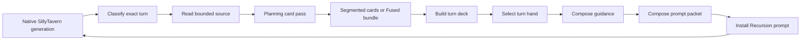

# Runtime Architecture

This is the current V1 runtime authority for Recursion.

## Boundary

Recursion is a SillyTavern extension. SillyTavern owns chat state, message identity, native generation, prompt assembly, and visible story output. Recursion owns bounded source reading, structured planning, cards, guidance, prompt-packet installation, optional Post-process operations, and its own storage and diagnostics.

Recursion never generates a detached primary story response. Stop and Resume use native SillyTavern generation seams.

## Main Components

- Host Adapter: snapshots chat, installs and clears Recursion prompt lanes, reads message and swipe identity, and requests native generation start/stop.
- Turn Identity: hashes the exact bounded source band, latest user identity, selected swipe, character/group identity, and runtime contracts.
- Utility Arbiter: returns the structured plan and requested card jobs.
- Segmented Pipeline: runs requested card roles as independently checkpointed model stages.
- Fused Pipeline: runs one structured multi-card bundle, with bounded validation and Segmented fallback.
- Turn Deck And Hand: validate generated card evidence and select the bounded set for this turn.
- Guidance And Packet Composer: produces provider guidance, raw card evidence, guardrails, and the host injection plan.
- Execution Scheduler: persists V2 manifests, checkpoints, attempts, pauses, retries, and dependency-aware reprocessing.
- Post-process Runtime: binds optional rewrites to one completed assistant response identity and commits through guarded host mutations.

## Turn Identity

Turn identity is computed before provider work. It includes:

- chat key;
- latest user message id and content hash;
- bounded visible source-band hash;
- selected swipe identity when applicable;
- character and group hashes;
- settings, provider, pipeline, deck, card, prompt, and stage contracts.

The source band honors configured message and character bounds. Repeated user text with a new message id produces a new key. Changes inside the band change the key; changes outside it do not.

## Pre-process Flow

```mermaid
flowchart LR
  Host["Native SillyTavern generation"] --> Identity["Classify exact turn"]
  Identity --> Snapshot["Read bounded source"]
  Snapshot --> Arbiter["Planning card pass"]
  Arbiter --> Cards["Segmented cards or Fused bundle"]
  Cards --> Deck["Build turn deck"]
  Deck --> Hand["Select turn hand"]
  Hand --> Guidance["Compose guidance"]
  Guidance --> Packet["Compose prompt packet"]
  Packet --> Install["Install Recursion prompt"]
  Install --> Host
```

Every node is a V2 stage. Model stages have bounded attempt windows. Local and host stages are checkpointed where their outputs authorize later work. A blocking failure pauses the graph; continue-policy failures produce bounded fallback evidence.

## Generation Classification

- New user turn: revoke prior authority, cancel queued swipe intents, create a new operation, and run a new Arbiter.
- Same-turn unchanged swipe: validate the completed manifest and packet, reinstall it with zero Recursion model calls, and continue native story generation.
- Same-turn native host retry after Resume: finalize the completed host-owned operation and reinstall its packet with zero duplicate Recursion model calls.
- Edited-band swipe: reject reuse, cancel queued intent, and rebuild.
- Compatible paused operation: continue only after native host generation re-enters the interceptor.
- Incompatible or corrupt operation: mark stale or revoke, then recompute safely.

No semantic scene boundary or elapsed-time heuristic participates in classification.

## Segmented And Fused

Segmented gives every requested card family its own provider, validation, attempt, and checkpoint boundary. Independent card stages may share a scheduler wave.

Fused sends all requested families through one structured card-bundle call. Each returned sibling validates independently. A partially useful bundle may continue with accepted siblings and targeted repair; zero useful output falls back to Segmented. Pipeline choice changes future work and does not start generation by itself.

## Guidance And Prompt Installation

Explicit user instructions and established story facts outrank generated card interpretations and composer guidance. The composer receives up to four recent visible user/assistant messages (3,000 characters each) to check selected cards against the current exchange. Malformed guidance uses the configured bounded correction attempts before a terminal raw-card fallback. Transport and refusal errors retain the existing retry policy; cancellation never installs fallback. Terminal fallback is checkpointed for reuse.

Prompt installation rechecks the current host source before and after mutation. A stale operation cannot commit its packet. The prepared artifact becomes active only after the host reports installation success. Install failure blocks native story generation, is recorded explicitly, and is never promoted to a reusable success. The interceptor calls SillyTavern's abort callback whenever required preparation fails or pauses.

## Stop, Resume, And Retry

`runtime.stopGeneration()` owns one memoized cleanup. It pauses the current V2 operation, aborts provider work, cancels Post-process, requests native host Stop, waits for settlement, clears Recursion prompt lanes, and journals the result once.

Public `runtime.resumeOperation()` validates a paused host-owned operation and requests the stored native generation type from SillyTavern. It performs zero provider calls directly and does not mark the manifest running before the host accepts the start. When the host interceptor returns, the private continuation resumes the earliest compatible frontier.

`retryStage()` is valid only for the blocking failed stage. It resets that stage and all descendants while retaining compatible ancestors.

## Reprocess And Full Rebuild

Completed and reusable stages expose `Reprocess from here on the next swipe`. The click queues a turn-bound intent and starts nothing. The next matching swipe invalidates the selected root and descendants, consumes the intent once, and reuses unaffected compatible ancestors.

The idle command slot exposes `Rebuild all Recursion work on the next swipe`. Its pressed label is `Full rebuild on next swipe: Queued`. The next matching swipe bypasses all Pre-process checkpoints once. New user turns cancel this intent and always start independently.

## Post-process

Post-process captures the completed assistant message id, swipe id, text hash, active character/group identity, and originating Pre-process turn key. That response identity owns the operation.

Unified creates one guidance artifact and one rewrite using the frozen native or profile writer. Progressive processes enabled categories in deck order and carries the latest accepted draft forward. As Swipe appends and selects one guarded swipe; Replace mutates the active response only after complete success. Review before applying stores a pending comparison and releases generation controls until acceptance. Source-bound review actions recheck the current target identity; a retained comparison does not grant authority to edit a changed response.

Stop preserves the original response and accepted checkpoints. Resume uses the same scheduler and idempotent host-commit receipt. A changed response body gets a new response identity and cannot reuse another swipe's rewrite.

## Settings And Host Events

Settings or provider changes pause incompatible work immediately, clear prepared authority, and clear Recursion prompt lanes. Power Off additionally disables future preparation. Host chat change, message edit, deletion, or older-source mutation pauses active work and clears volatile prompt state. Latest-assistant swipe generation follows the turn-classification rules above.

Empty assistant placeholders are excluded from pending-user discovery. The latest visible user message remains part of the turn key and provider source even when SillyTavern inserts an empty assistant placeholder before interception.

## UI State

The compact bar shows Stop only while Recursion or native host generation is active. Otherwise the same slot shows Full Rebuild. Progress rows expose at most one contextual action: Stop, Resume, Retry, Reprocess, or cancel queued reprocess.

Canonical Pre-process row vocabulary is `Reading current turn`, `Planning card pass`, `Building turn deck`, `Selecting turn hand`, `Reasoner guidance`, `Composing prompt packet`, and `Installing Recursion prompt`.

Last Brief remains inspectable after completion but does not authorize reuse.

## Privacy And Diagnostics

Runtime activity, journals, manifests, and reports use safe ids, hashes, counts, states, attempt data, and stable diagnostic codes. Raw prompts, provider output, hidden reasoning, chat bodies, API keys, bearer tokens, cookies, and stack traces are excluded.

## Acceptance

Repository and installed-host proofs must separately show new-turn Arbiter work, zero-call unchanged-swipe reuse, edited-band rejection, one-shot Reprocess and Full Rebuild, unified Stop, native Resume with no detached provider call, response-bound Post-process, prompt mutation counts, and installed-copy parity.
