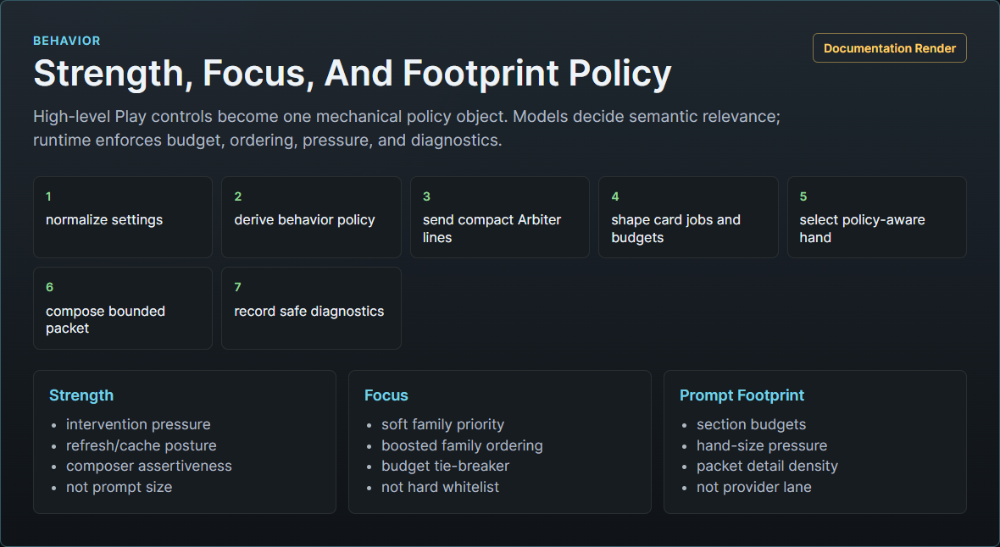

# Behavior Settings Policy Spec

## Purpose

This spec defines the target V1 contract for the Play-tab behavior controls:

- Strength
- Focus
- Prompt Footprint

These controls must create observable backend behavior, not merely send vague hints to the Arbiter. The design keeps Recursion mostly turnkey by making each setting a small pressure control over the automatic card and prompt pipeline.

This spec covers design improvement planning. It does not replace provider routing, card generation, prompt composition, storage, or UI specs; it defines how those systems should interpret the user-facing behavior knobs.

Related docs:

- [Product Scope](RECURSION_PRODUCT_SCOPE.md)
- [Card System Spec](CARD_SYSTEM_SPEC.md)
- [UI Spec](UI_SPEC.md)
- [Runtime Turn Sequence](../technical/RUNTIME_TURN_SEQUENCE.md)
- [Prompt Packet And Injection](../technical/PROMPT_PACKET_AND_INJECTION.md)
- [Prompt Composition Spec](../architecture/PROMPT_COMPOSITION_SPEC.md)
- [Provider and Generation Spec](../architecture/PROVIDER_AND_GENERATION_SPEC.md)
- [Storage And Diagnostics](../technical/STORAGE_AND_DIAGNOSTICS.md)

## Problem

Prompt Footprint already affects prompt composition because it maps to concrete packet budgets. Strength and Focus are currently too weak if they are only normalized, stored, passed to Arbiter JSON, and included in the scene-cache settings hash.

That is not enough for a user-facing control. If the Arbiter ignores the raw setting text, the backend should still show a predictable difference.

The robust approach is:

1. Let model calls decide semantic relevance.
2. Let runtime enforce mechanical policy.
3. Keep the policy small, testable, and visible in diagnostics.

Recursion should not implement brittle deterministic relevance scoring. Runtime must not decide that a character is emotionally important, that a plot thread matters, or that a scene constraint applies. Runtime can safely enforce budgets, ordering, caps, boosts, fallback, routing eligibility, and diagnostic labels.



## Goals

- Make Strength, Focus, and Prompt Footprint materially affect backend operations.
- Preserve the automatic card-and-hand model; do not turn V1 into card micromanagement.
- Keep semantic judgment in Utility or Reasoner calls.
- Keep runtime policy deterministic only for mechanical behavior.
- Keep Prompt Footprint as the owner of size and detail.
- Keep Strength as intervention pressure, not hidden prompt bloat.
- Keep Focus as a soft priority profile, not a hard whitelist.
- Make differences testable without depending on creative model output.
- Show visible, sanitized reasons in the Recursion activity UI and Full Viewer.

## Non-Goals

- No deterministic semantic relevance scorer.
- No user-editable card weights.
- No per-card prompt placement matrix.
- No automatic durable memory, lore, vector recall, or transcript summary.
- No hidden chain-of-thought capture.
- No broad planner that decides future story outcomes.
- No legacy compatibility shims for older pre-alpha behavior shapes.

## Control Ownership

| Control | Owns | Does not own |
| --- | --- | --- |
| Mode | Auto versus Manual enforcement. | Provider lane depth, prompt size, or semantic relevance. |
| Card Scope | Family/sub-item preference in Auto and strict family/sub-item whitelist in Manual. | Final prose style or provider cost. |
| Reasoning Level | Provider lane policy and Reasoner cost depth. | Prompt size, card family focus, or intervention strength. |
| Min Cards / Max Cards | Reasoning Level card-count bounds: Low uses Min, Medium/High use the average, Ultra uses Max. | Prompt section size, provider lane routing, or semantic relevance. |
| Strength | Intervention pressure, refresh pressure, cache reuse posture, and composer assertiveness. | Prompt Footprint size or Reasoning Level lane selection. |
| Focus | Broad family priority profile. | Hard exclusion, except where Manual card scope already excludes a family. |
| Prompt Footprint | Packet size, section budgets, and detail level. | Provider lane policy, semantic truth, or card-count bounds. |
| Advanced Injection | Final composed packet placement, role, and depth. | Card selection, card generation, or composition content. |

## Influence Policy Object

Runtime should derive one policy object from normalized settings at the start of each run. This keeps Arbiter prompt text, post-Arbiter plan shaping, hand selection, composition, diagnostics, and tests aligned.

Source module:

```text
src/settings-policy.mjs
```

Target shape:

```ts
type RecursionInfluencePolicy = {
  strength: {
    level: "light" | "balanced" | "strong";
    cacheReuse: "prefer" | "normal" | "cautious";
    refreshPressure: "low" | "normal" | "high";
    selectionPressure: "lean" | "normal" | "full";
    composerAssertiveness: "soft" | "normal" | "firm";
    arbiterLine: string;
    composerLine: string;
  };
  focus: {
    level: "balanced" | "character" | "continuity" | "prose" | "plot";
    boostedFamilies: string[];
    arbiterLine: string;
    composerLine: string;
  };
  cardBudget: {
    minCards: number;
    normalCards: number;
    maxCards: number;
  };
  footprint: {
    level: "compact" | "normal" | "rich";
    allowedProfiles: ("compact" | "normal" | "rich")[];
    preferredProfile: "compact" | "normal" | "rich";
    detailPressure: "compact" | "normal" | "rich";
    sectionBudgets: {
      sceneBrief: number;
      turnBrief: number;
      guardrails: number;
    };
    arbiterLine: string;
    composerLine: string;
  };
};
```

The implementation lives in `src/settings-policy.mjs`. Runtime, card selection, prompt composition, tests, docs, and renders should use this single policy contract rather than duplicating Strength, Focus, or Prompt Footprint meaning in separate modules.

## Strength Contract

Strength controls how much Recursion should intervene in the next generation when relevant cards exist.

It must not increase `promptFootprint`, section budgets, Reasoning Level, provider lane, or final injection depth. If the user wants more text, Prompt Footprint owns that. If the user wants more Reasoner use, Reasoning Level owns that.

| Strength | Runtime posture | Arbiter pressure | Composer pressure |
| --- | --- | --- | --- |
| Light | Prefer valid cache, avoid churn, select fewer support cards inside the active footprint. | Ask for refresh/regeneration only when relevance or drift risk is clear. | Phrase guidance as gentle, sparse writing support. |
| Balanced | Default V1 behavior. | Normal refresh, card-job, and lifecycle pressure. | Normal concise brief. |
| Strong | Be more willing to refresh stale or weak cards, preserve high-risk cards, and use the active footprint fully. | Ask for regeneration when scene drift, scene-constraint risk, or weak coverage is plausible. | Phrase selected constraints firmly and prefer explicit guardrails when evidence supports them. |

Mechanical effects:

- Arbiter prompt includes a short Strength policy line.
- Local fallback plan uses Strength to choose conservative versus full hand pressure.
- Post-Arbiter plan shaping keeps Strength inside the active card budget instead of enlarging the hand.
- Hand selection applies Strength inside existing max-card and token caps; Light uses lean pressure, Balanced uses normal pressure, and Strong uses the active footprint fully without enlarging it.
- Composer gets a Strength line so Utility and Reasoner composition use matching assertiveness.
- Diagnostics record the resolved Strength policy and any plan shaping labels.

Prohibited effects:

- Strong must not silently switch Compact to Rich.
- Strong must not force Reasoner while Reasoning Level is Low.
- Strong must not inject raw cards.
- Strong must not create facts or override the Arbiter's semantic decision.
- Light must not drop critical scene constraints only because the user wants a lighter touch.

## Focus Contract

Focus is a soft priority profile. It tells Recursion what kind of value the user wants emphasized when the current scene supports it.

Focus does not replace Card Scope. Card Scope is the family/sub-item selector. In Auto, Card Scope is a preference and high-relevance unselected cards may still be used. In Manual, Card Scope is a strict whitelist and Focus can only reorder or emphasize families that remain allowed.

| Focus | Boosted families |
| --- | --- |
| Balanced | No family boost. |
| Character | Active Cast, Character Motivation, Relationship, Knowledge. |
| Constraints | Scene Constraints, Items, Consequences, Scene Frame, Knowledge. |
| Scene | Scene Frame, Environment, Items, Active Cast. |
| Plot | Open Threads, Consequences, Knowledge, Scene Frame. |

Mechanical effects:

- Arbiter receives the boosted family list and a concise Focus policy line.
- The available catalog is ordered with boosted families first when that does not violate Manual scope.
- Card jobs from boosted families receive mechanical priority only after Arbiter relevance exists.
- Hand selection uses boosted family membership as a tie-breaker after freshness, validity, emphasis, and critical guardrails.
- Prompt composition keeps boosted-family guidance earlier under budget pressure.
- Diagnostics record the focus profile, boosted families, selected boosted count, and any high-relevance Auto exceptions.

Prohibited effects:

- Focus must not suppress critical guardrails from other families.
- Focus must not turn Auto into a whitelist.
- Focus must not bypass Manual scope.
- Focus must not invent character emotions, plot importance, or scene constraints.
- Scene focus must not become a second style preset that fights the user's SillyTavern preset.

## Card Budget Contract

Min Cards and Max Cards are high-level behavior settings, not per-card micromanagement. Runtime derives Normal Cards from their average:

```text
normalCards = floor((minCards + maxCards) / 2)
```

Reasoning Level applies the values mechanically:

| Reasoning Level | Card budget behavior |
| --- | --- |
| Low | Cap positive `maxCards` at Min Cards. |
| Medium | Cap positive `maxCards` at Normal Cards. |
| High | Cap positive `maxCards` at Normal Cards. |
| Ultra | Raise and cap positive `maxCards` at Max Cards. |

Defaults preserve the original V1 pressure: Min Cards `3`, Max Cards `10`, Normal Cards `6`.

## Prompt Footprint Contract

Prompt Footprint owns packet size and detail. It controls section budgets and how much card detail survives into the composed packet. It no longer owns card-count ceilings; Min Cards and Max Cards own that behavior through Reasoning Level.

The current code-level section budgets are:

| Footprint | Scene Brief | Turn Brief | Guardrails |
| --- | ---: | ---: | ---: |
| Compact | 240 | 240 | 520 |
| Normal | 900 | 900 | 900 |
| Rich | 1600 | 1600 | 1200 |

The stored Prompt Footprint setting is the user's baseline preference. Arbiter may still request a current-turn footprint, but runtime must treat that request through the user's selected policy:

- Compact: keep compact unless a safety or hard scene-constraint reason requires temporary expansion.
- Normal: allow compact or normal freely; allow rich only when the Arbiter gives a clear high-risk reason.
- Rich: allow rich when useful, but still permit normal or compact for simple turns.

Runtime records temporary expansions as diagnostics such as `footprint-safety-override` or `footprint-risk-override`. A valid Arbiter override must never mutate the stored setting.

Mechanical effects:

- Arbiter prompt includes the user's footprint policy and allowed profiles.
- Sanitized Arbiter plan resolves to one effective footprint.
- Plan card counts are clamped by Reasoning Level plus Min/Max Cards.
- Hand selection uses the configured card budget, then applies Strength and Focus tie-breakers.
- Prompt composition uses the effective footprint's section budgets.
- UI and diagnostics show both stored footprint and effective footprint when they differ.

Prohibited effects:

- Footprint must not choose provider lanes.
- Footprint must not force Reasoner while Reasoning Level is Low.
- Compact must not remove critical safety or scene-constraint guardrails.
- Rich must not become a transcript summary, lore recap, or broad future plot plan.

## Runtime Flow

Target V1 flow:

1. Normalize settings.
2. Derive `influencePolicyForSettings(settings)`.
3. Freeze the runtime snapshot.
4. Send the Arbiter safe settings plus the influence policy.
5. Normalize Arbiter output.
6. Apply runtime policy shaping to budgets, card jobs, lifecycle, and diagnostics.
7. Generate or reuse cards.
8. Select the hand with policy-aware tie-breakers.
9. Compose the prompt packet with policy-aware budget and assertiveness lines.
10. Install the prompt packet.
11. Persist sanitized diagnostics.
12. Render visible policy effects in the progress menu, Last Brief, and Full Viewer.

The Arbiter remains the semantic judge. Runtime policy only changes mechanical pressure around accepted or requested cards.

## Arbiter Prompt Additions

The Arbiter request should include a short behavior policy block near settings:

```text
Behavior policy:
- Strength: Strong. Prefer firm current-turn guidance and refresh weak/stale coverage when relevance is plausible. Do not increase footprint size.
- Focus: Character. Prefer Active Cast, Character Motivation, Relationship, and Knowledge when relevant; do not ignore critical non-character scene constraints.
- Prompt Footprint: Normal. Compact or Normal are allowed freely; Rich requires a high-risk reason.
```

This block must stay compact. It is a policy hint, not a hidden prompt chain.

## Hand Selection Rules

The hand selector should sort and omit through this order:

1. Validity and freshness.
2. Critical guardrails and hard scene constraints.
3. Arbiter-selected emphasis.
4. Manual card-scope whitelist, if Manual.
5. Effective card-budget and token pressure.
6. Focus boosted-family tie-breaker.
7. Strength selection pressure tie-breaker.
8. Stable catalog priority and id fallback.

This order preserves safety and semantic relevance before user preference boosts.

## Composition Rules

The composer should receive:

- selected cards;
- omitted cards;
- effective footprint;
- Strength composer line;
- Focus composer line;
- Reasoning Level composer eligibility;
- final injection settings.

Utility composition uses the policy to order and phrase guidance. Reasoner composition receives the same policy and must still return bounded, evidence-based output.

The composer should never receive raw provider reasoning, inspector-only notes, API keys, or full transcripts.

## Diagnostics And UI

Diagnostics should expose policy effects without exposing prompt internals:

```json
{
  "behaviorPolicy": {
    "strength": "strong",
    "focus": "character",
    "storedFootprint": "normal",
    "effectiveFootprint": "rich",
    "footprintOverrideReason": "high-continuity-risk",
    "boostedFamilies": ["Active Cast", "Character Motivation", "Relationship", "Knowledge"],
    "selectedBoostedCards": 3,
    "planShaping": ["strong-refresh-pressure", "focus-family-ordering"]
  }
}
```

Visible surfaces:

- Recursion Bar keeps only compact status text and the Hero Pixel Array.
- Progress menu may show `Behavior policy applied` as a quiet completed or cached row only when a run actually occurs.
- Last Brief rows may show subtle chips such as `focus` or `strong` when a selected card was boosted.
- Full Viewer should show the full sanitized behavior policy for the last run.
- Export Diagnostics may include the policy object, but not raw prompts or provider responses.

## Implementation Planning

Recommended task order:

1. Add policy tests before code.
2. Create `src/settings-policy.mjs` with pure policy derivation and exported constants.
3. Thread the policy into the Arbiter prompt.
4. Apply post-Arbiter plan shaping for footprint, strength, and focus.
5. Apply policy-aware hand selection without adding deterministic semantic relevance.
6. Thread policy into prompt composition and diagnostics.
7. Update UI view models and Full Viewer diagnostics.
8. Update docs and render evidence.

The first implementation pass should focus on deterministic tests and runtime contracts. Live SillyTavern proof comes after the deterministic suite passes.

## Verification Plan

Required focused tests:

- Same normalized settings produce a stable policy object.
- Strength Light, Balanced, and Strong produce different Arbiter policy lines and hand-selection pressure.
- Strength Strong does not change effective footprint, Reasoning Level, provider lane, or injection placement.
- Focus Character, Constraints, Scene, and Plot reorder boosted families without excluding non-boosted critical cards.
- Manual mode plus Focus never includes disabled Manual-scope families.
- Auto mode plus partial Card Scope prefers selected scope but still permits high-relevance exceptions.
- Compact, Normal, and Rich produce different section budgets and packet detail while Min Cards, Max Cards, and Reasoning Level own card-count pressure.
- Arbiter footprint override is accepted only when allowed by the stored footprint policy.
- Invalid Arbiter footprint falls back to stored setting.
- Reasoner unavailable still produces a Utility-composed packet with policy diagnostics.
- Diagnostics contain policy labels and hashes, not raw prompts, raw responses, secrets, or transcript text.

Recommended commands:

```powershell
npm.cmd test
node tools\scripts\run-alpha-gate.mjs
```

Use live SillyTavern smoke only after the deterministic suite proves the contract.

## Acceptance Criteria

The improvement is complete when:

- Changing Strength changes Arbiter prompt policy, plan shaping, hand-selection pressure, composer assertiveness, and diagnostics.
- Changing Focus changes boosted family ordering, tie-breakers, selected-hand priority under budget pressure, composer priority, and diagnostics.
- Changing Prompt Footprint changes effective section budgets, packet detail, prompt packet metadata, and diagnostics.
- The settings do not blur ownership: Strength does not own size, Focus does not own strict filtering, Footprint does not own provider lane, and Reasoning Level does not own prompt length.
- Tests prove each setting has backend effects without relying on creative model output.
- UI surfaces explain what happened without asking users to edit cards.

## V1 Cuts

Do not add these while implementing this policy:

- Numeric sliders for custom card weights.
- Per-family user priority numbers.
- Per-card manual emphasis controls.
- Prompt token calculators exposed as normal user controls.
- Direct raw-card injection options.
- A separate "auto everything" setting that hides these three controls.
- Legacy support for older pre-alpha settings that contradict this contract.

Recursion is pre-alpha. When this policy is implemented, update code, docs, tests, and examples in place to the new coherent V1 contract.
