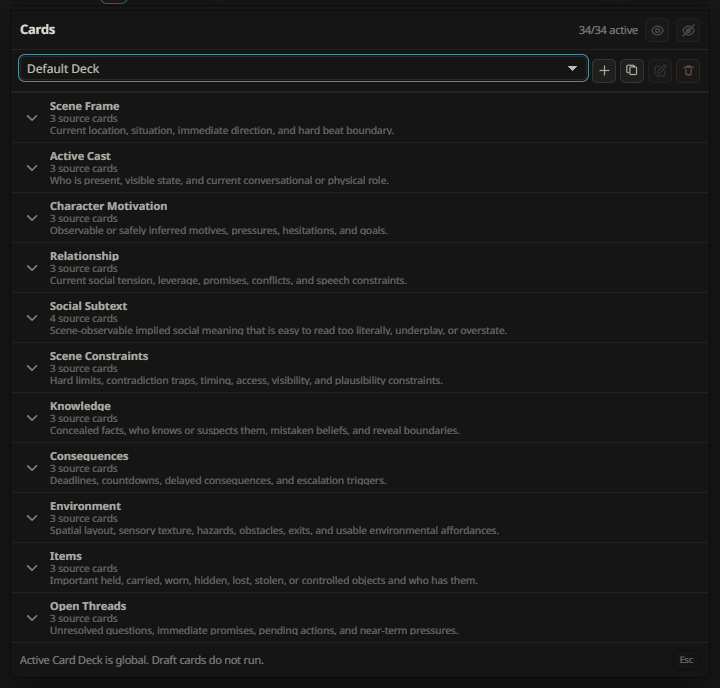

# Recursion `0.1.0-pre-alpha.6` Documentation Update Brief

## Purpose

This brief is the source of truth for the next documentation pass. The release target is `0.1.0-pre-alpha.6`, following `0.1.0-pre-alpha.5`.

The central documentation change is to present the card system as a first-class Recursion feature rather than as an implementation detail. The update must explain what cards are, how operators control them, how the runtime turns them into a hand and prompt packet, and how custom authoring and inspection fit together.

Recursion is pre-alpha. Update the current contract in place. Do not preserve obsolete wording or invent compatibility explanations for older card shapes.

## Documentation outcomes

By the end of the update, a reader should be able to:

1. Understand the card system in one pass from the README.
2. Configure card focus, card count, priority, and mode from the operator manual.
3. Create and manage custom decks, categories, and authored cards.
4. Understand the difference between the catalog/deck, scene-local generated cards, and the selected turn hand.
5. Trace the lifecycle from current chat snapshot through card generation, validation, hand selection, prompt composition, installation, and inspection.
6. Understand what `off`, `active`, and `priority` mean, including Auto versus Manual behavior and Max Cards trimming.
7. Find the card system’s privacy, persistence, failure, and mobile interaction boundaries.
8. See the feature operating in the real UI through reviewed documentation renders.

## Release/version surfaces

Update all current version surfaces from `0.1.0-pre-alpha.5` to `0.1.0-pre-alpha.6`:

- `package.json`
- `package-lock.json` if the package metadata records the version
- `manifest.json`
- release navigation in `docs/DOCUMENTATION_INDEX.md`
- `docs/release/README.md`
- new `docs/release/0.1.0-pre-alpha.6.md`
- README or other docs that name the current release explicitly

The new release note should summarize the card-system work and link to the user, technical, design, testing, and render documentation updated in this pass.

## Card-system feature taxonomy

Use this vocabulary consistently across all documentation.

### 1. Card catalog and families

Document the fixed catalog and its scene questions:

| Family | Coverage |
| --- | --- |
| Scene Frame | current location, temporal position, active scene state |
| Active Cast | present participants and relevant roles |
| Character Motivation | wants, fears, goals, pressure, and action drivers |
| Dialogue Relationship | relationship state, status, trust, friction, and exchange dynamics |
| Social Subtext | what is implied, avoided, concealed, or signaled beneath speech |
| Scene Constraints | rules, limits, obligations, hazards, and boundaries |
| Knowledge & Secrets | who knows what, hidden information, and disclosure risks |
| Clocks & Consequences | active countdowns, consequences, escalation, and causal pressure |
| Environment & Affordances | usable spaces, objects, exits, hazards, and opportunities |
| Possessions & Items | relevant held, visible, missing, or actionable items |
| Open Threads | unresolved questions, promises, clues, and pending developments |

The technical docs should also list every supported sub-item from `src/card-scope.mjs`, not only the family labels.

### 2. Scope and focus controls

Cover:

- Auto scope versus Manual scope.
- Family and sub-item focus selection.
- Strict whitelist behavior.
- Automatic inclusion exceptions when strict whitelist is disabled.
- Empty-selection fallback and the explicit `allowEmpty` contract.
- Min Cards and Max Cards interaction.
- Manual selection trimming when Max Cards is reached.
- Focus labels and selected-family/sub-item summaries.

### 3. Decks, categories, and authored cards

Explain the distinction between the bundled Default Deck and custom decks. Cover:

- creating, naming, normalizing, selecting, duplicating, and deleting custom decks;
- creating, editing, duplicating, and deleting categories;
- creating authored cards and placing them in categories;
- generated versus authored card identity;
- category and card ordering;
- drag handles and reorder semantics;
- duplicate-name rules;
- default-deck protection and fallback when an active custom deck is unavailable;
- persistence and normalization of deck settings.

### 4. Card selection states

Document the three-state contract:

| State | Meaning |
| --- | --- |
| `off` | Do not use this card for the current card pass. |
| `active` | Normal eligible card; the runtime may select it when relevant. |
| `priority` | Operator-prioritized card; it receives stronger selection emphasis within the applicable limits. |

Include the eye-state icons, click-cycle behavior, accessible labels, and the fact that selection state is separate from card content and category order.

### 5. Runtime card lifecycle

Explain the path from active-chat evidence to a prompt-ready hand:

1. Snapshot the current turn.
2. Detect scene shift and determine the work required.
3. Resolve the active deck and card scope.
4. Plan card jobs through the Arbiter.
5. Generate or refresh scene-local card content.
6. Validate and normalize provider results.
7. Merge generated results with authored/deck context.
8. Select the turn hand under focus, priority, Min Cards, Max Cards, and prompt-budget rules.
9. Compose guidance, card evidence, guardrails, omissions, and metadata.
10. Install the packet into SillyTavern and expose it through Last Brief and the Full Viewer.

Clarify that the deck is an operator/configuration surface, the generated cards are scene-local reasoning artifacts, and the hand is the bounded evidence selected for one reply.

### 6. Card assist and model lanes

Cover card assist as a bounded authoring aid, including:

- its input boundary;
- generated suggestions versus committed authored content;
- validation and failure behavior;
- Utility and Reasoner routing under Reasoning Level;
- no hidden chain-of-thought or raw provider payload persistence;
- how selected card context can be reused by Enhancement passes without turning cards into durable memory.

### 7. Inspection, diagnostics, and privacy

Document:

- Last Brief card counts and selected-hand visibility;
- Full Viewer card evidence, guidance, omissions, and packet metadata;
- compact journal breadcrumbs and card counts;
- redaction boundaries;
- scene-local invalidation and regeneration;
- provider fallback and fail-soft behavior;
- what is persisted in settings/decks versus what remains runtime-only.

### 8. Mobile and interaction behavior

Cover the compact card control, expanded card/deck surfaces, touch targets, horizontal overflow, drag affordances, eye-state controls, and the expected behavior when editing cards on narrow screens.

## File-by-file update matrix

### Must update

| File | Required work |
| --- | --- |
| `README.md` | Add cards to Key Features/At A Glance; add a card-system Feature Surface; explain deck, scope, priority, hand, and inspection in concise public language; link to the operator and technical docs. |
| `docs/release/0.1.0-pre-alpha.6.md` | Create release notes centered on the card-system additions and supporting UI/runtime work. |
| `docs/release/README.md` | Add `.6` to release navigation and describe it as the current release. |
| `docs/DOCUMENTATION_INDEX.md` | Add the `.6` release, this update brief, and any newly promoted card-specific docs/renders. |
| `docs/user/RECURSION_OPERATOR_MANUAL.md` | Add a complete operator-facing Cards section covering the card menu, scope, deck management, card editing, states, priority, assist, inspection, mobile, and troubleshooting. |
| `docs/user/FIRST_RUN_WORKFLOW.md` | Add a first-run card path: inspect the default deck, try Auto, try Manual focus, prioritize a card, run a pass, and inspect the resulting hand. |
| `docs/user/README.md` | Route readers to the new card workflow/manual sections. |
| `docs/technical/CARD_DECK_AND_HAND.md` | Expand from the existing generated-card contract to the full deck/category/authored-card/state/ordering/normalization/hand contract. |
| `docs/technical/RECURSION_TECHNICAL_MANUAL.md` | Update the runtime spine and component-ownership sections to make deck, scope, card state, hand, and inspection boundaries explicit. |
| `docs/technical/RUNTIME_TURN_SEQUENCE.md` | Add card scope resolution, deck lookup, priority/Max Cards handling, and hand selection to the turn sequence and failure branches. |
| `docs/technical/PROMPT_PACKET_AND_INJECTION.md` | Explain selected card evidence, authored-card context, omissions, and the hand-to-packet boundary. |
| `docs/architecture/RUNTIME_ARCHITECTURE.md` | Add the card-deck/settings/runtime/UI ownership boundaries and relevant data flow. |
| `docs/architecture/PROMPT_COMPOSITION_SPEC.md` | Update card inputs, hand constraints, and authored/generated distinction. |
| `docs/design/CARD_SYSTEM_SPEC.md` | Reconcile the design contract with the implemented deck editor, card states, priority, assist, drag, mobile, and persistence behavior. |
| `docs/design/UI_SPEC.md` | Add the card controls, deck editor, eye-state/priority semantics, drag handles, and mobile interaction contract. |
| `docs/testing/DOCUMENTATION_RENDER_TRACKING.md` | Add the `.6` render pass, source requirements, target assets, and promotion checklist. |
| `docs/README.md` | Add the new planning brief and card-documentation route if the folder guide lists planning documents individually. |
| `assets/documentation/README.md` | Add the card render family and explain contact-sheet versus standalone capture conventions. |

### Check for stale wording and update where needed

| File/group | Review focus |
| --- | --- |
| `docs/user/PROVIDER_SETUP.md` | Card assist/provider lane wording and cost expectations. |
| `docs/user/PROMPT_PRIVACY_AND_SAFETY.md` | Card persistence, redaction, and selected-hand boundaries. |
| `docs/technical/MODEL_CALLS_AND_PROVIDER_ROUTING.md` | Card generation, assist, validation, fallback, and reasoning-level routing. |
| `docs/technical/STORAGE_AND_DIAGNOSTICS.md` and `docs/architecture/STORAGE_AND_DIAGNOSTICS.md` | Deck settings versus scene-local card/runtime artifacts. |
| `docs/testing/TESTING_STRATEGY.md` | Card editor, scope, state, hand, assist, and render evidence coverage. |
| `docs/testing/ARTIFACT_CONTRACT.md` | Card/deck/hand artifact names and redaction-safe evidence. |
| `docs/planning/DOCUMENTATION_EXPANSION_PLAN.md` | Mark this brief as the current `.6` documentation pass and retain the render-marker contract. |

## Mermaid material to add

Keep explanatory diagrams inline as Mermaid. Do not create PNGs for these relationships.

### A. Card system end-to-end flow

Show: active chat → snapshot → scene shift → active deck → scope/focus → Arbiter → card generation/assist → validation → hand selection → prompt packet → Last Brief/Full Viewer.

### B. Deck, card, and hand ownership graph

Show the distinction and ownership of:

- Default Deck/custom Deck;
- categories and card order;
- authored cards and generated cards;
- scene-local card cache;
- turn hand;
- prompt packet and inspection surfaces.

### C. Selection-state transition graph

Show `off → active → priority → off`, the UI click cycle, and how each state affects eligibility and priority without changing card content.

### D. Scope and cap decision graph

Show Auto/Manual scope, strict whitelist, empty-selection fallback, priority, Min Cards, Max Cards, trimming, and final eligible jobs/cards.

### E. Authored-card lifecycle

Show create draft → edit → validate/normalize → persist → select/reorder → use in deck context → duplicate/delete paths.

### F. Failure and privacy boundary graph

Show invalid provider output, assist failure, fallback, stale scene invalidation, and the rule that secrets/raw prompts/raw responses/hidden reasoning do not enter saved card/deck/diagnostic artifacts.

### G. Card UI-to-runtime boundary graph

Show card controls and deck editor events flowing into normalized settings/deck state, then into runtime scope/hand selection, with Last Brief as read-only inspection output.

## Render inventory

All captures must be live-host renders from a sterile `recursion-soak-*` profile, with the served extension matching the checkout. Raw captures remain in `.recursion-doc-renderer/`; only reviewed, redacted final images go under `assets/documentation/renders/`.

### Required standalone renders

| Target asset | Required visual |
| --- | --- |
| `recursion-operator-card-control.png` | Compact Recursion Bar with the Cards control visible in idle/ready state. |
| `recursion-card-scope-auto.png` | Cards scope surface showing Auto behavior and the default catalog. |
| `recursion-card-scope-manual.png` | Manual family/sub-item focus selection with selected counts and scope summary. |
| `recursion-card-priority-states.png` | Card rows showing off, active, and priority eye-state visuals and labels. |
| `recursion-card-deck-overview.png` | Deck selector with Default Deck and custom-deck affordances. |
| `recursion-card-deck-editor.png` | Custom deck editor with categories, cards, authored/generated distinction, and ordering controls. |
| `recursion-card-category-editor.png` | Category create/edit/delete surface with drag handle treatment. |
| `recursion-card-authored-card-editor.png` | Authored card creation/edit surface with name, content, category, and state controls. |
| `recursion-card-assist.png` | Card Assist input/result state showing bounded suggestion workflow and commit boundary. |
| `recursion-card-mobile-editor.png` | Narrow-screen card/deck editing state with usable touch targets and no clipped controls. |
| `recursion-card-hand-inspection.png` | Last Brief or Full Viewer showing selected hand, card evidence, counts, and omissions. |
| `recursion-card-fallback-state.png` | Fail-soft card/provider state where the original usable packet remains visible. |

### Recommended contact sheets

Use contact sheets where the purpose is to show a state family rather than one interaction:

- `recursion-card-selection-state-contact-sheet.png` — off/active/priority rows;
- `recursion-card-deck-lifecycle-contact-sheet.png` — create, edit, duplicate, delete;
- `recursion-card-scope-contact-sheet.png` — Auto, Manual, strict whitelist, capped selection;
- `recursion-card-inspection-contact-sheet.png` — compact Last Brief, expanded viewer, omissions, metadata;
- `recursion-card-mobile-contact-sheet.png` — bar, scope, editor, and inspection on narrow screens.

### Render placement requirements

Each required render must be linked from the document section that explains it. Until captured, place a visible marker in that target document using the existing contract:

```markdown

```

Do not use screenshots to replace Mermaid diagrams. Do not promote fixture-only images as live UI evidence.

## Verification checklist

- [ ] `package.json`, `package-lock.json`, and `manifest.json` all identify `0.1.0-pre-alpha.6`.
- [ ] README Key Features names cards, decks/scope, priority, hand selection, and inspection.
- [ ] README links to the operator manual and technical card documentation.
- [ ] Release navigation identifies `.6` as current.
- [ ] Operator docs explain every user-facing card feature and sub-feature listed here.
- [ ] Technical docs explain catalog, deck, scope, state, hand, validation, persistence, and privacy boundaries.
- [ ] All seven Mermaid relationships are present and render as valid Mermaid.
- [ ] Every required screenshot has either a promoted asset or a visible `<Render Needed>` marker.
- [ ] Render tracking and asset documentation agree with the final asset set.
- [ ] No stale `.5` or pre-deck card terminology remains in public/current docs.
- [ ] `git diff --check` passes.
- [ ] Documentation link/image checks pass.
- [ ] Focused card, UI, and documentation-render checks pass.

## Suggested implementation order

1. Version and release navigation surfaces.
2. Card feature vocabulary and canonical technical/design docs.
3. Operator manual and first-run workflow.
4. README feature surfaces and public links.
5. Mermaid diagrams and cross-document links.
6. Live card-system renders and render tracking promotion.
7. Documentation verification and stale-wording audit.
