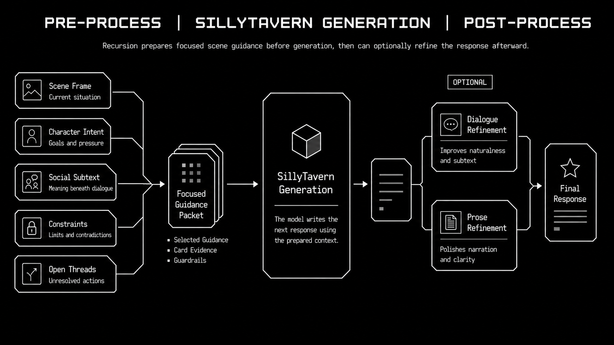
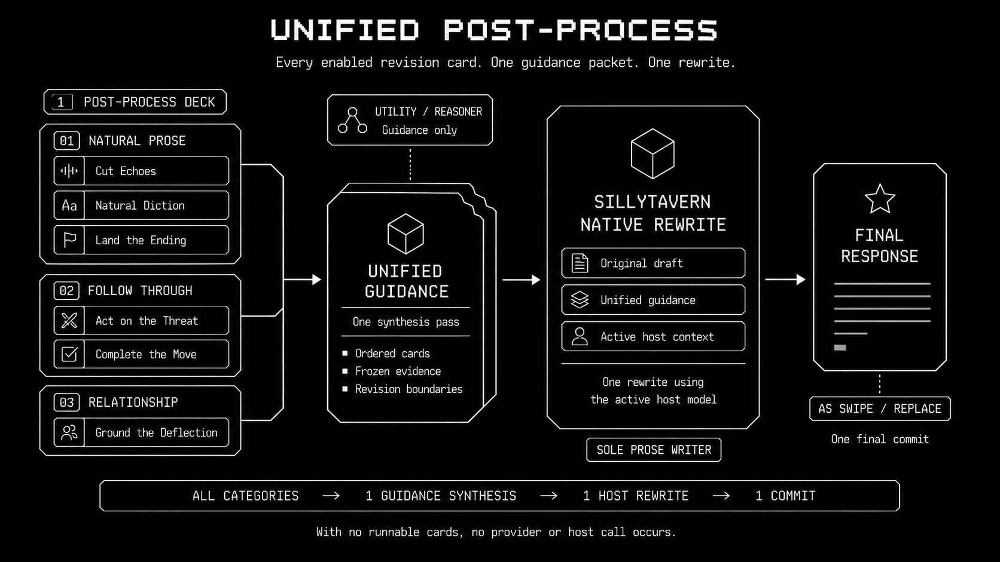
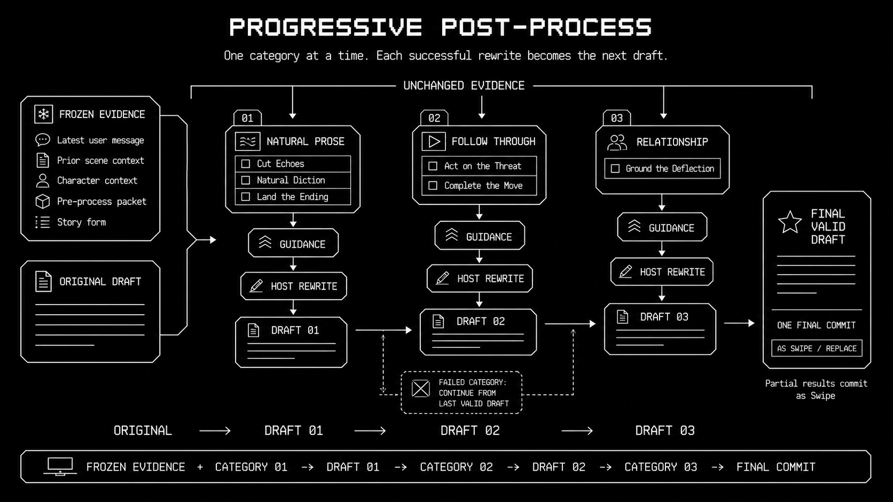

# Recursion `0.1.0-pre-alpha.6`

## Cutomization & Refinement

Recursion `0.1.0-pre-alpha.6` introduces two major additions: **Custom Decks & Cards** for shaping the questions Recursion asks about your scene, and **Post-Processing** for giving completed responses a second, refined pass.

Define what matters, guide how it's considered, then refine the response.

## Custom Decks & Cards

Duplicate a deck, create your own categories, write cards in your own words, and arrange everything in the order that fits your story. Keep the bundled catalog as a starting point or make something completely personal for a character, faction, location, relationship, or style of play.

Cards now give you a more expressive way to steer a turn:

- Choose which cards are active, inactive, or priority.
- Use Manual mode as a strict whitelist when you want direct control.
- Inspect the exact hand Recursion used through Last Brief and the Full Viewer.
- Add, edit, duplicate, reorder, and remove authored cards with a compact, touch-friendly workflow.
- Get bounded Card Assist suggestions without giving up the final say.

## Post-Processing

Clean AI-slop and polish that turd to a mirror finish.

Post-Processing lets you revise a completed assistant response using an independent deck of focused rewrite cards. Recursion reads the response and its bounded scene evidence, creates structured guidance, and lets SillyTavern's active model and preset write the revision in the context you already use.

Choose the kind of pass you want:

- **Unified** combines your enabled cards into one coordinated revision.
- **Progressive** applies them in order, carrying each successful improvement into the next pass.
- **As Swipe** preserves the original so you can compare or return to it.
- **Replace** updates the selected response after the full operation succeeds.

## Also in this release

- A shared card-panel experience across Pre-process and Post-process, including descriptions, disclosure state, category/card editing, and drag ordering.
- Faster, safer reuse for exact-source turns, prepared prompt packets, and unchanged latest-assistant swipes.
- More resilient host lifecycle handling around Stop, duplicate terminal events, native quiet generation, and response settlement.
- Clearer progress and failure reasons across card selection, provider work, and response revision.
- A refreshed first-run workflow and documentation visuals throughout the project.

## Explore the new workflow

- [First-Run Workflow](../user/FIRST_RUN_WORKFLOW.md)
- [Recursion Operator Manual](../user/RECURSION_OPERATOR_MANUAL.md)
- [Post-process Cards Runtime Boundary](../architecture/POST_PROCESS_CARDS_RUNTIME.md)
- [Post-process Cards Design](../superpowers/specs/2026-07-18-recursion-post-process-cards-design.md)
- [Cache Use And Reuse Spec](../architecture/CACHE_USE_AND_REUSE_SPEC.md)
