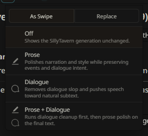
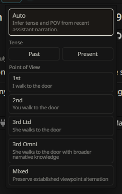

# Recursion Post-Alpha.1 Feature Highlights

This is the cumulative update post for the work added after `0.1.0-pre-alpha.1`, through `0.1.0-pre-alpha.6`.

Recursion started alpha.1 as a current-scene prompt compiler: it reads the active SillyTavern chat, builds scene cards, selects a compact hand, and installs an inspectable prompt packet before the host model writes. The post-alpha.1 work keeps that core scope and adds a dedicated post-generation Enhancements surface for improving the assistant message that just landed.

## Headline Features

The current `.6` release also promotes the card system into a complete operator surface: custom decks, authored cards, card states, priority, hand inspection, and mobile-aware editing are documented in the [`.6` release notes](0.1.0-pre-alpha.6.md).

- Added an `Enhancements` control to the compact Recursion Bar.
- Added enhancement targets: `Off`, `Prose`, `Dialogue`, and `Prose + Dialogue`.
- Added apply modes: `As Swipe` and `Replace`.
- Added Dialogue Enhancement for echoing, forced questions, over-technical dialogue, unsupported defensive tropes, attraction cliches, and weak subtext.
- Kept Prose + Dialogue ordered as Dialogue first, then Prose, with one final applied result.
- Routed Enhancement work through Utility at Low and Medium Reasoning Level, and through Reasoner at High and Ultra when that lane is available.
- Added bounded, sender-aware enhancement context from recent visible transcript messages, recent dialogue examples, and selected Recursion cards.
- Added exact no-op rejection for Dialogue output so duplicate enhanced swipes are not appended.
- Added retry behavior for exact no-op Dialogue output and low dialogue-span edits when strong slop or echo signals are detected.
- Added enhancement markers for attempt, retry reason, applied provider lane, fallback source, whole-message edit ratio, and dialogue-span edit ratio.
- Updated operator, provider, UI, and runtime-sequence docs for the current Enhancement contract.

## What This Changes In Use

Before alpha.2, Recursion's visible value was mainly before generation: prepare a better prompt packet, inspect Last Brief, then let SillyTavern continue.

After alpha.2-alpha.5, Recursion can also act immediately after the assistant response lands. When Enhancements are enabled, Recursion can hold the fresh assistant output, run a provider pass against the new text plus bounded scene context, validate the result, and either add the improved text as a selected swipe or replace the active message.

## UI Changes Since Alpha.1

The compact bar changed in two operator-facing places. The old post-generation prose affordance is now an icon-only Enhancements menu with an apply control and four target rows. The Tense & PoV selector is now a two-axis correction menu instead of a flat list of combined story-form choices.





This makes Recursion useful for two different moments:

- before generation, where the scene-card and prompt-packet system helps the host model notice what matters;
- after generation, where Enhancements can clean dialogue/prose slop without changing Recursion's bounded scene-memory scope.

## Dialogue Enhancement

Dialogue Enhancement is the main post-alpha.1 addition. It asks a provider to revise speech toward natural subtext while preserving the message's narration shell and scene meaning.

The validator is intentionally strict. Dialogue output that is byte-identical to the source retries once, then keeps the original. Low-change dialogue output can also retry when Recursion detects strong slop, soft suspicious phrasing, or echoed user context. Dialogue edit tracking focuses on dialogue spans so a narration-heavy message does not hide an unchanged line of speech behind a larger whole-message diff.

## Prose + Dialogue

`Prose + Dialogue` runs Dialogue first and Prose second. The final result is applied once, either as a selected sibling swipe or as a replacement, depending on the selected apply mode.

This keeps the user-facing result simple: one enhanced candidate, not a stack of intermediate passes.

## Provider Routing

Enhancements follow the current Reasoning Level contract:

| Reasoning Level | Enhancement Lane |
| --- | --- |
| Low | Utility |
| Medium | Utility |
| High | Reasoner when available, with Utility fallback |
| Ultra | Reasoner when available, with Utility fallback |

Reasoner is not required. If the selected enhancement lane is unavailable, fails, or returns invalid output, Recursion preserves the original message and records compact fallback metadata instead of leaving the host output hidden.

## Safety And Diagnostics

The post-alpha.1 work keeps the existing privacy boundary:

- provider secrets are session-only;
- raw model prompts and responses are not stored in normal diagnostics;
- Enhancement context is bounded;
- markers store compact ratios, lanes, retry reasons, and fallback metadata rather than raw provider payloads;
- failed or invalid passes reveal the original assistant message unchanged.

Enhancement mutation is treated as Recursion-owned runtime work. Late SillyTavern update or swipe events from that short mutation window do not clear Last Brief or the current prompt packet.

## Release Checkpoints

- [`0.1.0-pre-alpha.2`](0.1.0-pre-alpha.2.md): introduced the broader Enhancements surface, Dialogue target, Prose + Dialogue target, apply modes, and live feature proof.
- [`0.1.0-pre-alpha.3`](0.1.0-pre-alpha.3.md): tightened Enhancement provider routing so High and Ultra use Reasoner when available instead of silently staying on Utility.
- [`0.1.0-pre-alpha.4`](0.1.0-pre-alpha.4.md): added bounded context, sender labels, selected-card context, and no-op rejection when deterministic slop requires intervention.
- [`0.1.0-pre-alpha.5`](0.1.0-pre-alpha.5.md): tightened Dialogue Enhancement with dialogue-span edit ratios, retry reasons, tiered slop detection, and richer marker metadata.

## Current Verification Posture

The current checkpoint records focused local coverage for Dialogue Enhancement, Prose Enhancement, runtime behavior, UI behavior, the full local test suite, and whitespace checks:

```powershell
node tools\scripts\test-dialogue-enhancement.mjs
node tools\scripts\test-prose-enhancement.mjs
node tools\scripts\test-runtime.mjs
node tools\scripts\test-ui.mjs
npm.cmd test
git diff --check
```

For broader release confidence, use the maintained alpha gate:

```powershell
node tools\scripts\run-alpha-gate.mjs
```
