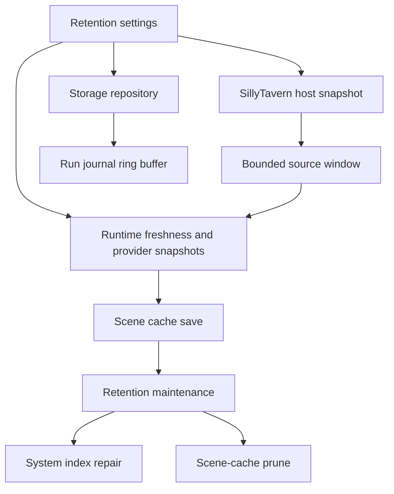

# Recursion Retention Cap Settings Design

## Purpose

Recursion must scale across long SillyTavern chats without becoming a transcript archive, memory system, or chat-pruning tool. The correct V1 contract is to cap Recursion-owned work and storage, not SillyTavern messages.

This design adds user-exposed cap settings for Recursion's source window, provider snapshot, scene-cache retention, source-variant retention, and run-journal retention. The settings live in Advanced because they are operational tuning controls, not normal-play behavior controls.

## Current State

- Storage already writes bounded Recursion-owned records:
  - `recursion-system-index.v1.json`
  - `recursion-scene-{chatKey}-{sceneKey}.v1.json`
  - `recursion-run-journal-{chatKey}.v1.json`
- Run journals are bounded in `src/storage.mjs`, defaulting to 100 entries and clamping at 500.
- Scene-cache pruning exists through `pruneSceneCaches(options)`, defaulting to 3 scene caches per chat and 24 total, but it is not yet part of routine runtime maintenance.
- Runtime provider prompts already use only the last 12 visible provider-safe messages.
- The SillyTavern host snapshot path still normalizes `context.chat` as a full array and hashes all visible source messages. This keeps prompt tokens bounded but leaves snapshot/freshness work proportional to full chat length.
- Advanced settings currently expose `diagnostics.maxJournalEntries`; bootstrap does not pass that value into `createStorageRepository(...)`, so the saved setting does not own repository retention yet.

## Non-Goals

- Do not delete, hide, trim, summarize, or rewrite SillyTavern chat messages.
- Do not add a Recursion transcript archive.
- Do not add vector recall, durable story memory, lore import/export, or cross-scene canon.
- Do not expose per-card retention controls.
- Do not preserve old pre-alpha setting names if a cleaner V1 shape is better.

## Approaches

### Option A: Internal Caps Only

Keep hard-coded defaults and hide cap settings from users.

Tradeoff: least UI churn, but users cannot tune slow long-chat setups or storage-heavy debugging sessions. This also leaves a mismatch between existing journal-size UI and repository behavior unless fixed separately.

### Option B: Advanced Retention Settings

Add a compact Advanced > Retention disclosure with bounded numeric controls. Runtime, host snapshot, storage, diagnostics, and docs all read one normalized retention policy.

Tradeoff: more settings, but they are grouped in Advanced and solve the actual long-chat scale problem without touching user chat data.

Recommendation: choose Option B.

### Option C: Chat Message Cap

Delete or ignore SillyTavern messages past a user-configured count.

Tradeoff: dangerous product boundary. It risks destroying user-authored chat history and conflicts with Recursion's role as a current-scene prompt compiler.

Decision: reject Option C.

## Retention Settings Contract

Create one V1 settings object:

```ts
type RecursionRetentionSettings = {
  sourceWindowMessages: number;
  sourceWindowCharacters: number;
  providerVisibleMessages: number;
  sceneCachesPerChat: number;
  sceneCachesTotal: number;
  sourceVariantsPerScene: number;
  runJournalEntries: number;
};
```

Defaults and UI ranges:

| Setting | Default | Min | Max | Step | UI Label | Effect |
| --- | ---: | ---: | ---: | ---: | --- | --- |
| `sourceWindowMessages` | 48 | 12 | 200 | 4 | Source Messages | Maximum recent visible messages Recursion normalizes and hashes for current-scene freshness. |
| `sourceWindowCharacters` | 24000 | 6000 | 100000 | 1000 | Source Text Budget | Maximum combined visible text characters in the source window. Runtime walks backward from the latest visible message until either this or Source Messages is reached. |
| `providerVisibleMessages` | 12 | 4 | 32 | 1 | Provider Messages | Maximum recent visible messages included in provider-safe snapshots. |
| `sceneCachesPerChat` | 3 | 1 | 12 | 1 | Scene Caches / Chat | Maximum unprotected Recursion scene-cache files retained per chat. |
| `sceneCachesTotal` | 24 | 4 | 100 | 4 | Scene Caches Total | Maximum unprotected Recursion scene-cache files retained across chats. |
| `sourceVariantsPerScene` | 4 | 1 | 8 | 1 | Swipe Variants / Scene | Maximum active-source variants retained inside one scene cache. |
| `runJournalEntries` | 100 | 10 | 500 | 10 | Journal Entries | Maximum sanitized run-journal entries retained per chat. |

`sourceWindowCharacters` and `sourceWindowMessages` are both enforced. Message count prevents huge lists; character budget prevents a few enormous messages from dominating snapshot work. Provider Messages stays separate from Source Messages because provider calls need token control while freshness needs source identity control.

`sceneCachesTotal` must never be normalized below `sceneCachesPerChat`. If the user enters a lower total, normalization raises total to the per-chat value.

## Settings Placement

Advanced keeps four disclosures:

- Injection
- UI
- Retention
- Diagnostics

Retention owns the numeric caps:

- Source Messages
- Source Text Budget
- Provider Messages
- Scene Caches / Chat
- Scene Caches Total
- Swipe Variants / Scene
- Journal Entries

Diagnostics keeps controls that act on or export diagnostics:

- Include Excerpts
- Reset Scene Cache
- Clear Run Journal
- Export Diagnostics

Tooltip copy:

- Source Messages: `Recent visible messages Recursion reads for source freshness. Does not delete SillyTavern chat.`
- Source Text Budget: `Character budget for the source freshness window. Lower values make long chats cheaper; higher values keep more local scene evidence.`
- Provider Messages: `Recent visible messages sent to Recursion provider calls. This affects Recursion analysis prompts, not the final story model context.`
- Scene Caches / Chat: `Recursion scene-cache files retained per chat. Old unprotected caches are disposable and can be rebuilt.`
- Scene Caches Total: `Total Recursion scene-cache files retained across chats. Cleanup never deletes SillyTavern messages or other extension data.`
- Swipe Variants / Scene: `Active-source variants retained for swipe A/B/A reuse. Higher values preserve more swipe branches but make scene-cache files larger.`
- Journal Entries: `Sanitized Recursion activity entries retained per chat. Higher values help debugging but cost more local storage.`

## Runtime Contract

The host snapshot must stop normalizing full chats. It should build a bounded source window by scanning from the latest host message backward, keeping visible non-system messages until the configured message cap or character budget is reached. It should return:

```ts
type BoundedSnapshotMetadata = {
  sourceWindowFirstMesId: number;
  sourceWindowLastMesId: number;
  sourceWindowMessageCount: number;
  sourceWindowCharacterCount: number;
  sourceWindowTruncated: boolean;
  sourceWindowLimitReason?: "message-cap" | "character-budget" | "both";
};
```

Runtime freshness checks compare cached card source ranges against this bounded window. Cards whose evidence falls outside the bounded window become stale for prompt use. They can still appear as sanitized cache metadata in inspection surfaces, but `promptText` must not enter prompt composition from stale evidence.

Provider-safe snapshots use `providerVisibleMessages`, still bounded by `PROVIDER_MESSAGE_TEXT_LIMIT` for each message.

## Storage Contract

Storage repository should accept a dynamic retention policy source:

```ts
createStorageRepository({
  storage,
  activity,
  getRetentionSettings: () => settingsStore.get().retention
});
```

Repository methods normalize retention at call time so settings changes affect future journal loads/appends and prune passes without recreating the repository.

Retention maintenance should run best-effort:

- after a successful scene-cache save;
- after startup/bootstrap when an active scene exists;
- after Retention settings change.

Maintenance must:

- repair the index;
- prune scene caches beyond `sceneCachesPerChat` and `sceneCachesTotal`;
- protect the active scene;
- preserve unreadable records instead of guessing;
- never delete run journals during scene-cache pruning;
- never touch SillyTavern chats, characters, World Info, Memory Books, Summaryception, VectFox, or non-Recursion extension files.

Run journals remain ring buffers. Changing `runJournalEntries` changes how many entries are retained next time a journal is loaded or appended.

Source variants per scene should be controlled by `sourceVariantsPerScene`; normalization keeps the active variant and newest remaining variants up to the cap.

## Data Flow



## Error Handling

- Invalid or blank numeric inputs normalize to defaults.
- Values outside ranges clamp to the nearest allowed value.
- If storage pruning fails, generation continues and a sanitized storage warning is recorded.
- If host snapshot cannot read chat, runtime receives an empty bounded snapshot and fails soft as it does today.
- If settings change during a run, the current run uses the snapshot policy it already read; the next run uses the new caps.

## Diagnostics

Diagnostics may include cap metadata:

```ts
{
  sourceWindow: {
    messageCount: 48,
    characterCount: 18320,
    truncated: true,
    limitReason: "message-cap"
  },
  retention: {
    sceneCachesPerChat: 3,
    sceneCachesTotal: 24,
    sourceVariantsPerScene: 4,
    runJournalEntries: 100
  }
}
```

Diagnostics must not include raw message text unless Include Excerpts is explicitly enabled and the existing excerpt redaction path approves the text.

## Testing

Focused tests should prove:

- settings defaults, ranges, and persistence for `retention`;
- UI renders Retention controls with correct labels, ranges, datasets, and tooltips;
- host snapshot normalizes only the bounded source window;
- provider-safe snapshot honors `providerVisibleMessages`;
- source freshness rejects cached cards whose evidence falls outside the bounded window;
- scene-cache pruning uses user caps and protects the active scene;
- source variant normalization uses `sourceVariantsPerScene`;
- journal ring buffer uses `runJournalEntries` from current settings;
- cleanup never touches non-Recursion files or SillyTavern chat data;
- docs state that caps affect Recursion-owned data and windows, not chat retention.

## Rollout

Because Recursion is pre-alpha, the clean V1 setting shape should replace `diagnostics.maxJournalEntries` with `retention.runJournalEntries`. Update docs, settings normalization, UI, tests, and examples in place instead of adding compatibility shims.
