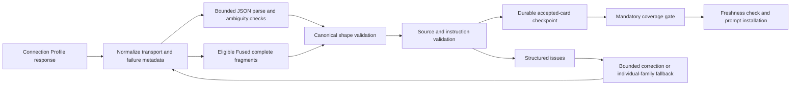

# Model-output recovery and understandable settings

Status: design, plan, and execution preapproved by the repository owner on 2026-10-07. No further approval gates apply to this work. Work happens on `codex/recovery-settings` in the attached managed worktree. Publishing, deployment, and changes to the running SillyTavern account are outside this request.

## 1. Intent and success

Recursion should complete more turns when a model produces malformed output, retain work that already passed validation, and make settings understandable without knowledge of pipeline internals. Broken JSON and failed recovery are the owner's highest priority. Settings changes must improve actual behavior as well as labels.

Success means: complete, source-bound cards survive damaged bundle envelopes; correction calls identify actionable errors; recovery never invents missing evidence or reuses stale work; optional failures can produce an explained smaller hand; mandatory coverage still blocks installation; and the card target is independent of provider routing. Existing cancellation, checkpoint, budget, privacy, and native-host contracts remain enforceable.

This is an in-place V1 contract improvement. Recursion is pre-alpha: replace old persisted settings and update consumers, examples, docs, and tests together. Do not retain Min/Max settings, compatibility aliases, or a second recovery implementation.

## 2. Evidence from the current implementation

| Boundary | Observed behavior | Consequence |
| --- | --- | --- |
| `runtime.mjs: validateFusedProviderResult` | Every `ok:false` result returns before card parsing. | Existing fragment salvage cannot serve the durable pipeline. A complete Scene Frame fragment is accepted by the card parser and discarded by durable validation for the same response. |
| `providers.mjs: generate` | Failed Fused output is truncated to 12,000 characters before salvage. | Complete later items can disappear before validation. |
| `structured-output-parser.mjs` | First balanced object wins; JSON.parse overwrites duplicate keys. | An example object may displace the answer, or conflicting field values may be accepted silently. |
| `runtime/preprocess-graph.mjs` and runtime overrides | Corrections append to the previous prompt; failures have mostly general messages. | Repeated attempts accumulate feedback and may repeat the same mistake. |
| `cards.mjs: repairProviderEvidenceRefs` | Missing/out-of-window evidence can be replaced with the latest message. | Apparent recovery can attribute unsupported content to a source the model never cited. |
| `attempt-policy.mjs` | Context recovery reduces only output reservation; native output may downgrade without consulting explicit policy. | Oversized input remains oversized; forced Native Schema can behave like Auto. |
| Durable Segmented stages and hand validator | Every planned generated family blocks. | Optional enrichment exhaustion stops an otherwise usable turn. |
| Settings and Manual scope | Routing selects Min/average/Max target; some cap edits target a dropped `cardScope` field. | Hidden coupling and a Manual cap that deck state can bypass. |

Four focused suites passed during the review; those suites do not cover all cases above. The full baseline's local child-process verifier passed outside the restricted sandbox. Record subsequent baseline and final integration results in the execution ledger.

## 3. Architecture and boundaries

Retain the durable scheduler and one canonical provider router. Use small modules for structural JSON scanning, output-shape issues, correction prompts, and recovery eligibility. Do not replace the pipeline or add a new framework/dependency.



Transport failures remain transport failures. A partial-output artifact may retain a safe failure code without turning that code into a fabricated card-validation rejection. Normal inspectors show reasons; diagnostics hold fixed codes and counters. No raw output, hidden reasoning, prompts, or credentials enter the run journal.

## 4. Structural JSON safety

Keep common formatting repair: fences, comments, trailing commas, escaped transport line breaks, and proven syntax defects. Parsing is bounded to 262,144 characters, nesting depth 64, and at most 40 complete bundle items. Exceeding a bound returns a specific recoverable output diagnostic; it never creates a partial trusted object.

Add string-aware scanning for complete top-level values and duplicate object keys. Repeated keys in distinct nested objects are legal; repeated keys in the same object are ambiguous and rejected, including escaped spellings that decode to the same key. A response with multiple competing top-level objects is rejected for correction; ordinary prose around one object and a single fenced object remain supported. Braces and apparent JSON inside quoted string values do not become candidates.

Never close an unfinished card or fabricate a missing field. The enclosing bundle can be broken while complete member objects are usable. Singleton-array normalization, when accepted, is recorded as normalization rather than claimed as untouched strict JSON. Any repair still passes shape and semantic validation.

Examples:

```text
{"promptText":"Keep the door closed.","promptText":"Open the door."}
  => json_ambiguous; ask for exactly one value.
Example: {"example":true}\nAnswer: {"promptText":"...","evidenceRefs":["message:8"]}
  => json_ambiguous; do not pick the example or guess the intended answer.
{"items":[{"family":"Scene Frame","promptText":"Keep the doorway in view.","evidenceRefs":["message:8"]},{"family":
  => retain only the complete Scene Frame after all card checks.
```

## 5. Canonical output contracts and issue feedback

Keep `jsonSchemaForRequest` as the canonical structural contract. Introduce a small dependency-free validator for the subset Recursion emits: type, const, enum, required, properties, additionalProperties, items, minimum/maximum, string and array lengths, uniqueness, and anyOf. Unknown schema constructs must be surfaced during tests, not silently accepted. Provider-specific transport may project unsupported constraints, while local validation retains the full contract.

Card and bundle item validation share those schema definitions. Validate the Fused envelope separately from each item: one malformed sibling must not reject valid siblings. Existing role-specific validators continue to own semantic identities, source hashes, installed-card coverage, instruction form, and editorial correctness; wire shared shape validation where a canonical role schema is defined without replacing semantic checks with a shallow schema marker. Validate wire payloads separately from request-owned envelope metadata: Post-process guidance's wire schema is only guidanceText, while normalization supplies trusted schema/source identities. A wire additionalProperties rule must not reject those locally supplied identities. Preserve established deterministic payload normalization before structural validation.

Issues are bounded data:

```ts
type OutputIssue = {
  path: string; // request-owned field path; maximum 160 characters
  rule: 'required' | 'type' | 'enum' | 'const' | 'length' | 'unique' | 'additional-property' | 'evidence' | 'instruction';
  message: string; // fixed explanatory copy; never model field values
};
type OutputCheck = { ok: boolean; issues: OutputIssue[] }; // maximum 8 issues
```

Do not echo rejected values into diagnostics. A correction can name the requested family, expected type, legal source-window bounds, and allowed request-owned identifiers. It must not include private reasoning or the full failed response.

Use one correction builder for durable Arbiter, card, Fused, and Guidance requests and Post-process guidance. Corrections rebuild from the initial prompt or message array, retain current token/format adjustments, and include up to eight precise issues plus the expected output shape. The host prioritizes message arrays over prompt text, so message-based requests receive a real user correction message. Passing a correction with no meaningful request change is an explicit stop, not a paid retry under a new label. Preserve existing editorial-specific feedback where it carries richer verifier evidence.

## 6. Fused recovery and salvage

Allow complete-member salvage only for explicit JSON parse/object/ambiguity errors, payload shape mismatch, and provider completion-token exhaustion. Never salvage authentication, account, configuration, refusal/content-filter, cancellation, transient transport, stale-source, storage, or operation-budget failures. The original failure remains inspectable as a fixed code.

Normalize partial visible content at the provider boundary before throwing token-limit errors, so eligible fragments are available in memory. Extract complete items under the structural limits before any diagnostic truncation; return a transient `recoverableItems` array to the durable validator. The durable artifact persists only validated cards, outcome codes, and request-bound identities. A bounded `recoverableText` path may remain only as a parser input during integration, not as persisted journal content or a second production contract.

Use identical per-item normalization, duplicate-family rejection, requested-family checks, source-coverage checks, instruction checks, and evidence validation for successful and salvaged responses. Valid siblings checkpoint immediately; unresolved families use the existing Segmented stages on the bundle's selected lane. Accepted siblings are never regenerated by that recovery wave.

If no complete item survives, allow one meaningfully corrected bundle attempt within the configured model/recovery budget; then use individual-family fallback for output-related exhaustion. Fused token/context capacity exhaustion may also narrow to individual-family calls. Keep provider cause distinct from any actual item rejection. A connection outage cannot be repaired by narrower prompts.

## 7. Evidence and capacity recovery

Evidence must refer to the supplied source window. Remove latest-message substitution for empty, malformed, or entirely out-of-window refs. Mechanical normalization may preserve a known reference spelling; it cannot change which message is cited. Partially invalid evidence is rejected for correction rather than silently dropped. Existing request-owned authored-source binding remains deterministic and source-bound.

Context overflow first reduces an excessive output reservation to the role floor within the same configured ceiling. If the input still cannot fit, Fused narrows to individual-family calls; single-family and planner work stop with an actionable source-window/output-limit explanation. Do not silently cut source messages, authored instructions, mandatory cards, or invent token counts. This bounded narrowing is the shipping input-reduction mechanism; generic lossy history compaction is excluded.

Token exhaustion may raise the output budget up to the actual configured ceiling. If the ceiling is reached, Fused can recover complete items and narrow unresolved work. All extra calls consume the durable operation allowance except the existing separately bounded capacity retry policy; elapsed queue/cooldown time remains subject to the operation deadline.

Native Schema is an explicit policy: unsupported forced native output stops with a compatibility explanation. Auto may downgrade to Prompt JSON within budget and records the effective method. Correct both wrapped durable requests and direct requests. Include configured generation policy in durable request metadata so retry policy can make this decision.

Rate-limit and transient retries remain bounded and abortable, honor Retry-After, and use small bounded jitter to reduce synchronized retries. Inject randomness in tests. Keep shared-profile cooldown and queue ownership; a timed-out transport must not release a queue slot before the underlying operation settles.

## 8. Mandatory coverage and optional degradation

Mandatory generated jobs include selected Scene Constraints and jobs forced by Manual, Priority, or Refinement coverage. Mandatory authored Priority/Refinement cards and all selected authored instructions retain their authority. A failed mandatory job blocks prompt installation and retains Retry on its owner.

Other generated families are optional enrichment. After bounded recovery exhaustion, their failure may settle the graph with `continue`, a null artifact, and a safe omission record. Hand validation checks required jobs and selected authored cards; it does not require exhausted optional jobs. The resulting hand must explain missing optional work with requested, delivered, and omitted counts. Optional failure must not revive stale cache cards or local invented evidence.

Reserve scarce recovery calls for mandatory work before optional retries. Successful repaired rows become ordinary completion; unresolved optional omissions stay amber in the aggregate hand explanation, with the specific failed family cause inspectable. A completed operation with optional omissions is degraded, not a silent full success. Existing Stop, Resume, Retry, Reprocess, stale-source, and reload behavior remain intact.

## 9. One understandable card target

Persist only `cardsPerTurn`, integer 0..20, default 6. Remove persisted/operator Min Cards and Max Cards and their midpoint formula. Internal `plan.budgets.maxCards` and `selectHand({maxCards})` retain their meaning as derived operation budgets; they are not legacy user settings. `normalizeCardBudgetSettings` produces one `{ targetCards }` policy.

Low/Medium/High/Ultra retain provider routing and reasoning policy; every level uses the same card target. Strength does not secretly change the card count. Mandatory Priority/Refinement coverage may exceed the target and remains visible in counts. Zero requests no discretionary cards.

Manual derives a per-turn selection projection from the active deck without mutating saved card states. Reserve mandatory Refinement entries first, then take eligible Active authored cards/family requests in deck order up to the remaining target. A repeated family source is grouped according to existing family coverage rules. Deck entries exceeding the target remain enabled in the saved deck and are explained as omitted for this turn. Zero includes only mandatory Refinement entries. Required Scene Constraints blocks only when selected; it is not injected into an explicit Manual whitelist.

Update provider prompts, run hashes, prepared-generation identities, diagnostics snapshots, settings reset, UI autosave, schemas/examples, and current-contract tests in place. Old min/max values are ignored by normalization; no migration shim or dual persistence.

## 10. Compact settings UX

Preserve Play / Providers / Advanced and existing graphite, native SillyTavern controls. No dashboard, onboarding wizard, permanent bar badge, or broad Save button.

Play has visible labels `Guidance strength`, `Cards per turn`, `Focus`, and `Guidance detail`. Variety and cooldown remain adjacent optional controls with their Auto-only explanation. Display a short computed summary: target card count, actual available routing, and the fact that mandatory cards can exceed the target. Explanations are visible helper text, usable on touch and when tooltips are off.

The bar retains the reasoning-chain control, but its description explains model routing rather than implying it owns card count. Providers show the selected Connection Profile, Test Profile, and plain check results first. Put Behavioral Preset, Instruct Formatting, Samplers, Structured Output, Output Token Ceiling, and Concurrent requests inside a collapsed `Compatibility and tuning` disclosure per lane. Preserve disclosure state across autosave and tab rerenders. Existing field revision checks and field-local autosave remain authoritative.

Test results distinguish single cards, combined cards, structured-output method, and verified concurrency. Avoid claiming combined reliability from one synthetic small test; call it a capability check. Untested profiles remain usable with current caution semantics. An incompatible combined check does not erase a passing single-card check.

Advanced retains model-attempt and time controls. Visible copy explains that model attempts include the first call, capacity retries are separately bounded, the operation allowance can stop recovery earlier, and Resume preserves the current budget while deliberate Retry/Reprocess opens a new window. Defaults remain request 180 seconds, operation 300 seconds, model attempts 2.

## 11. Provider qualification truth

Auto must not use a native-schema certification whose configuration hash is stale. Store a separate `profileIdentityHash` for the selected available profile's model, API/completion mode, preset and instruct identity; compare it alongside the existing Recursion configuration hash. Settings normalization cannot read the host, so it must not invent a current profile fingerprint. A Connection Profile edited under the same ID becomes Untested; production does not launch hidden paid probes. Use sanitized profile descriptors and hashes; do not store credentials or endpoint bodies.

Capability resolution and generation policy agree on current qualification. Certification records the exact descriptor fingerprint exercised. Shared-profile concurrency remains conservative. Explicit Fused selection continues to request Fused and uses actual-result recovery; this work does not reinstate the obsolete certification gate for Fused dispatch.

## 12. Diagnostics and measurement

Use the existing diagnostics export and journal. Add a bounded recovery summary derived from stage attempts/outcomes: corrected attempts, local repairs, salvaged accepted families, unresolved families, optional omissions, total calls when observable, and preprocessing duration. Label unavailable measurements explicitly. Do not claim a first-pass success rate or live latency improvement from offline fixtures.

The implementation's fixed stage/operation counter keys are `parseFailures`, `shapeFailures`, `correctionRequests`, `budgetAdjustments`, `rateLimitRetries`, `transientRetries`, `salvagedItems`, `segmentedRepairCalls`, `optionalOmissions`, and `requiredBlocks`. Per-call journal diagnostics retain the existing `structuredOutputRepaired` / `structuredOutputRepairCode` flags for local syntax repair. Fused summaries expose accepted/unresolved families and safe recovery/omission causes; existing stage attempts, timing, and active-operation allowance describe observable calls and duration. These are event counts and timings, not model quality or performance estimates.

Keep a small sanitized regression corpus spanning valid JSON, syntax repair, ambiguous keys/objects, partial bundles, long bundles, invalid refs, context/token limits, refusals, and capacity errors. Use real router/validator/scheduler integration with fake transport only where a real model would be external and paid. Include negative controls proving mandatory failure, Stop, source change, reload, and budgets prevent installation or extra dispatch.

## 13. Implementation strategy and alternatives

Implement two independently verifiable parts: the shared output/recovery boundary, then the card-target/settings contract. They share runtime integration but have separate responsibilities and tests. Prefer selective individual-family fallback to a new dynamic multi-bundle scheduler: the existing checkpoint IDs and controls already support individual work, and required evidence remains complete. Prefer schema-derived field issues to a growing list of string-matching repair prompts.

Increasing global attempt limits alone raises cost without fixing discarded siblings or ambiguous parsing. Replacing planning/card/guidance with one monolithic call would couple semantic and output failures and discard established checkpoint boundaries. Neither is the chosen approach.

## 14. Verification and delivery

For each behavioral change: one focused failing regression, observe the expected failure, implement, and observe GREEN before the next subfeature. Update intentionally changed old-contract tests and fixtures with documented rationale, not to hide failures.

Required gates: changed-module syntax checks; focused parser/router/Fused/attempt/settings/coverage/UI suites; full `npm test`; `npm run test:alpha`; and relevant browser/UI checks using local synthetic fixtures. Run child-process/browser checks with the needed sandbox permission. Reuse installed dependencies or install the locked dev dependencies for this worktree; do not upgrade libraries as part of this change.

Review the full branch for safety and contract coherence, address material findings, and keep source/delivery evidence in an execution ledger and results document. Live provider-spend benchmarks and deployment are not required for this local implementation; report that limitation instead of substituting mock performance claims. Leave the work reviewable on its attached branch; do not merge, push, publish, or update the user's running account.
