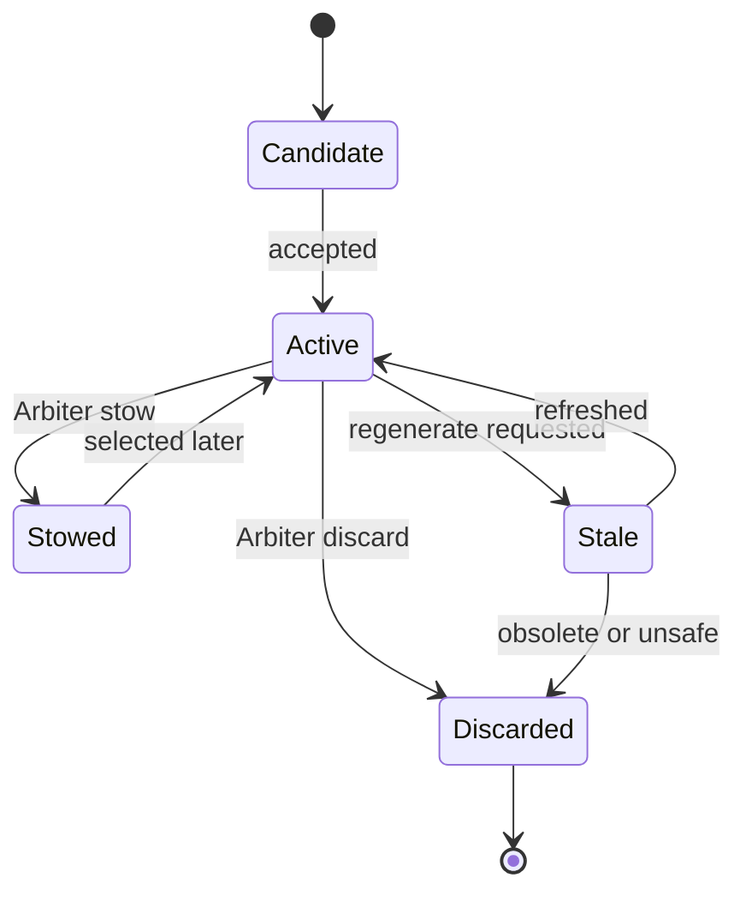
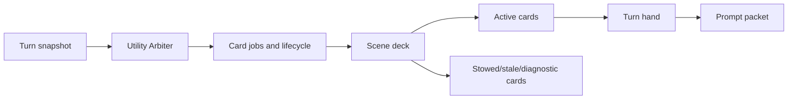

# Card Deck And Hand

The card system is Recursion's scene-local prompt cache. It is implemented by `src/cards.mjs`, coordinated by `src/runtime.mjs`, persisted by `src/storage.mjs`, and inspected through `src/ui.mjs`.

Cards are disposable cache artifacts. They are not memories, lore, canon, or user-authored prompt fragments.

## Fixed V1 Card Families

| Family | Provider role | Purpose | Prompt use |
| --- | --- | --- | --- |
| Scene Frame | `sceneFrameCard` | Current location, situation, participants, and dramatic direction. | Usually eligible while the scene is active. |
| Active Cast | `activeCastCard` | Who is present, visible state, and conversational or physical role. | Prevents dropped characters and speaker confusion. |
| Character Motivation | `characterMotivationCard` | Observable or safely inferred motives, pressures, hesitations, and goals. | Behavior-facing guidance without private thought injection. |
| Dialogue/Relationship | `dialogueRelationshipCard` | Current tension, relationship texture, promises, conflicts, and voice constraints. | Guides tone, subtext, and relational continuity. |
| Continuity Risk | `continuityRiskCard` | Facts likely to be contradicted if omitted. | High-priority safety guidance. |
| Environment/Items | `environmentItemsCard` | Spatial constraints, sensory details, objects, hazards, and affordances. | Grounds action and prose. |
| Prose/Pacing | `prosePacingCard` | Local craft guidance for density, momentum, specificity, and response shape. | Low-volume style guidance. |
| Open Threads | `openThreadsCard` | Unresolved questions, promises, pending actions, and near-term pressures. | Keeps the next response aware of visible obligations. |

## Card Data Contract

A normalized card contains:

- `id`
- `schemaVersion`
- `family`
- `role`
- `sceneId`
- `catalogKey`
- `status`
- `source`
- `promptText`
- `summary`
- `evidenceRefs`
- `tokenEstimate`
- `detailProfile`
- `emphasis`
- `freshness`
- `arbiter`
- optional `inspectorNotes`

`promptText` is the only card text eligible for prompt composition. `summary` supports scanning. `inspectorNotes` are diagnostics and must never be injected.

## Lifecycle

<Render Needed>: assets/documentation/renders/recursion-card-lifecycle.png - Card lifecycle visual showing create, accept, select, stow, stale, refresh, discard, and diagnostic-only discarded history.

Runtime normalizes cards, enforces text and evidence limits, validates catalog membership, caps token estimates, and rejects malformed records. The Utility Arbiter owns semantic utility decisions such as which families matter, which cards are stale, and which cards belong in the next hand.

## Arbiter Decisions

The Arbiter can request:

- create or refresh card jobs
- select or emphasize cards for the turn
- stow cards that remain valid but low value
- discard cards that are obsolete, duplicative, misleading, or outside the scene
- use or skip Reasoner composition

Runtime applies these decisions only after schema and safety checks. If an explicit selection exists, cards not touched by the selection are stowed for that hand.

## Scene Deck Vs Turn Hand

The scene deck is the cached set of cards for one scene. It can contain active, stowed, stale, and discarded cards. Only active cards can enter the turn hand.

The turn hand is a compact selection for one prompt packet. It is rebuilt each generation attempt and sorted by emphasis, catalog priority, and id. It is capped by max-card and token budgets.

## Invalidation And Refresh

Hard invalidation retires or replaces the deck when chat identity, scene fingerprint, source hashes, schema versions, catalog versions, or prompt composition contracts no longer match.

Soft invalidation marks the deck stale for Arbiter review when manual scene refresh is invoked, provider settings change, the source window advances, the prompt budget changes, or runtime rejects cards for schema, size, freshness, or safety reasons. Manual refresh uses reason `user-refresh` and rechecks the current host snapshot without adding synthetic chat content.

Pre-alpha storage can invalidate old experimental records instead of carrying compatibility layers.

## Character Motivation Safety

Character Motivation cards may include visible goals, established pressures, observable emotional posture, and behavior-facing uncertainty. Safe phrasing uses terms such as "appears", "seems", "is under pressure to", or "is likely guarding" when motivation is inferred.

They must not include first-person internal monologue, secret thoughts as truth, hidden plans, spoilers, instructions to reveal inner thoughts, or diagnostic speculation copied into prompt text.

The card runner enforces this twice: Motivation card requests include the safety instruction, and normalized Motivation cards with obvious internal-thought wording are rejected before they can enter the scene deck or prompt hand.

## Inspector Visibility

The UI can show:

- latest hand card families, emphasis, and summaries
- selected and omitted counts
- deck states through the viewer
- source refs and token estimates
- Arbiter reasons
- validation warnings and regeneration requests
- inspector-only notes as non-injected diagnostics

The inspector is read-oriented. V1 actions stay broad: refresh scene, copy prompt packet metadata, open settings, test providers, clear session keys, and inspect diagnostics.

<Render Needed>: assets/documentation/renders/recursion-card-family-matrix.png - Card family matrix showing the eight fixed families, prompt use, lifecycle state, emphasis, and inspector visibility.
