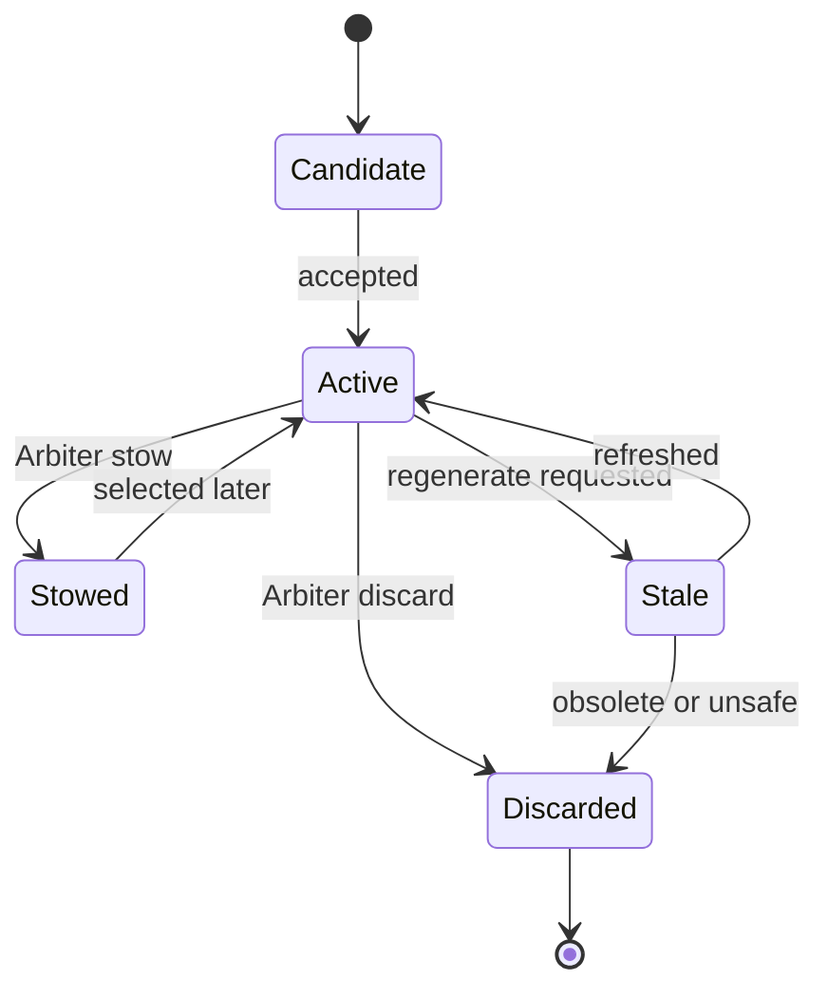
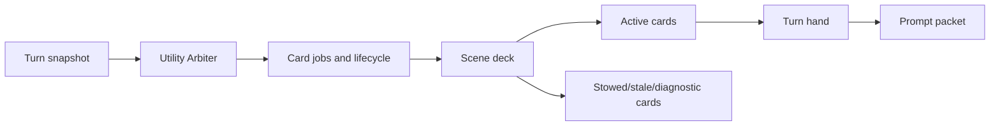

# Card Deck And Hand

The card system is Recursion's scene-local reasoning cache. It is implemented by `src/cards.mjs`, coordinated by `src/runtime.mjs`, persisted by `src/storage.mjs`, and inspected through `src/ui.mjs`.

Cards are disposable cache artifacts. They are not memories, lore, canon, continuity records, or user-authored prompt fragments. Their job is to expand what the current scene implies for the next response, not to preserve facts for their own sake.

## Fixed V1 Card Families

| Family | Provider role | Purpose | Prompt use |
| --- | --- | --- | --- |
| Scene Frame | `sceneFrameCard` | Current location, situation, immediate direction, and hard beat boundary. | Usually eligible while the scene is active. |
| Active Cast | `activeCastCard` | Who is present, visible state, and conversational or physical role. | Prevents dropped characters and speaker confusion. |
| Character Motivation | `characterMotivationCard` | Observable or safely inferred motives, pressures, hesitations, and goals. | Behavior-facing guidance without private thought injection. |
| Relationship | `dialogueRelationshipCard` | Current tension, relationship texture, promises, conflicts, and voice constraints. | Guides tone, subtext, and active relationship implications. |
| Social Subtext | `socialSubtextCard` | Scene-observable implied social meaning such as humor, veiled pressure, invitation, boundaries, status, and face. | Prevents literal reads of indirect or socially loaded cues. |
| Scene Constraints | `sceneConstraintsCard` | Hard limits, contradiction traps, timing, access, visibility, and plausibility constraints. | High-priority hard-limit, timing, access, and contradiction guidance. |
| Knowledge | `knowledgeSecretsCard` | Concealed facts, who knows or suspects them, mistaken beliefs, and reveal boundaries. | Guardrail guidance for knowledge state and spoiler-safe reveals. |
| Consequences | `clocksConsequencesCard` | Deadlines, countdowns, delayed consequences, and escalation triggers. | Keeps near-term pressure visible. |
| Environment | `environmentAffordancesCard` | Spatial layout, sensory texture, hazards, obstacles, exits, and environmental affordances. | Grounds action and prose. |
| Items | `possessionsItemsCard` | Important held, carried, worn, hidden, lost, stolen, or controlled objects and who has them. | Tracks object ownership and immediate item use. |
| Open Threads | `openThreadsCard` | Unresolved questions, promises, pending actions, and near-term pressures. | Keeps the next response aware of visible obligations. |

Each family also exposes fixed scope facets. Facets do not create separate cards; they define what the Arbiter and card generator should emphasize inside that family. The facet labels and descriptions live in `src/card-scope.mjs` and are reused for Arbiter catalog payloads, card-generation prompt focus, UI hover help, and diagnostics.

## Family Audit

The catalog should converge on scene-implication cards rather than continuity cards:

| Family | Direction |
| --- | --- |
| Scene Frame | Keep, but require it to expand active situation and relevance boundaries instead of summarizing. |
| Active Cast | Keep for presence, visibility, speaker control, and who can plausibly act or interrupt. |
| Character Motivation | Keep only for observable pressures and behavior-facing uncertainty. |
| Relationship | Keep, focused on current leverage, tension, promises, refusal, trust, and escalation/softening paths. |
| Social Subtext | Keep for dry humor, veiled pressure, invitation/boundary cues, status moves, and face dynamics that change the next beat. |
| Scene Constraints | Keep for hard limits and plausibility traps, not durable continuity ownership. |
| Knowledge | Keep for who knows, suspects, misunderstands, can infer, or must not learn something yet. |
| Consequences | Keep for active near-term pressure, delayed effects, and escalation triggers. |
| Environment | Keep as a core Recursion family for routes, sightlines, hazards, affordances, sensory grounding, and plausible interruptions. |
| Items | Keep for access, control, affordance, and risk of important objects in the current beat. |
| Open Threads | Keep, but limit it to visible unresolved hooks and obligations with next-turn relevance. |

The detailed facet-by-facet audit lives in [Card System Spec](../design/CARD_SYSTEM_SPEC.md#card-facet-audit). Implementation work should treat that table as the source of truth for future catalog edits: broad craft guidance stays outside cards, hard beat constraints live under Scene Frame, and `voiceConstraints` plus Social Subtext facets should remain scene-local observable cues.

## Card Scope

Card scope is the user-facing focus control over the fixed V1 catalog. It has two modes:

- Auto: selected families and sub-items are the preferred focus, but not a whitelist. The Utility Arbiter still sees the full catalog and may request unselected families when they have high relevance to scene constraints, scene coherence, or the current user message. Runtime records visible compact `auto-scope-exception:<family>` diagnostics for any unselected family that enters the plan or hand.
- Manual: selected families and sub-items are a strict whitelist. Runtime removes disabled-family card jobs before provider generation and filters disabled cached, provider, and fallback cards before deck and hand selection.

Sub-items are focus facets inside a family, such as `hardLimits` under Scene Constraints or `pendingActions` under Open Threads. They guide the prompt for that family card and appear in safe diagnostics, but they do not create separate generated cards, separate deck records, or separate prompt-injection lanes.

## Card Data Contract

A normalized card contains:

- `id`
- `schemaVersion`
- `family`
- `role`
- `sceneId`
- `catalogKey`
- `status`
- `source`
- `promptText`
- `summary`
- `evidenceRefs`
- `tokenEstimate`
- `detailProfile`
- `emphasis`
- `freshness`
- `arbiter`
- optional `inspectorNotes`

`promptText` is the only card text eligible for prompt composition. It is instruction-shaped private evidence, not story prose: short lines such as `Keep Jack at Capodichino immediately after landing`, `Preserve his weak cover and lack of field readiness`, and `Do not skip the sergeant response beat`. It must not contain mini-scenes, dialogue, sensory recap paragraphs, or decorative narration. `summary` supports scanning. `inspectorNotes` are diagnostics and must never be injected.

## Lifecycle

Runtime normalizes cards, enforces text and evidence limits, validates catalog membership, caps token estimates, and rejects malformed records. The Utility Arbiter owns semantic utility decisions such as which families matter, which cards are stale, and which cards belong in the next hand.

## Arbiter Decisions

The Arbiter can request:

- create or refresh card jobs
- select or emphasize cards for the turn
- stow cards that remain valid but low value
- discard cards that are obsolete, duplicative, misleading, or outside the scene
- use or skip Reasoner composition

Runtime applies these decisions only after schema and safety checks. If an explicit selection exists, cards not touched by the selection are stowed for that hand.

## Scene Deck Vs Turn Hand

The scene deck is the cached set of cards for one scene. It can contain active, stowed, stale, and discarded cards. Only active cards can enter the turn hand.

The turn hand is a compact selection for one prompt packet. It is rebuilt each generation attempt and sorted by emphasis, catalog priority, and id. It is capped by max-card and token budgets. Runtime also applies the effective max-card budget before provider generation, so fresh provider calls are not made for card jobs that cannot reach the hand.

Card Deck selection state adds a user-steering layer above normal Auto sorting:

- `off` cards are omitted from runtime scope.
- `active` cards remain normal candidates.
- `priority` cards are Auto-first. Runtime derives ordered Priority card ids and, for current built-in deck cards, ordered Priority families. `selectHand(...)` accepts `forcedCardIds` for exact hand-card forcing and `forcedFamilies` for generated family-card forcing.

The Cards dropdown represents those states with the supplied eye icons: slashed eye for `off`, open eye for `active`, and eye-plus for `priority`. The deck header has two bulk actions for editable decks: open eye sets all runnable cards to normal `active` and clears Priority, while slashed eye sets all runnable cards to `off`. Draft cards are left untouched, and the read-only Default deck requires duplication before either bulk action can run.

If Priority exceeds `Max Cards`, runtime keeps the top ordered Priority cards, does not backfill with lower Active cards, records `priority-card-cap`, and marks over-cap omissions as `priority-over-max-cards`.

## Invalidation And Refresh

Hard invalidation retires or replaces the deck when chat identity, scene fingerprint, source hashes, schema versions, catalog versions, or prompt composition contracts no longer match.

Soft invalidation marks the deck stale for Arbiter review when manual scene refresh is invoked, provider settings change, the source window advances, the prompt budget changes, or runtime rejects cards for schema, size, freshness, or safety reasons. Manual refresh uses reason `user-refresh` and rechecks the current host snapshot without adding synthetic chat content.

Rapid may attach a `rapid` object to a source variant. This object stores sanitized Rapid V2 warm-artifact metadata for that exact source revision: warm artifact id, base source revision hash, base snapshot hash, selected card ids, generated card ids, provider-authored guidance metadata, contract hashes, artifact hash, and diagnostics. It is not a separate memory layer, and it must not contain raw provider prompts, raw provider responses, hidden reasoning, API keys, inactive swipe text, or installed prompt packets.

Pre-alpha storage can invalidate old experimental records instead of carrying compatibility layers.

## Character Motivation Safety

Character Motivation cards may include visible goals, established pressures, observable emotional posture, and behavior-facing uncertainty. Safe phrasing uses terms such as "appears", "seems", "is under pressure to", or "is likely guarding" when motivation is inferred.

They must not include first-person internal monologue, secret thoughts as truth, hidden plans, spoilers, instructions to reveal inner thoughts, or diagnostic speculation copied into prompt text.

The card runner enforces this twice: Motivation card requests include the safety instruction, and normalized Motivation cards with obvious internal-thought wording are rejected before they can enter the scene deck or prompt hand.

## Inspector Visibility

The UI can show:

- latest hand card families, emphasis, and summaries
- selected and omitted counts
- deck states through the viewer
- source refs and token estimates
- Arbiter reasons
- validation warnings and regeneration requests
- inspector-only notes as non-injected diagnostics

The inspector is read-oriented. V1 actions stay broad: refresh scene, copy prompt packet metadata, open settings, test providers, clear OpenAI-compatible session keys, and inspect diagnostics.

## Card Family Matrix

| Family group | Families | Main prompt pressure |
| --- | --- | --- |
| Scene frame | Scene Frame, Active Cast | Keep the current location, cast, and immediate situation coherent. |
| Character and relationship | Character Motivation, Relationship, Social Subtext | Shape behavior, tone, subtext, and visible interpersonal pressure without private thought injection. |
| Constraints and knowledge | Scene Constraints, Knowledge | Prevent contradiction, premature reveals, and impossible actions. |
| Pressure and affordance | Consequences, Environment, Items | Keep timing, space, hazards, props, and object control active in the next reply. |
| Continuation | Open Threads | Preserve visible obligations, pending actions, and unresolved near-term hooks. |
