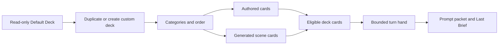
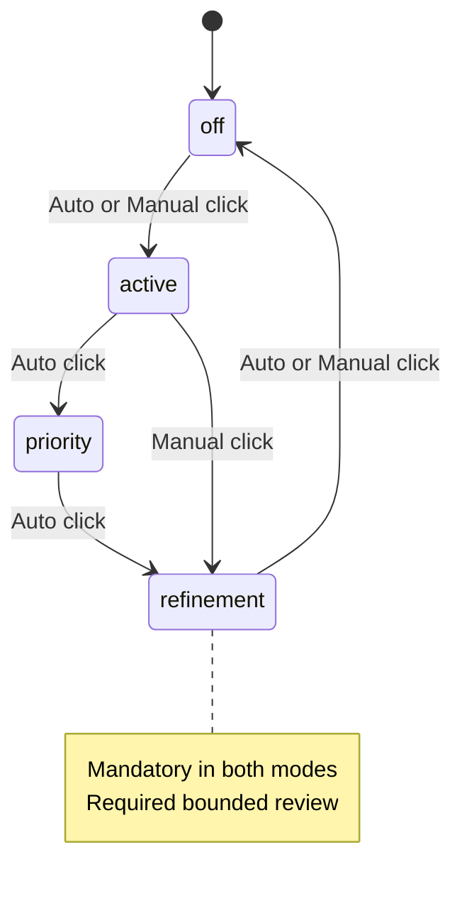
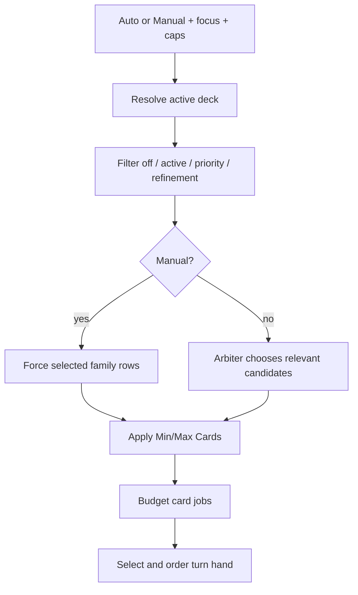
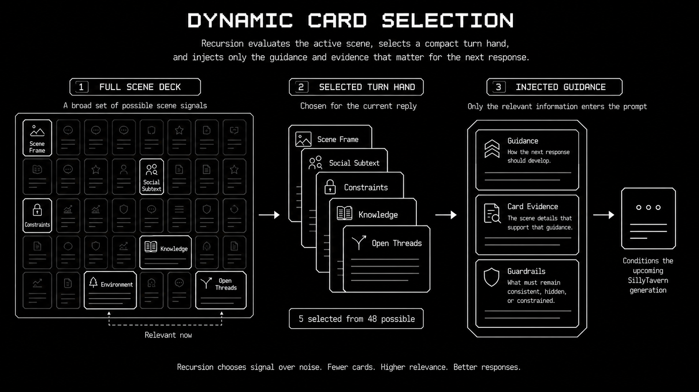
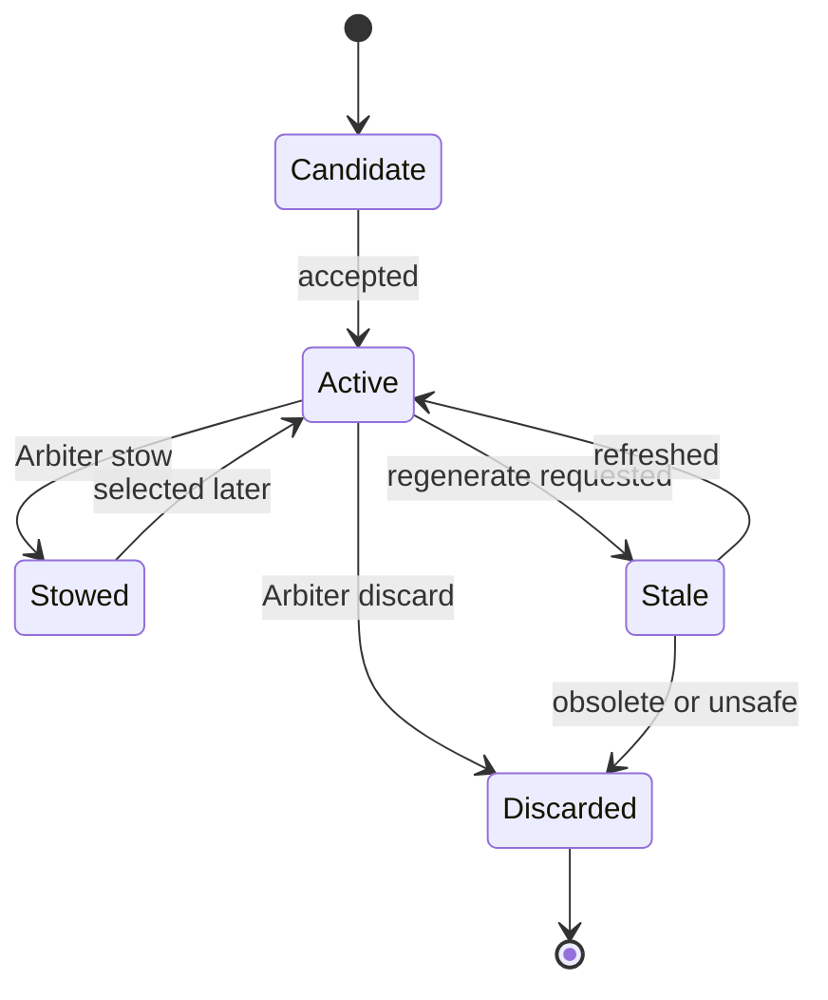
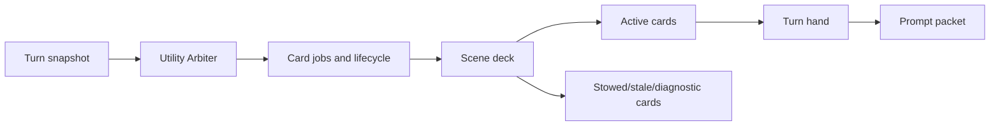

# Card Deck And Hand

## Operator Deck Layer

The active deck is the operator-controlled catalog layer above the scene-local generated cache. Recursion ships a read-only Default Deck and supports normalized custom decks with categories, authored cards, category/card order, and an active-deck id. Custom decks can be created, duplicated, edited, and deleted; deleting the active deck falls back to Default Deck.

Authored cards are explicit operator content. Generated cards are provider-produced scene evidence. Both can be visible in the active deck, but neither distinction changes the hand contract: only eligible, validated cards can enter the bounded turn hand.

```mermaid
flowchart LR
    Default[Read-only Default Deck] --> Duplicate[Duplicate or create custom deck]
    Duplicate --> Categories[Categories and order]
    Categories --> Authored[Authored cards]
    Categories --> Generated[Generated scene cards]
    Authored --> Eligible[Eligible deck cards]
    Generated --> Eligible
    Eligible --> Hand[Bounded turn hand]
    Hand --> Packet[Prompt packet and Last Brief]
```

## Selection State Contract

Cards expose `off`, `active`, `priority`, and `refinement`. Auto cycles `off -> active -> priority -> refinement -> off`; Manual cycles `off -> active -> refinement -> off`. Manual treats existing Priority as Active. Refinement requires inclusion and bounded scene-analysis review in both modes. `off` excludes a card from scope, `active` makes it a normal candidate, and `priority` moves it ahead of normal active cards in Auto. Every runnable Priority card in Auto and Refinement card in either mode is required, in deck category/card order, even when Priority cards exceed the turn card limit. Ordinary cards fill only the remaining slots.

Authored cards without a built-in generator family enter hand selection directly as `Authored` guidance, with their deck IDs and operator text. Unmarked authored cards require no provider call and are rebuilt from the active deck rather than stored as generated scene evidence. Disabled and draft cards are excluded. Authored text and ordering participate in the deck revision hash, invalidating prepared swipe reuse after edits.

Marked authored cards first receive an evidence-bound scene application. Refinement then requires a review using the frozen scene, original instructions, and complete selected hand. Unchanged acceptance is success; specific findings may trigger one revision and one verification review. Unresolved findings or provider failure block preparation. Shared generated families are revised once and reviewed against each marked facet. Saved authored instructions remain unchanged and accompany accepted applications in the final hand. Guidance, packet evidence, and Last Brief use only accepted results. Changes to card state, text, order, scene, provider settings, or refinement contracts invalidate dependent checkpoints and prepared packets.

Every review verdict includes a brief scene-specific assessment with visible evidence and supporting selected-card references. Review checks missing application as well as incorrect claims; generic uncertainty alone cannot satisfy a meaningful omitted distinction or check. Explicit peer coverage and evidence-backed non-applicability can justify leaving a card unchanged. If a supporting peer changes, its dependent accepted targets join the existing verification call. The Viewer shows the final assessment, while narrator input and compact diagnostics retain only the accepted guidance and compact outcome metadata respectively. This uses the existing calls in both Fused and Segmented modes.

Auto resolves Priority slots before provider work: authored Priority cards reserve slots, and generated Priority families omitted by the Arbiter are added explicitly. Multiple source cards belonging to one generated family share its generated card slot. Both kinds follow source deck order ahead of ordinary candidates. Priority coverage expands the effective card limit when necessary; it is never trimmed to fit it. Remaining generation capacity retains the normal focus and strength policy. The runtime cache contract is version 3 so previously capped Priority artifacts cannot be reused.

```mermaid
stateDiagram-v2
    [*] --> off
    off --> active: Auto or Manual click
    active --> priority: Auto click
    priority --> refinement: Auto click
    active --> refinement: Manual click
    refinement --> off: Auto or Manual click
    note right of refinement
      Mandatory in both modes
      Required bounded review
    end note
```

## Scope And Cap Resolution

The runtime resolves the active deck, card state, Manual selection, strict whitelist, priority order, and Min/Max Cards before provider jobs are budgeted. This prevents provider work from being requested for cards that cannot reach the hand.

```mermaid
flowchart TD
    Settings[Auto or Manual + focus + caps] --> Deck[Resolve active deck]
    Deck --> State[Filter off / active / priority / refinement]
    State --> Mode{Manual?}
    Mode -->|yes| Forced[Force selected family rows]
    Mode -->|no| Auto[Arbiter chooses relevant candidates]
    Forced --> Cap[Apply Min/Max Cards]
    Auto --> Cap
    Cap --> Jobs[Budget card jobs]
    Jobs --> Hand[Select and order turn hand]
```

The deck-to-hand boundary is the central card-system contract: the full scene deck contains possible signals, while the turn hand contains only the bounded cards selected for the current reply. Guidance composition then converts that hand into prompt-facing guidance, card evidence, and guardrails.

The card system is Recursion's scene-local reasoning cache. It is implemented by `src/cards.mjs`, coordinated by `src/runtime.mjs`, persisted by `src/storage.mjs`, and inspected through `src/ui.mjs`.

Cards are disposable cache artifacts. They are not memories, lore, canon, continuity records, or user-authored prompt fragments. Their job is to expand what the current scene implies for the next response, not to preserve facts for their own sake.

## Fixed V1 Card Families

| Family | Provider role | Purpose | Prompt use |
| --- | --- | --- | --- |
| Scene Frame | `sceneFrameCard` | Current location, situation, immediate direction, and hard beat boundary. | Usually eligible while the scene is active. |
| Active Cast | `activeCastCard` | Who is present, visible state, and conversational or physical role. | Prevents dropped characters and speaker confusion. |
| Character Motivation | `characterMotivationCard` | Observable or safely inferred motives, pressures, hesitations, and goals. | Behavior-facing guidance without private thought injection. |
| Relationship | `dialogueRelationshipCard` | Current tension, relationship texture, promises, conflicts, and voice constraints. | Guides tone, subtext, and active relationship implications. |
| Social Subtext | `socialSubtextCard` | Scene-observable implied social meaning such as humor, veiled pressure, invitation, boundaries, status, and face. | Prevents literal reads of indirect or socially loaded cues. |
| Realism | `realismCard` | Scene-specific emotional and conversational plausibility. | Weigh plausible explanations, seek corroboration, and ground interpretations in established stakes, emotion, and relationships. |
| Scene Constraints | `sceneConstraintsCard` | Hard limits, contradiction traps, timing, access, visibility, and plausibility constraints. | High-priority hard-limit, timing, access, and contradiction guidance. |
| Knowledge | `knowledgeSecretsCard` | Concealed facts, who knows or suspects them, mistaken beliefs, and reveal boundaries. | Guardrail guidance for knowledge state and spoiler-safe reveals. |
| Consequences | `clocksConsequencesCard` | Deadlines, countdowns, delayed consequences, and escalation triggers. | Keeps near-term pressure visible. |
| Environment | `environmentAffordancesCard` | Spatial layout, sensory texture, hazards, obstacles, exits, and environmental affordances. | Grounds action and prose. |
| Items | `possessionsItemsCard` | Important held, carried, worn, hidden, lost, stolen, or controlled objects and who has them. | Tracks object ownership and immediate item use. |
| Open Threads | `openThreadsCard` | Unresolved questions, promises, pending actions, and near-term pressures. | Keeps the next response aware of visible obligations. |

Each family also exposes fixed scope facets. Facets do not create separate cards; they define what the Arbiter and card generator should emphasize inside that family. The facet labels and descriptions live in `src/card-scope.mjs` and are reused for Arbiter catalog payloads, card-generation prompt focus, UI hover help, and diagnostics.

## Family Audit

The catalog should converge on scene-implication cards rather than continuity cards:

| Family | Direction |
| --- | --- |
| Scene Frame | Keep, but require it to expand active situation and relevance boundaries instead of summarizing. |
| Active Cast | Keep for presence, visibility, speaker control, and who can plausibly act or interrupt. |
| Character Motivation | Keep only for observable pressures and behavior-facing uncertainty. |
| Relationship | Keep, focused on current leverage, tension, promises, refusal, trust, and escalation/softening paths. |
| Social Subtext | Keep for dry humor, veiled pressure, invitation/boundary cues, status moves, and face dynamics that change the next beat. |
| Scene Constraints | Keep for hard limits and plausibility traps, not durable continuity ownership. |
| Knowledge | Keep for who knows, suspects, misunderstands, can infer, or must not learn something yet. |
| Consequences | Keep for active near-term pressure, delayed effects, and escalation triggers. |
| Environment | Keep as a core Recursion family for routes, sightlines, hazards, affordances, sensory grounding, and plausible interruptions. |
| Items | Keep for access, control, affordance, and risk of important objects in the current beat. |
| Open Threads | Keep, but limit it to visible unresolved hooks and obligations with next-turn relevance. |

The detailed facet-by-facet audit lives in [Card System Spec](../design/CARD_SYSTEM_SPEC.md#card-facet-audit). Implementation work should treat that table as the source of truth for future catalog edits: broad craft guidance stays outside cards, hard beat constraints live under Scene Frame, and `voiceConstraints` plus Social Subtext facets should remain scene-local observable cues.

## Card Scope

Card scope is the user-facing focus control over the fixed V1 catalog. It has two modes:

- Auto: selected families and sub-items are the preferred focus, but not a whitelist. The Utility Arbiter still sees the full catalog and may request unselected families when they have high relevance to scene constraints, scene coherence, or the current user message. Runtime records visible compact `auto-scope-exception:<family>` diagnostics for any unselected family that enters the plan or hand.
- Manual: selected families and sub-items are a strict whitelist. Runtime removes disabled-family card jobs before provider generation and filters disabled cached, provider, and fallback cards before deck and hand selection.

Sub-items are focus facets inside a family, such as `hardLimits` under Scene Constraints or `pendingActions` under Open Threads. They guide the prompt for that family card and appear in safe diagnostics, but they do not create separate generated cards, separate deck records, or separate prompt-injection lanes.

## Card Data Contract

A normalized card contains:

- `id`
- `schemaVersion`
- `family`
- `role`
- `sceneId`
- `catalogKey`
- `status`
- `source`
- `promptText`
- `summary`
- `evidenceRefs`
- `tokenEstimate`
- `detailProfile`
- `emphasis`
- `freshness`
- `arbiter`
- optional `inspectorNotes`

`promptText` is the only card text eligible for prompt composition. It is instruction-shaped private evidence, not story prose: short lines such as `Keep Jack at Capodichino immediately after landing`, `Preserve his weak cover and lack of field readiness`, and `Do not skip the sergeant response beat`. It must not contain mini-scenes, dialogue, sensory recap paragraphs, or decorative narration. `summary` supports scanning. `inspectorNotes` are diagnostics and must never be injected. Card normalization and runtime sanitization preserve instruction line boundaries through validation, checkpoints, hand selection, and injection; only within-line whitespace is compacted. CRLF/CR normalize to LF. The shape check recognizes ordinary bullet and numbered-list markers without rewriting the stored instructions. A harmless heading must not hide the instruction lines that follow it. Narrative-prose checks still apply; formatting alone cannot make prose a valid card. Content-safety checks use a whitespace-compacted validation copy so a line break cannot split a forbidden phrase; the stored instructions keep their line breaks.

## Lifecycle

```mermaid
stateDiagram-v2
    [*] --> Candidate
    Candidate --> Active: accepted
    Active --> Stowed: Arbiter stow
    Active --> Stale: regenerate requested
    Active --> Discarded: Arbiter discard
    Stowed --> Active: selected later
    Stale --> Active: refreshed
    Stale --> Discarded: obsolete or unsafe
    Discarded --> [*]
```

Runtime normalizes cards, enforces text and evidence limits, validates catalog membership, caps token estimates, and rejects malformed records. The Utility Arbiter owns semantic utility decisions such as which families matter, which cards are stale, and which cards belong in the next hand.

## Arbiter Decisions

The Arbiter can request:

- create or refresh card jobs
- select or emphasize cards for the turn
- stow cards that remain valid but low value
- discard cards that are obsolete, duplicative, misleading, or outside the scene
- use or skip Reasoner composition

Runtime applies these decisions only after schema and safety checks. If an explicit selection exists, cards not touched by the selection are stowed for that hand.

## Scene Deck Vs Turn Hand

The scene deck primitives can represent active, stowed, stale, and discarded cards. The current preprocessor builds its deck for the current turn; it does not load prior-turn scene cards. Only active, validated cards enter the turn hand. Compatible same-turn checkpoints and prepared packets provide reuse.

The turn hand is rebuilt for each generation attempt. Required Priority and Refinement cards come first in deck order; ordinary Auto candidates follow the Arbiter's scene-specific cardJobs order within remaining turn slots, with an optional seeded replacement of the final discretionary slot. Focus informs the Arbiter; fixed catalog rankings do not override its choices. Priority coverage can exceed the turn card limit. Runtime reserves required slots before provider generation so ordinary jobs that cannot reach the hand are not dispatched. Token estimates remain diagnostic.

Card Deck selection state adds a user-steering layer above normal Auto sorting:

- `off` cards are omitted from runtime scope.
- `active` cards remain normal candidates.
- `refinement` cards are mandatory in both modes and reviewed before Guidance.
- `priority` cards are Auto-first. Runtime derives ordered Priority card ids and, for current built-in deck cards, ordered Priority families. `selectHand(...)` accepts `forcedCardIds` for exact hand-card forcing and `forcedFamilies` for generated family-card forcing.

The Cards dropdown represents those states with the supplied eye icons: slashed eye for `off`, open eye for `active`, eye-plus for `priority`, and an eye with a small four-point sparkle for `refinement`. The deck header has two bulk actions for all decks: open eye sets all runnable cards to normal `active` and clears Priority and Refinement, while slashed eye sets all runnable cards to `off`. Draft cards are left untouched, and the Default deck persists operator states through its overlay without requiring duplication.

If Priority exceeds the turn card limit, runtime includes every runnable Priority card in deck order and includes no ordinary Active cards. Priority generated families are required stages: a provider failure blocks preparation rather than silently omitting the card.

Card Deck organization is stored directly on the active deck. Category drag handles update `categoryOrder`; card drag handles update `cardOrderByCategory` and, for cross-category drops, the card's `categoryId`. There is no second visible Card Scope selector under Card Decks. Runtime scope derives from the active deck's `off`, `active`, `priority`, and `refinement` states, with category/card order used for Priority ordering and deterministic hand selection.

```mermaid
flowchart LR
    Snapshot["Turn snapshot"] --> Arbiter["Utility Arbiter"]
    Arbiter --> Jobs["Card jobs and lifecycle"]
    Jobs --> Deck["Scene deck"]
    Deck --> Active["Active cards"]
    Deck --> Stowed["Stowed/stale/diagnostic cards"]
    Active --> Hand["Turn hand"]
    Hand --> Packet["Prompt packet"]
```

## Invalidation And Refresh

Hard invalidation retires or replaces the deck when chat identity, scene fingerprint, source hashes, schema versions, catalog versions, or prompt composition contracts no longer match.

Soft invalidation marks the deck stale for Arbiter review when manual scene refresh is invoked, provider settings change, the source window advances, the prompt budget changes, or runtime rejects cards for schema, size, freshness, or safety reasons. Manual refresh uses reason `user-refresh` and rechecks the current host snapshot without adding synthetic chat content.

Durable execution checkpoints may reference accepted scene-card artifacts for an exact source revision. Those artifacts are not a memory layer: they are reusable only while source, settings, provider, catalog, pipeline, and prompt contracts remain compatible. Manifests store hashes and references rather than artifact bodies.

Pre-alpha storage can invalidate old experimental records instead of carrying compatibility layers.

## Character Motivation Safety

Character Motivation cards may include visible goals, established pressures, observable emotional posture, and behavior-facing uncertainty. Safe phrasing uses terms such as "appears", "seems", "is under pressure to", or "is likely guarding" when motivation is inferred.

They must not include first-person internal monologue, secret thoughts as truth, hidden plans, spoilers, instructions to reveal inner thoughts, or diagnostic speculation copied into prompt text.

The card runner enforces this twice: Motivation card requests include the safety instruction, and normalized Motivation cards with obvious internal-thought wording are rejected before they can enter the scene deck or prompt hand.

## Inspector Visibility

## Editable Deck Contract

The bundled Default Deck is read-only. Duplicating it creates a custom deck with editable categories, authored cards, card order, category order, and `Card Assist`; each edit is committed explicitly. Grip handles are the only drag affordance, and dragging may reorder a category or move a card between categories. Draft cards are not runnable until they have a real name and prompt text.

Deck order is deterministic selection priority, not a second prompt. In Auto, every runnable `priority` card is required before discretionary `active` cards, even when mandatory coverage exceeds `Max Cards`. Diagnostics show the effective hand limit and reserved capacity. In Manual, selected rows are forced and the priority state does not add another card. Disabled cards are excluded from planning, reuse, hand selection, composition, and injection.

The UI can show:

- latest hand card families, emphasis, and summaries
- selected and omitted counts
- deck states through the viewer
- source refs and token estimates
- Arbiter reasons
- validation warnings and regeneration requests
- inspector-only notes as non-injected diagnostics

The inspector is read-oriented. V1 actions stay broad: refresh scene, copy prompt packet metadata, open settings, test Connection Profiles, and inspect diagnostics.

## Card Family Matrix

| Family group | Families | Main prompt pressure |
| --- | --- | --- |
| Scene frame | Scene Frame, Active Cast | Keep the current location, cast, and immediate situation coherent. |
| Character and relationship | Character Motivation, Relationship, Social Subtext | Shape behavior, tone, subtext, and visible interpersonal pressure without private thought injection. |
| Constraints and knowledge | Scene Constraints, Knowledge | Prevent contradiction, premature reveals, and impossible actions. |
| Pressure and affordance | Consequences, Environment, Items | Keep timing, space, hazards, props, and object control active in the next reply. |
| Continuation | Open Threads | Preserve visible obligations, pending actions, and unresolved near-term hooks. |

## Scene-specific selection and sense-making

The Arbiter receives Settings.selectionBudget: the effective total maxCards, mandatoryCardIds, mandatoryFamilies, authoredSlots, and availableSlots. Built-in Priority facets sharing a generator consume one family slot; every required source card remains covered. Priority may expand the hand beyond its ordinary limit. Play settings own the total target; a smaller model-selected budget cannot reduce it. Runtime completes undersized rankings from currently eligible sources in stable order.

cardJobs is ordered from greatest to least contribution to this particular reply. Each reason should name a distinct contribution; three copies of a setting restriction should not crowd out an important uncertainty or relationship. The runtime reserves Priority capacity before dispatch, keeps discretionary jobs in proposal order, and carries that order through final hand construction. Generation completion order and static catalog priority cannot reorder those choices. No extra selection model call is added.

Fresh turns have no previous-turn scene-card cache. Same-turn swipes reuse the settled packet; Resume reuses compatible execution checkpoints. Selection provenance is therefore the original proposal, not a claim that a new Arbiter ran for each swipe. Selection contract 8 invalidates incompatible prompt and execution checkpoints.

The normalized Auto plan adds runtime-owned selection diagnostics: source, proposed (family/reason), mandatoryCardIds, mandatoryFamilies, authoredSlots, availableSlots, retained (family/reason/mandatory), and omitted (family/reason). Hand metadata adds selected (id/family/source/mandatory) and handOmissions. The compact diagnostic export and hand.selected journal retain this evidence. Successful model plans report arbiter-model-plan, not local-fallback-plan. Existing turn classification and checkpoint diagnostics identify reuse. These are operator diagnostics, never story text.

Knowledge connects observations and claims to tentative interpretations, answerable questions, and reasonable evidence. Character Motivation connects established personal stakes to different reactions. Relationship distinguishes belief, trust, and willingness to cooperate. Scene Frame and Scene Constraints preserve established limits without inventing a requirement to delay, stay in place, or resist. Doubt can coexist with listening, help, and sensible precautions. None of these cards creates hidden facts, guarantees acceptance, scripts the player's response, or turns characters into uniformly rational investigators.

## Realism analysis

The bundled Default Deck includes five active generated Realism facets: **What matters now**, **Familiar Explanations First**, **Claims Need Corroboration**, **Conversational proportion**, and **Interpreting intent**. In Auto mode, the Arbiter selects Realism when these considerations materially affect the next exchange. Selected facets produce one scene-specific family card and consume one hand slot, using one segmented analysis call or one item in the fused bundle. These are not Priority cards; omission adds no Realism analysis call or mandatory baseline text.

Familiar Explanations First weighs unprecedented claims against possibilities known within each character's world, experience, relationships, and stakes. Claims Need Corroboration separates testimony from observation and independently checked evidence, and encourages feasible questions or checks that distinguish competing explanations. Sincerity does not establish accuracy, unusual knowledge does not prove its source, and a confirmed detail does not verify an entire account. Characters can cooperate while uncertain, revise beliefs when evidence changes, and act without impossible certainty or repetitive interrogation. For example, knowing a private fact may warrant investigation without proving a claimed body swap or another universe.

Realism means plausibility within the story's setting and established characterization, not mundane realism or universal politeness. Ground reactions in each character's emotional state, stress, trust, and relationship history. An incomplete answer alone does not establish deception or malice. Identify the specific missing detail that matters, while preserving supported hostility, prejudice, fear, and urgent action. Do not invent diagnoses, private motives, or the player's feelings.

For example, after someone describes books about a character's life only in broad terms, the useful uncertainty could be which events they contain or how the speaker knows. A skeptical character can ask for a concrete example without demanding proof the speaker cannot supply. This is an analysis principle, not scripted dialogue or a requirement to ask a question every turn. Reply length should fit the character and exchange, rather than enforce brevity or generic prose rules.

Existing custom decks retain their authored content. Select or duplicate the updated Default Deck to use the bundled category.

## Grounded interpretation and narration boundaries

Generated cards are fallible analysis, not new canon or pacing authority. An unanswered question does not require continued withholding. A player preparing to explain may invite attention, concern, or clarification; analysis must not invent an earned-reveal requirement or script the player's answer. Emotional interpretations remain tentative unless established.

Card writers use neutral analytical instructions rather than performing the story's voice or tense. Story-form metadata governs the narrator; cards cannot select a viewpoint character. Packet guardrails preserve current physical state and completed actions independently of selected families, and require story output without drafting notes. These are model instructions, not a guarantee of prose quality or a substitute for host reasoning-channel separation.

The composer checks cards against bounded recent source messages. Invalid JSON/schema Guidance receives bounded correction. Exhausted composition pauses preparation for Retry; it cannot install a raw-card fallback. Guidance remains subordinate to user instructions and established scene evidence. The revised Guidance stage and prompt contract invalidate older prepared prompts.

## Protective instructions and validation

Card and packet validators share clause-aware handling for explicit protective instructions, such as “Do not reveal spoilers” and “Keep private thoughts private.” A protective clause does not exempt a later disclosure command or an exception. Unsupported private-state claims and requests to disclose reasoning remain rejected. This is a narrow lexical check, not a semantic classifier. Rejection details name the rule and include only a bounded matched phrase for targeted correction; arbitrary full rejected cards are not exported.

After preparation completes with an optional failed card omitted, the Segmented cards parent shows a warning and names the missing card. The child remains failed with its precise rejection and retry action. During a failure, the parent identifies failed cards rather than substituting an internal-error message.

Ordinary mention of “future plot” is not a validation failure. Explicit hidden-future-content and private-reasoning checks remain active; topic words alone do not establish disclosure.

## Selection variety and cooldown

Auto settings use `cardSelection: { variety: 'low', cooldownTurns: 0 }`. Variety accepts off/low/medium/high. It can replace at most the final optional slot: Low uses a 25% chance and the next two ranked alternatives; Medium 50% and four; High 100% and all remaining ranked alternatives. Earlier choices and mandatory Priority/Refinement coverage stay fixed. No alternatives means no change. The deterministic seed binds turn identity, deck revision and settings; retries, resumes and prepared swipes reuse the selected plan. Stable target completion does not enter the variety draw.

Cooldown accepts 0–10 completed assistant turns. Zero disables it. Nonmandatory source deck IDs used in the preceding N completed response positions are excluded before arbitration and both Fused/Segmented generation, including fallback. Strict shortages yield smaller hands; mandatory Priority and Refinement sources remain included without restoring cooled siblings. Manual bypasses both policies. Settings masks are transient and never change saved card states.

The Arbiter receives current needs, eligible family/authored sources and the last three body-free selection summaries. Candidates may include `sourceCardIds`, authored `cardId`, `need`, `reason`, and `coverageKey`. Duplicate optional coverage is omitted. Selection diagnostics include original rank, mandatory IDs, actual retained identities, cooldown/coverage/budget omissions and any variety replacement.

Completed native responses store `recursion.cardSelectionUsage.v1` in message/active-swipe extras through the guarded host save boundary. Receipts contain source IDs and short purposes, bound to full visible branch prefix and target response hash. Full-chat validation precedes the provider window; only the latest ten completed response rows are exposed to cooldown. Incomplete stream markers survive native Stop text cleanup via generation-start identity. Duplicate events, preparation, failed/stopped generations and inactive swipes do not advance use; post-process replacement/swipe/Restore original preserve provenance. Same-message swipes occupy one response position. Full-prefix edits invalidate stale selection and final installation even outside retained model context.
