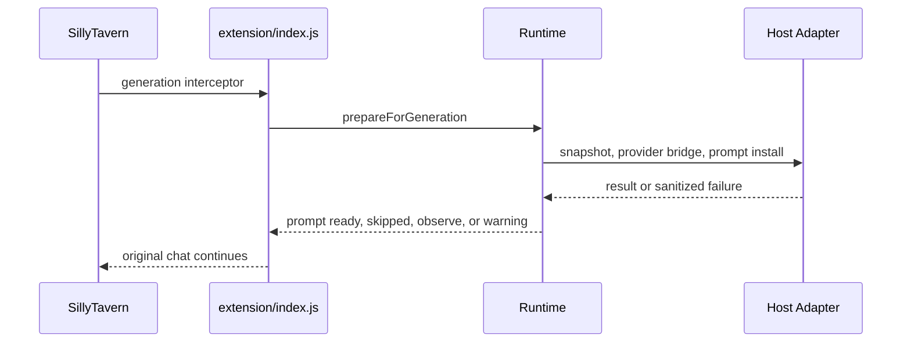

# Host Integration Manual

SillyTavern is Recursion's active V1 host. Host integration is split between the entrypoint in `src/extension/index.js`, the SillyTavern adapter in `src/hosts/sillytavern/host.mjs`, the user-file adapter in `src/hosts/sillytavern/storage.mjs`, and the host-neutral runtime modules under `src/`.

## Adapter Responsibilities

The SillyTavern adapter:

- reads the active SillyTavern context
- captures chat id, chat messages, message ids, roles, visibility, scene fingerprint, scene key, and turn fingerprint
- exposes settings through `extension_settings.recursion`
- bridges host generation APIs to provider routing
- installs and clears Recursion prompt blocks
- selects SillyTavern user-file storage when available
- falls back to memory storage when user-file storage cannot be used
- keeps host-specific APIs out of core runtime modules

## Extension Entrypoint

`src/extension/index.js` bootstraps the host, activity reporter, storage repository, generation router, runtime, and UI mount. It exports and registers:

- `recursionGenerationInterceptor`
- `recursionOnInstall`
- `recursionOnUpdate`
- `recursionOnEnable`
- `recursionOnDisable`
- `recursionOnDelete`
- `recursionOnClean`
- `recursionOnActivate`

Document-ready bootstrap mounts Recursion when a SillyTavern context is available.

## Lifecycle Hooks

Enable and activate call bootstrap. Disable and delete dispose the runtime, clear prompt keys best-effort, destroy the UI, and drop host/runtime references. Cleanup is intentionally light because Recursion records are cache-oriented and user-visible cleanup actions belong to settings, storage diagnostics, or cache controls.

## Generation Interceptor Boundary

The generation interceptor calls `runtime.prepareForGeneration()` before returning the chat to SillyTavern. It catches and logs sanitized failures so the host generation can continue.

<Render Needed>: assets/documentation/renders/recursion-host-adapter-boundary.png - Host adapter boundary visual showing SillyTavern context, generation interceptor, prompt adapter, settings adapter, storage adapter, UI mount, and host-neutral runtime.

## Prompt Adapter

The prompt adapter converts validated packets into prompt blocks through `packetToPromptBlocks()`. It accepts only Recursion-owned prompt keys and rejects unsafe hidden-thought or forward-plot wording.

Install behavior:

1. Build prompt blocks.
2. Validate keys and prompt text.
3. Clear known Recursion prompt keys.
4. Call `setExtensionPrompt` for each block.
5. Track installed keys.
6. Roll back known keys if a partial install fails.

Clear behavior calls `setExtensionPrompt` with empty text for known Recursion keys and any keys installed during the session. It attempts every key even if one clear fails, returns a stable prompt-clear failure result with failed keys, and keeps failed non-core keys tracked for a later retry. Prompt install validates the packet first, then aborts before writing new prompt text if the pre-install clear reports failure.

## Storage Adapter

The SillyTavern user-file adapter uses:

- `GET /user/files/{file}`
- `POST /api/files/upload`
- `POST /api/files/delete`

It validates storage filenames, requires `.json`, prevents path traversal, prefixes non-prefixed keys with `recursion-`, and serializes data as base64 JSON for upload.

If the user-file API throws or returns a non-OK response for read, write, or delete, the adapter downgrades that session to memory storage for subsequent operations. Read-side and delete-side `404` responses remain normal missing-record results and do not trigger fallback. Filename validation and JSON serialization still run before fallback, so unsafe keys and invalid JSON values are rejected instead of being treated as host storage outages.

## Settings Adapter

Settings are stored under `extension_settings.recursion` and normalized through `src/settings.mjs`. Provider API keys are intercepted as session-only values and are never written to extension settings.

## Generation Adapter

The generation adapter prefers `generateRaw` when available. It passes prompt, system prompt, response length, temperature, top-p, provider source, host connection profile id, JSON schema, and abort signal.

If only `generateQuietPrompt` is available, host connection profiles are unsupported and current-host-model generation can still run. Missing generation APIs produce a provider failure, not a host-blocking exception.

## UI Mount

The UI mounts a chat-attached Recursion root near the `#chat` element when possible, otherwise into a stable parent. It renders the Recursion Bar, Hero Pixel Array progress menu, options/settings menu, Last Brief dropdown, settings panel, and Full Viewer. The UI updates from `runtime.view()` on a short interval and uses sanitized view data.

## Fake And Contract Tests

The deterministic suite covers fake host behavior, settings normalization, session-only secret handling, provider routing, card lifecycle, prompt packet validation, prompt injection metadata, storage repository behavior, activity events, and UI view model behavior. Fake adapters prove contracts without mutating a live SillyTavern profile.

## Live Smoke Guardrails

Live smoke is guarded by dedicated-user requirements. Automated live mutation must use `recursion-soak-*` users and reject `default-user`. Live checks verify served-extension freshness, storage probes, no-generation UI mount/open behavior, and opt-in generation bridge prompt-install evidence.

Live artifacts must follow [Artifact Contract](../testing/ARTIFACT_CONTRACT.md) and avoid raw provider prompts, raw provider responses, full transcripts, secrets, hidden reasoning, and private story plans.

## Deferred Host Boundary

The runtime is host-neutral where that keeps the model, cache, prompt, storage, and activity contracts clean. SillyTavern is the only active V1 host integration. Additional host ports are deferred boundary work and should connect through the same adapter responsibilities rather than importing host APIs into runtime modules.
