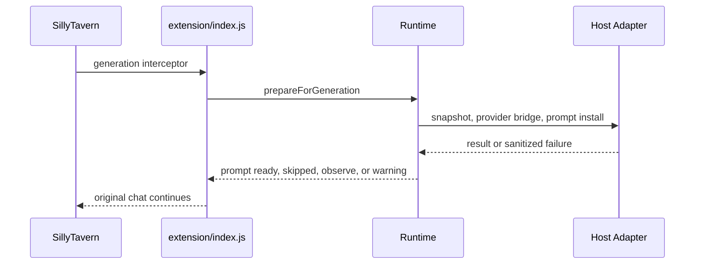

# Host Integration Manual

SillyTavern is Recursion's active V1 host. Host integration is split between the entrypoint in `src/extension/index.js`, the SillyTavern adapter in `src/hosts/sillytavern/host.mjs`, the user-file adapter in `src/hosts/sillytavern/storage.mjs`, and the host-neutral runtime modules under `src/`.

## Adapter Responsibilities

The SillyTavern adapter:

- reads the active SillyTavern context
- captures chat id, chat messages, message ids, roles, visibility, scene fingerprint, scene key, and turn fingerprint
- captures active swipe id/count metadata and a source revision hash for the current visible source
- exposes settings through `extension_settings.recursion`
- bridges host generation APIs to provider routing
- exposes host generation stop through `generation.stop()`
- installs and clears Recursion prompt blocks
- selects SillyTavern user-file storage when available
- falls back to memory storage when user-file storage cannot be used
- keeps host-specific APIs out of core runtime modules

## Extension Entrypoint

`src/extension/index.js` bootstraps the host, activity reporter, storage repository, generation router, runtime, and UI mount. It exports and registers:

- `recursionGenerationInterceptor`
- `recursionOnInstall`
- `recursionOnUpdate`
- `recursionOnEnable`
- `recursionOnDisable`
- `recursionOnDelete`
- `recursionOnClean`
- `recursionOnActivate`

Document-ready bootstrap mounts Recursion when a SillyTavern context is available.

## Lifecycle Hooks

Enable and activate call bootstrap. Disable and delete dispose the runtime, clear prompt keys best-effort, destroy the UI, and drop host/runtime references. Cleanup is intentionally light because Recursion records are cache-oriented and user-visible cleanup actions belong to settings, storage diagnostics, or cache controls.

## Host Events

When SillyTavern exposes `eventSource` plus `event_types.CHAT_CHANGED`, the entrypoint subscribes during bootstrap and removes the listener during teardown. The handler calls `runtime.handleChatChanged()` and remains fail-soft: cleanup errors are logged, but host navigation must continue.

Chat-change cleanup clears volatile Recursion state, clears Recursion-owned prompt keys, and best-effort marks the previously active scene cache stale with reason `chat-changed`. It does not run provider calls or compile a new packet for the newly selected chat.

The entrypoint also subscribes to source mutation events when available: `MESSAGE_DELETED`, `MESSAGE_UPDATED`, and `MESSAGE_SWIPED`. The SillyTavern adapter normalizes message event ids, swipe/delete/edit flags, latest-assistant identity, and object-shaped event text before bootstrap chooses the runtime handler. Delete/update handlers and older-message swipe handlers call `runtime.handleSourceChanged()` so source changes do not leave an old Recursion prompt installed. A `MESSAGE_SWIPED` event for the latest visible assistant message is treated as a same-turn swipe retry: the entrypoint does not clear prompt keys, and Rapid does not warm again for the same assistant message id. The cleanup records only compact event metadata such as event name and message id.

For swiped assistant messages, the SillyTavern adapter records the active `swipe_id`, swipe count, and active-swipe text hash in the normalized message. The source revision hash includes the active swipe metadata, not inactive swipe bodies. Changing inactive swipe text does not invalidate the source revision until that swipe becomes active.

The entrypoint subscribes to SillyTavern's player Stop signal through `event_types.GENERATION_STOPPED`, with `generation_stopped` as a fallback event name. That handler calls `runtime.handleHostGenerationStopped()`. Runtime aborts active Recursion provider signals, prevents stale packet installation, clears Recursion-owned prompt keys, marks any active scene cache stale with reason `host-generation-stopped`, and surfaces the progress outcome as skipped rather than warning or failure. Assistant-landed events clear the runtime's host-generation-active state so the Recursion Bar stop affordance disappears when the host turn settles.

## Generation Interceptor Boundary

The generation interceptor calls `runtime.prepareForGeneration({ hostGeneration: true })` before returning the chat to SillyTavern. It catches and logs sanitized failures so the host generation can continue. While that intercepted turn is active, `runtime.view().hostGenerationActive` allows the UI to expose the active-only Stop generation button.

## Prompt Adapter

The prompt adapter converts validated packets into prompt blocks through `packetToPromptBlocks()`. It accepts only Recursion-owned prompt keys and rejects unsafe hidden-thought or forward-plot wording.

Install behavior:

1. Build prompt blocks.
2. Validate keys and prompt text.
3. Clear known Recursion prompt keys.
4. Call `setExtensionPrompt` for each block.
5. Track installed keys.
6. Roll back known keys if a partial install fails.

Clear behavior calls `setExtensionPrompt` with empty text for known Recursion keys and any keys installed during the session. It attempts every key even if one clear fails, returns a stable prompt-clear failure result with failed keys, and keeps failed non-core keys tracked for a later retry. Prompt install validates the packet first, then aborts before writing new prompt text if the pre-install clear reports failure.

## Storage Adapter

The SillyTavern user-file adapter uses:

- `GET /user/files/{file}`
- `POST /api/files/upload`
- `POST /api/files/delete`

It validates storage filenames, requires `.json`, prevents path traversal, prefixes non-prefixed keys with `recursion-`, and serializes data as base64 JSON for upload.

If the user-file API throws or returns a non-OK response for read, write, or delete, the adapter downgrades that session to memory storage for subsequent operations. Read-side and delete-side `404` responses remain normal missing-record results and do not trigger fallback. Filename validation and JSON serialization still run before fallback, so unsafe keys and invalid JSON values are rejected instead of being treated as host storage outages.

## Settings Adapter

Settings are stored under `extension_settings.recursion` and normalized through `src/settings.mjs`. Provider API keys are intercepted as session-only values and are never written to extension settings.

## Generation Adapter

The generation adapter prefers `generateRaw` when available. It passes prompt, system prompt, response length, temperature, top-p, provider source, host connection profile id, response schema metadata, machine-JSON intent, and abort signal.

The SillyTavern adapter owns connection-profile discovery because the object graph and ConnectionManager APIs are host-specific. It exposes `providerProfiles.list()` for runtime/UI setup checks while provider core remains host-neutral.

Host connection profile routing uses `ConnectionManagerRequestService.sendRequest` when available. For Recursion machine-JSON jobs, the adapter disables host preset/instruct inclusion and passes a minimal JSON schema constraint keyed to the expected Recursion response schema and frozen snapshot hash when present. This is an output-shape request, not trust by itself; `src/providers.mjs` still parses and validates the returned visible JSON before runtime consumes it.

If only `generateQuietPrompt` is available, host connection profiles are unsupported and current-host-model generation can still run. Missing generation APIs produce a provider failure, not a host-blocking exception.

The stop adapter exposes `generation.stop(details)`. It prefers SillyTavern's extension-context `stopGeneration()` function, which triggers the same host stop path as the native Stop control. If that API is absent, it falls back to clicking the native `#mes_stop` / `.mes_stop` button. If neither seam exists, it returns `RECURSION_HOST_STOP_UNAVAILABLE` so runtime can still abort Recursion work and clear prompt lanes without claiming the host model was stopped.

The native chat-generation adapter exposes `generation.start(details)`. Force Regenerate uses it with `{ type: 'regenerate' }` after the fresh Recursion packet installs, which maps to SillyTavern's extension-context `Generate('regenerate')` function. This seam is separate from `generation.generate(...)`, which remains the provider/quiet machine-JSON path for Utility and Reasoner calls.

## UI Mount

The UI mounts a chat-attached Recursion root near the `#chat` element when possible, otherwise into a stable parent. It renders the Recursion Bar, active-only Stop generation button, Hero Pixel Array progress menu, options/settings menu, Last Brief dropdown, settings panel, and Full Viewer. The UI updates from `runtime.view()` on a short interval and uses sanitized view data.

## Fake And Contract Tests

The deterministic suite covers fake host behavior, settings normalization, session-only secret handling, provider routing, card lifecycle, prompt packet validation, prompt injection metadata, storage repository behavior, activity events, and UI view model behavior. Fake adapters prove contracts without mutating a live SillyTavern profile.

## Live Smoke Guardrails

Live smoke is guarded by dedicated-user requirements. Automated live mutation must use `recursion-soak-*` users and reject `default-user`. Live checks verify served-extension freshness, storage probes, no-generation UI mount/open behavior, and opt-in generation bridge prompt-install evidence.

Live artifacts must follow [Artifact Contract](../testing/ARTIFACT_CONTRACT.md) and avoid raw provider prompts, raw provider responses, full transcripts, secrets, hidden reasoning, and private story plans.

## Deferred Host Boundary

The runtime is host-neutral where that keeps the model, cache, prompt, storage, and activity contracts clean. SillyTavern is the only active V1 host integration. Additional host ports are deferred boundary work and should connect through the same adapter responsibilities rather than importing host APIs into runtime modules.
