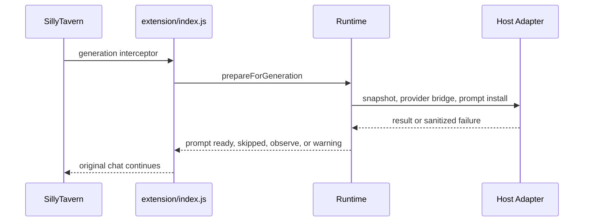

# Host Integration Manual

SillyTavern is Recursion's active V1 host. Host integration is split between the entrypoint in `src/extension/index.js`, the SillyTavern adapter in `src/hosts/sillytavern/host.mjs`, connection-profile discovery in `src/hosts/sillytavern/provider-profiles.mjs`, the user-file adapter in `src/hosts/sillytavern/storage.mjs`, and the host-neutral runtime modules under `src/`.

## Adapter Responsibilities

The SillyTavern adapter:

- reads the active SillyTavern context
- captures chat id, chat messages, message ids, roles, visibility, scene fingerprint, scene key, and turn fingerprint
- captures active swipe id/count metadata and a source revision hash for the current visible source
- exposes settings through `extension_settings.recursion`
- bridges host generation APIs to provider routing
- exposes host generation stop through `generation.stop()`
- installs and clears Recursion prompt blocks
- selects SillyTavern user-file storage when available
- falls back to memory storage when user-file storage cannot be used
- keeps host-specific APIs out of core runtime modules

## Extension Entrypoint

`src/extension/index.js` bootstraps the host, activity reporter, storage repository, generation router, runtime, and UI mount. It exports and registers:

- `recursionGenerationInterceptor`
- `recursionOnInstall`
- `recursionOnUpdate`
- `recursionOnEnable`
- `recursionOnDisable`
- `recursionOnDelete`
- `recursionOnClean`
- `recursionOnActivate`

Document-ready bootstrap mounts Recursion when a SillyTavern context is available.

## Lifecycle Hooks

Enable and activate call bootstrap. Disable and delete dispose the runtime, clear prompt keys best-effort, destroy the UI, and drop host/runtime references. Cleanup is intentionally light because Recursion records are cache-oriented and user-visible cleanup actions belong to settings, storage diagnostics, or cache controls.

## Host Events

When SillyTavern exposes `eventSource` plus `event_types.CHAT_CHANGED`, the entrypoint subscribes during bootstrap and removes the listener during teardown. The handler calls `runtime.handleChatChanged()` and remains fail-soft: cleanup errors are logged, but host navigation must continue.

Chat-change cleanup clears volatile Recursion state and owned prompt keys, pauses active work before stale results can commit, and marks incompatible execution stages stale with reason `chat-changed`. Durable paused manifests and required artifacts remain scoped to their original chat and cannot resume against the newly selected chat. The handler does not run provider calls or compile a packet for the new chat.

The entrypoint also subscribes to source mutation events when available: `MESSAGE_DELETED`, `MESSAGE_UPDATED`, and `MESSAGE_SWIPED`. The SillyTavern adapter normalizes message event ids, swipe/delete/edit flags, latest-assistant identity, and object-shaped event text before bootstrap chooses the runtime handler. During native swipe startup, SillyTavern may temporarily expose the latest assistant row with empty text; for `MESSAGE_SWIPED` only, that visible non-user, non-system row remains the latest-assistant target. Delete/update handlers and older-message swipe handlers call `runtime.handleSourceChanged()` so source changes do not leave an old Recursion prompt installed. A `MESSAGE_SWIPED` event for the latest visible assistant message is treated as a same-turn swipe retry and may reuse only an independently validated prepared-generation checkpoint for the matching pre-assistant source basis. Cleanup records only compact event metadata such as event name and message id.

For swiped assistant messages, the SillyTavern adapter records the active `swipe_id`, swipe count, and active-swipe text hash in the normalized message. The source revision hash includes the active swipe metadata, not inactive swipe bodies. Changing inactive swipe text does not invalidate the source revision until that swipe becomes active.

SillyTavern chat rows commonly omit an explicit `mesid`. The adapter therefore preserves each row's full-chat index before applying the bounded source window; it never renumbers a retained window to `0..N`. This keeps sparse `MESSAGE_SWIPED` identity aligned with the snapshot row that must be excluded from the retry turn basis. Swipe reads exclude that latest assistant row before applying retention limits, so different response lengths cannot alter the pre-assistant source band.

The entrypoint subscribes to SillyTavern's player Stop signal through `event_types.GENERATION_STOPPED`, with `generation_stopped` as a fallback event name. That handler calls `runtime.handleHostGenerationStopped()`. Runtime aborts active Recursion provider signals, prevents stale packet installation, clears Recursion-owned prompt keys, cancels any Post-process trigger belonging to the stopped host generation, and surfaces the progress outcome as skipped rather than warning or failure. It does not automatically retry the primary story generation. Accepted Pre-process checkpoints remain eligible only for a later independently validated send or swipe. Assistant-landed events clear the runtime's host-generation-active state so the Recursion Bar stop affordance disappears when the host turn settles.

## Generation Interceptor Boundary

The generation interceptor calls `runtime.prepareForGeneration({ hostGeneration: true })` before returning the chat to SillyTavern. It catches and logs sanitized failures so the host generation can continue. While that intercepted turn is active, `runtime.view().hostGenerationActive` allows the UI to expose the active-only Stop generation button.

A host-owned Resume re-enters SillyTavern before continuing saved Recursion work. Normal and regenerate resumes call the native `Generate` surface. Swipe resumes call SillyTavern's native right-swipe lifecycle, which allocates the new swipe slot, emits `MESSAGE_SWIPED`, displays the generation placeholder, and then enters `Generate('swipe')`; calling `Generate('swipe')` directly would overwrite the selected slot instead of performing a native swipe.

```mermaid
sequenceDiagram
    participant ST as SillyTavern
    participant Entry as extension/index.js
    participant Runtime as Runtime
    participant Host as Host Adapter
    ST->>Entry: generation interceptor
    Entry->>Runtime: prepareForGeneration
    Runtime->>Host: snapshot, provider bridge, prompt install
    Host-->>Runtime: result or sanitized failure
    Runtime-->>Entry: prompt ready, skipped, observe, or warning
    Entry-->>ST: original chat continues
```

## Prompt Adapter

The prompt adapter converts validated packets into prompt blocks through `packetToPromptBlocks()`. It accepts only Recursion-owned prompt keys and rejects unsafe hidden-thought or forward-plot wording.

Install behavior:

1. Build prompt blocks.
2. Validate keys and prompt text.
3. Clear known Recursion prompt keys.
4. Resolve placement and role to SillyTavern's numeric prompt enums.
5. Call `setExtensionPrompt` for each block.
6. When the shared `extensionPrompts` store is available, verify exact text plus finite numeric position, depth, and role metadata.
7. Track installed keys only after verification.
8. Roll back known keys if a partial install fails or SillyTavern stores malformed metadata.

`SillyTavern.getContext()` exposes `setExtensionPrompt` and the shared prompt store, but does not expose `extension_prompt_types` or `extension_prompt_roles`. The adapter therefore owns numeric fallbacks matching SillyTavern's public enums; string enum names are invalid because the host coerces them with `Number(...)`. A successful setter call is not sufficient evidence of installation.

Clear behavior calls `setExtensionPrompt` with empty text for known Recursion keys and any keys installed during the session. It attempts every key even if one clear fails, returns a stable prompt-clear failure result with failed keys, and keeps failed non-core keys tracked for a later retry. Prompt install validates the packet first, then aborts before writing new prompt text if the pre-install clear reports failure.

## Storage Adapter

The SillyTavern user-file adapter uses:

- `GET /user/files/{file}`
- `POST /api/files/upload`
- `POST /api/files/delete`

It validates storage filenames, requires `.json`, prevents path traversal, prefixes non-prefixed keys with `recursion-`, and serializes data as base64 JSON for upload.

If the user-file API throws or returns a non-OK response for read, write, or delete, the adapter downgrades that session to memory storage for subsequent operations. Read-side and delete-side `404` responses remain normal missing-record results and do not trigger fallback. Filename validation and JSON serialization still run before fallback, so unsafe keys and invalid JSON values are rejected instead of being treated as host storage outages.

## Settings Adapter

Settings are stored under `extension_settings.recursion` and normalized through `src/settings.mjs`. Each Utility or Reasoner lane stores a selected Connection Profile id, generation policy, sampler overrides, output-token ceiling, configuration revision, and staged certification. Recursion does not store provider endpoints, credentials, authorization headers, or complete Connection Profile data.

## Generation Adapter

Turn and checkpoint fingerprints use SHA-256. Secure contexts use Web Crypto; plain HTTP LAN clients use a local SHA-256 implementation with identical output. Fingerprinting does not require HTTPS and does not encrypt or transmit chat data.

Scheduler stage ownership IDs use the shared local ID helper and do not require secure-context APIs. Stage ID initialization failures settle the stage as failed and pause blocking execution instead of repeatedly scheduling a pending stage.

Utility and Reasoner work has one supported transport: `ConnectionManagerRequestService.sendRequest`. The adapter requires `getSupportedProfiles`, `getProfile`, `validateProfile`, and `sendRequest`, validates the selected profile as chat or text completion, and fails with a stable non-retryable configuration error when the profile or host capability is missing. There is no current-model or direct-endpoint fallback.

Before sending, the adapter reads SillyTavern's public key metadata. If the profile's saved key reference is absent from its provider's key list and that same provider has an active key, the request overrides `secret_id` with the active key reference. Existing saved references remain authoritative; provider authentication failures do not trigger retries with other keys. This mirrors ordinary profile activation retaining the active key when a saved reference cannot be resolved, without switching the active connection or modifying profiles. Credential values are never read. Missing metadata, missing active keys, and Vertex AI's auth-mode-dependent credential stores retain the host's original behavior.

The request keeps four policies independent:

- `includePreset` follows Behavioral Preset (`Isolated` or `Full Profile`);
- `includeInstruct` follows Instruct Formatting and is enabled automatically for text-completion profiles;
- sampler values come from an allowlisted projection of the Connection Profile preset or explicit Recursion overrides;
- native schema payloads are attached only when the effective structured-output method is `native-schema`.

The adapter passes `extractData: false` so SillyTavern returns the provider envelope and Recursion performs its own canonical response extraction, JSON recovery, and role validation. Prompt text, raw response bodies, complete profile objects, endpoint fields, secret references, and hidden reasoning are not returned through diagnostics.

Utility requests default to minimal reasoning, including planning, cards, fused bundles, and guidance. Chat-completion requests forward explicit reasoning intent even in isolated preset mode: minimal/medium/high map to SillyTavern's NanoGPT low/high/max values, or min/medium/high for other chat sources. SillyTavern performs the backend translation. Text-completion requests do not receive chat reasoning controls. Provider support determines whether effort is honored; this is not a hard reasoning-token cap. Production requests use the configured output-token ceiling as their default allowance; explicit smaller limits and certification probes remain bounded.

Every model request enters an abort-aware FIFO queue keyed by Connection Profile id. Calls sharing a profile never overlap; calls using distinct profiles may overlap. Stop aborts the active request where supported and removes queued work before it starts.

Post-process prose rewriting is a separate host-owned operation. `generation.rewriteWithPostProcess()` temporarily installs the validated Recursion guidance packet, invokes SillyTavern's native quiet generation path, normalizes the resulting prose, and clears the temporary prompt key. This path writes prose; the Utility and Reasoner Connection Profile path returns structured Recursion data.

The stop adapter exposes `generation.stop(details)`. It prefers SillyTavern's extension-context `stopGeneration()` function, which triggers the same host stop path as the native Stop control. If that API is absent, it falls back to clicking the native `#mes_stop` / `.mes_stop` button. If neither seam exists, it returns `RECURSION_HOST_STOP_UNAVAILABLE` so runtime can still abort Recursion work and clear prompt lanes without claiming the host model was stopped.

The native chat-generation adapter exposes `generation.start(details)` for host-owned generation flows, but the Recursion Bar Regenerate command does not call it. Regenerate only queues one full-fresh next-generation intent; the next SillyTavern send or swipe remains the host generation trigger and consumes that intent through the generation interceptor.

## UI Mount

The UI mounts a chat-attached Recursion root near the `#chat` element when possible, otherwise into a stable parent. It renders the Recursion Bar, the Hero Pixel Array progress menu with one contextual 24px stage-action slot, options/settings menu, Last Brief dropdown, settings panel, and Full Viewer. The UI updates from `runtime.view()` on a short interval and uses sanitized view data. Stop, Resume, Retry Stage, Reprocess from here on the next swipe, and Cancel queued reprocess appear only when the row state permits them.

## Fake And Contract Tests

The deterministic suite covers fake host behavior, settings normalization, session-only secret handling, provider routing, card lifecycle, prompt packet validation, prompt injection metadata, storage repository behavior, activity events, and UI view model behavior. Fake adapters prove contracts without mutating a live SillyTavern profile.

## Live Smoke Guardrails

Live smoke is guarded by dedicated-user requirements. Automated live mutation must use `recursion-soak-*` users and reject `default-user`. Live checks verify served-extension freshness, storage probes, no-generation UI mount/open behavior, and opt-in generation bridge prompt-install evidence.

Live artifacts must follow [Artifact Contract](../testing/ARTIFACT_CONTRACT.md) and avoid raw provider prompts, raw provider responses, full transcripts, secrets, hidden reasoning, and private story plans.

## Deferred Host Boundary

The runtime is host-neutral where that keeps the model, cache, prompt, storage, and activity contracts clean. SillyTavern is the only active V1 host integration. Additional host ports are deferred boundary work and should connect through the same adapter responsibilities rather than importing host APIs into runtime modules.
