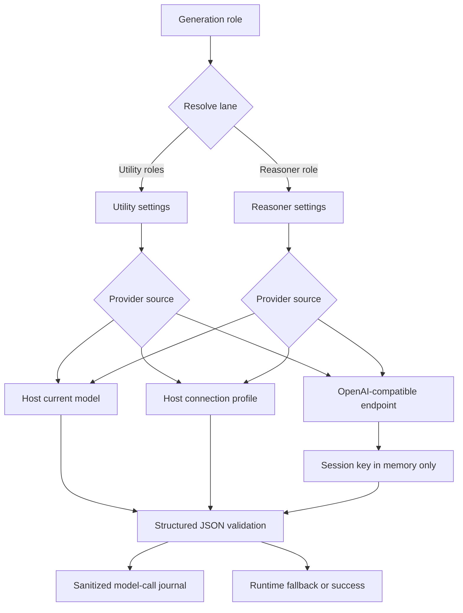

# Model Calls And Provider Routing

Provider routing is implemented by `src/providers.mjs`, configured by `src/settings.mjs`, orchestrated by `src/runtime.mjs`, and journaled through the storage repository.

## Provider Lanes

| Lane | Required | Uses | Fallback |
| --- | --- | --- | --- |
| Utility | Yes | Utility Arbiter, card generation, provider tests, Utility composition support. | Local fallback plan, cache reuse, prompt clear, or skip. |
| Reasoner | No | Optional composer synthesis for rich, crowded, conflicted, or subtle hands. | Utility-composed packet. |

Utility remains the default operational lane. Reasoner is eligible only when enabled and selected by settings or Arbiter state.

## Provider Sources

Each lane can resolve to:

- `host-current-model`
- `host-connection-profile`
- `openai-compatible`

Host current model and host connection profiles route through SillyTavern generation APIs. OpenAI-compatible endpoints use `fetch` against `/chat/completions` with JSON-object response format.

Direct endpoint API keys are session-only secrets kept in the in-memory secret store. Settings store only `sessionApiKeyPresent`.

## Generation Roles

| Role | Lane | Current use |
| --- | --- | --- |
| `utilityArbiter` | Utility | Plan action, scene status, card jobs, Reasoner decision, budgets, and compact diagnostics. |
| Card roles | Utility | Generate fixed-family card JSON from the frozen snapshot. |
| `briefUtilityComposer` | Utility | Reserved Utility composition role in the routing contract. |
| `reasonerComposer` | Reasoner | Optional synthesis patch for the Turn Brief. |
| `providerTest` | Selected lane | Connectivity and structured response test for provider settings UI. |

Card roles are `sceneFrameCard`, `activeCastCard`, `characterMotivationCard`, `dialogueRelationshipCard`, `continuityRiskCard`, `environmentItemsCard`, `prosePacingCard`, and `openThreadsCard`.

## Routing Diagram

<Render Needed>: assets/documentation/renders/recursion-provider-routing.png - Provider routing visual showing Utility and Reasoner lanes, source choices, session secret boundary, validation, journal, retry, and fallback paths.

## Structured Output Validation

All provider work must return a JSON object. OpenAI-compatible responses are normalized before JSON parsing so empty visible output, reasoning-only payloads, and token-limit truncation are reported as provider failures with stable error codes. The router then parses visible text through the structured JSON parser, including recovery from fenced JSON wrappers, and returns either `ok: true` with parsed data or `ok: false` with sanitized diagnostics. Runtime consumers still validate role-specific schemas; for example, provider tests only pass on `recursion.providerTest.v1`.

Validation failures do not become successful model calls. Prompt composition consumes accepted structured data only.

## Retries And Fallbacks

Transient transport and server failures can receive one same-lane retry when the snapshot is still current. Schema failures do not receive blind retries. Provider results normalize to statuses such as success, validation failed, provider failed, timeout, aborted, or stale.

Fallback behavior:

- Utility Arbiter failure uses local fallback plan.
- Card call failure omits failed cards and keeps valid siblings.
- Reasoner failure falls back to Utility composition.
- Provider test failure updates lane status with compact error text.
- Host generation unavailability makes the lane unhealthy without blocking normal chat generation.
- Token-limit, reasoning-only, and empty visible provider responses are classified before raw response text can enter diagnostics, journals, or Activity Ribbon details.

## Model-Call Journal

Journal entries are sanitized and bounded. They can include:

- run id and role id
- lane and provider source
- provider id and model label
- schema id
- latency
- retry count
- request hash
- response hash
- compact error code and message

They must not include raw prompts, raw provider responses, API keys, bearer tokens, cookies, full chat messages, hidden reasoning, or full prompt packets.

## Session Secret Boundary

The settings store accepts `apiKey` in a provider update, moves it into the session secret store, and removes it from persisted provider settings. Clearing a lane key deletes it from memory and immediately updates the `sessionApiKeyPresent` state.

OpenAI-compatible requests read the key only at call time. Error text and diagnostics are redacted to avoid copying credentials or request text.

## Abort And Stale Handling

Provider calls receive abort signals from runtime. Timeouts use an internal abort controller. Batch calls combine the runtime signal with per-request signals.

If a run is no longer active, runtime returns a superseded result and refuses to apply late cache, prompt, or activity updates. Aborted calls are recorded as aborted rather than installed.

## Operator-Visible Provider States

The UI shows Utility and Reasoner provider cards with source, profile, endpoint, model, session key state, temperature, top-p, max tokens, test status, resolved provider, and resolved model. The Recursion Bar shows the active composer lane and Reasoner state.

Visible states are compact: ready, unavailable, disabled, issue, composing, or test failed. Raw provider errors remain out of the bar and ribbon.
