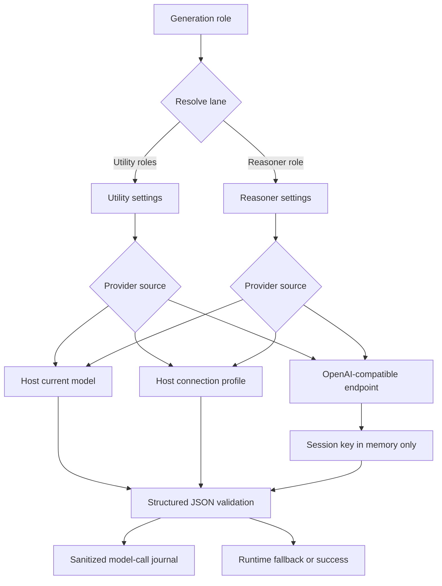

# Model Calls And Provider Routing

Provider routing is implemented by `src/providers.mjs`, configured by `src/settings.mjs`, orchestrated by `src/runtime.mjs`, and journaled through the storage repository.

## Provider Lanes

| Lane | Required | Uses | Fallback |
| --- | --- | --- | --- |
| Utility | Yes | Low/Medium Arbiter, Low/Medium card generation, Low/Medium Fused bundles, lower-priority High cards, provider tests, and `guidanceComposer`. | Local fallback plan, cache reuse, raw-card-only packet, prompt clear, or skip. |
| Reasoner | No | Medium+ guidance augmentation, High/Ultra Arbiter, High/Ultra Fused bundles when healthy, high-priority High cards, Ultra card generation. | Utility guidance plus raw card evidence. |

Utility remains the required operational lane. Reasoner is eligible only when enabled and selected by Reasoning Level policy.

## Provider Sources

Each lane can resolve to:

- `host-current-model`
- `host-connection-profile`
- `openai-compatible`

Host current model routes through SillyTavern raw generation when available, with quiet prompt as a current-model fallback. Host connection profiles route through `ConnectionManagerRequestService.sendRequest` when that SillyTavern service is available. For machine JSON jobs, Recursion passes the expected response schema and frozen snapshot hash to the host profile request, suppresses host preset/instruct wrapping, and still validates the returned schema before trusting the output. If a profile is selected but only quiet prompt generation is available, Recursion reports the profile route as unsupported instead of silently falling back to the current model. OpenAI-compatible endpoints use `fetch` against `/chat/completions` with JSON-object response format.

Utility and Reasoner default to `8192` max tokens. Host connection-profile calls pass the lane's configured max tokens as the explicit `maxTokens` argument to `ConnectionManagerRequestService.sendRequest`, which SillyTavern forwards as request `max_tokens`. Recursion machine-JSON jobs suppress profile preset/instruct wrapping, so the selected connection profile supplies routing, model, and secret context rather than overriding Recursion's max-token budget through its preset.

Direct endpoint API keys are session-only secrets kept in the in-memory secret store. Settings store only `sessionApiKeyPresent`.

The provider control plane is shared with the settings UI:

- connection profiles are listed from `context.ConnectionManagerRequestService.getSupportedProfiles()`, global `ConnectionManagerRequestService.getSupportedProfiles()`, and host state profile arrays/maps;
- provider status resolves the selected source, selected profile label, and model label before a test call runs;
- OpenAI-compatible model discovery uses the configured base URL normalized to `/models`, sends a GET with the session bearer key, and accepts OpenAI-style `data[]` plus simpler `models[]` payloads.

Model discovery is not a generation call. It does not mutate settings, clear prompts, invalidate scene cache, write journals, or persist the session key. The Providers pane may show the discovered model list and copy a selected id into the model input, but saving remains a separate operator action.

Recursion exposes route visibility as a compact Reasoning Level summary rather than Directive-style per-role routing controls. Detailed role-to-lane policy stays in runtime so the V1 settings pane remains small.

## Generation Roles

| Role | Lane | Current use |
| --- | --- | --- |
| `utilityArbiter` | Utility by default; Reasoner at High/Ultra when healthy | Plan action, scene status, card jobs, Reasoner decision, budgets, and compact diagnostics. |
| Card roles | Utility by default; Reasoner for high-priority High cards and Ultra card calls when healthy | Generate fixed-family card JSON from the frozen snapshot. |
| `fusedCardBundle` | Utility at Low/Medium; Reasoner at High/Ultra when healthy | Generate all requested card families in one structured bundle for the Fused pipeline. |
| `guidanceComposer` | Utility | Provider-authored direction for using selected raw card evidence in Standard, Rapid warm, and Fused packets. |
| `rapidTurnDelta` | Utility | Foreground Rapid role that selects from warmed raw cards and emits a small user-message guidance delta. |
| `reasonerComposer` | Reasoner | Medium+ synthesis patch for Guidance. |
| `providerTest` | Selected lane | Connectivity and structured response test for provider settings UI. |

Card roles are `sceneFrameCard`, `activeCastCard`, `characterMotivationCard`, `dialogueRelationshipCard`, `socialSubtextCard`, `sceneConstraintsCard`, `knowledgeSecretsCard`, `clocksConsequencesCard`, `environmentAffordancesCard`, `possessionsItemsCard`, and `openThreadsCard`. Fused wraps those card families in `fusedCardBundle` with response schema `recursion.cardBundle.v1`; each accepted item inside the bundle still validates as one `recursion.card.v1` card. Rapid foreground roles are Utility-only; they do not run on the Reasoner lane.

Fused is meant for stronger reasoning model families that can maintain a larger multi-card structured contract in one response, such as recent DeepSeek, GLM, MiniMax, Kimi, MiMo, Qwen, and similar models. Standard is a better fit for fast, cheaper utility-class models, including 500B-and-lower models, Nemotron, GPT-OSS, Gemma, and similar, because each call has a narrower one-card contract.

Rapid foreground roles are latency-sensitive structured Utility calls. `rapidTurnDelta` is used only when an exact-source warm artifact is ready. If no warm artifact is available, Rapid escalates to Standard for that same pending user message. Runtime must not replace missing Rapid output with local scene briefs, turn briefs, or summary packs.

## Routing Diagram

## Structured Output Validation

All provider work must return a JSON object. OpenAI-compatible responses are normalized before JSON parsing so empty visible output, reasoning-only payloads, and token-limit truncation are reported as provider failures with stable error codes. The router rejects undeclared role ids, parses visible text through the structured JSON parser, validates the expected role schema, and returns either `ok: true` with parsed data or `ok: false` with sanitized diagnostics. Runtime consumers still validate role-specific payload details; for example, provider tests pass only when the router succeeds and the parsed payload contains `schema: "recursion.providerTest.v1"` plus explicit `ok: true`.

The structured parser may recover common provider formatting damage: markdown fences, wrapper prose, `<think>` / `<reasoning>` blocks, comments, trailing commas, smart quotes, BOMs, and literal line breaks inside JSON strings. Repair never supplies missing contract fields. A repaired object that lacks the expected `schema`, role/family, valid evidence, or composer envelope remains invalid and is retried or rejected by the same semantic validators as strict JSON. Roles that require a provider-echoed `snapshotHash` still reject missing or mismatched hashes. Rapid foreground roles instead stamp local revision hashes from the frozen request after schema validation, because those hashes are runtime bookkeeping rather than provider-authored guidance.

Every generation-role request carries `responseSchema` and `machineJson: true` into the host adapter. Requests with a frozen snapshot also carry `snapshotHash`. Host adapters may use that metadata to request structured JSON support, but the metadata is advisory until the router validates the visible response body.

Validation failures do not become successful model calls. Prompt composition consumes accepted structured data only. Success diagnostics may include compact repair metadata such as `structuredOutputRepaired`, `structuredOutputRepairCode`, and `visibleContentLength`; raw malformed response text and hidden reasoning stay out of journals, activity details, and reports.

## Reasoning Amount Routing

Runtime derives provider reasoning amount from the user-facing Reasoning Level and the work category. Final guidance augmentation uses minimal for Low, medium for Medium and High, and high for Ultra. Reasoner Arbiter calls use medium for High and Ultra. Reasoner card calls use minimal for High and medium for Ultra. Provider tests always use minimal.

Fused card bundles use the card work category when they route to Reasoner. High therefore sends minimal reasoning intent on the Reasoner lane, while Ultra sends medium reasoning intent. Low and Medium keep the Fused bundle on Utility.

The request contract is `reasoningCategory` plus `reasoningIntent`, where intent is normalized to `minimal`, `medium`, or `high`. Direct OpenAI-compatible calls apply provider fields only for known dialects:

- OpenRouter and OpenAI: `reasoning: { effort, exclude: true }`.
- GLM/Z.AI: `thinking: { type: "enabled" }` plus `reasoning_effort`.
- MiniMax M3: `thinking: "adaptive"` for medium/minimal and `"enabled"` for high.
- DeepSeek reasoner: no reasoning-control field because the provider does not expose an effort knob.
- Unknown endpoints: no speculative reasoning-control field.

If a known endpoint rejects reasoning fields, the adapter retries once without those fields and records `reasoningDowngraded: true`. Host current-model calls receive flat and nested reasoning metadata; host connection-profile calls receive `parameters.reasoning = { intent, category, exclude: true }` so profile-backed Claude, Gemini, OpenRouter, and other integrations can translate intent to native controls. Hidden reasoning content is never requested for display or persisted by Recursion.

## Retries And Fallbacks

Provider calls use a 120 second default timeout unless a caller overrides it. The longer default keeps live host connection-profile routes from failing early while still bounding stalled Recursion work.

Transient transport and server failures can receive one same-lane retry only while the abort signal has not fired and the current-run or current-snapshot guard still passes. Recoverable structured-output schema failures receive one correction retry that names the expected `schema` field and, when present, the frozen `snapshotHash` field. Provider results normalize to statuses such as success, validation failed, provider failed, timeout, aborted, or stale.

Rapid foreground Utility calls may hedge: runtime starts the primary Utility call immediately and starts a backup Utility call after the configured short delay if no valid structured output has returned. The first valid structured output wins, diagnostics record whether `primary` or `backup` won, and late results cannot install prompt packets after the run is no longer current. Hedging is limited to Rapid foreground roles and is not used for final Story generation.

Fallback behavior:

- Utility provider unavailable, timed out, or transport-failed reuses valid cache when safe; otherwise runtime clears Recursion injection and skips new guidance.
- Invalid Utility Arbiter schema or missing/mismatched Arbiter `snapshotHash` can use a conservative local fallback plan because a provider result existed but failed structured validation.
- Rapid warm miss escalates to Standard for the same pending user message; it does not permit local Rapid cards, local Rapid scene briefs, local Rapid turn briefs, or summary fast-start packs.
- Rapid invalid structured output, mandatory missing cards, or provider-declared Standard escalation continue through the Standard pipeline for that same pending user message.
- Fused bundle schema mismatch, snapshot mismatch, provider failure, or an empty valid result falls back to Standard individual card calls for the same pending user message.
- Card call failure omits failed cards and keeps valid siblings.
- Reasoner failure falls back to Utility guidance plus raw selected Card Evidence.
- Provider test failure updates lane status with compact error text.
- Host generation unavailability makes the lane unhealthy without blocking normal chat generation.
- Token-limit, reasoning-only, and empty visible provider responses are classified before raw response text can enter diagnostics, journals, or progress details.

## Model-Call Journal

Journal entries are sanitized and bounded. They can include:

- run id and role id
- lane and provider source
- provider id and model label
- schema id
- latency
- retry count
- effective timeout
- frozen snapshot hash when the request carries one
- request hash
- response hash
- structured-output repair metadata
- reasoning intent, category, dialect, applied/downgraded flags
- compact error code and message

They must not include raw prompts, raw provider responses, API keys, bearer tokens, cookies, full chat messages, hidden reasoning, or full prompt packets.

## Session Secret Boundary

The settings store accepts `apiKey` in a provider update, moves it into the session secret store, and removes it from persisted provider settings. Clearing a lane key deletes it from memory and immediately updates the `sessionApiKeyPresent` state.

OpenAI-compatible requests read the key only at call time. Error text and diagnostics are redacted to avoid copying credentials or request text.

## Abort And Stale Handling

Provider calls receive abort signals from runtime. Timeouts use an internal abort controller. Batch calls combine the runtime signal with per-request signals. Retry guards may be synchronous or asynchronous; when they report that the run is no longer current, the router skips the transient retry and returns sanitized failure results for the pending call or batch entries.

If a run is no longer active, runtime returns a superseded result and refuses to apply late cache, prompt, or activity updates. Aborted calls are recorded as aborted rather than installed. When the abort comes from SillyTavern `GENERATION_STOPPED`, runtime performs host-stop cleanup and reports skipped progress so the user sees cancellation, not a provider warning or failure.

## Operator-Visible Provider States

The compact UI shows Utility and Reasoner provider details in collapsible lanes with source, profile, endpoint, model, session key state, max tokens, test status, resolved provider, and resolved model. Temperature and top-p remain normalized provider settings with defaults, but they are not visible controls in the compact V1 surface. The Recursion Bar shows current progress, active composition lane, and Reasoning Level bias without exposing raw provider errors.

Visible states are compact: ready, unavailable, disabled, issue, composing, or test failed. Raw provider errors remain out of the bar and progress menu.
