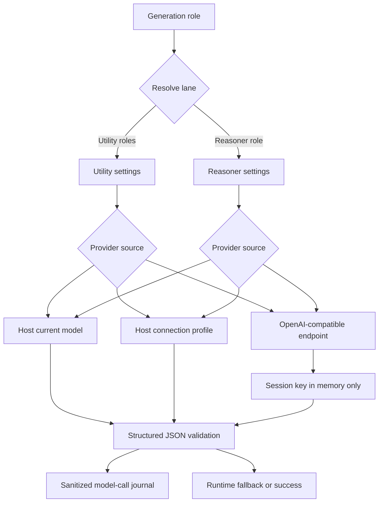

# Model Calls And Provider Routing

Provider routing is implemented by `src/providers.mjs`, configured by `src/settings.mjs`, orchestrated by `src/runtime.mjs`, and journaled through the storage repository.

## Provider Lanes

| Lane | Required | Uses | Fallback |
| --- | --- | --- | --- |
| Utility | Yes | Low/Medium Arbiter, Low/Medium card generation, Low/Medium Fused bundles, lower-priority High cards, provider tests, Pre-process guidance, and Post-process guidance when selected. | Local fallback plan, cache reuse, raw-card-only packet, prompt clear, original-message reveal, or skip. |
| Reasoner | No | Medium+ guidance, High/Ultra Arbiter, High/Ultra Fused bundles when routable, high-priority High cards, Ultra card generation, and Post-process guidance when configured Ready or Untested. | Utility guidance plus raw card evidence. |

Utility remains the required operational lane. Reasoner eligibility comes from
one shared capability resolver plus Reasoning Level policy; there is no provider
enable Boolean.

The resolver reports `unconfigured`, `untested`, `ready`, or `unhealthy`.
Configuration completeness, host support, and session credentials establish
whether a lane is testable. Only pass/fail health evidence bound to the current
configuration hash establishes `ready` or `unhealthy`; stale health is neutral.
Ordinary Medium/High/Ultra work routes through configured `ready` or `untested`
Reasoner according to policy; `untested` is caution-only. `Unconfigured` or
`unhealthy` ordinary work falls back to Utility. Medium+ Redirect is unavailable
and skipped before provider work only for those blocking states. Low Redirect
uses Utility.

## Provider Sources

Each lane can resolve to:

- `host-current-model`
- `host-connection-profile`
- `openai-compatible`

Host current model routes through SillyTavern raw generation when available, with quiet prompt as a current-model fallback. Host connection profiles route through `ConnectionManagerRequestService.sendRequest` when that SillyTavern service is available. For machine JSON jobs, Recursion passes the expected response schema and frozen snapshot hash to the host profile request, suppresses host preset/instruct wrapping, and still validates the returned schema before trusting the output. If a profile is selected but only quiet prompt generation is available, Recursion reports the profile route as unsupported instead of silently falling back to the current model. OpenAI-compatible endpoints use `fetch` against `/chat/completions` with JSON-object response format.

Utility and Reasoner default to `8192` max tokens. Host connection-profile calls pass the lane's configured max tokens as the explicit `maxTokens` argument to `ConnectionManagerRequestService.sendRequest`, which SillyTavern forwards as request `max_tokens`. Recursion machine-JSON jobs suppress profile preset/instruct wrapping, so the selected connection profile supplies routing, model, and secret context rather than overriding Recursion's max-token budget through its preset.

Provider Test uses the selected lane's configured max-token ceiling, including
the default `8192`; it does not impose a smaller hidden response cap. Tests are
single-flight per lane. Duplicate same-lane callers share one request, and a
test requested while that lane has active production work returns
`RECURSION_PROVIDER_BUSY` without superseding the active run.

Direct endpoint API keys are session-only secrets kept in the in-memory secret store. Settings store only `sessionApiKeyPresent`.

The provider control plane is shared with the settings UI:

- connection profiles are listed from `context.ConnectionManagerRequestService.getSupportedProfiles()`, global `ConnectionManagerRequestService.getSupportedProfiles()`, and host state profile arrays/maps;
- provider status resolves the selected source, selected profile label, and model label before a test call runs;
- OpenAI-compatible model discovery uses the configured base URL normalized to `/models`, sends a GET with the session bearer key, and accepts OpenAI-style `data[]` plus simpler `models[]` payloads.

Model discovery is not a generation call. It does not mutate settings, clear prompts, invalidate scene cache, write journals, or persist the session key. The Providers pane may show the discovered model list and copy a selected id into the model input, but saving remains a separate operator action.

Recursion exposes route visibility as a compact Reasoning Level summary rather than Directive-style per-role routing controls. Detailed role-to-lane policy stays in runtime so the V1 settings pane remains small.

## Generation Roles

| Role | Lane | Current use |
| --- | --- | --- |
| `utilityArbiter` | Utility by default; configured Ready or Untested Reasoner at High/Ultra | Plan action, scene status, card jobs, Reasoner decision, budgets, and compact diagnostics. |
| Card roles | Utility by default; configured Ready or Untested Reasoner for high-priority High cards and Ultra card calls | Generate fixed-family card JSON from the frozen snapshot. |
| `fusedCardBundle` | Utility at Low/Medium; configured Ready or Untested Reasoner at High/Ultra | Generate all requested card families in one structured bundle for the Fused pipeline. |
| `guidanceComposer` | Utility | Provider-authored direction for using selected raw card evidence in Segmented and Fused packets, and for Post-process operations. Guidance remains structured; native host quiet generation writes prose. |
| `reasonerComposer` | Reasoner | Medium+ synthesis for Pre-process and Post-process Guidance when the configured lane is ready or untested. |
| `postProcessGuidance` | Utility or sticky Reasoner lane | Structured guidance for one frozen completed response and the active Post-process deck. It never writes prose. |
| `editorialDiagnostician` | Utility for Repair/Recompose; Redirect follows its readiness-specific lane | Diagnoses the frozen response and emits the mode-bound editorial brief before any candidate or patch is written. |
| `editorialTransformer` | Same Editorial lane as diagnosis, with Redirect-specific Reasoner rules | Emits a complete Recompose candidate, Redirect text, or Repair bounded patches. Repair never accepts a full candidate. |
| `editorialVerifier` | Same Editorial lane; required for Redirect and Repair card-audit paths | Verifies Redirect's canonical checks or receives compact Repair `failedCardIds`; Recursion derives canonical Repair outcomes locally. |
| `editorialEffectivenessJudge` | Reasoner-capable Redirect proof lane | Independently judges Redirect effectiveness in live certification; it is not semantic authority for Repair. |
| `providerTest` | Selected lane | Connectivity and structured response test for provider settings UI. |

Card roles are `sceneFrameCard`, `activeCastCard`, `characterMotivationCard`, `dialogueRelationshipCard`, `socialSubtextCard`, `sceneConstraintsCard`, `knowledgeSecretsCard`, `clocksConsequencesCard`, `environmentAffordancesCard`, `possessionsItemsCard`, and `openThreadsCard`. Fused wraps those card families in `fusedCardBundle` with response schema `recursion.cardBundle.v1`; each accepted item inside the bundle still validates as one `recursion.card.v1` card.

Runtime sends card roles only for jobs that can fit the effective selected-hand budget. The Arbiter is still instructed to respect `budgets.maxCards`, but runtime enforces that boundary before the expensive provider-call layer and records `card-jobs-budgeted` when it trims over-requested jobs.

Fused is meant for stronger reasoning model families that can maintain a larger multi-card structured contract in one response, such as recent DeepSeek, GLM, MiniMax, Kimi, MiMo, Qwen, and similar models. Segmented is a better fit for smaller or simpler local and utility-class models because each call has a narrower one-card contract. Fused validates every returned sibling independently, repairs missing or damaged siblings with Segmented calls when any useful item survives, and falls back to the full Segmented card path only when the bundle yields no useful cards.

## Routing Diagram

```mermaid
flowchart TD
    Role["Generation role"] --> Lane{"Resolve lane"}
    Lane -- "Utility roles" --> Utility["Utility settings"]
    Lane -- "Reasoner role" --> Reasoner["Reasoner settings"]
    Utility --> SourceU{"Provider source"}
    Reasoner --> SourceR{"Provider source"}
    SourceU --> HostModel["Host current model"]
    SourceU --> HostProfile["Host connection profile"]
    SourceU --> OpenAI["OpenAI-compatible endpoint"]
    SourceR --> HostModel
    SourceR --> HostProfile
    SourceR --> OpenAI
    OpenAI --> Secret["Session key in memory only"]
    HostModel --> Validate["Structured JSON validation"]
    HostProfile --> Validate
    Secret --> Validate
    Validate --> Journal["Sanitized model-call journal"]
    Validate --> Runtime["Runtime fallback or success"]
```

## Structured Output Validation

All provider work normally returns a JSON object. OpenAI-compatible responses are normalized before JSON parsing so empty visible output, reasoning-only payloads, and token-limit truncation are reported as provider failures with stable error codes. The router rejects undeclared role ids, parses visible text through the structured JSON parser, validates the expected role schema, and returns either `ok: true` with parsed data or `ok: false` with sanitized diagnostics. Runtime consumers still validate role-specific payload details; for example, provider tests pass only when the router succeeds and the parsed payload contains `schema: "recursion.providerTest.v1"` plus explicit `ok: true`.

Current Post-process guidance uses strict visible JSON under `recursion.postProcessGuidance.v1`. The request carries the frozen source hash, bounded evidence, ordered enabled categories, operation mode, and apply mode. Runtime validates source identity, category coverage, guidance text, and retry limits before passing guidance to native host quiet generation. Provider-layer retries stay on the same selected lane; native host generation is the only prose-writing step.

The legacy `generationReviewer` and Editorial role contracts below are retained as historical implementation notes only. They are not callable roles in the current Post-process runtime.

The active Enhancement path uses the mode-specific Editorial roles. Repair's
Transformer request has one candidate-free envelope with bounded `patches` and
requires at least one effective patch. Its request carries complete frozen
target metadata; known domains and narrowly recognizable displaced evidence
fields may be restored only from that request. Repair's Verifier returns only
dynamic `failedCardIds`; Recursion validates those IDs and constructs the full
canonical card ledger locally. Initial Repair diagnosis and Transformer calls
disable provider-layer structured retries while preserving the single runtime
semantic-correction budget, so a parse-valid but semantically invalid result
gets one explicit correction request rather than silently losing its retry.

The structured parser may recover common provider formatting damage: markdown fences, wrapper prose, `<think>` / `<reasoning>` blocks, comments, trailing commas, smart quotes, BOMs, and literal line breaks inside JSON strings. Repair never supplies missing contract fields. A repaired object that lacks the expected `schema`, role/family, valid evidence, or composer envelope remains invalid and is retried or rejected by the same semantic validators as strict JSON. Roles that require a provider-echoed `snapshotHash` still reject missing or mismatched hashes.

Every generation-role request carries `responseSchema` and `machineJson: true` into the host adapter. Requests with a frozen snapshot also carry `snapshotHash`. Host adapters may use that metadata to request structured JSON support, but the metadata is advisory until the router validates the visible response body.

Segmented `recursion.card.v1` requests carry a complete dynamic machine schema rather than the generic schema fallback. The schema constrains the frozen `snapshotHash`, request-owned `role` and `family`, and exactly one item with required `promptText` and `evidenceRefs`. A parsed `{ envelope, items }` response is normalized only when those frozen identities exist and no returned identity conflicts; this narrow recovery is recorded as `semanticNormalization: "nested-card-envelope"`.

Validation failures do not become successful model calls. Prompt composition consumes accepted structured data only. Success diagnostics may include compact repair metadata such as `structuredOutputRepaired`, `structuredOutputRecovery`, `semanticNormalization`, and `visibleContentLength`; failures may include safe role/schema names, provider source/model, top-level field names, and bounded value-free response structure. Raw malformed response text, provider field values, card text, prompts, transcript text, secrets, and hidden reasoning stay out of journals, activity details, and reports. Generation Review may apply already-validated bounded patches after unresolved card-outcome coverage only as explicit `partial-failed`, never as a successful review.

`guidanceComposer` has two validation layers. Provider-call journal success means the transport and schema parser returned a response. Prompt packet diagnostics then record whether that guidance passed Recursion validation. A `guidanceComposer success` entry followed by `guidanceStatus: fallback-raw-only` means the model call completed but the guidance payload was rejected by schema, snapshot, source-id, hidden-reasoning, or empty-text validation.

## Reasoning Amount Routing

Runtime derives provider reasoning amount from the user-facing Reasoning Level and the work category. Final guidance augmentation uses minimal for Low, medium for Medium and High, and high for Ultra. Reasoner Arbiter calls use medium for High and Ultra. Reasoner card calls use minimal for High and medium for Ultra. Provider tests always use minimal.

Fused card bundles use the card work category when they route to Reasoner. High therefore sends minimal reasoning intent on the Reasoner lane, while Ultra sends medium reasoning intent. Low and Medium keep the Fused bundle on Utility.

The request contract is `reasoningCategory` plus `reasoningIntent`, where intent is normalized to `minimal`, `medium`, or `high`. Direct OpenAI-compatible calls apply provider fields only for known dialects:

- OpenRouter and OpenAI: `reasoning: { effort, exclude: true }`.
- GLM/Z.AI: `thinking: { type: "enabled" }` plus `reasoning_effort`.
- MiniMax M3: `thinking: "adaptive"` for medium/minimal and `"enabled"` for high.
- DeepSeek reasoner: no reasoning-control field because the provider does not expose an effort knob.
- Unknown endpoints: no speculative reasoning-control field.

If a known endpoint rejects reasoning fields, the adapter retries once without those fields and records `reasoningDowngraded: true`. Host current-model calls receive flat and nested reasoning metadata; host connection-profile calls receive `parameters.reasoning = { intent, category, exclude: true }` so profile-backed Claude, Gemini, OpenRouter, and other integrations can translate intent to native controls. Hidden reasoning content is never requested for display or persisted by Recursion.

## Retries And Fallbacks

Recursion sets no default generation timeout. A slow local or remote model may remain pending until it returns, the provider fails it, or the user stops the operation. Provider-owned deadlines still surface as provider failures, and the small Provider Test action may use an explicit bounded diagnostic deadline without changing production generation behavior.

The advanced `Attempts per step` setting controls the total automatic model attempts for each model stage. Its range is one through five and its default is two. Local validation, persistence, cache reads, host commits, and other non-model stages do not consume attempts. An attempt is consumed when Recursion dispatches a model call. A known transport, provider, or structured-output failure may use another attempt only while the operation is current, its abort signal has not fired, and the stage has attempts remaining. Slow-but-pending calls are not retried.

The attempt window belongs to the durable stage, not an individual browser callback. Stop pauses the operation and aborts the current call while preserving accepted checkpoints. Resume continues the earliest incomplete stage. Retry Stage discards that stage's failed or partial output and gives it a fresh configured attempt window. Reprocess from Here is queued for the next generation and invalidates the selected stage plus its dependents; it never races the active run.

For a rejected Segmented card, each remaining automatic attempt appends the prior stable failure code and safe validation message to the correction request. The correction repeats the canonical `recursion.card.v1` envelope requirement without changing role, family, snapshot, source context, or sibling stages. Accepted sibling checkpoints are not repeated.

Recursion never automatically retries SillyTavern's primary story generation. It can retry only its own Pre-process and Post-process model stages. A provider may still charge for a response that never reaches Recursion, so automatic recovery cannot guarantee cost recovery.

Fallback behavior:

- Utility provider unavailable or transport-failed reuses a valid checkpoint or scene cache entry when safe; otherwise runtime pauses or fails the affected operation without discarding unrelated accepted work.
- Invalid Utility Arbiter schema or missing/mismatched Arbiter `snapshotHash` can use a conservative local fallback plan because a provider result existed but failed structured validation.
- Fused bundle validation reports accepted, invalid, rejected, omitted, and missing requested families. When at least one requested item is trustworthy, runtime repairs only damaged or missing siblings through individual Segmented card calls for the same pending user message. Wrong snapshot, provider failure with no recoverable item fragments, or zero trustworthy items triggers full Segmented card fallback.
- Card call failure omits failed cards and keeps valid siblings. A completed fail-soft run with an exhausted card stage is `Needs attention`, not `Ready`; the failed row retains its stable code, precise reason, and suggested action while downstream prompt installation may still complete.
- Reasoner failure falls back to Utility guidance plus raw selected Card Evidence.
- Provider test completion records compact hash-bound health without changing provider configuration.
- Host generation unavailability makes the lane unhealthy without blocking normal chat generation.
- Token-limit, reasoning-only, and empty visible provider responses are classified before raw response text can enter diagnostics, journals, or progress details.

## Model-Call Journal

Journal entries are sanitized and bounded. They can include:

- run id and role id
- lane and provider source
- provider id and model label
- schema id
- latency
- attempt number and configured attempt window
- provider-reported timeout or failure classification, when applicable
- frozen snapshot hash when the request carries one
- request hash
- response hash
- structured-output repair metadata
- reasoning intent, category, dialect, applied/downgraded flags
- compact error code and message
- capability transition state, reason code, configuration revision, configuration hash, and changed field names

They must not include raw prompts, raw provider responses, API keys, bearer tokens, cookies, full chat messages, hidden reasoning, or full prompt packets.

`provider.capability.changed` records configuration and health transitions with
only lane, prior/current capability, reason code, `configRevision`, hash, and
changed field names. `editorial.preflight.skipped` records a blocked Medium+
Redirect with the same sanitized capability reason. Neither event may contain a
profile id, endpoint, model value, secret, raw provider error, prompt, or
response.

## Session Secret Boundary

The settings store accepts `apiKey` in a provider update, moves it into the session secret store, and removes it from persisted provider settings. Clearing a lane key deletes it from memory and immediately updates the `sessionApiKeyPresent` state.

OpenAI-compatible requests read the key only at call time. Error text and diagnostics are redacted to avoid copying credentials or request text.

## Abort And Stale Handling

Provider calls receive abort signals from runtime. Batch calls combine the runtime signal with per-request signals. Attempt guards may be synchronous or asynchronous; when they report that the operation is no longer current, the router skips the next attempt and returns a sanitized result for the pending call or batch entries.

If an operation is no longer active, runtime returns a stale result and refuses to apply late cache, prompt, or activity updates. Aborted calls are recorded as aborted rather than installed. Stop preserves durable accepted checkpoints and exposes Resume or Retry Stage. When SillyTavern's own `GENERATION_STOPPED` event ends primary story generation, Recursion cleans up its prompt and pending Post-process trigger but does not attempt to restart the host generation.

## Operator-Visible Provider States

## Recovery And Editorial Routing

Generation Review follows the selected Enhancement mode and frozen request
metadata. Ordinary Repair/Recompose routing uses Reasoner only when capability
is `ready` and may fall back to Utility under its existing bounded rules.
Redirect is stricter: Low uses Utility, while Medium/High/Ultra require Reasoner
`ready` before generation and never use a Utility Redirect fallback.

Provider status must distinguish transport/auth failure, malformed structured output, semantic validation failure, token exhaustion, and safe fallback. The UI may show a concise normalized reason, but raw provider payloads, prompts, secrets, and hidden reasoning stay out of progress, diagnostics, journals, and saved artifacts.

The compact UI shows Utility and Reasoner provider details in collapsible lanes with source, profile, endpoint, model, session key state, max tokens, capability, resolved provider, and resolved model. Temperature and top-p remain normalized provider settings with defaults, but they are not visible controls in the compact V1 surface. Provider field commits are field-scoped compare-and-swap updates against `configRevision`; stale UI writes refresh instead of replacing newer configuration. The Recursion Bar shows current progress, active composition lane, and Reasoning Level bias without exposing raw provider errors.

Visible provider capability labels are compact: `Ready`, `Untested`,
`Unhealthy`, or `Configure`. Raw provider errors remain out of the bar and
progress menu.
