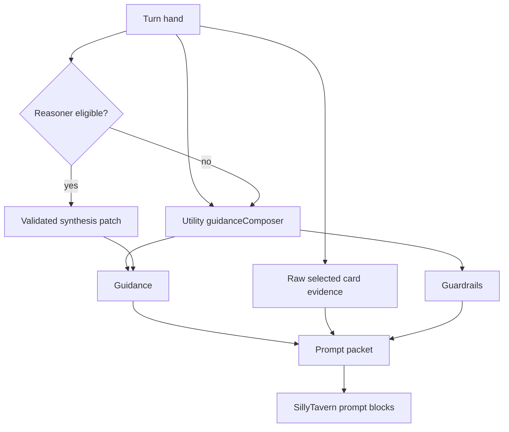
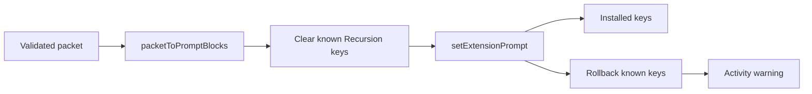

# Prompt Packet And Injection

The prompt packet is the model-facing Recursion artifact for one generation attempt. It is composed by `src/prompt.mjs`, installed by `src/hosts/sillytavern/host.mjs`, and orchestrated by `src/runtime.mjs`.

Recursion injects provider-authored guidance plus the full raw selected-card evidence for the turn hand. It does not inject the full raw scene deck.

## Packet Sections

| Section | Prompt key | Placement | Purpose |
| --- | --- | --- | --- |
| Guidance | `recursion.guidance` | `in_prompt`, depth 4 | Provider-authored direction for how the selected evidence should shape the next generation. |
| Card Evidence | `recursion.cardEvidence` | `in_prompt`, depth 4 | Full raw `promptText` from selected cards, grouped as evidence and preserved without semantic summarization. |
| Guardrails | `recursion.guardrails` | `in_prompt`, depth 1 | Compact global constraints for player intent, privacy, scope, and raw-evidence handling. |

## Composer Inputs

The composer receives:

- selected hand cards
- omitted hand candidates
- current snapshot identifiers
- frozen snapshot hash
- scene fingerprint
- turn fingerprint
- settings for footprint and Reasoner use
- section budgets
- generation router for `guidanceComposer` and optional Reasoner augmentation
- activity reporter for fallback events

Cards are normalized before composition. Unsafe evidence refs, unsupported families, secret-looking ids, hidden-thought wording, and invalid omission reasons are cleaned or rejected. Full selected-card prompt text is preserved in the Card Evidence section; packet budgeting is applied to guidance and guardrails, not by locally summarizing selected cards into a smaller semantic brief.

## Utility Composition

Utility composition is the default path. It calls `guidanceComposer` with the selected raw cards, omitted candidates, behavior policy, and current source metadata. The provider writes guidance about how the next generation should use the evidence; runtime validates schema, source ids, hidden-reasoning language, and length before trusting it.

The selected raw card evidence remains model-facing even when guidance composition is unavailable. If `guidanceComposer` fails, Recursion installs a raw-card-only packet with minimal fallback guidance that tells the model to use the card evidence directly.

## Reasoner Composition

Reasoner composition is optional. It runs only when settings allow it and the current footprint or Arbiter decision makes it eligible. The Reasoner receives selected cards, Utility guidance, and the frozen snapshot hash, then returns `recursion.reasonerComposer.v1` with the same `snapshotHash`, an instruction patch, and source card ids.

Runtime validates the schema, echoed snapshot hash, patch text, kept ids, and dropped ids. If validation fails, if the provider fails, or if the patch cannot fit the guidance budget, the packet remains Utility-composed and diagnostics record a Reasoner fallback.

Reasoner output cannot invent lore, forward plot, hidden motives, or private analysis.

## Footprint And Budgeting

The V1 footprints are `compact`, `normal`, and `rich`.

Prompt Footprint is the size/detail owner for the final composed packet. Strength may change intervention pressure and composer assertiveness inside the chosen footprint, but it must not silently enlarge the packet. The detailed policy contract lives in [Behavior Settings Policy Spec](../design/BEHAVIOR_SETTINGS_POLICY_SPEC.md).

| Footprint | Section budgets in source | Use |
| --- | --- | --- |
| Compact | small Guidance, full selected Card Evidence, larger guardrail allowance | Stable scenes, crowded prompt environment, or low need. |
| Normal | balanced Guidance and Guardrail caps with full selected Card Evidence | Default roleplay turn. |
| Rich | expanded Guidance with bounded guardrails and full selected Card Evidence | High complexity or high drift risk. |

Budget order favors critical guardrails, guidance that points at immediate scene constraints and current user focus, and then lower-priority directional nuance. Omission is part of the contract, but selected card evidence is not locally rewritten into shorter scene and turn briefs.

## Omissions

Prompt diagnostics record omitted cards and reasons such as:

- `token-budget`
- `max-cards`
- `inactive`
- `budget_exceeded`
- `reasoner_dropped`
- `unspecified`

The broader architecture spec defines additional policy-level omission reasons. The implementation-facing packet path keeps the stored reasons compact and safe for UI display.

## Raw Critical Guardrail Exceptions

The architecture contract allows exact raw critical guardrail exceptions only when exact wording is required to preserve a hard scene constraint or safety boundary. The current implementation already injects selected raw card evidence as a bounded evidence section, so raw exceptions should be used only for exact guardrail wording that must sit outside normal evidence. They remain rare, visible in diagnostics, and bounded by Recursion-owned prompt keys.

## Injection Lanes And Cleanup

The SillyTavern adapter accepts only prompt keys starting with `recursion.` and currently installs the three V3 keys: `recursion.guidance`, `recursion.cardEvidence`, and `recursion.guardrails`. It clears known Recursion keys before install, tracks installed keys, and rolls back known keys if a partial install fails.

Advanced user settings control the composed packet's effective insertion lane without changing packet content. The V1 recommended defaults are `in_prompt`, `system`, and depth `4`.

- `injection.placement`: `in_prompt` or `in_chat`
- `injection.role`: `system`, `user`, or `assistant`
- `injection.depth`: integer `0..10`

These settings apply to the composed Recursion packet blocks after Utility/Reasoner composition and before host install. They are intended for model/preset compatibility, not per-card prompt engineering. Invalid or unsupported host combinations must normalize to the concrete safe system-role plan and emit a compact activity warning.

Power-off, extension disable, delete, and runtime teardown clear Recursion prompt keys best-effort.

## Privacy Guardrails

Prompt composition and injection must not persist or display:

- API keys or bearer tokens
- raw provider prompts or responses
- full transcripts
- hidden chain-of-thought
- private story plans
- secret motives as fact
- inspector-only notes
- raw external extension data

The viewer preview exposes prompt metadata, selected refs, omissions, injection plan, diagnostics, and hashes. It redacts sensitive keys and does not display full packet sections in broad JSON previews.
