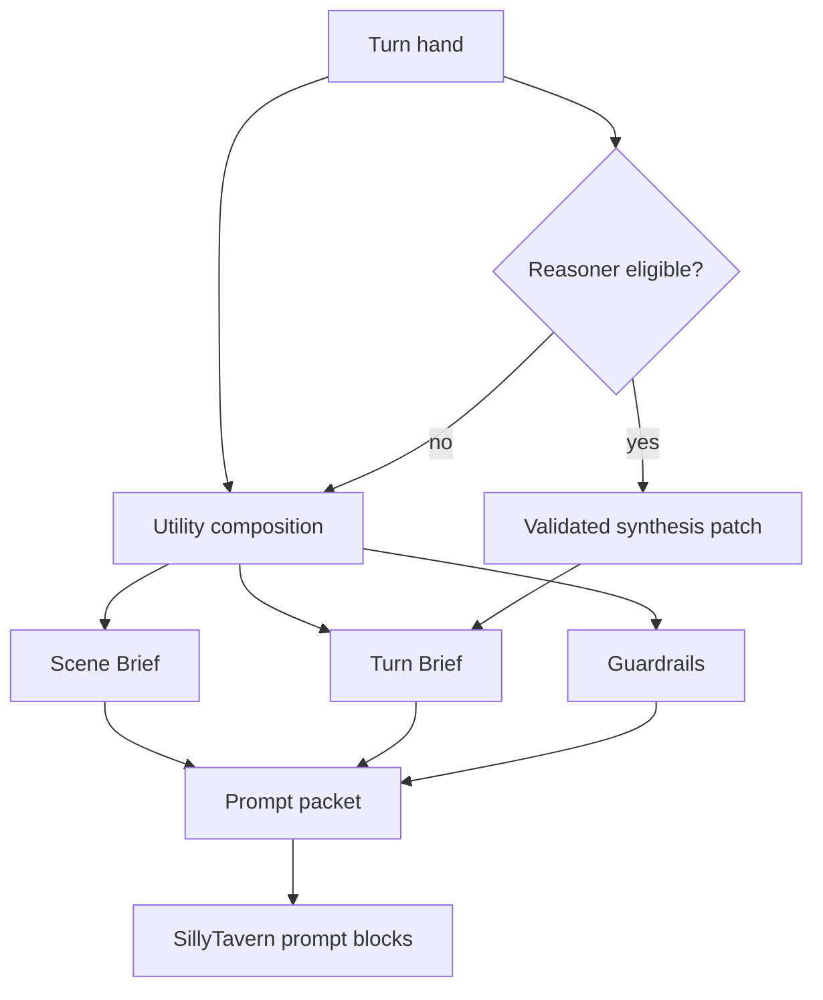
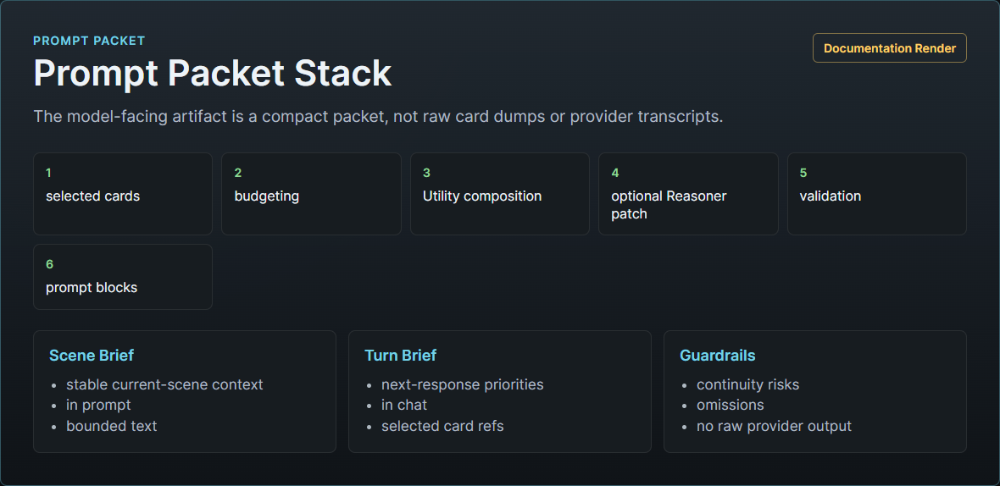
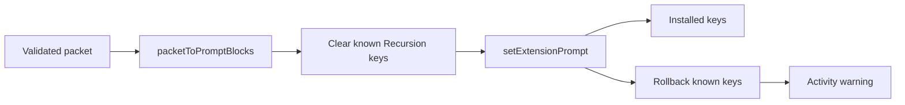
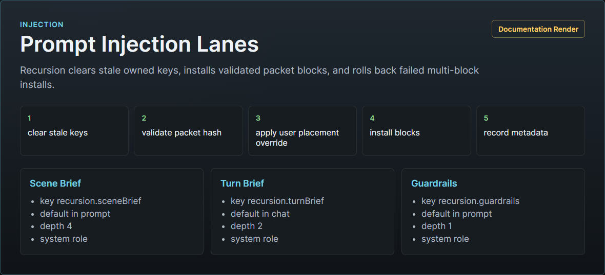

# Prompt Packet And Injection

The prompt packet is the model-facing Recursion artifact for one generation attempt. It is composed by `src/prompt.mjs`, installed by `src/hosts/sillytavern/host.mjs`, and orchestrated by `src/runtime.mjs`.

Recursion injects a composed packet, not the full raw scene deck.

## Packet Sections

| Section | Prompt key | Placement | Purpose |
| --- | --- | --- | --- |
| Scene Brief | `recursion.sceneBrief` | `in_prompt`, depth 4 | Stable current-scene frame, cast, environmental affordances, and possessions. |
| Turn Brief | `recursion.turnBrief` | `in_chat`, depth 2 | Immediate next-response guidance from the current turn hand. |
| Guardrails | `recursion.guardrails` | `in_prompt`, depth 1 | Compact constraints for continuity, player intent, privacy, and scope. |

## Composer Inputs

The composer receives:

- selected hand cards
- omitted hand candidates
- current snapshot identifiers
- frozen snapshot hash
- scene fingerprint
- turn fingerprint
- settings for footprint and Reasoner use
- section budgets
- generation router when Reasoner can run
- activity reporter for fallback events

Cards are normalized before composition. Unsafe evidence refs, unsupported families, secret-looking ids, oversized text, hidden-thought wording, and invalid omission reasons are cleaned or rejected.

## Utility Composition

Utility composition is the default path. It maps card families to sections:

- Scene Brief: Scene Frame, Active Cast, Environment/Affordances, Possessions/Items
- Guardrails: Continuity Risk, Knowledge/Secrets, plus static guardrails
- Turn Brief: Character Motivation, Dialogue/Relationship, Clocks/Consequences, Prose/Pacing, Open Threads, and other turn-facing guidance

Utility composition removes unsafe text, enforces section budgets, records source ids, and creates omission records when budget prevents inclusion.

## Reasoner Composition

Reasoner composition is optional. It runs only when settings allow it and the current footprint or Arbiter decision makes it eligible. The Reasoner receives selected cards, Utility sections, and the frozen snapshot hash, then returns `recursion.reasonerComposer.v1` with the same `snapshotHash`, an instruction patch, and source card ids.

Runtime validates the schema, echoed snapshot hash, patch text, kept ids, and dropped ids. If validation fails, if the provider fails, or if the patch cannot fit the Turn Brief budget, the packet remains Utility-composed and diagnostics record a Reasoner fallback.

Reasoner output cannot invent lore, forward plot, hidden motives, or private analysis.

## Footprint And Budgeting

The V1 footprints are `compact`, `normal`, and `rich`.

Prompt Footprint is the size/detail owner for the final composed packet. Strength may change intervention pressure and composer assertiveness inside the chosen footprint, but it must not silently enlarge the packet. The detailed policy contract lives in [Behavior Settings Policy Spec](../design/BEHAVIOR_SETTINGS_POLICY_SPEC.md).

| Footprint | Section budgets in source | Use |
| --- | --- | --- |
| Compact | small Scene Brief and Turn Brief, larger guardrail allowance | Stable scenes, crowded prompt environment, or low need. |
| Normal | balanced section caps | Default roleplay turn. |
| Rich | expanded Scene Brief and Turn Brief with bounded guardrails | High complexity or high drift risk. |

Budget order favors critical guardrails, immediate turn continuity, current user focus, scene essentials, cast and relationship posture, environment texture, prose craft, and lower-priority open threads. Omission is part of the contract.

## Omissions

Prompt diagnostics record omitted cards and reasons such as:

- `token-budget`
- `max-cards`
- `inactive`
- `budget_exceeded`
- `reasoner_dropped`
- `unspecified`

The broader architecture spec defines additional policy-level omission reasons. The implementation-facing packet path keeps the stored reasons compact and safe for UI display.

## Raw Critical Guardrail Exceptions

The architecture contract allows exact raw critical guardrail exceptions only when exact wording is required to preserve a hard continuity prohibition or safety boundary. The current implementation installs three composed sections and validates against hidden-thought and forward-plan wording. Raw exceptions should remain rare, visible in diagnostics, and bounded by Recursion-owned prompt keys.

## Injection Lanes And Cleanup

The SillyTavern adapter accepts only prompt keys starting with `recursion.` and currently installs the three V1 keys. It clears known Recursion keys before install, tracks installed keys, and rolls back known keys if a partial install fails.

Advanced user settings can override the composed packet's effective insertion lane without changing packet content:

- `injection.placement`: `default`, `in_prompt`, or `in_chat`
- `injection.role`: `system`, `user`, or `assistant`
- `injection.depth`: `default` or integer `0..10`

`default` preserves the section template shown above. Explicit overrides apply to the composed Recursion packet blocks after Utility/Reasoner composition and before host install. They are intended for model/preset compatibility, not per-card prompt engineering. Invalid or unsupported host combinations must normalize to the default safe system-role plan and emit a compact activity warning.

Power-off, extension disable, delete, and runtime teardown clear Recursion prompt keys best-effort.

## Privacy Guardrails

Prompt composition and injection must not persist or display:

- API keys or bearer tokens
- raw provider prompts or responses
- full transcripts
- hidden chain-of-thought
- private story plans
- secret motives as fact
- inspector-only notes
- raw external extension data

The viewer preview exposes prompt metadata, selected refs, omissions, injection plan, diagnostics, and hashes. It redacts sensitive keys and does not display full packet sections in broad JSON previews.
