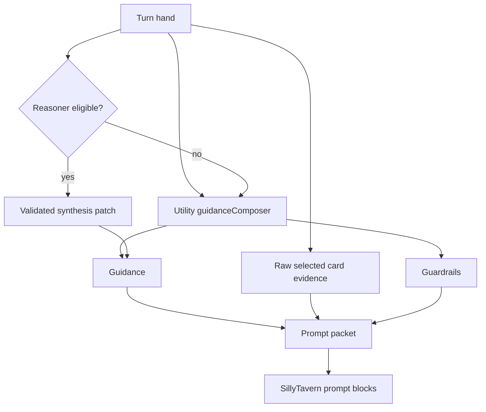
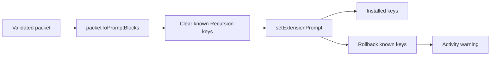

# Prompt Packet And Injection

The prompt packet is the model-facing Recursion artifact for one generation attempt. It is composed by `src/prompt.mjs`, installed by `src/hosts/sillytavern/host.mjs`, and orchestrated by `src/runtime.mjs`.

Recursion injects provider-authored guidance plus the full raw selected-card evidence for the turn hand. It does not inject the full raw scene deck.

## Packet Sections

| Section | Prompt key | Placement | Purpose |
| --- | --- | --- | --- |
| Guidance | `recursion.guidance` | `in_prompt`, depth 1 | Provider-authored direction for how selected evidence should shape native generation. |
| Card Evidence | `recursion.cardEvidence` | `in_prompt`, depth 1 | Full raw `promptText` from selected cards, grouped as evidence and preserved without semantic summarization. |
| Guardrails | `recursion.guardrails` | `in_prompt`, depth 1 | Compact global constraints for player intent, privacy, scope, and raw-evidence handling. |

```mermaid
flowchart TD
    Hand["Turn hand"] --> Utility["Utility guidanceComposer"]
    Hand --> Evidence["Raw selected card evidence"]
    Utility --> Guidance["Guidance"]
    Utility --> Guardrails["Guardrails"]
    Hand --> Reasoner{"Reasoner eligible?"}
    Reasoner -- "yes" --> Patch["Validated synthesis patch"]
    Patch --> Guidance
    Reasoner -- "no" --> Utility
    Guidance --> Packet["Prompt packet"]
    Evidence --> Packet
    Guardrails --> Packet
    Packet --> Blocks["SillyTavern prompt blocks"]
```

## Composer Inputs

The composer receives:

- selected hand cards
- omitted hand candidates
- current snapshot identifiers
- frozen snapshot hash
- scene fingerprint
- turn fingerprint
- settings for footprint and Reasoner use
- section budgets
- normalized story form from the Arbiter
- generation router for `guidanceComposer` and optional Reasoner augmentation
- activity reporter for fallback events

Cards are normalized before composition. Unsafe evidence refs, unsupported families, secret-looking ids, prose-shaped card paragraphs, hidden-thought wording, and invalid omission reasons are cleaned or rejected. Full selected-card prompt text is preserved in the Card Evidence section; packet budgeting is applied to guidance and guardrails, not by locally summarizing selected cards into a smaller semantic brief.

Source messages are preserved in full through runtime normalization, pending-user capture, provider snapshots, Segmented/Fused card serialization, and guidance composition. Redaction remains active; character limits apply to metadata and generated output fields, not individual story messages. Retention settings still select a bounded window of whole messages. The guidance composer receives the last four eligible messages in full. Revision context budgets likewise select whole messages rather than message prefixes, and revision requests retain the entire target draft.

The shared scene interpretation contract requires cards and composers to preserve completed actions and discoveries, including results at message endings, and update reactions when information, decisions, or precautions change the stakes. A mitigated risk and an unresolved cause are distinct. Prior fear is evidence of a previous reaction, not authority to freeze or escalate it; neither calm nor agreement is mandatory. Compact narrator guardrails reinforce this distinction. Prompt packet version 5 and provider contract 13 invalidate prepared work from before the conversational-premise guidance.

The same contract distinguishes a stated intention from a claim of capability or success and reassesses earlier questions when the premise changes. Selected Interpreting Intent and Open Threads cards develop that distinction; the shared instruction reaches Segmented and Fused card generation, Guidance, and optional synthesis. Narrator guardrails retain a compact reminder even without those families. Relevant unanswered questions remain uncertain, but need not block progress. Reactions remain character-dependent, and guidance leaves the player room to explain rather than inventing and rejecting their missing explanation.

For example, after a question about verifying dream contact, "I want to bring her back, even temporarily" introduces a larger objective. A response can register that ambition and ask what makes a return possible; it should not automatically repeat the contact question as though nothing changed. If verification still controls a present risk or decision, it remains relevant. Prompt-boundary tests verify delivery of this guidance, not live model compliance.

Public revision snapshots carry `analysisContractVersion: 2`, invalidating cached Generation Review and Editorial results even when a long target draft has only short supporting context.

## Utility Composition

Utility guidance composition is the default path. It calls `guidanceComposer` with the selected raw cards, omitted candidates, behavior policy, and current source metadata. The provider writes guidance about how native generation should use the evidence; runtime validates schema, source ids, hidden-reasoning language, and length before trusting it.

The composer includes the normalized story form in the provider request and in fallback guidance. When tense and POV are known, including a forced Tense & PoV override, the guidance section names the target form directly. When either field is unknown, it tells the host model to match the active chat's established story form instead of introducing a new form from card evidence. Prompt Packet metadata records the effective story form so operators can distinguish Arbiter-detected form, heuristic fallback, and user override behavior from ordinary guidance text.

Guidance is required before a prepared packet can be installed. Invalid output receives bounded correction; exhausted composition pauses preparation and stops narration. Retry reuses accepted planning and cards. Raw cards remain evidence alongside validated Guidance, never a substitute for failed composition. The native JSON schema describes all Guidance fields, and prompt-based requests include a system instruction and a concrete output template. When a nonempty string `guidanceText` object omits `schema` or `snapshotHash`, the provider boundary fills those identifiers from the frozen request and records `guidance-request-envelope` normalization. Conflicting identifiers still fail validation. The Guidance stage and prompt contract invalidate older fallback checkpoints and prepared packets.

## Reasoner Composition

Reasoner composition is optional. It runs only when settings allow it and the current footprint or Arbiter decision makes it eligible. The Reasoner receives selected cards, Utility guidance, and the frozen snapshot hash, then returns `recursion.reasonerComposer.v1` with the same `snapshotHash`, an instruction patch, and source card ids.

Runtime validates the schema, echoed snapshot hash, patch text, kept ids, and dropped ids. If validation fails, if the provider fails, or if the patch cannot fit the guidance budget, the packet keeps Utility guidance plus raw selected Card Evidence and diagnostics record a Reasoner fallback.

Reasoner output cannot invent lore, forward plot, hidden motives, or private analysis.

## Footprint And Budgeting

The V1 footprints are `compact`, `normal`, and `rich`.

Prompt Footprint is the size/detail owner for the final composed packet. Strength may change intervention pressure and composer assertiveness inside the chosen footprint, but it must not silently enlarge the packet. The detailed policy contract lives in [Behavior Settings Policy Spec](../design/BEHAVIOR_SETTINGS_POLICY_SPEC.md).

| Footprint | Section budgets in source | Use |
| --- | --- | --- |
| Compact | small Guidance, full selected Card Evidence, larger guardrail allowance | Stable scenes, crowded prompt environment, or low need. |
| Normal | balanced Guidance and Guardrail caps with full selected Card Evidence | Default roleplay turn. |
| Rich | expanded Guidance with bounded guardrails and full selected Card Evidence | High complexity or high drift risk. |

Budget order favors critical guardrails, guidance that points at immediate scene constraints and current user focus, and then lower-priority directional nuance. Omission is part of the contract, but selected card evidence is not locally rewritten into shorter scene and turn briefs.

The Card Evidence section serializes selected instruction-shaped card text verbatim, preserving line breaks under each card label. It does not rewrite cards into prose and it does not expose card labels as final-response content.

## Omissions

Prompt diagnostics record omitted cards and reasons such as:

- `token-budget`
- `max-cards`
- `inactive`
- `budget_exceeded`
- `reasoner_dropped`
- `unspecified`

The broader architecture spec defines additional policy-level omission reasons. The implementation-facing packet path keeps the stored reasons compact and safe for UI display.

## Raw Critical Guardrail Exceptions

The architecture contract allows exact raw critical guardrail exceptions only when exact wording is required to preserve a hard scene constraint or safety boundary. The current implementation already injects selected raw card evidence as a bounded evidence section, so raw exceptions should be used only for exact guardrail wording that must sit outside normal evidence. They remain rare, visible in diagnostics, and bounded by Recursion-owned prompt keys.

## Injection Lanes And Cleanup

```mermaid
flowchart LR
    Packet["Validated packet"] --> Blocks["packetToPromptBlocks"]
    Blocks --> Clear["Clear known Recursion keys"]
    Clear --> Install["setExtensionPrompt"]
    Install --> Success["Installed keys"]
    Install --> Failure["Rollback known keys"]
    Failure --> Warn["Activity warning"]
```

The SillyTavern adapter accepts only prompt keys starting with `recursion.` and currently installs the three V3 keys: `recursion.guidance`, `recursion.cardEvidence`, and `recursion.guardrails`. It clears known Recursion keys before install, tracks installed keys, and rolls back known keys if a partial install fails.

Advanced user settings control the composed packet's effective insertion lane without changing packet content. The V1 recommended defaults are `in_prompt`, `system`, and depth `1`.

- `injection.placement`: `in_prompt` or `in_chat`
- `injection.role`: `system`, `user`, or `assistant`
- `injection.depth`: integer `0..10`

These settings apply to the composed Recursion packet blocks after Utility/Reasoner composition and before host install. They are intended for model/preset compatibility, not per-card prompt engineering. Invalid or unsupported host combinations must normalize to the concrete safe system-role plan and emit a compact activity warning.

Power-off, extension disable, delete, and runtime teardown clear Recursion prompt keys best-effort.

## Privacy Guardrails

Prompt composition and injection must not persist or display:

- API keys or bearer tokens
- raw provider prompts or responses
- full transcripts
- hidden chain-of-thought
- private story plans
- secret motives as fact
- inspector-only notes
- raw external extension data

The viewer preview exposes prompt metadata, selected refs, omissions, injection plan, diagnostics, and hashes. It redacts sensitive keys and does not display full packet sections in broad JSON previews.
