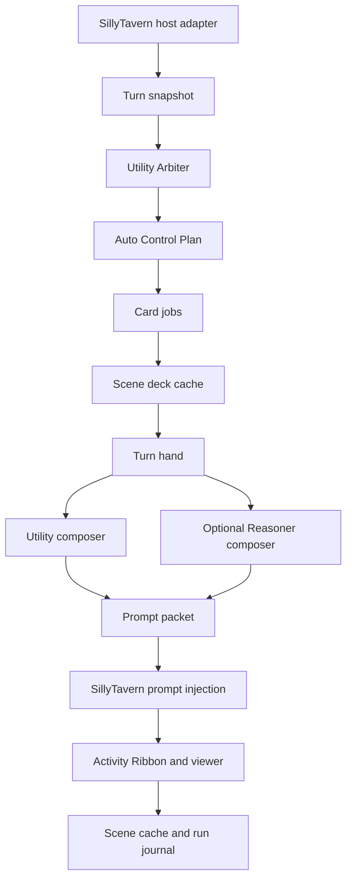

# Recursion Technical Manual

Recursion is a SillyTavern extension that compiles compact, current-scene writing guidance for the next generation. It observes the active chat, runs Utility-led structured work, maintains a disposable scene deck, selects a turn hand, composes an inspectable prompt packet, and installs Recursion-owned prompt entries only when the mode allows injection.

## Product Boundary

Recursion owns the current-scene prompt compiler. It does not own durable memory, World Info, Memory Books, Summaryception, VectFox, transcript archives, vector recall, campaign saves, branching, character databases, or user-authored card catalogs.

The V1 contract is one coherent pre-alpha shape. When a source contract changes, docs, schemas, tests, and examples should move together instead of preserving old internal data shapes.

## Runtime Pipeline



<Render Needed>: assets/documentation/renders/recursion-technical-runtime-pipeline.png - Polished runtime pipeline from SillyTavern snapshot through Utility Arbiter, scene deck, turn hand, prompt packet, injection, activity, and storage.

The runtime spine is implemented across `src/runtime.mjs`, `src/cards.mjs`, `src/prompt.mjs`, `src/providers.mjs`, `src/storage.mjs`, `src/activity.mjs`, and `src/hosts/sillytavern/host.mjs`.

## Component Ownership

| Component | Owner module | Responsibility |
| --- | --- | --- |
| Core helpers | `src/core.mjs` | Stable hashing, safe ids, truncation, JSON parsing, cloning, timestamps, and redaction. |
| Settings | `src/settings.mjs` | Mode, strength, footprint, focus, Reasoner use, provider preferences, and session-only API key handling. |
| Activity | `src/activity.mjs` | Sanitized user-facing activity events for the bar, ribbon, viewer, and diagnostics. |
| Providers | `src/providers.mjs` | Utility and Reasoner lane routing, host and OpenAI-compatible calls, JSON parsing, retries, timeouts, aborts, and model-call diagnostics. |
| Cards | `src/cards.mjs` | Fixed V1 catalog, card normalization, provider-result conversion, lifecycle application, and hand selection. |
| Prompt | `src/prompt.mjs` | Packet sections, budgets, omissions, Reasoner merge, validation, and prompt block conversion. |
| Storage | `src/storage.mjs` | Logical scene-cache and run-journal records, key safety, redaction, index maintenance, and bounded retention. |
| Runtime | `src/runtime.mjs` | Off/Observe only/Auto orchestration, snapshot use, Utility Arbiter plan handling, cache updates, prompt install/clear flow, settings/provider actions, and view model data. |
| UI | `src/ui.mjs` | Recursion Bar, Activity Ribbon, Actions, Last Hand, Full Viewer, settings, and provider controls. |
| SillyTavern host | `src/hosts/sillytavern/host.mjs` | Snapshot capture, prompt install/clear, provider bridge, settings store, and user-file storage adapter selection. |
| Entrypoint | `src/extension/index.js` | Extension lifecycle hooks, runtime bootstrap, UI mount, generation interceptor, and teardown cleanup. |

## Mode Behavior

Off mode clears or avoids Recursion prompt entries and does not inspect chat for prompt compilation.

Observe only mode captures the current turn, runs safe runtime work, composes a preview packet, updates diagnostics, and clears Recursion prompt entries instead of injecting.

Auto mode runs the full pipeline and installs validated prompt blocks through Recursion-owned SillyTavern prompt keys when the Utility Arbiter or local fallback path produces useful guidance.

Settings and provider changes supersede the active run, abort stale provider work where possible, and await prompt cleanup before their operation results resolve. `updateSettings` returns updated settings plus the prompt-clear result; `updateProvider` and `clearProviderKey` return updated provider settings plus the prompt-clear result. Clear failure leaves the setting or provider change applied, returns `ok: false`, and surfaces the sanitized prompt-clear warning.

## Provider Lanes

Recursion has two provider lanes:

| Lane | Role |
| --- | --- |
| Utility | Required default lane for Arbiter planning, card work, provider tests, and normal prompt composition support. |
| Reasoner | Optional composer lane for rich, crowded, conflicted, or subtle hands. Utility remains the fallback. |

Each lane can use the current host model, a host connection profile when the host supports it, or an OpenAI-compatible endpoint. Direct endpoint API keys live only in the session secret store and are never persisted.

## Card And Hand System

The fixed V1 card catalog is Scene Frame, Active Cast, Character Motivation, Dialogue/Relationship, Continuity Risk, Environment/Items, Prose/Pacing, and Open Threads.

Cards are disposable scene-local cache artifacts. The scene deck stores active, stowed, stale, and discarded records for one scene. The turn hand is rebuilt for each composition event from active cards under max-card and token caps. A valid card can stay in the deck without entering the hand.

Character Motivation cards are behavior-facing. They can describe visible pressure, established goals, and likely posture, but they cannot inject private internal-thought dumps or hidden motives as fact.

## Prompt Packet

The model-facing artifact is the prompt packet, not the raw scene deck. V1 packets contain:

| Section | Use |
| --- | --- |
| Scene Brief | Stable current-scene frame, cast, relationship posture, and grounding details while the scene remains valid. |
| Turn Brief | Immediate next-generation guidance, latest visible user pressure, continuity risks, and response cues. |
| Guardrails | Compact constraints that protect continuity, player intent, privacy, and scope. |

Prompt packets include selected-card references, omissions, injection metadata, diagnostics, section hashes, and composition lane status. Full prompt sections are hidden from the viewer preview by default to avoid accidental raw prompt exposure in broad diagnostics.

## Storage And Diagnostics

Settings stay in `extension_settings.recursion`. Larger records use logical JSON keys owned by the storage repository:

- `recursion-system-index.v1.json`
- `recursion-scene-{chatKey}-{sceneKey}.v1.json`
- `recursion-run-journal-{chatKey}.v1.json`

Diagnostics are bounded and sanitized. Normal records may include hashes, ids, card families, statuses, token estimates, provider lane labels, durations, and compact errors. They must not include API keys, raw provider prompts, raw provider responses, full transcripts, hidden reasoning, private story plans, or unbounded local paths.

<Render Needed>: assets/documentation/renders/recursion-diagnostics-boundary.png - Diagnostic boundary visual showing settings, scene cache, run journal, activity, artifacts, redaction, and forbidden raw provider data.

## Host Adapter

SillyTavern is the active V1 host. The adapter reads the active context, maps messages into host-neutral snapshots, installs prompt blocks with `setExtensionPrompt`, clears Recursion prompt keys, bridges host generation APIs, and stores Recursion records through SillyTavern user files when available.

Additional host integrations are reserved behind the adapter boundary and are not active V1 integrations.

## UI Observability

The Recursion Bar shows mode, ready/working state, hand count, composer lane, Reasoner state, and top-level actions. The Activity Ribbon shows user-safe stages such as reading the turn, planning card work, generating cards, selecting the hand, installing prompt entries, storage warnings, and ready or fallback states. The Full Viewer exposes Now, Deck, Activity, Prompt Packet metadata, Settings, and Providers.

The UI is an observatory, not a card editor. It shows what Recursion did without turning the card system into a user-managed memory product.

## Fail-Soft Invariants

- Provider failure degrades Recursion, not the chat.
- Invalid Utility Arbiter output falls back to conservative local behavior.
- Invalid card output omits only that card.
- Reasoner failure falls back to Utility composition.
- Prompt composition over budget trims by priority and records omissions.
- Prompt install failure records a warning and generation continues without Recursion.
- Storage failure keeps in-memory work for the current turn when possible and reports a warning.
- Stale async results cannot mutate the active cache or prompt packet.
- Prompt install is replace-or-clear from Recursion's perspective.

## Testing Evidence

The maintained local gate is:

```powershell
npm.cmd test
node tools\scripts\run-alpha-gate.mjs
```

The testing strategy covers deterministic contracts for settings, storage, provider routing, structured parsing, cards, prompt composition, prompt injection metadata, activity normalization, fake host behavior, Playwright readiness, dedicated soak-user checks, and guarded live smoke.

Live smoke is opt-in and must use dedicated `recursion-soak-*` users. Automated mutation through `default-user` is rejected.

## Non-Goals

Recursion V1 excludes durable memory, lore authority, vector recall, transcript summarization, campaign saves, branching, character database extraction, user-defined card families, per-card editing workflows, raw provider logs, hidden chain-of-thought storage, and broad plot planning.
