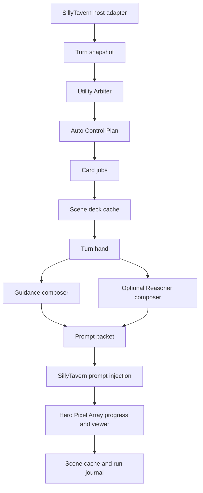
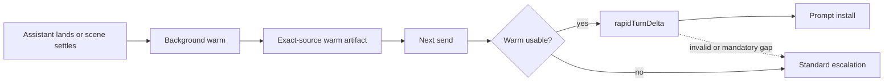
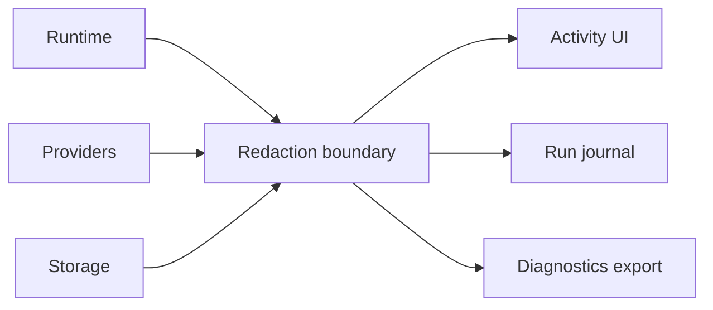

# Recursion Technical Manual

Recursion is a SillyTavern extension that compiles compact, current-scene reasoning guidance for the next generation. It observes the active chat, runs Utility-led structured work, maintains a disposable scene deck, selects a turn hand, composes an inspectable prompt packet, and installs Recursion-owned prompt entries only when the mode allows injection.

## Product Boundary

Recursion owns the current-scene prompt compiler. It does not own continuity-extension duties, durable memory, World Info, Memory Books, Summaryception, VectFox, transcript archives, vector recall, campaign saves, branching, character databases, or user-authored card catalogs.

The V1 contract is one coherent pre-alpha shape. When a source contract changes, docs, schemas, tests, and examples should move together instead of preserving old internal data shapes.

## Runtime Pipeline



The runtime spine is implemented across `src/runtime.mjs`, `src/settings-policy.mjs`, `src/cards.mjs`, `src/card-scope.mjs`, `src/progress.mjs`, `src/prompt.mjs`, `src/providers.mjs`, `src/storage.mjs`, `src/activity.mjs`, and `src/hosts/sillytavern/host.mjs`.

Pipeline selection is controlled by `settings.pipelineMode` and is independent from Auto/Manual mode. `standard` is the default normalized value. `rapid` and `fused` are accepted alternate values, but invalid pipeline names normalize back to Standard.

Standard is the reference foreground implementation. It captures the turn, calls the Utility Arbiter, runs provider or cache card work, selects the hand, composes through Utility or Reasoner, validates the packet, installs Recursion-owned prompt keys, and records sanitized activity and journal evidence before generation continues.


Rapid changes when provider work happens, not who authors the guidance. `warmRapidScene()` runs only when Recursion is enabled and `pipelineMode` is `rapid`; it captures an exact source revision, builds a provider-generated warm card packet, and stores `variant.rapid` metadata without installing prompt text. On the foreground send path, Rapid uses `rapidTurnDelta` when the warm artifact matches the active source and contract hashes. If no usable warm artifact exists, Rapid continues through Standard for that same pending user message. Rapid foreground Utility calls may hedge, and invalid Rapid output, mandatory missing cards, or provider-declared Standard escalation also continue through Standard.

Fused changes only the foreground card-generation stage. It keeps the Standard Arbiter, scope, Manual forced-card reconciliation, deck, hand, guidance, packet, and install stages, but sends all requested card families as one `fusedCardBundle` model call. Runtime accepts valid requested siblings, rejects unrequested or duplicate cards, repairs damaged or missing requested siblings with individual Standard card calls, and uses full Standard fallback only when the bundle yields no trustworthy card. Fused still obeys Reasoning Level: Low/Medium use Utility, while High/Ultra use Reasoner when healthy and fall back to Utility if not.

Fused is designed for stronger reasoning models such as recent DeepSeek, GLM, MiniMax, Kimi, MiMo, Qwen, and similar. Standard is usually the better pipeline for fast, cheaper utility-class models such as 500B-and-lower models, Nemotron, GPT-OSS, Gemma, and similar.



Rapid must not gain speed by using local fallback cards, local scene briefs, local turn briefs, summary fast-start packs, or timeout-based quality cuts. Its latency win comes from background provider warm work, exact-source cache reuse, a small foreground Utility delta, and optional hedged Rapid Utility calls.

## Component Ownership

| Component | Owner module | Responsibility |
| --- | --- | --- |
| Core helpers | `src/core.mjs` | Stable hashing, safe ids, truncation, JSON parsing, cloning, timestamps, and redaction. |
| Settings | `src/settings.mjs` | Mode, Standard/Rapid/Fused pipeline mode, Reasoning Level, strength, footprint, focus, provider preferences, injection settings, retention caps, UI limits, and session-only API key handling. |
| Retention policy | `src/retention-policy.mjs` | User-facing cap defaults, ranges, settings normalization, and bounded source-window selection. |
| Behavior policy | `src/settings-policy.mjs` | Source-backed Strength, Min/Max Cards, Focus, Prompt Footprint, policy prompt lines, effective footprint, and diagnostics summaries. |
| Activity | `src/activity.mjs` | Sanitized user-facing activity events for the bar, progress menu, viewer, and diagnostics. |
| Progress model | `src/progress.mjs` | Hero Pixel Array blocks, progress-menu rows, nested card/model-call status, and compact current-step text. |
| Providers | `src/providers.mjs` | Utility and Reasoner lane routing, host-current-model, host-connection-profile, OpenAI-compatible calls, model discovery, JSON parsing, retries, timeouts, aborts, and model-call diagnostics. |
| Cards | `src/cards.mjs` | Fixed V1 catalog, card normalization, provider-result conversion, lifecycle application, and hand selection. |
| Card scope | `src/card-scope.mjs` | Fixed family/sub-item scope catalog, Auto focus payloads, Manual whitelist enforcement helpers, and safe scope summaries. |
| Prompt | `src/prompt.mjs` | Guidance, card evidence, guardrail sections, budgets, omissions, Reasoner merge, validation, and prompt block conversion. |
| Storage | `src/storage.mjs` | Logical scene-cache and run-journal records, key safety, redaction, index maintenance, and bounded retention. |
| Runtime | `src/runtime.mjs` | Power toggle, Auto/Manual orchestration, Standard/Rapid/Fused pipeline orchestration, snapshot use, Utility Arbiter plan handling, card-scope enforcement, cache updates, prompt install/clear flow, settings/provider actions, and view model data. |
| UI | `src/ui.mjs` | Recursion Bar, Hero Pixel Array progress menu, options/settings, Last Brief, Full Viewer, settings, and provider controls. |
| SillyTavern host | `src/hosts/sillytavern/host.mjs` | Snapshot capture, prompt install/clear, provider bridge, settings store, and user-file storage adapter selection. |
| Entrypoint | `src/extension/index.js` | Extension lifecycle hooks, runtime bootstrap, UI mount, generation interceptor, and teardown cleanup. |

## Mode Behavior

Power-off clears or avoids Recursion prompt entries and does not inspect chat for prompt compilation.

Manual captures the current turn and follows the selected prompt-install pipeline, but it constrains card generation and cached-card reuse to the selected card families. Disabled families are omitted before provider card jobs run and filtered again before deck and hand selection.

Auto mode runs the selected pipeline and installs validated prompt blocks through Recursion-owned SillyTavern prompt keys when the selected path produces useful guidance. User-selected card families and sub-items are preferred in Auto, but the Utility Arbiter still sees the full fixed catalog in Standard and can request unselected families when they have high relevance to scene constraints, scene coherence, or the current user message.

Settings and provider changes supersede the active run, abort stale provider work where possible, and await prompt cleanup before their operation results resolve. `updateSettings` returns updated settings plus the prompt-clear result; `updateProvider` and `clearProviderKey` return updated provider settings plus the prompt-clear result. Clear failure leaves the setting or provider change applied, returns `ok: false`, and surfaces the sanitized prompt-clear warning.

## Provider Lanes

Recursion has two provider lanes:

| Lane | Role |
| --- | --- |
| Utility | Required default lane for Arbiter planning, card work, provider tests, guidance composition, and fail-soft guidance support. |
| Reasoner | Optional composer lane for rich, crowded, conflicted, or subtle hands. Utility remains the fallback. |

Each lane can use the current host model, a host connection profile when the host supports it, or an OpenAI-compatible endpoint. Direct endpoint API keys live only in the session secret store and are never persisted. OpenAI-compatible model discovery is read-only against `/models`; it may use the session key but does not save secrets, write journals, clear prompts, or invalidate scene cache.

Reasoning Level is the operator-facing lane-depth control. Low is Utility-only, Medium uses Reasoner for guidance composition when healthy, High adds Reasoner for Arbiter and priority card families, and Ultra is Reasoner-heavy when healthy. Disabled, untested, unhealthy, missing-profile, or missing-key Reasoner routes fall back to Utility without blocking normal chat generation.

## Card And Hand System

The fixed V1 card catalog is Scene Frame, Active Cast, Character Motivation, Relationship, Social Subtext, Scene Constraints, Knowledge, Consequences, Environment, Items, and Open Threads.

Cards are disposable scene-local cache artifacts. The scene deck stores active, stowed, stale, and discarded records for one scene. The turn hand is rebuilt for each composition event from active cards under max-card and token caps. A valid card can stay in the deck without entering the hand.

Scene caches are source-revision aware. Runtime hashes the visible message source, including active SillyTavern swipe metadata, and stores up to four source variants inside a scene cache. Cached cards are reusable only from the exact active source variant when variants exist, so swiping from A to B cannot leak B cards when the user swipes back to A.

Cards expand scene implications rather than preserve facts for their own sake. For example, a location card should derive routes, sightlines, plausible interruptions, usable local details, and relevance boundaries from the active location instead of restating the place name or dumping broad setting lore.

Character Motivation cards are behavior-facing. They can describe visible pressure, established goals, and likely posture, but they cannot inject private internal-thought dumps or hidden motives as fact.

## Prompt Packet

The model-facing artifact is the prompt packet, not the raw scene deck. V3 packets contain:

| Section | Use |
| --- | --- |
| Guidance | Provider-authored direction for using selected evidence in the next generation. |
| Card Evidence | Full raw selected card `promptText`, grouped as evidence and preserved without local semantic summarization. |
| Guardrails | Compact constraints that protect scene plausibility, player intent, privacy, and scope. |

Prompt packets include selected-card references, omissions, injection metadata, diagnostics, section hashes, and composition lane status. The Last Brief Prompt Packet panel and Full Viewer show the final injected packet text with bounded redaction so users can inspect what Recursion actually installed.

## Storage And Diagnostics

Settings stay in `extension_settings.recursion`. Larger records use logical JSON keys owned by the storage repository:

- `recursion-system-index.v1.json`
- `recursion-scene-{chatKey}-{sceneKey}.v1.json`
- `recursion-run-journal-{chatKey}.v1.json`

Diagnostics are bounded and sanitized. Normal records may include hashes, ids, card families, statuses, token estimates, provider lane labels, durations, and compact errors. They must not include API keys, raw provider prompts, raw provider responses, full transcripts, hidden reasoning, private story plans, or unbounded local paths.

Retention caps are local Recursion tuning controls. Source Messages and Source Text Budget bound the visible source window by walking backward from the latest visible chat message; Provider Messages bounds provider-safe snapshots; Scene Caches / Chat and Scene Caches Total prune only unprotected Recursion scene-cache files; Swipe Variants / Scene bounds active-source variants; Journal Entries bounds sanitized run journals. These caps do not delete, hide, summarize, or rewrite SillyTavern chat history.



## Host Adapter

SillyTavern is the active V1 host. The adapter reads the active context, maps messages into host-neutral snapshots, installs prompt blocks with `setExtensionPrompt`, clears Recursion prompt keys, bridges host generation APIs, and stores Recursion records through SillyTavern user files when available.

Additional host integrations are reserved behind the adapter boundary and are not active V1 integrations.

## UI Observability

The Recursion Bar shows the wordmark, power toggle, icon-only mode, Cards scope button, Hero Pixel Array, current-step text, Reasoning Level chain, Last Brief dropdown arrow, and options entry. The progress menu shows user-safe stages such as reading the turn, planning card work, generating cards, selecting the hand, installing prompt entries, storage warnings, and ready or fallback states. The Full Viewer exposes Now, Deck, Activity, Prompt Packet, Settings, and Providers.

The Last Brief and Full Viewer are observatories, while the Cards surface is the bounded deck editor. Together they expose deck configuration, authored cards, generated scene evidence, selected hand contents, and omissions without turning the card system into a user-managed memory product.

## Fail-Soft Invariants

- Provider failure degrades Recursion, not the chat.
- Invalid Utility Arbiter output falls back to conservative local behavior.
- Invalid card output omits only that card.
- Reasoner failure falls back to Utility guidance plus raw selected Card Evidence.
- Prompt composition over budget trims by priority and records omissions.
- Prompt install failure records a warning and generation continues without Recursion.
- Storage failure keeps in-memory work for the current turn when possible and reports a warning.
- Stale async results cannot mutate the active cache or prompt packet.
- Swipe changes are prompt-safe source changes: Recursion clears stale prompts immediately and reuses cached cards only when the active source revision matches.
- Prompt install is replace-or-clear from Recursion's perspective.
- Player Stop / host generation stop aborts active Recursion work, clears owned prompt keys, marks any canceled cache stale, and reports skipped progress instead of warning/failure.

## Testing Evidence

The maintained local gate is:

```powershell
npm.cmd test
node tools\scripts\run-alpha-gate.mjs
```

The testing strategy covers deterministic contracts for settings, storage, provider routing, structured parsing, cards, prompt composition, prompt injection metadata, activity normalization, fake host behavior, Playwright readiness, dedicated soak-user checks, and guarded live smoke.

Live smoke is opt-in and must use dedicated `recursion-soak-*` users. Automated mutation through `default-user` is rejected.

## Non-Goals

Recursion V1 excludes continuity-extension ownership, durable memory, lore authority, vector recall, transcript summarization, campaign saves, branching, character database extraction, user-defined card families, per-card editing workflows, raw provider logs, hidden chain-of-thought storage, and broad plot planning.
