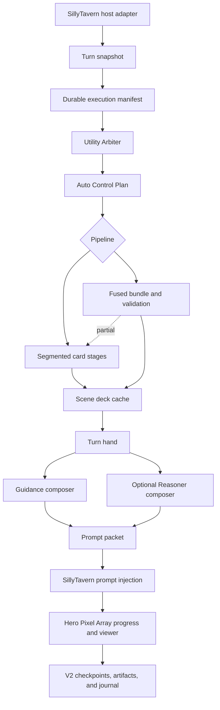
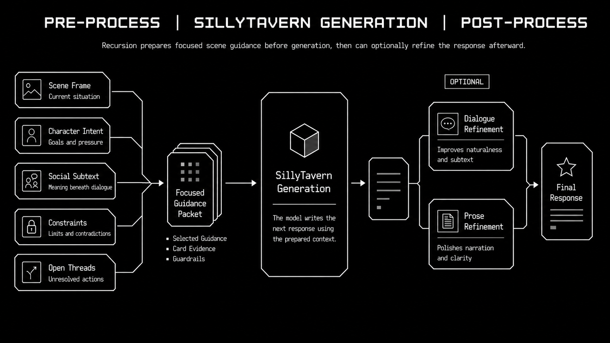
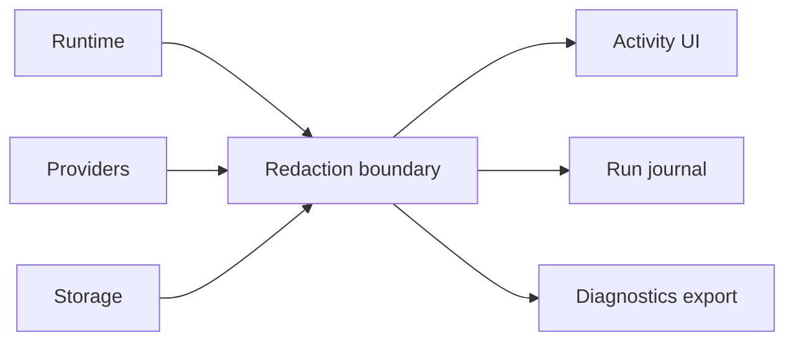

# Recursion Technical Manual

Recursion is a SillyTavern extension that compiles compact, current-turn reasoning guidance for native host generation. It observes a bounded band of the active chat, runs Utility-led structured work, builds a disposable turn deck, selects a turn hand, composes an inspectable prompt packet, and installs Recursion-owned prompt entries only when the mode allows injection.

## Product Boundary

Recursion owns the current-scene prompt compiler. It does not own continuity-extension duties, durable memory, World Info, Memory Books, Summaryception, VectFox, transcript archives, vector recall, campaign saves, branching, character databases, or user-authored card catalogs.

The V1 contract is one coherent pre-alpha shape. When a source contract changes, docs, schemas, tests, and examples should move together instead of preserving old internal data shapes.

## Runtime Pipeline


```mermaid
flowchart TD
    Host["SillyTavern host adapter"] --> Snapshot["Turn snapshot"]
    Snapshot --> Manifest["Durable execution manifest"]
    Manifest --> Arbiter["Utility Arbiter"]
    Arbiter --> Plan["Auto Control Plan"]
    Plan --> Jobs{"Pipeline"}
    Jobs --> Segmented["Segmented card stages"]
    Jobs --> Fused["Fused bundle and validation"]
    Fused -. "partial" .-> Segmented
    Segmented --> Deck["Scene deck cache"]
    Fused --> Deck
    Deck --> Hand["Turn hand"]
    Hand --> Composer["Guidance composer"]
    Hand --> Reasoner["Optional Reasoner composer"]
    Composer --> Packet["Prompt packet"]
    Reasoner --> Packet
    Packet --> Inject["SillyTavern prompt injection"]
    Inject --> Activity["Hero Pixel Array progress and viewer"]
    Activity --> Storage["V2 checkpoints, artifacts, and journal"]
```

The runtime spine is implemented across `src/runtime.mjs`, `src/execution-contracts.mjs`, `src/execution-scheduler.mjs`, `src/settings-policy.mjs`, `src/cards.mjs`, `src/card-scope.mjs`, `src/progress.mjs`, `src/prompt.mjs`, `src/providers.mjs`, `src/storage.mjs`, `src/activity.mjs`, and `src/hosts/sillytavern/host.mjs`.

Pipeline selection is controlled by `settings.pipelineMode` and is independent from Auto/Manual mode. `segmented` is the default normalized value and `fused` is the other V1 value. Invalid pipeline names normalize to Segmented.

Segmented is the reference foreground implementation. It captures the turn, calls the Utility Arbiter, runs each requested card family through a separate narrow stage, selects the hand, composes through Utility or Reasoner, validates the packet, installs Recursion-owned prompt keys, and records sanitized activity and journal evidence before generation continues. Its small per-call contracts are suitable for smaller and locally hosted models.


```mermaid
flowchart LR
    Send["User send"] --> Snapshot["Snapshot"]
    Snapshot --> Arbiter["Utility Arbiter"]
    Arbiter --> Cards["Segmented card stages"]
    Cards --> Hand["Hand"]
    Hand --> Compose["Compose and validate"]
    Compose --> Install["Prompt install"]
    Install --> Continue["Host generation"]
```

Fused changes only the foreground card-generation stage. It keeps the Segmented Arbiter, scope, Manual forced-card reconciliation, deck, hand, guidance, packet, and install stages, but sends all requested card families as one `fusedCardBundle` model call. Runtime accepts valid requested siblings, rejects unrequested or duplicate cards, repairs damaged or missing requested siblings with individual Segmented card calls, and uses full Segmented fallback only when the bundle yields no useful cards. Fused still obeys Reasoning Level: Low/Medium use Utility, while High/Ultra use configured Ready or Untested Reasoner and fall back to Utility only when that lane is unconfigured, unhealthy, or fails.

Fused is designed for stronger reasoning models such as recent DeepSeek, GLM, MiniMax, Kimi, MiMo, Qwen, and similar. Segmented is usually the better pipeline for smaller, simpler, or less reliable structured-output models.

Every Pre-process and Post-process run is represented as a durable stage graph. Accepted stage outputs are stored as hash-addressed artifacts before the manifest advances. Recursion sets no default generation timeout: a model call may wait indefinitely until it returns, fails, or the user stops it. `Attempts per step` supplies a bounded one-to-five total attempt window for model stages only, with a default of two. SillyTavern's primary story generation is never automatically retried by Recursion.

Stop aborts the active call, requests native host Stop, and pauses the operation without discarding accepted checkpoints. Resume requests the matching native host action and continues only when the interceptor returns. Retry Stage discards the current stage output and resets only that stage's attempt window. Reprocess from here on the next swipe invalidates the selected stage and dependent stages when consumed. Full Rebuild bypasses all reusable Pre-process work for one matching swipe.

## Component Ownership

| Component | Owner module | Responsibility |
| --- | --- | --- |
| Core helpers | `src/core.mjs` | Stable hashing, safe ids, truncation, JSON parsing, cloning, timestamps, and redaction. |
| Execution contracts | `src/execution-contracts.mjs` | Durable operation, stage, artifact, queued-intent, failure, and lifecycle contracts. |
| Execution scheduler | `src/execution-scheduler.mjs` | Checkpoint-aware stage traversal, attempt windows, stop/pause/resume/retry, stale guards, and queued invalidation. |
| Settings | `src/settings.mjs` | Mode, Segmented/Fused pipeline mode, attempts per step, Reasoning Level, strength, footprint, focus, provider preferences, injection settings, retention caps, UI limits, and session-only API key handling. |
| Retention policy | `src/retention-policy.mjs` | User-facing cap defaults, ranges, settings normalization, and bounded source-window selection. |
| Behavior policy | `src/settings-policy.mjs` | Source-backed Strength, Min/Max Cards, Focus, Prompt Footprint, policy prompt lines, effective footprint, and diagnostics summaries. |
| Activity | `src/activity.mjs` | Sanitized user-facing activity events for the bar, progress menu, viewer, and diagnostics. |
| Progress model | `src/progress.mjs` | Hero Pixel Array blocks, progress-menu rows, nested card/model-call status, and compact current-step text. |
| Providers | `src/providers.mjs` | Utility and Reasoner lane routing, host-current-model, host-connection-profile, OpenAI-compatible calls, model discovery, JSON parsing, bounded stage attempts, aborts, and model-call diagnostics. |
| Cards | `src/cards.mjs` | Fixed V1 catalog, card normalization, provider-result conversion, lifecycle application, and hand selection. |
| Card scope | `src/card-scope.mjs` | Fixed family/sub-item scope catalog, Auto focus payloads, Manual whitelist enforcement helpers, and safe scope summaries. |
| Prompt | `src/prompt.mjs` | Guidance, card evidence, guardrail sections, budgets, omissions, Reasoner merge, validation, and prompt block conversion. |
| Storage | `src/storage.mjs` | V2 execution manifests and artifacts, queued next-swipe intents, run journals, key safety, redaction, repair, and bounded retention. |
| Runtime | `src/runtime.mjs` | Power toggle, Auto/Manual orchestration, Segmented/Fused execution, snapshot use, Utility Arbiter plan handling, card-scope enforcement, cache updates, prompt install/clear flow, settings/provider actions, and view model data. |
| UI | `src/ui.mjs` | Recursion Bar, Hero Pixel Array progress menu, options/settings, Last Brief, Full Viewer, settings, and provider controls. |
| SillyTavern host | `src/hosts/sillytavern/host.mjs` | Snapshot capture, prompt install/clear, provider bridge, settings store, and user-file storage adapter selection. |
| Entrypoint | `src/extension/index.js` | Extension lifecycle hooks, runtime bootstrap, UI mount, generation interceptor, and teardown cleanup. |

## Mode Behavior

Power-off clears or avoids Recursion prompt entries and does not inspect chat for prompt compilation.

Manual captures the current turn and follows the selected prompt-install pipeline, but it constrains card generation and cached-card reuse to the selected card families. Disabled families are omitted before provider card jobs run and filtered again before deck and hand selection.

Auto mode runs the selected pipeline and installs validated prompt blocks through Recursion-owned SillyTavern prompt keys when the selected path produces useful guidance. User-selected card families and sub-items are preferred in Auto, but the Utility Arbiter still sees the full fixed catalog in Segmented and can request unselected families when they have high relevance to scene constraints, scene coherence, or the current user message.

Settings and provider changes supersede the active run, abort stale provider work where possible, and await prompt cleanup before their operation results resolve. `updateSettings` returns updated settings plus the prompt-clear result; `updateProvider` and `clearProviderKey` return updated provider settings plus the prompt-clear result. Clear failure leaves the setting or provider change applied, returns `ok: false`, and surfaces the sanitized prompt-clear warning.

## Provider Lanes

Recursion has two provider lanes:

| Lane | Role |
| --- | --- |
| Utility | Required default lane for Arbiter planning, card work, provider tests, guidance composition, and fail-soft guidance support. |
| Reasoner | Optional composer lane for rich, crowded, conflicted, or subtle hands. Utility remains the fallback. |

Each lane can use the current host model, a host connection profile when the host supports it, or an OpenAI-compatible endpoint. Direct endpoint API keys live only in the session secret store and are never persisted. OpenAI-compatible model discovery is read-only against `/models`; it may use the session key but does not save secrets, write journals, clear prompts, or invalidate active-turn work.

Reasoning Level is the operator-facing lane-depth control. Low is Utility-only, Medium uses configured Ready or Untested Reasoner for guidance composition, High adds that Reasoner lane for Arbiter and priority card families, and Ultra is Reasoner-heavy. Untested is caution-only and remains routable. Unconfigured or unhealthy Reasoner routes fall back to Utility without blocking normal chat generation. Post-process guidance stays on the selected lane for its operation and fails soft when that lane is unavailable or its routed call fails.

## Card And Hand System

The fixed V1 card catalog is Scene Frame, Active Cast, Character Motivation, Relationship, Social Subtext, Scene Constraints, Knowledge, Consequences, Environment, Items, and Open Threads.

Cards are disposable scene-local cache artifacts. The scene deck stores active, stowed, stale, and discarded records for one scene. The turn hand is rebuilt for each composition event from active cards under max-card and token caps. A valid card can stay in the deck without entering the hand.

Every Pre-process operation is source-revision aware. Runtime hashes the exact bounded visible source, including latest user identity and relevant selected-swipe metadata, into a turn key. A new user message always builds fresh work. An unchanged swipe may reinstall the completed packet without model calls only when every turn, settings, provider, pipeline, dependency, and artifact binding still matches. An edit or selected-swipe change inside the bounded band rejects incompatible reuse.

Cards expand scene implications rather than preserve facts for their own sake. For example, a location card should derive routes, sightlines, plausible interruptions, usable local details, and relevance boundaries from the active location instead of restating the place name or dumping broad setting lore.

Character Motivation cards are behavior-facing. They can describe visible pressure, established goals, and likely posture, but they cannot inject private internal-thought dumps or hidden motives as fact.

## Prompt Packet

The model-facing artifact is the prompt packet, not the raw scene deck. V3 packets contain:

| Section | Use |
| --- | --- |
| Guidance | Provider-authored direction for using selected evidence in native generation. |
| Card Evidence | Full raw selected card `promptText`, grouped as evidence and preserved without local semantic summarization. |
| Guardrails | Compact constraints that protect scene plausibility, player intent, privacy, and scope. |

Prompt packets include selected-card references, omissions, injection metadata, diagnostics, section hashes, and composition lane status. The Last Brief Prompt Packet panel and Full Viewer show the final injected packet text with bounded redaction so users can inspect what Recursion actually installed.

## Pre-process And Post-process Boundaries

Pre-process Cards are the scene-evidence deck used before the host writes a response. Post-process Cards are an independent ordered deck evaluated only after an assistant response lands. Post-process guidance is structured provider output; SillyTavern's native quiet-generation path is the only prose writer. Unified performs one guidance synthesis and one host rewrite for all enabled categories. Progressive rewrites category-by-category while carrying the latest valid draft forward. As Swipe appends the result as a selected swipe; Replace updates the selected response in place only after a complete successful run.



Post-process freezes the source response, bounded visible evidence, Pre-process packet, active Post-process deck, and operation settings before provider work. Guidance uses one sticky provider lane. Guidance and native rewrite drafts are checkpointed, and the host-commit stage uses an idempotent receipt so Resume cannot duplicate a swipe or replacement. Failed or stale work never commits a response mutation, and one sanitized Post-process marker records a successful settlement.

## Storage And Diagnostics

Settings stay in `extension_settings.recursion`. Larger records use logical JSON keys owned by the storage repository:

- `recursion-system-index.v1.json`
- `recursion-scene-{chatKey}-{sceneKey}.v1.json`
- `recursion-run-journal-{chatKey}.v1.json`
- `recursion-execution-{chatKey}-{operationId}.v1.json`
- `recursion-execution-artifact-{chatKey}-{artifactId}.v1.json`
- `recursion-execution-intent-{chatKey}.v1.json`

Execution manifests contain stage metadata and artifact references, never artifact bodies. Artifact files may contain the minimum source or model output needed to resume an active operation, remain local to the chat, and are removed when terminal retention no longer requires them. Completed Pre-process runs keep only reusable checkpoint references. Completed Post-process runs keep only the final accepted rewrite and host-commit receipt. Stale runs retain bounded metadata but no artifacts; abandoned runs are fully pruned.

Diagnostics are bounded and sanitized. Normal records may include hashes, ids, card families, operation/stage states, attempt numbers, token estimates, provider lane labels, durations, artifact byte counts, lifecycle codes, and compact errors. They must not include API keys, raw provider prompts, raw provider responses, artifact bodies, full transcripts, hidden reasoning, private story plans, or unbounded local paths. Explicit diagnostic excerpts remain opt-in and bounded.

Context Windows and Storage Retention are local Recursion tuning controls. Source Freshness Messages and Source Freshness Text Budget bound the visible source window by walking backward from the latest visible chat message; Provider Analysis Messages bounds provider-safe snapshots; Journal Entries bounds sanitized run journals. Generated prior-turn work is pruned automatically. These controls do not delete, hide, summarize, or rewrite SillyTavern chat history.


```mermaid
flowchart LR
    Runtime["Runtime"] --> Redaction["Redaction boundary"]
    Providers["Providers"] --> Redaction
    Storage["Storage"] --> Redaction
    Redaction --> Activity["Activity UI"]
    Redaction --> Journal["Run journal"]
    Redaction --> Export["Diagnostics export"]
```

## Host Adapter

SillyTavern is the active V1 host. The adapter reads the active context, maps messages into host-neutral snapshots, installs prompt blocks with `setExtensionPrompt`, clears Recursion prompt keys, bridges host generation APIs, and stores Recursion records through SillyTavern user files when available.

Additional host integrations are reserved behind the adapter boundary and are not active V1 integrations.

## UI Observability

The Recursion Bar shows the wordmark, power toggle, icon-only mode, Cards scope button, Hero Pixel Array, current-step text, Reasoning Level chain, Last Brief dropdown arrow, and options entry. The progress menu shows user-safe stages such as reading the turn, planning card work, generating cards, selecting the hand, installing prompt entries, storage warnings, and ready or fallback states. Each stage row owns one fixed 24px contextual action slot: Stop while active; Resume while paused; Retry Stage after a retryable failure; Reprocess from here on the next swipe for eligible completed/stale work; or Cancel queued reprocess. The action is direct—there is no expansion row or confirmation flap—and the selected operation uses the cyan action state. Mobile truncates stage text before shrinking this control. Hover tooltips and accessible labels carry the explanatory wording.

The idle shared action slot queues a one-shot Full Rebuild. Its accessible labels are `Rebuild all Recursion work on the next swipe` and, while active, `Full rebuild on next swipe: Queued`. The click starts no model or host work. The next matching swipe consumes the intent once and bypasses reusable Pre-process artifacts. A new user message cancels it.

The Last Brief and Full Viewer are observatories, while the Cards surface is the bounded deck editor. Together they expose deck configuration, authored cards, generated scene evidence, selected hand contents, and omissions without turning the card system into a user-managed memory product.

## Fail-Soft Invariants

- Provider failure pauses or degrades the affected Recursion stage, not the chat.
- Invalid Utility Arbiter output falls back to conservative local behavior.
- Invalid card output omits only that card.
- Reasoner failure falls back to Utility guidance plus raw selected Card Evidence.
- Prompt composition over budget trims by priority and records omissions.
- Prompt install failure records a warning and generation continues without Recursion.
- Storage failure keeps in-memory work for the current turn when possible and reports a warning.
- Stale async results cannot mutate the active execution, cache, prompt packet, or host response.
- Swipe changes are prompt-safe source changes: Recursion clears stale prompts immediately and reuses cached cards only when the active source revision matches.
- Prompt install is replace-or-clear from Recursion's perspective.
- Player Stop aborts the active Recursion call, preserves accepted checkpoints, and leaves the operation paused with Resume or Retry Stage available.
- Host generation stop clears owned prompt keys and cancels pending Post-process work, but Recursion does not automatically retry the primary story generation.

## Testing Evidence

The maintained local gate is:

```powershell
npm.cmd test
node tools\scripts\run-alpha-gate.mjs
```

The testing strategy covers deterministic contracts for settings, storage, provider routing, structured parsing, cards, prompt composition, prompt injection metadata, activity normalization, fake host behavior, Playwright readiness, dedicated soak-user checks, and guarded live smoke.

Live smoke is opt-in and must use dedicated `recursion-soak-*` users. Automated mutation through `default-user` is rejected.

## Current Runtime Contract

The current runtime preserves these related boundaries:

- Card Deck configuration is persistent operator state; the scene deck and turn hand remain disposable runtime artifacts. `off`, `active`, and `priority` cards become runtime scope only when they are runnable and belong to the active deck.
- Checkpoint and unchanged-swipe reuse are exact-turn optimizations. An artifact, hand, or prepared packet may be reused only when turn identity, packet contract, pipeline provenance, dependencies, and artifact-integrity checks match. A queued Full Rebuild bypasses those paths once for the next matching swipe; a new user message always runs fresh work.
- Post-process is a post-generation revision pipeline, not a generic rewrite. Guidance synthesis and native host rewriting bind to one frozen source and one ordered Post-process deck; failure reasons remain visible and host generation remains safe.
- Post-process `As Swipe` certification is mutation-strict: live proof requires exactly one new selected Recursion-owned swipe with a source-bound marker, healthy terminal Post-process settlement, current-run progress/provider evidence, and matching before/after text hashes. Progressive partial output may settle only as a swipe; Replace requires a complete successful result.

## Non-Goals

Recursion V1 excludes continuity-extension ownership, durable memory, lore authority, vector recall, transcript summarization, campaign saves, branching, character database extraction, user-defined card families, per-card editing workflows, raw provider logs, hidden chain-of-thought storage, and broad plot planning.
