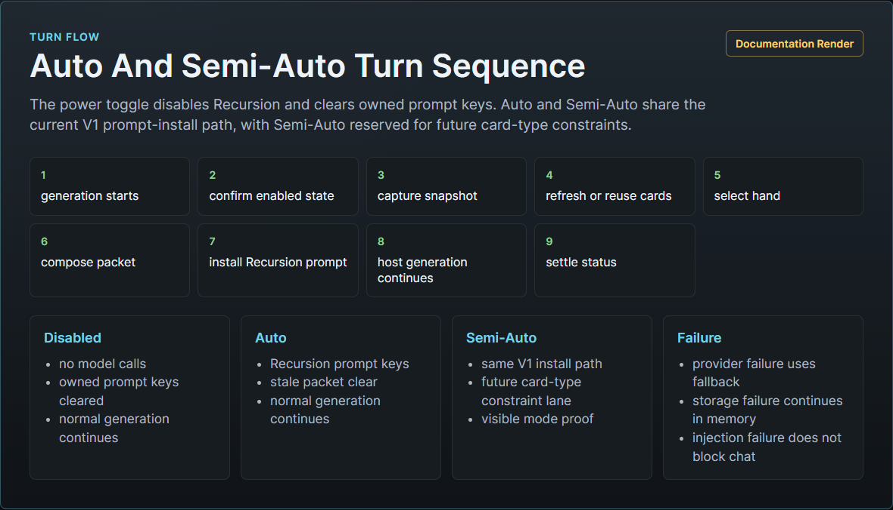
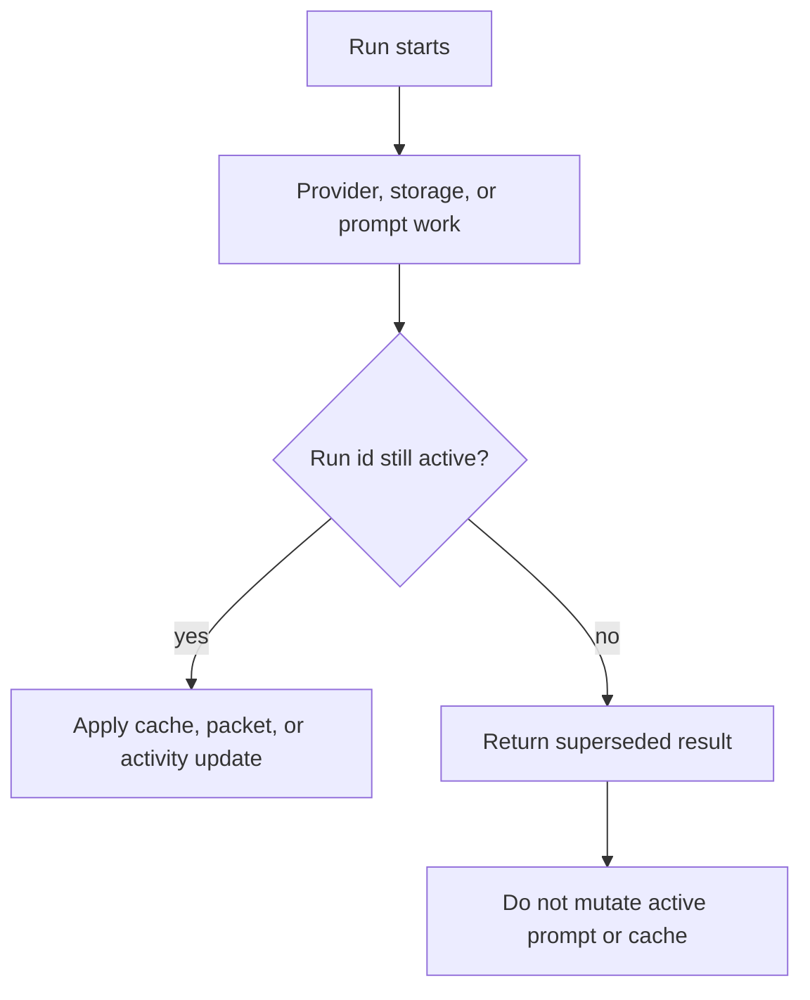
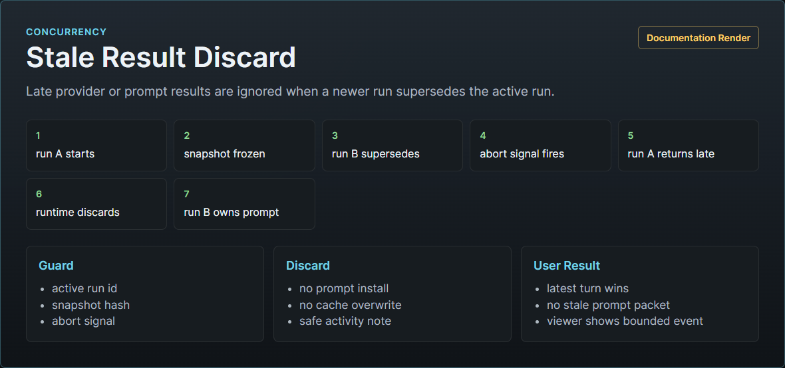

# Runtime Turn Sequence

This manual describes the turn lifecycle implemented by `src/runtime.mjs` and the adjacent card, prompt, provider, activity, storage, and SillyTavern adapter modules.

## Power And Mode Lifecycles

| Control state | Runtime behavior |
| --- | --- |
| Power off | Supersedes active Recursion work, clears Recursion prompt entries, and returns without chat inspection or prompt compilation. |
| Auto | Captures a snapshot, sends the full fixed catalog plus card-scope focus preferences to the Utility Arbiter, runs the full pipeline, installs validated prompt blocks, writes bounded diagnostics, and settles the progress surface. |
| Manual | Captures a snapshot, sends only enabled card-scope families/sub-items to the Utility Arbiter, strictly filters disabled card jobs/cards before generation and hand selection, then runs the same prompt-compile pipeline when useful. |

## Auto Sequence

## Snapshot Capture

The host adapter returns a host-neutral snapshot with chat id, chat key, scene fingerprint, scene key, turn fingerprint, latest message id, and normalized messages. System or hidden SillyTavern messages are not treated as visible story messages. Runtime sanitizes and bounds provider-facing snapshots before sending them to model lanes.

Snapshot hashes and fingerprints are used to reject stale work. A newer run supersedes older work, and late provider results cannot update the active cache or prompt packet.

## Behavior Policy And Utility Arbiter

Runtime derives the behavior influence policy from normalized settings before the Arbiter call. [Behavior Settings Policy Spec](../design/BEHAVIOR_SETTINGS_POLICY_SPEC.md) owns this contract: Strength controls intervention pressure, Min/Max Cards control Reasoning Level card-count bounds, Focus controls soft family priority, and Prompt Footprint controls packet size/detail. The Arbiter still owns semantic relevance; runtime enforces mechanical policy through prompt lines, budget shaping, hand-selection tie-breakers, composer inputs, and diagnostics.

The Utility Arbiter receives safe settings, provider health, the bounded snapshot, and card-scope payload. In Auto, the payload includes the full available catalog plus selected focus preferences; selected families and sub-items are preferred, but unselected families can still be requested when they have high relevance to scene constraints, scene coherence, or the current user message. In Manual, the payload is a strict whitelist and disabled families are not offered to the Arbiter. It returns the V1 `recursion.utilityArbiter.v1` plan shape:

- `snapshotHash`: exact echo of the frozen request snapshot hash
- `action`: `skip`, `reuse-cache`, `refresh-cards`, or `compose-brief`
- `sceneStatus`: `same-scene`, `soft-shift`, `hard-shift`, or `unknown`
- `cardJobs`: requested card roles or families
- `reasonerDecision`: `use` or `skip` plus compact signals
- `budgets`: target brief tokens and max cards
- `diagnostics`: compact labels

Runtime includes an explicit output contract in the Arbiter prompt. The contract restates the required top-level JSON fields, the exact `schema`, and the frozen `snapshotHash`, and rejects common alternate outputs such as markdown, prose, hidden reasoning, or `lifecycleActions`. This makes the provider request, retry prompt, router validation, and fallback branch all enforce the same machine-readable shape.

Runtime validates and normalizes the plan. If the Utility provider is unavailable, runtime reuses a valid cache when safe or clears Recursion injection and continues the turn without new guidance. If the Arbiter returns invalid structured output, including a missing or mismatched `snapshotHash`, runtime uses the conservative local fallback plan because the provider responded but the plan was unsafe. Rejected Arbiter card jobs, lifecycle actions, diagnostics, and Reasoner decisions are not trusted.

Reasoner decisions are advisory after normalization. When the Arbiter requests Reasoner but the Reasoner lane is disabled, untested, has a failed provider test, lacks a required direct-endpoint session key, or has incomplete route settings, runtime rewrites the decision to `skip`, records a stable `reasoner-unavailable` diagnostic, and composes through Utility only.

## Card Jobs And Deck Update

Card requests are built from the Arbiter plan, the frozen snapshot, and the selected sub-item focus for each requested family. The selected focus facets are copied into the model-visible card-generation prompt with their labels and descriptions, while also remaining in safe request metadata for diagnostics. Sub-items guide what the provider should emphasize inside a family; they do not create separate card instances.

In Manual mode, runtime enforces the whitelist after the Arbiter returns. Disabled-family jobs are omitted before provider generation, disabled cached/provider/fallback cards are filtered before deck and hand selection, and diagnostics use compact `manual-scope-omitted:<family>` reasons without prompt text. In Auto mode, disabled focus is advisory: runtime keeps the full catalog available, but records compact exception diagnostics when an unselected critical family is used.

Utility card calls are batched when the provider router supports batching. Each accepted provider result is converted into a normalized V1 card, then sanitized before entering the deck.

Runtime can create local fallback Scene Frame and Scene Constraints role cards from the latest visible messages after a valid or locally recoverable plan exists. These local cards keep the first loop useful by deriving basic scene frame and hard-constraint guidance when card generation is unavailable, but they are not used to mask a missing or transport-failing Utility provider.

After cache, provider, and fallback cards are known, runtime emits sanitized `cardProgress` activity events for the Hero Pixel Array progress menu. These events are child rows under `utility-card-batch`: generated provider cards use `state: done` and `source: generated` when they complete cleanly, generated provider cards that complete after a retry use `state: warning`, `source: generated`, `retryCount`, and a safe `reason`, cache-reused cards use `state: cached` and `source: cache`, and local fallback cards use `state: warning` and `source: fallback`. The event detail is limited to parent step id, role/family, source, state, safe card id, retry count, and one sanitized progress reason; it must not include card prompt text, raw provider output, transcript text, or secrets.

Lifecycle actions from the plan can select, emphasize, stow, discard, or mark cards stale. If a selection exists, untouched cards are stowed for the current hand. Refresh is a two-part contract. The Arbiter requests new work through `cardJobs`, optionally naming `refreshOfCardId` for the cached card being replaced. Lifecycle `regenerate` marks the old cached card stale; by itself it does not create a replacement card. This keeps generation work explicit and prevents runtime from inventing semantic refreshes. The updated deck is saved as a scene cache record.

Scene cache reads are source-revision aware. Runtime derives a `sourceRevisionHash` from visible message hashes plus active swipe metadata, then asks the Arbiter only about cards from that exact active variant when variants exist. Saving a deck updates the active variant and preserves up to three other recent variants. This makes swipe A/B/A flows fast without allowing cards generated for B to condition A.

## Hand Selection

The hand selector considers only active cards. It sorts by emphasis, catalog priority, and id, then applies max-card and token caps. Omitted cards receive reasons such as `inactive`, `max-cards`, or `token-budget`.

The resulting hand contains sanitized card ids, families, roles, prompt text, token estimates, detail profiles, emphasis values, and evidence refs. The hand is a turn artifact, not durable memory.

## Composition And Injection

The prompt composer turns the hand into Scene Brief, Turn Brief, and Guardrails. Utility composition is the default path. Reasoner composition can add a validated synthesis patch when settings and the Arbiter permit it.

Auto and Manual install prompt blocks through the SillyTavern adapter when the current run produces a valid hand and packet. Committed prompt install attempts write a sanitized `hand.selected` journal breadcrumb for the final hand before the prompt install event. Power-off clears without compilation.

Current SillyTavern prompt keys:

- `recursion.sceneBrief`
- `recursion.turnBrief`
- `recursion.guardrails`

Install uses a clear-then-install sequence and rolls back all known Recursion prompt keys if a partial install fails.

## Activity And Storage

Activity events are emitted for reading the turn, planning, cache inspection, card generation or cache reuse, nested card progress, hand selection, prompt install, prompt clear, storage save, warnings, and settled results. The compact progress model renders the latest active run state rather than a raw log. Routine cache inspection after source changes is neutral completed work; actual scene-deck reuse renders as cached/purple.

Storage writes are sequenced separately from prompt mutations. Storage failure records a warning and keeps the current generation path moving when in-memory state is sufficient. `hand.selected` entries store hand id, selected and omitted counts, up to 16 selected card ids/families/roles/emphasis/token estimates with `listedCount` and `truncated`, source hashes, and prompt packet hashes; they do not store card `promptText`, prompt sections, inspector notes, or provider payloads.

## Cancellation And Stale Results

Runtime keeps one active run id and an abort controller. Settings changes, provider changes, mode changes, refreshes, dispose, chat changes that supersede work, and newer generation attempts invalidate earlier work.

When the SillyTavern entrypoint receives `event_types.CHAT_CHANGED`, runtime aborts active provider work, clears volatile packet/hand/plan/snapshot state, best-effort marks the previously active scene cache stale with reason `chat-changed`, clears Recursion prompt keys, and journals the prompt-clear result against the previous chat when known. It does not call Utility or Reasoner for the newly selected chat until the next generation or explicit refresh.

When the entrypoint receives source mutation events such as `MESSAGE_DELETED`, `MESSAGE_UPDATED`, or `MESSAGE_SWIPED`, runtime follows the same prompt-safe cleanup path with reason `source-changed`. It clears the stale prompt immediately and stores only compact event metadata such as event name and message id; it does not persist changed message text. The next generation reads the current active source revision and starts fresh progress, so old warning or failed rows do not carry forward. If the user swiped back to an earlier revision and that exact variant still exists and validates, runtime can reuse it with cached/purple progress; otherwise it regenerates or skips according to the Arbiter plan.

When the player cancels SillyTavern generation, the entrypoint receives `event_types.GENERATION_STOPPED` (`generation_stopped`). Runtime treats that as `host-generation-stopped`: it aborts the active run controller so in-flight Utility/Reasoner calls receive an abort signal, clears volatile packet/hand/plan/snapshot state, clears Recursion prompt keys, and refuses to install any late packet from the canceled run. If a scene cache had already been written for that canceled attempt, runtime marks it stale with reason `host-generation-stopped`. The progress outcome is `skipped`/neutral so user cancellation is not displayed as a provider warning or failure.

## Failure Branches

| Failure | Runtime branch |
| --- | --- |
| Utility provider unavailable | Reuse valid cache when safe; otherwise clear Recursion prompt and skip Recursion injection. |
| Invalid Arbiter schema | Use conservative local fallback plan and record Utility fallback diagnostics. |
| Card batch failure | Continue with accepted siblings and local fallback cards after a valid or locally recoverable plan. |
| Invalid cached card | Ignore the card and show neutral cache-inspection progress; warn only if the run must skip because no reusable cache remains. |
| No reusable cache for `reuse-cache` | Clear Recursion prompt and return a warning skip. |
| Reasoner disabled, untested, unhealthy, or missing required route settings | Skip Reasoner before the composer call and compose through Utility. |
| Reasoner call failed | Compose with Utility and record Reasoner fallback metadata. |
| Prompt install failed | Record warning; normal SillyTavern generation continues. |
| Prompt clear failed | Record warning because a stale prompt may remain in host state. |
| Storage write failed | Continue in memory for current turn and show storage warning. |
| Runtime exception | Settle activity as error and throw a sanitized runtime error. |
