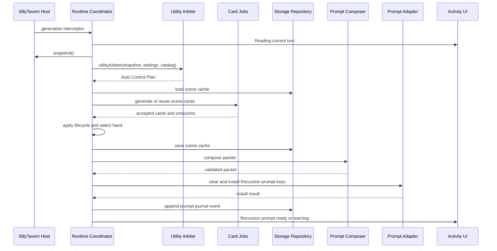
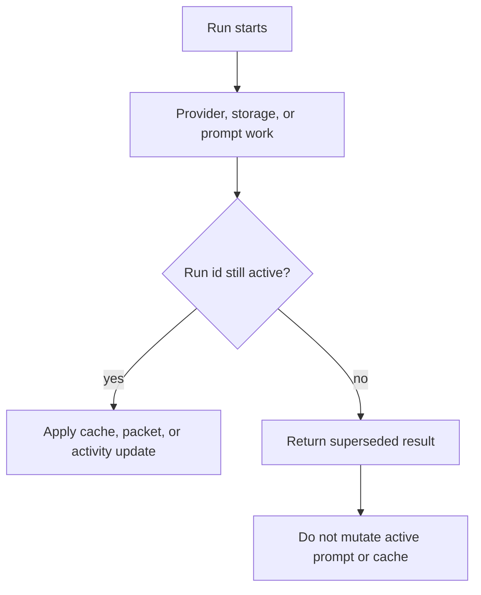

# Runtime Turn Sequence

This manual describes the turn lifecycle implemented by `src/runtime.mjs` and the adjacent card, prompt, provider, activity, storage, and SillyTavern adapter modules.

## Mode Lifecycles

| Mode | Runtime behavior |
| --- | --- |
| Off | Supersedes active Recursion work, clears Recursion prompt entries, and returns without chat inspection or prompt compilation. |
| Observe | Captures a snapshot, runs Utility planning and safe card/prompt work, saves diagnostics, clears prompt entries, and returns a preview without injection. |
| Auto | Captures a snapshot, runs the full pipeline, installs validated prompt blocks, writes bounded diagnostics, and settles the Activity Ribbon. |

## Auto Sequence

<Render Needed>: assets/documentation/renders/recursion-runtime-turn-sequence.png - Polished turn sequence visual for Auto mode from generation interceptor through prompt install and settled activity.

## Snapshot Capture

The host adapter returns a host-neutral snapshot with chat id, chat key, scene fingerprint, scene key, turn fingerprint, latest message id, and normalized messages. System or hidden SillyTavern messages are not treated as visible story messages. Runtime sanitizes and bounds provider-facing snapshots before sending them to model lanes.

Snapshot hashes and fingerprints are used to reject stale work. A newer run supersedes older work, and late provider results cannot update the active cache or prompt packet.

## Utility Arbiter

The Utility Arbiter receives safe settings, the fixed card catalog, and the bounded snapshot. It returns the V1 `recursion.utilityArbiter.v1` plan shape:

- `action`: `skip`, `reuse-cache`, `refresh-cards`, or `compose-brief`
- `sceneStatus`: `same-scene`, `soft-shift`, `hard-shift`, or `unknown`
- `cardJobs`: requested card roles or families
- `reasonerDecision`: `use` or `skip` plus compact signals
- `budgets`: target brief tokens and max cards
- `diagnostics`: compact labels

Runtime validates and normalizes the plan. If the Arbiter is unavailable or invalid, runtime uses a local fallback plan that composes from safe local cards when possible.

## Card Jobs And Deck Update

Card requests are built from the Arbiter plan and the frozen snapshot. Utility card calls are batched when the provider router supports batching. Each accepted provider result is converted into a normalized V1 card, then sanitized before entering the deck.

Runtime also creates local fallback Scene Frame and Continuity Risk cards from the latest visible messages. These local cards keep the first loop useful when provider card generation is unavailable.

Lifecycle actions from the plan can select, emphasize, stow, discard, or mark cards stale. If a selection exists, untouched cards are stowed for the current hand. The updated deck is saved as a scene cache record.

## Hand Selection

The hand selector considers only active cards. It sorts by emphasis, catalog priority, and id, then applies max-card and token caps. Omitted cards receive reasons such as `inactive`, `max-cards`, or `token-budget`.

The resulting hand contains sanitized card ids, families, roles, prompt text, token estimates, detail profiles, emphasis values, and evidence refs. The hand is a turn artifact, not durable memory.

## Composition And Injection

The prompt composer turns the hand into Scene Brief, Turn Brief, and Guardrails. Utility composition is the default path. Reasoner composition can add a validated synthesis patch when settings and the Arbiter permit it.

Auto mode installs prompt blocks through the SillyTavern adapter. Observe mode composes and then clears prompt entries. Off mode clears without compilation.

Current SillyTavern prompt keys:

- `recursion.sceneBrief`
- `recursion.turnBrief`
- `recursion.guardrails`

Install uses a clear-then-install sequence and rolls back all known Recursion prompt keys if a partial install fails.

## Activity And Storage

Activity events are emitted for reading the turn, planning, card generation or cache reuse, hand selection, prompt install, prompt clear, storage save, warnings, and settled results. The Activity Ribbon renders the latest active run state rather than a raw log.

Storage writes are sequenced separately from prompt mutations. Storage failure records a warning and keeps the current generation path moving when in-memory state is sufficient.

## Cancellation And Stale Results

Runtime keeps one active run id and an abort controller. Settings changes, provider changes, mode changes, refreshes, dispose, chat changes that supersede work, and newer generation attempts invalidate earlier work.

<Render Needed>: assets/documentation/renders/recursion-stale-result-discard.png - Stale-result discard visual showing active run supersession, abort signal, and late provider result being ignored.

## Failure Branches

| Failure | Runtime branch |
| --- | --- |
| Utility provider unavailable | Use local fallback plan, reuse valid cache, or skip/clear Recursion injection. |
| Invalid Arbiter schema | Merge into fallback plan and record Utility fallback diagnostics. |
| Card batch failure | Continue with accepted siblings and local fallback cards. |
| Invalid cached card | Ignore the card and show a cache warning. |
| No reusable cache for `reuse-cache` | Clear Recursion prompt and return a warning skip. |
| Reasoner disabled or failed | Compose with Utility and record Reasoner fallback metadata. |
| Prompt install failed | Record warning; normal SillyTavern generation continues. |
| Prompt clear failed | Record warning because a stale prompt may remain in host state. |
| Storage write failed | Continue in memory for current turn and show storage warning. |
| Runtime exception | Settle activity as error and throw a sanitized runtime error. |

