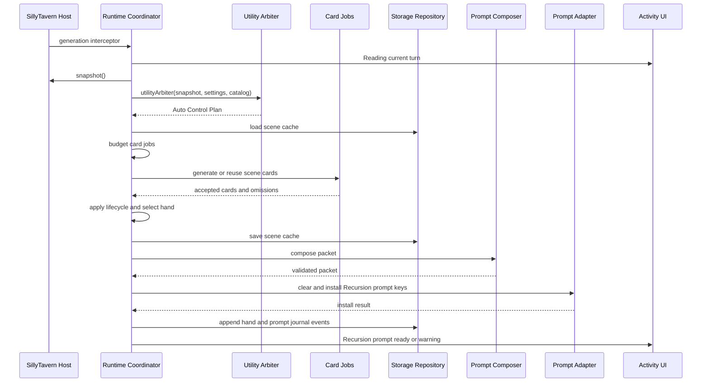
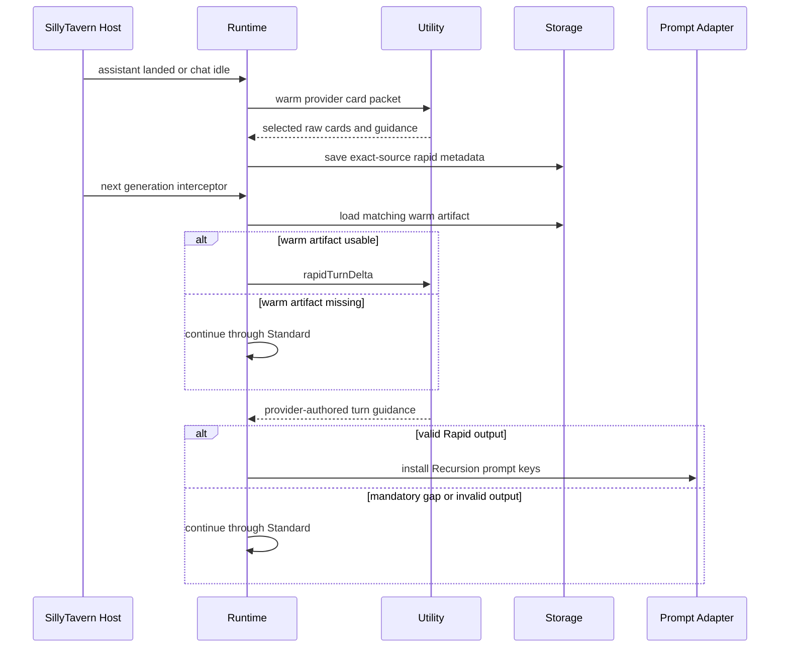
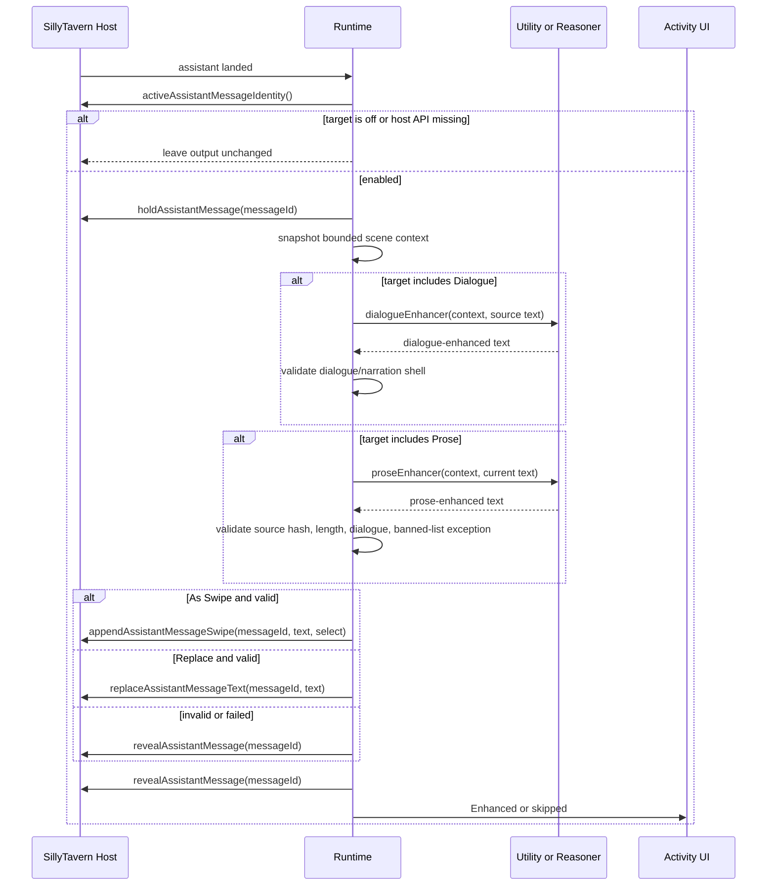
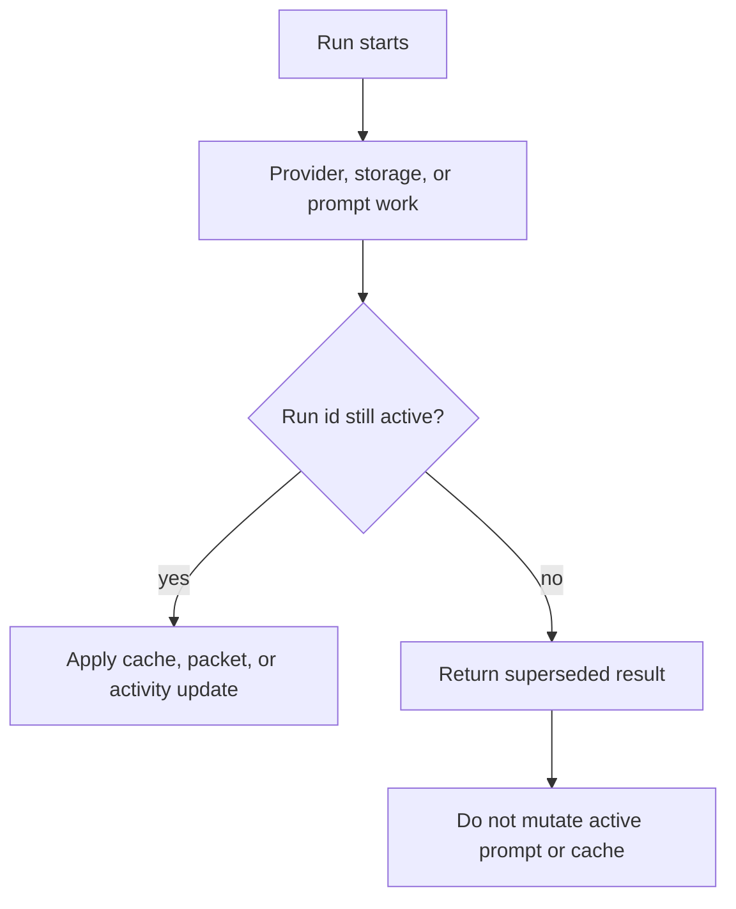
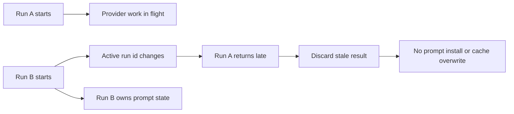

# Runtime Turn Sequence

This manual describes the turn lifecycle implemented by `src/runtime.mjs` and the adjacent card, prompt, provider, activity, storage, and SillyTavern adapter modules.

## Power And Mode Lifecycles

| Control state | Runtime behavior |
| --- | --- |
| Power off | Supersedes active Recursion work, clears Recursion prompt entries, and returns without chat inspection or prompt compilation. |
| Stop generation | Requests SillyTavern host generation stop, aborts active Recursion work, clears Recursion prompt entries, and settles the canceled attempt as skipped/neutral. |
| Regenerate | Arms one fresh-next-generation token from the Recursion Bar command slot. The click does not start provider work or host generation. The next send or swipe consumes the token once, skips packet/Rapid/cache reuse, soft-invalidates scene cache with `user-fresh-next-generation`, and restores normal pipeline behavior afterward. |
| Auto | Captures a snapshot, sends the full fixed catalog plus card-scope focus preferences to the selected pipeline, installs validated prompt blocks when useful, writes bounded diagnostics, and settles the progress surface. |
| Manual | Captures a snapshot, treats enabled card-scope families/sub-items as a strict whitelist, filters disabled card jobs/cards before generation and hand selection, then runs the selected prompt-compile pipeline when useful. |

Pipeline selection is separate from Auto/Manual. The compact bar owns the Pipeline selector as an icon-only dropdown immediately to the left of the Mode button. `Standard` runs the full foreground pipeline on send. `Rapid` warms a provider-generated card packet in the background and uses a short foreground Utility delta on send. `Fused` runs the foreground Arbiter and then generates all requested cards through one structured bundle call before the shared deck/hand/compose/install stages. Settings may persist `pipelineMode`, but Settings must not render a second Standard/Rapid/Fused toggle.

Enhancements are separate from Auto/Manual and Standard/Rapid/Fused. They run only after SillyTavern has produced an assistant message and only when `settings.enhancements.target` is `prose`, `dialogue`, or `prose-dialogue`. `Off` leaves the host output untouched. `As Swipe` preserves the original host output, appends one enhanced sibling swipe, and selects the enhanced swipe when a valid non-duplicate candidate exists. `Replace` replaces the active assistant text with the enhanced result. Low and Medium route enhancement calls through Utility; High and Ultra route them through Reasoner when that lane is available, then retry the same pass through Utility if the Reasoner call fails. If the hold, provider call, validation, or Dialogue duplicate check fails, runtime reveals the original host output unchanged.

## Auto Sequence

The Standard pipeline is the reference foreground path for Auto and Manual:

## Rapid Sequence

Rapid changes when provider work happens, not who authors the guidance. It never creates local fallback cards, local scene briefs, local turn briefs, or summary fast-start packs for the Rapid path.

Background warm:

1. After an assistant message lands, Enhancements run first when enabled. Only after those passes settle does `warmRapidScene()` capture the current source revision for Rapid. The runtime-level Rapid warm entrypoint waits behind any active or pending enhancement barrier, so settings-triggered or event-triggered Rapid warm cannot snapshot the unenhanced assistant text.
2. Runtime uses the provider Arbiter and provider card roles to build or refresh a scene deck for that exact revision.
3. Runtime saves the active scene cache variant with `variant.rapid` metadata, including the warm artifact id, source revision hash, selected card ids, guidance metadata, contract hashes, and Rapid pipeline version.
4. Background warm does not compose a final prompt packet, does not call the SillyTavern prompt adapter, and never installs Recursion prompt keys.

Foreground send:

1. Runtime captures the source snapshot before appending the pending user message and loads the active cache variant for that exact base source revision.
2. If a ready Rapid warm artifact matches the source revision, settings/provider/catalog/prompt contracts, and candidate cards, runtime calls `rapidTurnDelta` on the Utility lane.
3. If no warm artifact exists, runtime escalates to Standard for that same pending user message. Rapid warm miss is not a quality-degraded summary path.
4. The accepted Rapid output supplies selected warm card ids, a tiny user-message guidance delta, and optional background refresh requests for a later turn.
5. Runtime composes the same V3 prompt packet used by Standard: warm guidance plus Rapid turn guidance, full selected raw card evidence, and guardrails. It rechecks source freshness before installing.
6. If the provider marks a mandatory missing card, requests Standard escalation, or returns Rapid structured output that fails schema or content validation, Rapid aborts the Rapid install path and continues through Standard for that same pending user message with a compact escalation diagnostic. Runtime stamps local revision hashes from the frozen request instead of trusting model-echoed hash strings.

Rapid foreground roles are small Utility jobs. They may hedge by starting a primary call immediately and a backup after the configured short delay; the first valid structured output wins and diagnostics record the winning hedge source. Hedging is not used for Story generation.

## Enhancements Post-Generation Sequence

Enhancements are post-generation provider passes, not prompt-packet conditioning. They do not change the prompt installed before the host model writes. They mutate only the just-landed assistant message after validation.

The hold path blanks the active assistant text before the player sees the unenhanced host output. Hold state is transient and restored through `revealAssistantMessage()` on any failure. Runtime builds enhancement-lane requests from the original text, the latest bounded message context, the source-message hash, and normalized `enhancements.contextMessages`. Dialogue Enhancement uses character/card/context evidence to remove echoing, forced questions, over-technical "smart" speech, unearned defensive deflection, romance cliches, and other dialogue slop before improving naturalness and subtext. It measures both whole-message `editRatio` and dialogue-span-only `dialogueEditRatio`; the latter drives low-change retry so narration-heavy replies do not dilute dialogue revisions. Exact no-op Dialogue output retries once. Low dialogue-span edits retry once when strong slop, soft suspicion, or echoed-user context signals are present. If the retry still returns byte-identical text, runtime keeps the original instead of applying a duplicate enhanced swipe. Prose Enhancement then polishes the current text when target is `prose` or `prose-dialogue`.

`As Swipe` uses a marker derived from the original text hash, target, apply mode, and enhancement schema so the same enhanced swipe can be found instead of duplicated. Markers include per-pass `editRatio`, applied lane, and fallback metadata; Dialogue passes also include `dialogueEditRatio`, attempt number, and retry reason when a retry supplied the applied candidate. `Replace` writes the enhanced text into the active assistant message/swipe and asks the host adapter to save and update the visible message block best-effort. Both modes run before Rapid warm so future Rapid source revisions see the selected final text. While active, progress shows a first-class `Prose Enhancement`, `Dialogue Enhancement`, or `Enhancement` row with compact text `Enhancing prose...`, `Enhancing dialogue...`, or `Enhancing response...`, not the card-batch progress label.

If the player stops SillyTavern generation before Enhancements start, runtime cancels the armed pass. Any delayed assistant-landed or generation-ended event for that canceled generation must skip Enhancements, must not call enhancer roles, and must not hold, replace, reveal, or append assistant message text. The next fresh host generation clears that cancellation marker when it arms a new enhancement pass.

The message mutation caused by Enhancements is Recursion-owned. Late SillyTavern `MESSAGE_UPDATED` or `MESSAGE_SWIPED` events for the latest assistant that arrive from the enhancement save/reload window must not be routed through generic `source-changed` cleanup, must not clear Last Brief cards, and must not clear the current prompt packet. User edits outside that short owned-mutation window still use the normal source-change cleanup path.

## Regenerate Fresh-Next Sequence

Regenerate is one-shot and bar-owned:

1. The bar calls `runtime.requestFreshNextGeneration({ source: 'bar' })`.
2. Runtime records `freshNextGeneration.pending = true`, clears any pending latest-assistant swipe retry, and leaves Last Brief showing the previous completed packet.
3. No prompt preparation, provider work, prompt installation, prompt clearing, Rapid warm, or SillyTavern native generation starts on click. The command slot keeps Regenerate visible in a pressed armed state; Stop stays hidden while idle.
4. A second click before consumption calls `runtime.clearFreshNextGeneration({ source: 'bar' })` and clears the armed state without changing Last Brief.
5. The next host generation calls `prepareForGeneration({ hostGeneration: true })`, consumes the token before reuse checks, clears Last Brief with reason `user-fresh-next-generation`, and clears the pending view.
6. Runtime skips latest-assistant swipe packet reinstall and same-turn packet reuse.
7. Runtime soft-invalidates the current scene cache with reason `user-fresh-next-generation`.
8. If Rapid is selected, runtime bypasses Rapid foreground warm for this run and continues through Standard foreground work.
9. Cached card metadata may appear in the Arbiter scene-cache evidence as stale, but cached card prompt text is not prompt-eligible for the fresh hand.
10. Runtime installs a fresh packet, sets Last Brief ready with reason `fresh-next-generation-installed`, and lets the original host generation continue. It does not call `host.generation.start(...)`.

Repeated restart clicks while idle toggle a single token rather than stacking tokens. Once Stop owns the slot, cancellation uses the normal stop path. Source/chat cleanup, disable, hard reset, and host stop cleanup clear stale pending tokens.

## Snapshot Capture

The host adapter returns a host-neutral snapshot with chat id, chat key, scene fingerprint, scene key, turn fingerprint, latest message id, and normalized messages. System or hidden SillyTavern messages are not treated as visible story messages. Runtime sanitizes and bounds provider-facing snapshots before sending them to model lanes.

Snapshot hashes and fingerprints are used to reject stale work. A newer run supersedes older work, and late provider results cannot update the active cache or prompt packet.

## Behavior Policy And Utility Arbiter

Runtime derives the behavior influence policy from normalized settings before the Arbiter call. [Behavior Settings Policy Spec](../design/BEHAVIOR_SETTINGS_POLICY_SPEC.md) owns this contract: Strength controls intervention pressure, Min/Max Cards control Reasoning Level card-count bounds, Focus controls soft family priority, and Prompt Footprint controls packet size/detail. The Arbiter still owns semantic relevance; runtime enforces mechanical policy through prompt lines, budget shaping, hand-selection tie-breakers, composer inputs, and diagnostics.

The Utility Arbiter receives safe settings, provider health, the bounded snapshot, and card-scope payload. In Auto, the payload includes the full available catalog plus selected focus preferences; selected families and sub-items are preferred, but unselected families can still be requested when they have high relevance to scene constraints, scene coherence, or the current user message. In Manual, the payload is a strict whitelist and disabled families are not offered to the Arbiter. It returns the V1 `recursion.utilityArbiter.v1` plan shape:

- `snapshotHash`: exact echo of the frozen request snapshot hash
- `action`: `skip`, `reuse-cache`, `refresh-cards`, or `compose-brief`; the literal `compose-brief` enum now means compose the V3 Guidance/Card Evidence/Guardrails packet.
- `sceneStatus`: `same-scene`, `soft-shift`, `hard-shift`, or `unknown`
- `cardJobs`: requested card roles or families
- `reasonerDecision`: `use` or `skip` plus compact signals
- `budgets`: target guidance tokens and max cards
- `storyForm`: normalized tense, point of view, confidence, and message evidence for the active scene
- `diagnostics`: compact labels

Runtime includes an explicit output contract in the Arbiter prompt. The contract restates the required top-level JSON fields, the exact `schema`, and the frozen `snapshotHash`, and rejects common alternate outputs such as markdown, prose, hidden reasoning, or `lifecycleActions`. This makes the provider request, retry prompt, router validation, and fallback branch all enforce the same machine-readable shape.

The Arbiter must infer `storyForm` from visible story text before card jobs run unless the operator has selected a forced Tense & PoV value. Auto story form prioritizes the latest assistant narration because that is the host model's established output form; the pending user message is fallback evidence only when no assistant narration exists. Runtime normalizes unsupported or low-evidence output to `unknown`, runs a heuristic cross-check against obvious assistant-narration tense and POV cues, and uses a conservative instruction to match the active chat's established form when the result is unknown. A forced Tense & PoV value becomes a high-confidence `User override` story form and is passed through the same downstream prompt contract.

Runtime validates and normalizes the plan. If the Utility provider is unavailable, runtime reuses a valid cache when safe or clears Recursion injection and continues the turn without new guidance. If the Arbiter returns invalid structured output, including a missing or mismatched `snapshotHash`, runtime uses the conservative local fallback plan because the provider responded but the plan was unsafe. Rejected Arbiter card jobs, lifecycle actions, diagnostics, and Reasoner decisions are not trusted.

After the Arbiter plan is normalized, scoped, and shaped by Reasoning Level plus behavior policy, runtime budgets `cardJobs` before any provider card calls. Over-budget card jobs are recorded as `card-jobs-budgeted` diagnostics and are not sent to Utility or Reasoner. Final hand selection should not normally omit freshly generated cards for `max-cards`; that reason indicates cache/manual/fallback competition, not routine provider over-generation.

Reasoner decisions are advisory after normalization. When the Arbiter requests Reasoner but the Reasoner lane is disabled, untested, has a failed provider test, lacks a required direct-endpoint session key, or has incomplete route settings, runtime rewrites the decision to `skip`, records a stable `reasoner-unavailable` diagnostic, and composes through Utility only.

## Card Jobs And Deck Update

Card requests are built from the Arbiter plan, the frozen snapshot, and the selected sub-item focus for each requested family. The selected focus facets are copied into the model-visible card-generation prompt with their labels and descriptions, while also remaining in safe request metadata for diagnostics. Sub-items guide what the provider should emphasize inside a family; they do not create separate card instances.

Card-generation prompts receive the normalized `storyForm` block from the Arbiter. Card providers must write instruction-shaped `promptText` in that same tense and point of view, or use the conservative active-chat form when the Arbiter could not identify both fields. Runtime rejects narrative prose paragraphs, mini-scenes, dialogue, sensory recap, and hidden-reasoning wording before generated cards can enter the deck. Runtime also stores compact story-form metadata with each request for diagnostics.

In Manual mode, runtime enforces the whitelist after the Arbiter returns. Disabled-family jobs are omitted before provider generation, disabled cached/provider/fallback cards are filtered before deck and hand selection, and diagnostics use compact `manual-scope-omitted:<family>` reasons without prompt text. In Auto mode, disabled focus is advisory: runtime keeps the full catalog available, but records compact exception diagnostics when an unselected critical family is used.

Utility card calls are batched when the provider router supports batching. The router only receives budgeted card jobs that can fit the effective hand budget. Each accepted provider result is converted into a normalized V1 card, then sanitized before entering the deck.

Runtime can create local fallback Scene Frame and Scene Constraints role cards from the latest visible messages after a valid or locally recoverable plan exists. These local cards keep the first loop useful by deriving basic scene frame and hard-constraint guidance when card generation is unavailable, but they are not used to mask a missing or transport-failing Utility provider.

Rapid does not use those local fallback cards. A Rapid warm pass stores only provider-generated cards plus provider-authored guidance. A Rapid foreground pass either uses a valid warm provider artifact or escalates to Standard when the warm artifact is missing, selected warm cards cannot be found, provider output is unavailable or empty, provider output is invalid, or the provider declares a mandatory gap.

After cache, provider, and fallback cards are known, runtime emits sanitized `cardProgress` activity events for the Hero Pixel Array progress menu. These events are child rows under `utility-card-batch`: generated provider cards use `state: done` and `source: generated` when they complete cleanly, generated provider cards that complete after a retry use `state: warning`, `source: generated`, `retryCount`, and a safe `reason`, cache-reused cards use `state: cached` and `source: cache`, and local fallback cards use `state: warning` and `source: fallback`. The event detail is limited to parent step id, role/family, source, state, safe card id, retry count, and one sanitized progress reason; it must not include card prompt text, raw provider output, transcript text, or secrets.

Lifecycle actions from the plan can select, emphasize, stow, discard, or mark cards stale. If a selection exists, untouched cards are stowed for the current hand. Refresh is a two-part contract. The Arbiter requests new work through `cardJobs`, optionally naming `refreshOfCardId` for the cached card being replaced. Lifecycle `regenerate` marks the old cached card stale; by itself it does not create a replacement card. This keeps generation work explicit and prevents runtime from inventing semantic refreshes. The updated deck is saved as a scene cache record.

Scene cache reads are source-revision aware. Runtime derives a `sourceRevisionHash` from visible message hashes plus active swipe metadata, then asks the Arbiter only about cards from that exact active variant when variants exist. Saving a deck updates the active variant and preserves up to three other recent variants. This makes swipe A/B/A flows fast without allowing cards generated for B to condition A.

## Hand Selection

The hand selector considers only active cards. It sorts by emphasis, catalog priority, and id, then applies max-card and token caps. Omitted cards receive reasons such as `inactive`, `max-cards`, or `token-budget`.

The resulting hand contains sanitized card ids, families, roles, prompt text, token estimates, detail profiles, emphasis values, and evidence refs. The hand is a turn artifact, not durable memory.

## Composition And Injection

The prompt composer turns the hand into Guidance, Card Evidence, and Guardrails. `guidanceComposer` writes the provider-authored direction layer; selected instruction-shaped card text is preserved in Card Evidence. Reasoner composition can add a validated synthesis patch when settings and the Arbiter permit it. A `guidanceComposer` provider-call success means the model call completed; packet diagnostics still determine whether Recursion used that payload or fell back to raw-card-only guidance.

Auto and Manual install prompt blocks through the SillyTavern adapter when the current run produces a valid hand and packet. Committed prompt install attempts write a sanitized `hand.selected` journal breadcrumb for the final hand before the prompt install event. Power-off clears without compilation.

Current SillyTavern prompt keys:

- `recursion.guidance`
- `recursion.cardEvidence`
- `recursion.guardrails`

Install uses a clear-then-install sequence and rolls back all known Recursion prompt keys if a partial install fails.

## Activity And Storage

Activity events are emitted for reading the turn, planning, cache inspection, card generation or cache reuse, nested card progress, hand selection, prompt install, prompt clear, storage save, warnings, and settled results. The compact progress model renders the latest active run state rather than a raw log. Routine cache inspection after source changes is neutral completed work; actual scene-deck reuse renders as cached/purple.

Storage writes are sequenced separately from prompt mutations. Storage failure records a warning and keeps the current generation path moving when in-memory state is sufficient. `hand.selected` entries store hand id, selected and omitted counts, compact guidance validation status/fallback reason/counts, up to 16 selected card ids/families/roles/emphasis/token estimates with `listedCount` and `truncated`, source hashes, and prompt packet hashes; they do not store card `promptText`, prompt sections, inspector notes, raw guidance text, or provider payloads.

## Cancellation And Stale Results

Runtime keeps one active run id and an abort controller. Settings changes, provider changes, mode changes, refreshes, dispose, chat changes that supersede work, and newer generation attempts invalidate earlier work.

When the SillyTavern entrypoint receives `event_types.CHAT_CHANGED`, runtime aborts active provider work, clears volatile packet/hand/plan/snapshot state, best-effort marks the previously active scene cache stale with reason `chat-changed`, clears Recursion prompt keys, and journals the prompt-clear result against the previous chat when known. It does not call Utility or Reasoner for the newly selected chat until the next generation or explicit refresh.

When the entrypoint receives source mutation events such as `MESSAGE_DELETED`, `MESSAGE_UPDATED`, or older-message `MESSAGE_SWIPED`, runtime follows the same prompt-safe cleanup path with reason `source-changed`. It clears the stale prompt immediately and stores only compact event metadata such as event name and message id; it does not persist changed message text. Recursion-owned enhancement mutations are the exception: latest-assistant update/swipe events inside the owned enhancement window are ignored because the runtime already knows about the final selected text and Last Brief should remain ready. A `MESSAGE_SWIPED` event for the latest visible assistant message outside that owned window is different: it is treated as a same-turn swipe retry, so Recursion keeps the existing prompt and Rapid does not prewarm again. If SillyTavern invokes the generation interceptor again for that same pending user turn, runtime reinstalls the previous packet without running Standard, Rapid, Utility, or Reasoner work unless a fresh-next-generation token is armed. With fresh-next-generation armed, runtime clears the retry marker, uses the current post-swipe snapshot, and runs fresh provider work once. The next distinct user message reads the current active source revision and starts fresh progress. If the user swiped back to an earlier revision and that exact variant still exists and validates, runtime can reuse it with cached/purple progress; otherwise it regenerates or skips according to the Arbiter plan.

When the player cancels SillyTavern generation, the entrypoint receives `event_types.GENERATION_STOPPED` (`generation_stopped`). Runtime treats that as `host-generation-stopped`: it aborts the active run controller so in-flight Utility/Reasoner calls receive an abort signal, cancels any armed but not-yet-started enhancement pass, clears volatile packet/hand/plan/snapshot state, clears Recursion prompt keys, and refuses to install any late packet from the canceled run. If a scene cache had already been written for that canceled attempt, runtime marks it stale with reason `host-generation-stopped`. The progress outcome is `skipped`/neutral so user cancellation is not displayed as a provider warning or failure.

The Recursion Bar Stop generation button calls `runtime.stopGeneration()`. Runtime first asks `host.generation.stop()` to run SillyTavern's own generation stop path, then runs the same host-stop cleanup path used by the host event. Duplicate stop notifications collapse onto the in-flight cleanup promise so a button click plus SillyTavern `GENERATION_STOPPED` event clears Recursion prompt lanes once. Assistant-landed events call `handleHostGenerationEnded()` to hide the stop affordance after a normal generation completes. SillyTavern `GENERATION_AFTER_COMMANDS` is intentionally not treated as assistant-landed because it fires near generation startup and must not hide Stop while the host model is still running.

## Failure Branches

| Failure | Runtime branch |
| --- | --- |
| Utility provider unavailable | Reuse valid cache when safe; otherwise clear Recursion prompt and skip Recursion injection. |
| Invalid Arbiter schema | Use conservative local fallback plan and record Utility fallback diagnostics. |
| No Rapid warm artifact | Continue through Standard for the same pending user message; do not create local Rapid briefs or summary fast-start packs. |
| Rapid mandatory gap | Abort Rapid install and continue through Standard with `rapid-escalated-standard:mandatory-gap`. |
| Invalid Rapid structured output | Abort Rapid install and continue through Standard with `rapid-escalated-standard:invalid-provider-output`. |
| Rapid provider output unavailable or empty | Abort Rapid install and continue through Standard with `rapid-escalated-standard:provider-unavailable` or `rapid-escalated-standard:empty-provider-guidance`; do not install local substitute guidance. |
| Card batch failure | Continue with accepted siblings and local fallback cards after a valid or locally recoverable plan. |
| Invalid cached card | Ignore the card and show neutral cache-inspection progress; warn only if the run must skip because no reusable cache remains. |
| No reusable cache for `reuse-cache` | Clear Recursion prompt and return a warning skip. |
| Reasoner disabled, untested, unhealthy, or missing required route settings | Skip Reasoner before the composer call and compose through Utility. |
| Reasoner call failed | Compose with Utility and record Reasoner fallback metadata. |
| Prompt install failed | Record warning; normal SillyTavern generation continues. |
| Prompt clear failed | Record warning because a stale prompt may remain in host state. |
| Host stop API unavailable | Abort Recursion work and clear prompt lanes; report `RECURSION_HOST_STOP_UNAVAILABLE` in the stop result. |
| Storage write failed | Continue in memory for current turn and show storage warning. |
| Runtime exception | Settle activity as error and throw a sanitized runtime error. |
