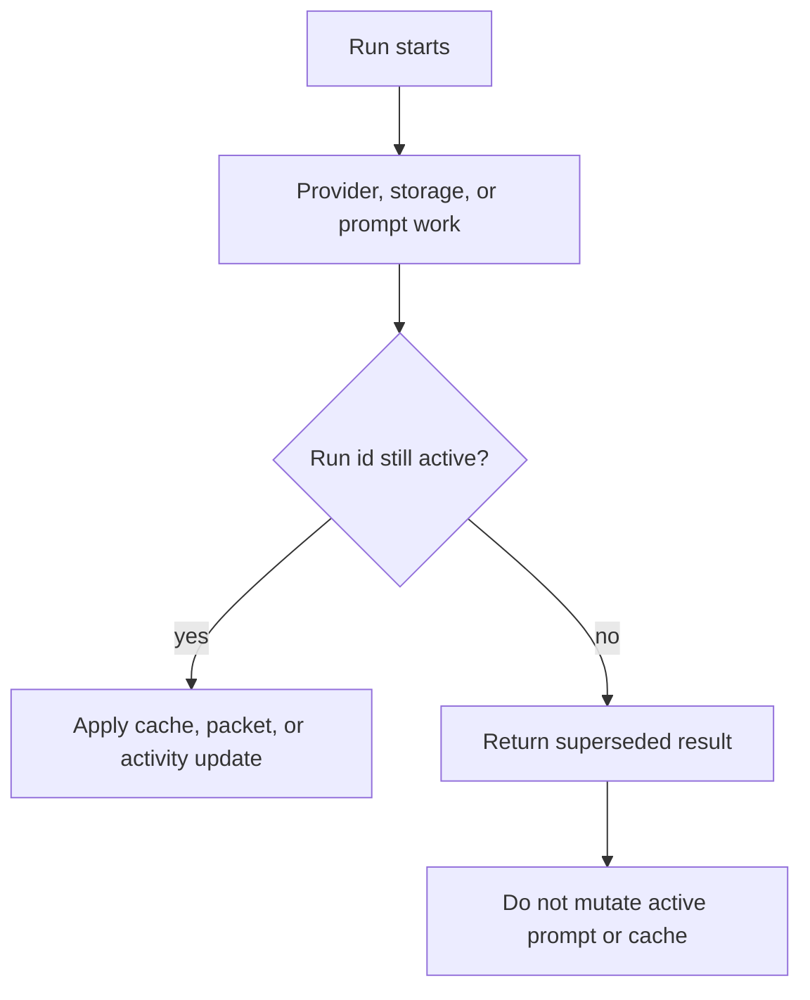

# Runtime Turn Sequence

This manual describes the turn lifecycle implemented by `src/runtime.mjs` and the adjacent card, prompt, provider, activity, storage, and SillyTavern adapter modules.

## Power And Mode Lifecycles

| Control state | Runtime behavior |
| --- | --- |
| Power off | Supersedes active Recursion work, clears Recursion prompt entries, and returns without chat inspection or prompt compilation. |
| Auto | Captures a snapshot, runs the full pipeline, installs validated prompt blocks, writes bounded diagnostics, and settles the progress surface. |
| Semi-Auto | Uses the same runtime path as Auto in V1, with the UI contract reserved for constraining card generation to selected card types when that backend selector lands. |

## Auto Sequence

## Snapshot Capture

The host adapter returns a host-neutral snapshot with chat id, chat key, scene fingerprint, scene key, turn fingerprint, latest message id, and normalized messages. System or hidden SillyTavern messages are not treated as visible story messages. Runtime sanitizes and bounds provider-facing snapshots before sending them to model lanes.

Snapshot hashes and fingerprints are used to reject stale work. A newer run supersedes older work, and late provider results cannot update the active cache or prompt packet.

## Utility Arbiter

The Utility Arbiter receives safe settings, the fixed card catalog, provider health, and the bounded snapshot. It returns the V1 `recursion.utilityArbiter.v1` plan shape:

- `snapshotHash`: exact echo of the frozen request snapshot hash
- `action`: `skip`, `reuse-cache`, `refresh-cards`, or `compose-brief`
- `sceneStatus`: `same-scene`, `soft-shift`, `hard-shift`, or `unknown`
- `cardJobs`: requested card roles or families
- `reasonerDecision`: `use` or `skip` plus compact signals
- `budgets`: target brief tokens and max cards
- `diagnostics`: compact labels

Runtime validates and normalizes the plan. If the Utility provider is unavailable, runtime reuses a valid cache when safe or clears Recursion injection and continues the turn without new guidance. If the Arbiter returns invalid structured output, including a missing or mismatched `snapshotHash`, runtime uses the conservative local fallback plan because the provider responded but the plan was unsafe. Rejected Arbiter card jobs, lifecycle actions, diagnostics, and Reasoner decisions are not trusted.

Reasoner decisions are advisory after normalization. When the Arbiter requests Reasoner but the Reasoner lane is disabled, untested, has a failed provider test, lacks a required direct-endpoint session key, or has incomplete route settings, runtime rewrites the decision to `skip`, records a stable `reasoner-unavailable` diagnostic, and composes through Utility only.

## Card Jobs And Deck Update

Card requests are built from the Arbiter plan and the frozen snapshot. Utility card calls are batched when the provider router supports batching. Each accepted provider result is converted into a normalized V1 card, then sanitized before entering the deck.

Runtime can create local fallback Scene Frame and Continuity Risk cards from the latest visible messages after a valid or locally recoverable plan exists. These local cards keep the first loop useful when card generation is unavailable, but they are not used to mask a missing or transport-failing Utility provider.

After cache, provider, and fallback cards are known, runtime emits sanitized `cardProgress` activity events for the Hero Pixel Array progress menu. These events are child rows under `utility-card-batch`: generated provider cards use `state: done` and `source: generated`, cache-reused cards use `state: cached` and `source: cache`, and local fallback cards use `state: warning` and `source: fallback`. The event detail is limited to parent step id, role/family, source, state, and safe card id; it must not include card prompt text, raw provider output, transcript text, or secrets.

Lifecycle actions from the plan can select, emphasize, stow, discard, or mark cards stale. If a selection exists, untouched cards are stowed for the current hand. The updated deck is saved as a scene cache record.

## Hand Selection

The hand selector considers only active cards. It sorts by emphasis, catalog priority, and id, then applies max-card and token caps. Omitted cards receive reasons such as `inactive`, `max-cards`, or `token-budget`.

The resulting hand contains sanitized card ids, families, roles, prompt text, token estimates, detail profiles, emphasis values, and evidence refs. The hand is a turn artifact, not durable memory.

## Composition And Injection

The prompt composer turns the hand into Scene Brief, Turn Brief, and Guardrails. Utility composition is the default path. Reasoner composition can add a validated synthesis patch when settings and the Arbiter permit it.

Auto and Semi-Auto install prompt blocks through the SillyTavern adapter. Committed prompt install attempts write a sanitized `hand.selected` journal breadcrumb for the final hand before the prompt install event. Power-off clears without compilation.

Current SillyTavern prompt keys:

- `recursion.sceneBrief`
- `recursion.turnBrief`
- `recursion.guardrails`

Install uses a clear-then-install sequence and rolls back all known Recursion prompt keys if a partial install fails.

## Activity And Storage

Activity events are emitted for reading the turn, planning, card generation or cache reuse, nested card progress, hand selection, prompt install, prompt clear, storage save, warnings, and settled results. The compact progress model renders the latest active run state rather than a raw log.

Storage writes are sequenced separately from prompt mutations. Storage failure records a warning and keeps the current generation path moving when in-memory state is sufficient. `hand.selected` entries store hand id, selected and omitted counts, up to 16 selected card ids/families/roles/emphasis/token estimates with `listedCount` and `truncated`, source hashes, and prompt packet hashes; they do not store card `promptText`, prompt sections, inspector notes, or provider payloads.

## Cancellation And Stale Results

Runtime keeps one active run id and an abort controller. Settings changes, provider changes, mode changes, refreshes, dispose, chat changes that supersede work, and newer generation attempts invalidate earlier work.

<Render Needed>: assets/documentation/renders/recursion-stale-result-discard.png - Stale-result discard visual showing active run supersession, abort signal, and late provider result being ignored.

## Failure Branches

| Failure | Runtime branch |
| --- | --- |
| Utility provider unavailable | Reuse valid cache when safe; otherwise clear Recursion prompt and skip Recursion injection. |
| Invalid Arbiter schema | Use conservative local fallback plan and record Utility fallback diagnostics. |
| Card batch failure | Continue with accepted siblings and local fallback cards after a valid or locally recoverable plan. |
| Invalid cached card | Ignore the card and show a cache warning. |
| No reusable cache for `reuse-cache` | Clear Recursion prompt and return a warning skip. |
| Reasoner disabled, untested, unhealthy, or missing required route settings | Skip Reasoner before the composer call and compose through Utility. |
| Reasoner call failed | Compose with Utility and record Reasoner fallback metadata. |
| Prompt install failed | Record warning; normal SillyTavern generation continues. |
| Prompt clear failed | Record warning because a stale prompt may remain in host state. |
| Storage write failed | Continue in memory for current turn and show storage warning. |
| Runtime exception | Settle activity as error and throw a sanitized runtime error. |
