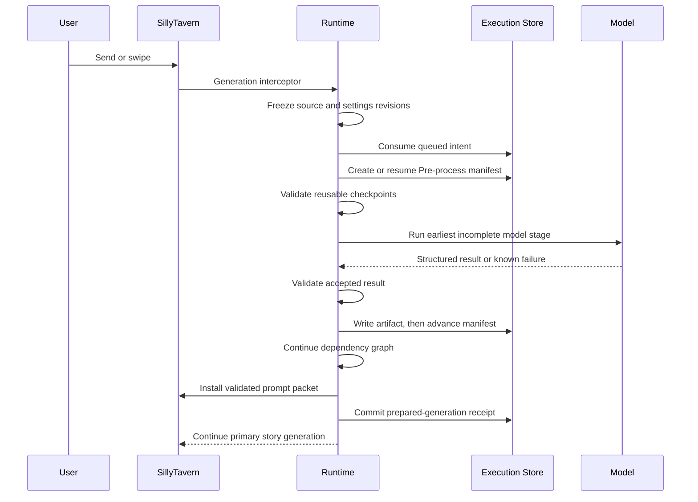
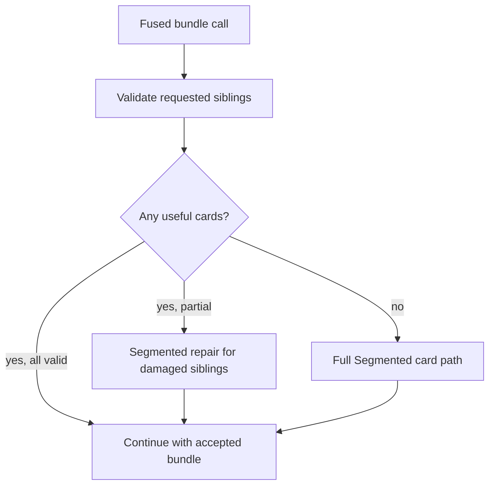
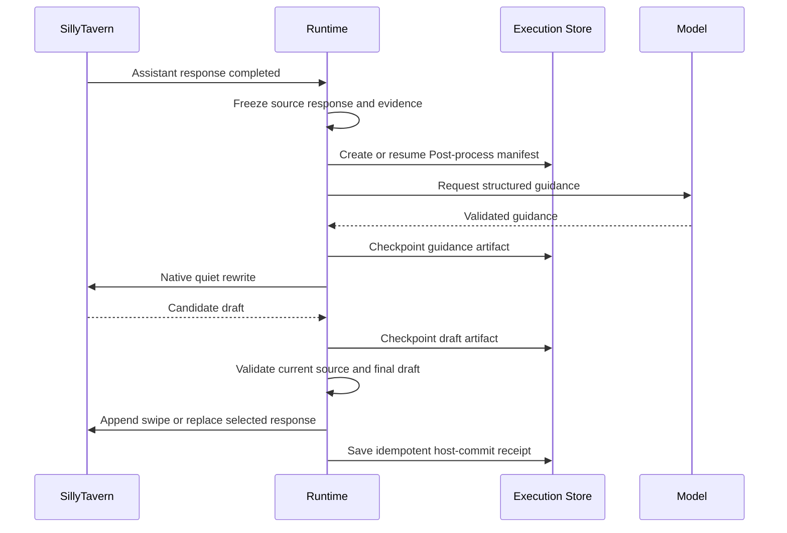

# Runtime Turn Sequence

This manual is the current execution-order authority for Recursion V1. It covers Segmented and Fused Pre-process work, SillyTavern story generation, optional Post-process work, durable checkpoints, and user recovery controls.

## Controls And Boundaries

| Control | Runtime effect |
| --- | --- |
| Power | Off aborts Recursion work, clears owned prompt keys, and prevents new preparation. |
| Auto / Manual | Auto lets the Arbiter choose from the runnable catalog. Manual restricts work to the operator-selected runnable families and sub-items. |
| Segmented / Fused | Segmented generates requested card families in separate narrow calls. Fused requests one bundle, validates every sibling, repairs useful partial bundles with Segmented calls, and uses full Segmented fallback only after zero useful cards. |
| Stop | Pauses the operation, aborts active Recursion work, requests native host Stop, clears owned prompts, and preserves accepted checkpoints. |
| Resume | Requests the matching native SillyTavern action and continues only after the host interceptor returns. |
| Retry Stage | Discards the failed stage's partial output and gives that stage a fresh configured attempt window. Accepted upstream checkpoints remain reusable. |
| Reprocess from here | Queues a next-swipe invalidation for the chosen stage and its dependents. It does not interrupt or race the active run. |
| Full Rebuild | Queues one fresh Pre-process pass for the next matching swipe. The click starts no provider or host work. |

Pipeline choice is separate from Auto/Manual. Post-process is separate from both. Pre-process prepares guidance before host generation. Post-process begins only after a completed assistant response lands and cannot block the original host generation.

## Execution State

Each operation has one durable manifest with:

- operation id, chat key, kind, pipeline, source revision, and settings revision;
- ordered stage ids and dependency edges;
- stage state, attempt number, elapsed time, failure class, and artifact references;
- lifecycle codes for stop, resume, retry, invalidation, completion, stale, and abandonment;
- a queued intent reference when one will affect the next matching swipe.

Artifact bodies live in separate hash-addressed records. The manifest never embeds source text, prompts, model output, draft prose, or commit payloads.

The scheduler recognizes these stage states:

- `pending`
- `running`
- `paused`
- `failed`
- `completed`
- `cached`
- `stale`
- `skipped`

Only model stages consume `Attempts per step`. The setting range is one through five and defaults to two total attempts per model stage. Snapshotting, validation, cache reads, persistence, prompt installation, and host commits do not consume the window.

Recursion sets no default generation timeout. A slow call remains pending until it returns, its provider fails it, or the user stops it. Provider-owned deadlines may still surface as provider failures. A pending call is never duplicated merely because it is slow.

## Pre-process Sequence

```mermaid
sequenceDiagram
    participant User
    participant Host as SillyTavern
    participant Runtime
    participant Store as Execution Store
    participant Model

    User->>Host: Send or swipe
    Host->>Runtime: Generation interceptor
    Runtime->>Runtime: Freeze source and settings revisions
    Runtime->>Store: Consume queued intent
    Runtime->>Store: Create or resume Pre-process manifest
    Runtime->>Runtime: Validate reusable checkpoints
    Runtime->>Model: Run earliest incomplete model stage
    Model-->>Runtime: Structured result or known failure
    Runtime->>Runtime: Validate accepted result
    Runtime->>Store: Write artifact, then advance manifest
    Runtime->>Runtime: Continue dependency graph
    Runtime->>Host: Install validated prompt packet
    Runtime->>Store: Commit prepared-generation receipt
    Runtime-->>Host: Continue primary story generation
```

The detailed sequence is:

1. The generation interceptor captures a bounded active-chat snapshot and freezes source, settings, provider, card-catalog, and prompt-contract revisions.
2. Runtime consumes at most one queued intent:
   - full fresh invalidates all reusable Pre-process stages for this generation;
   - reprocess-from-here invalidates the selected stage and its dependency closure.
3. Runtime loads a compatible paused operation or creates a new Pre-process manifest.
4. The scheduler validates checkpoint references and begins at the earliest incomplete stage.
5. Arbiter planning stays model-authored. Invalid structured output may use the existing conservative local plan where the Arbiter contract permits it; deterministic code does not replace the Arbiter's narrative judgment.
6. Card work follows the selected pipeline.
7. Runtime selects a bounded hand, composes and validates the prompt packet, and stores accepted outputs as artifacts before advancing the manifest.
8. Runtime rechecks source and settings revisions under prompt-mutation serialization.
9. A current packet is installed through Recursion-owned SillyTavern prompt keys and recorded as a prepared-generation receipt.
10. The interceptor yields to SillyTavern only after successful preparation or an intentional bypass. Failed or paused stages, stale source checks, prompt installation failures, and unexpected preparation errors abort primary narration. The primary story request remains host-owned and is never automatically retried by Recursion.

### Segmented Card Wave

Segmented turns each requested card family into an independently checkpointed model stage. A failed family may consume its remaining attempt window without replaying accepted siblings. A later Resume or Retry Stage begins at the failed family, not at the Arbiter.

When several card jobs are dependency-independent, runtime may dispatch them as one bounded wave. Each result still receives an individual stage outcome and artifact reference. Valid siblings remain accepted when another sibling fails.

### Fused Card Wave

Fused sends one structured bundle call after Arbiter and scope resolution.

```mermaid
flowchart TD
    Bundle["Fused bundle call"] --> Validate["Validate requested siblings"]
    Validate --> Useful{"Any useful cards?"}
    Useful -- "yes, all valid" --> Continue["Continue with accepted bundle"]
    Useful -- "yes, partial" --> Repair["Segmented repair for damaged siblings"]
    Useful -- "no" --> Fallback["Full Segmented card path"]
    Repair --> Continue
    Fallback --> Continue
```

Unrequested, duplicate, wrong-source, or invalid siblings are rejected individually. Partial success is checkpointed before repair begins. Full Segmented fallback is reserved for a bundle with no useful accepted cards.

## Stop, Resume, Retry, And Reprocess

Stop is operation-scoped:

1. Runtime assigns one Stop owner and memoizes the cleanup.
2. It pauses the V2 graph, aborts active provider and Post-process work, and requests native host Stop once.
3. A late result fails the current-operation guard and cannot update artifacts, prompt keys, or host text.
4. Runtime waits for settlement, clears owned prompt lanes once, and leaves accepted upstream artifacts referenced.
5. The active stage settles paused. The progress row exposes Resume; a known retryable failure exposes Retry Stage.

Resume preserves the stage's attempt history. It requests the stored native Send, Swipe, or Regenerate action and makes no provider call directly. The graph continues only when the matching host interceptor returns. If the stopped call had already been dispatched, it consumed an attempt. Retry Stage explicitly resets only that stage to the configured total attempt window and removes its partial artifact.

`Reprocess from here on the next swipe` remains available on eligible completed or stale rows after the fleeting active state is gone. Clicking it queues a turn-bound dependency invalidation and starts nothing. The queued row action becomes `Cancel queued reprocess`. The next matching swipe consumes it once; a new user message or source mismatch cancels it.

The idle Full Rebuild action follows the same queued model at operation scope. Its accessible labels are `Rebuild all Recursion work on the next swipe` and `Full rebuild on next swipe: Queued`. A second click cancels the queued intent. The previous Last Brief remains visible until another native generation starts.

## Post-process Sequence

Post-process starts only after SillyTavern has committed an assistant message and the selected response is stable.

```mermaid
sequenceDiagram
    participant Host as SillyTavern
    participant Runtime
    participant Store as Execution Store
    participant Model

    Host->>Runtime: Assistant response completed
    Runtime->>Runtime: Freeze source response and evidence
    Runtime->>Store: Create or resume Post-process manifest
    Runtime->>Model: Request structured guidance
    Model-->>Runtime: Validated guidance
    Runtime->>Store: Checkpoint guidance artifact
    Runtime->>Host: Native quiet rewrite
    Host-->>Runtime: Candidate draft
    Runtime->>Store: Checkpoint draft artifact
    Runtime->>Runtime: Validate current source and final draft
    Runtime->>Host: Append swipe or replace selected response
    Runtime->>Store: Save idempotent host-commit receipt
```

Unified runs one guidance and rewrite sequence for all enabled Post-process categories. Progressive repeats the guidance/rewrite pair in category order and carries only the latest valid checkpoint forward.

The host-commit stage is idempotent. Before mutating the selected assistant response, runtime checks for a matching commit receipt. A resumed operation cannot append the same swipe twice or repeat a replacement already committed.

Stop pauses Post-process without hiding or destroying the original assistant response. Resume can reuse accepted guidance and draft artifacts. Failed or stale work never commits a host mutation.

## Source Changes And Stale Work

Message deletion, message update, character change, chat change, or an outside swipe selection can invalidate the frozen source basis. Runtime immediately clears stale Recursion prompt keys, marks incompatible execution stages stale, and rejects late writes.

Staleness is dependency-aware:

- a source or settings mismatch invalidates the first affected stage and all dependents;
- unrelated accepted work may remain reusable when its contract still matches;
- stale operations retain bounded metadata for explanation but no artifact bodies;
- abandoned operations are fully pruned.

Chat change stops in-memory work for the old chat. Durable paused state remains chat-scoped and can be resumed only after the matching chat and source revision are active again.

## Host Generation Stop

SillyTavern `GENERATION_STOPPED` is distinct from stopping a Recursion stage. Runtime:

- aborts active Recursion preparation;
- clears Recursion-owned prompt keys;
- cancels any pending Post-process trigger for the stopped host generation;
- rejects late installs or response mutations;
- does not retry or restart the primary story generation.

Accepted Pre-process checkpoints can remain eligible for a later independently validated swipe or send.

## Contextual Progress Actions

Each progress row reserves one fixed 24px action slot:

| Row state | Action |
| --- | --- |
| Active model stage | Stop |
| Paused stage | Resume |
| Retryable failed stage | Retry Stage |
| Eligible completed or stale stage | Reprocess from here on the next swipe |
| Queued stage | Cancel queued reprocess |
| Ineligible or untouched stage | No action |

Only one action appears. The control is icon-first, cyan when selected or queued, and explained through a hover tooltip plus accessible label. Mobile truncates the stage label before shrinking the action target.

## Storage And Privacy

Terminal cleanup retains only what can still serve a valid purpose:

- completed Pre-process: referenced reusable checkpoints;
- completed Post-process: the final accepted rewrite and host-commit receipt;
- running or paused: artifacts required to continue safely;
- stale: bounded manifest metadata, no artifacts;
- abandoned: neither manifest nor artifacts.

Repair removes orphaned, superseded, or malformed artifacts without deleting in-flight artifacts written immediately before their manifest commit.

Normal diagnostics may expose operation/stage ids and states, attempts, elapsed time, failure class, hashes, byte counts, stale fields, and bounded lifecycle codes. They do not expose artifact bodies, prompts, provider responses, transcript text, draft prose, hidden reasoning, or secrets. Explicit diagnostic excerpts are opt-in and bounded.

Reset Turn Cache removes generated work for the active turn, queued intent, prepared-generation state, in-memory packet/hand/plan state, and Recursion-owned prompt keys without changing SillyTavern messages. Clear Run Journal is a separate action.

## Failure Outcomes

| Condition | Required outcome |
| --- | --- |
| Provider call remains slow | Keep waiting; do not create a duplicate attempt. |
| Known provider or validation failure with attempts remaining | Dispatch the next attempt for that model stage only. |
| Model stage exhausts attempts | Mark the stage failed and preserve accepted upstream checkpoints. |
| Fused partial bundle | Checkpoint useful siblings and repair damaged siblings with Segmented stages. |
| Fused zero-useful bundle | Continue through the full Segmented card path. |
| Stop during Recursion work | Pause operation and expose Resume or Retry Stage. |
| Source revision changes | Reject late results and stale affected stages plus dependents. |
| Prompt install fails | Record a sanitized warning; host chat generation remains usable without Recursion injection. |
| Post-process fails before commit | Preserve the original host response and expose recovery on the failed stage. |
| Host commit response is uncertain | Reconcile against the idempotent receipt before any retry. |
| SillyTavern generation is stopped | Clean up Recursion state; never auto-retry primary story generation. |
