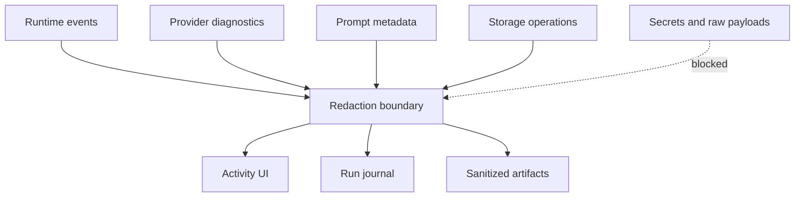
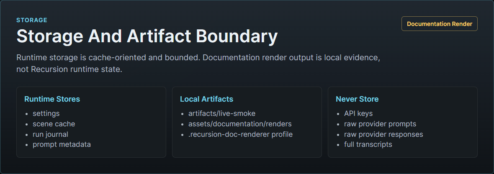
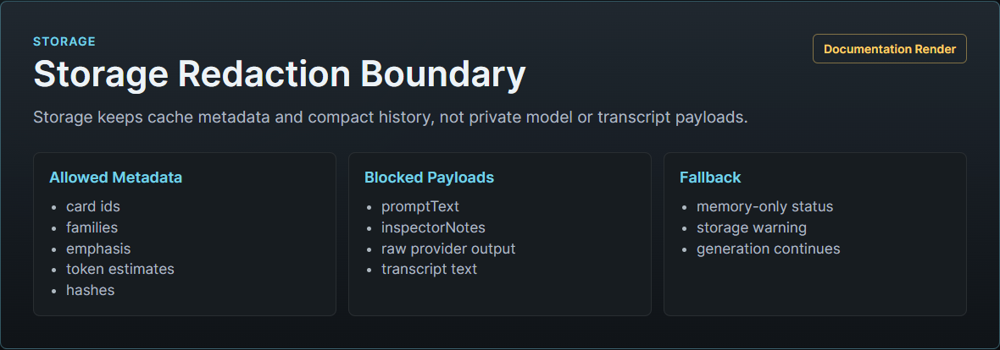

# Storage And Diagnostics

This is the release-facing technical manual for Recursion storage and diagnostics. The implementation-facing source contract remains [Storage and Diagnostics Spec](../architecture/STORAGE_AND_DIAGNOSTICS.md).

Recursion storage is cache-oriented. It makes current-scene prompt compilation fast, inspectable, and recoverable without becoming a memory system or campaign save.

## Settings Vs Logical Records

`extension_settings.recursion` stores compact controls:

- mode
- strength
- prompt footprint
- focus
- Reasoner use
- final prompt injection placement, role, and depth controls
- provider preferences without secrets
- diagnostics limits
- small UI preferences

Logical JSON records store larger bounded data:

| Logical key | Purpose |
| --- | --- |
| `recursion-system-index.v1.json` | Rebuildable index of known Recursion records. |
| `recursion-scene-{chatKey}-{sceneKey}.v1.json` | Scene-local card deck, latest hand, source hashes, versions, and cache state. |
| `recursion-run-journal-{chatKey}.v1.json` | Bounded sanitized runtime, provider, prompt, storage, and activity events. |

The storage repository constructs keys. Runtime and UI modules do not build physical paths directly.

## Scene Cache

Scene cache records contain:

- record type and schema version
- chat key and scene key
- cache state
- card records
- latest hand metadata
- source hashes and scene fingerprint
- contract version metadata

Cards are truncated, normalized, redacted, and bounded before write. Scene caches can be deleted and rebuilt from the active chat snapshot plus Utility outputs.

## Run Journal

The run journal is a ring buffer, not an archive. It stores compact entries with event names, severity, summary, run id, scene key, sanitized details, hashes, and metrics.

Provider journal entries are diagnostic only. A journal write failure cannot break the generation path.

Committed Auto and Semi-Auto prompt install attempts write a `hand.selected` breadcrumb. The entry is metadata only: hand id, selected and omitted counts, up to 16 selected card ids/families/roles/emphasis/token estimates with `listedCount` and `truncated`, source hash, prompt packet hash, and compact metrics. It must not persist card `promptText`, prompt packet sections, inspector notes, raw provider prompts, raw provider responses, transcript text, or secrets.

## Activity Event Contract

Activity events feed the Recursion Bar, Hero Pixel Array progress menu, Full Viewer, and selected journal entries. Events include run id, phase, foreground/background/review mode, severity, label, compact detail, chips, provider lane, composer lane, card counts, and fallback reason.

The progress menu renders the latest active run state. The Full Viewer can show bounded diagnostic history.

## Redaction

Redaction is centralized in core, activity, provider, storage, prompt, runtime, and UI boundaries. Sensitive key names, forbidden diagnostic payload keys, and secret-looking text are replaced or truncated before diagnostics persist or render.

Allowed default diagnostics:

- schema versions
- provider lane and source type
- resolved provider and model labels
- status categories
- durations and token counts
- card ids, families, statuses, emphasis, and token estimates
- hand selection counts and selected card identity metadata
- source message ranges and hashes
- prompt packet hashes and omission reasons
- cache hit, stale, index update, and prune events

Forbidden default diagnostics:

- API keys
- authorization headers
- cookies
- raw provider prompts
- raw provider responses
- full transcripts
- hidden reasoning
- private story plans
- inspector-only notes in prompt logs
- raw World Info, Memory Book, Summaryception, or VectFox data
- full local paths when a logical key is enough

Shared redaction treats `rawPrompt`, `rawResponse`, `providerPrompt`, `providerResponse`, `hiddenReasoning`, `privateStoryPlan`, `privatePlan`, and `sessionId` as forbidden diagnostic keys. Safe counters such as `tokenCount` and `sessionCount` remain allowed.







## Invalidation

Hard invalidation retires scene cache records when chat identity, scene fingerprint, source hashes, schema version, card catalog version, provider contract, prompt composition contract, or record validation no longer matches.

Runtime V1 writes this scene-cache contract metadata on every cache save:

```ts
versions: {
  storageSchemaVersion: 1;
  runtimeCacheContractVersion: 1;
  cardCatalogHash: string;
  promptPacketVersion: 1;
  providerContractHash: string;
  settingsHash: string;
}
```

`cardCatalogHash` is derived from the full V1 card catalog. `promptPacketVersion` is the prompt packet contract used by the composer. `providerContractHash` is derived from provider role ids and expected provider response schemas. `settingsHash` is derived from cache-relevant normalized settings, excluding UI state, diagnostics, provider test results, resolved display labels, and raw secrets.

When `storageSchemaVersion`, `runtimeCacheContractVersion`, `cardCatalogHash`, `promptPacketVersion`, or `providerContractHash` is missing or mismatched, runtime treats the record as a hard contract mismatch: cached cards are hidden from the Utility Arbiter prompt, the cache is best-effort marked `invalid` with reason `contract-mismatch`, and the scene rebuilds. When only `settingsHash` is missing or mismatched, runtime treats the record as soft settings drift: the cache is best-effort marked `stale` with reason `settings-changed`, but compact cached-card metadata remains visible to the Arbiter so it can decide whether reuse is still valid.

Soft invalidation asks the Arbiter to review when the user refreshes, provider settings change, freshness caps expire, the source window advances, token budgets change, or cards fail validation.

The storage repository exposes `invalidateSceneCache(chatKey, sceneKey, options)` for soft invalidation. When the scene cache exists, the repository preserves `cards`, `latestHand`, `source`, and `versions`, sets `cacheState: 'stale'` by default, writes sanitized `invalidation` metadata, keeps the scene cache index entry current, and appends a run journal entry:

```ts
{
  cacheState: 'stale';
  invalidation: {
    reason: string;      // bounded, defaults to "runtime-change"
    detectedAt: string;  // valid timestamp
    details?: object;    // JSON-safe and redacted
  };
}
```

The journal entry uses `event: 'cache.invalidated'`, `severity: 'info'`, the sanitized `sceneKey`, optional `runId`, and redacted reason/details. If no cache file exists, `invalidateSceneCache` returns `{ ok: false, reason: 'missing-cache', key }` and does not create a stale cache.

Runtime V1 reasons are `user-refresh`, `settings-changed`, `provider-changed`, `provider-key-cleared`, `chat-changed`, and `source-changed`. Chat-change invalidation is best-effort against the previously active scene cache when a cache reference exists; it does not create a new cache for the newly selected chat. Source-change invalidation is best-effort when SillyTavern reports a message delete, update, or swipe event; runtime clears the stale prompt immediately and leaves later source-window validation to reject any cached card whose evidence no longer matches. Details must not persist API keys, bearer tokens, `sk-...` tokens, private secrets, raw provider payloads, hidden reasoning, or raw message text.

Pre-alpha records can be invalidated and rebuilt instead of migrated through compatibility shims.

## Cleanup And Index Maintenance

Current storage behavior normalizes records whenever they are loaded or written. Scene cache saves and run journal appends update `recursion-system-index.v1.json` with the logical key, record kind, chat key, and update time. Scene cache clears remove the corresponding index entry. Run journals are bounded to the configured entry limit during normalization.

The repository also exposes `repairIndex()` for bounded cleanup. It rebuilds the system index from valid discoverable Recursion scene caches and run journals when the adapter supports key discovery, prunes missing or invalid index entries, preserves unreadable entries instead of guessing, and returns sanitized `storage.repaired` / `storage.pruned` diagnostics. It does not delete scene cache files, run journal files, SillyTavern data, or non-Recursion extension records.

`pruneSceneCaches(options)` is the explicit retention pass for cache files. It first repairs the index, then deletes old unprotected Recursion scene caches beyond `maxPerChat` and `maxTotal`, updates the system index, and returns sanitized `storage.pruned` diagnostics. `protectedScenes`, `protectedKeys`, or `activeScene` keep the active scene even when it is older than other caches. The prune pass revalidates each deletion candidate, preserves unreadable entries instead of guessing, deletes only confirmed `recursion-scene-*.v1.json` records, and never touches run journals, SillyTavern chats, character data, World Info, Memory Books, Summaryception data, VectFox data, or non-Recursion extension records.

If the host storage adapter downgrades a scene-cache or system-index write to memory fallback, the repository returns `storageStatus: { persisted: false, fallback: "memory" }` on the saved record and emits a `storageWarning` activity event instead of `Storage ready`. Generation remains fail-soft, but the UI and diagnostics must not imply durable persistence.

Cleanup never deletes SillyTavern chats, character data, World Info, Memory Books, Summaryception data, VectFox data, or non-Recursion extension records.

## Artifact Relationship

Test artifacts live under `artifacts/` and follow [Artifact Contract](../testing/ARTIFACT_CONTRACT.md). Artifacts are evidence, not runtime storage. Current runtime storage remains the settings object, scene cache, run journal, and system index.

## Tests

Focused tests should cover:

- settings persistence without session API keys
- logical key sanitization
- scene cache schema and size limits
- source hashes rather than full transcript archives
- run journal ring-buffer behavior
- redaction of secrets and raw provider I/O
- invalidation for chat, scene, source, provider, settings, schema, catalog, and prompt changes
- cleanup and index maintenance without touching non-Recursion records
- prompt install logs that store hashes and ids instead of raw prompt bodies
