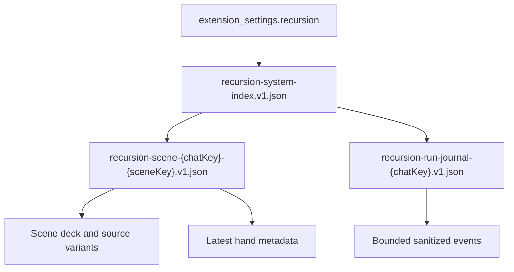
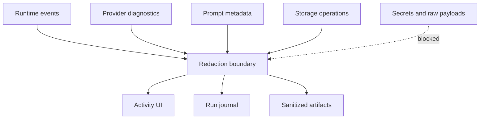

# Storage And Diagnostics

This is the release-facing technical manual for Recursion storage and diagnostics. The implementation-facing source contract remains [Storage and Diagnostics Spec](../architecture/STORAGE_AND_DIAGNOSTICS.md).

Recursion storage is cache-oriented. It makes current-scene prompt compilation fast, inspectable, and recoverable without becoming a memory system or campaign save.

## Settings Vs Logical Records

`extension_settings.recursion` stores compact controls:

- mode
- card scope
- strength
- prompt footprint
- focus
- Reasoner use
- final prompt injection placement, role, and depth controls
- provider preferences without secrets
- retention caps for source windows, provider snapshots, scene caches, source variants, and run journals
- diagnostics excerpt preferences
- small UI preferences

Logical JSON records store larger bounded data:

| Logical key | Purpose |
| --- | --- |
| `recursion-system-index.v1.json` | Rebuildable index of known Recursion records. |
| `recursion-scene-{chatKey}-{sceneKey}.v1.json` | Scene-local card deck, latest hand, source hashes, versions, and cache state. |
| `recursion-run-journal-{chatKey}.v1.json` | Bounded sanitized runtime, provider, prompt, storage, and activity events. |
| `recursion-pipeline-run-{chatKey}.v1.json` | Metadata-only current execution manifest and checkpoint graph. |
| `recursion-pipeline-artifact-{chatKey}-{operationId}-{artifactId}-v1.json` | Isolated body for one resumable stage. |
| `recursion-queued-reprocess-{chatKey}.v1.json` | One-shot full-fresh or dependency-aware stage intent. |

The storage repository constructs keys. Runtime and UI modules do not build physical paths directly.

`extension_settings.recursion.retention` owns the persisted caps shown in the Context Windows and Storage Retention sections:

- Source Messages: recent visible messages used for source freshness; shown as Source Freshness Messages.
- Source Text Budget: character budget for the source freshness window; shown as Source Freshness Text Budget.
- Provider Messages: recent visible messages sent to Recursion analysis calls; shown as Provider Analysis Messages.
- Scene Caches / Chat: unprotected scene-cache files retained per chat.
- Scene Caches Total: unprotected scene-cache files retained across chats.
- Swipe Variants / Scene: source variants retained inside one scene cache.
- Journal Entries: sanitized run-journal entries retained per chat.

These caps never delete, hide, summarize, or rewrite SillyTavern chat messages. They only bound Recursion-owned windows, caches, and diagnostics. Long-chat scaling is handled by the bounded source window: Recursion walks backward from the latest visible chat message until Source Freshness Messages or Source Freshness Text Budget is reached, then uses that bounded window for source hashes and cache freshness. Older chat messages remain in SillyTavern and can still be used by SillyTavern presets or other extensions.

## Scene Cache

Scene cache records contain:

- record type and schema version
- chat key and scene key
- cache state
- card records
- latest hand metadata
- source hashes and scene fingerprint
- active source revision hash
- bounded source variants
- contract version metadata

Cards are truncated, normalized, redacted, and bounded before write. Scene caches can be deleted and rebuilt from the active chat snapshot plus Utility outputs.

Source variants let Recursion survive SillyTavern swipe A/B/A flows without reusing the wrong cards. A cache has one `activeSourceRevisionHash`, a bounded `variantOrder`, and up to `retention.sourceVariantsPerScene` `variants`. Each variant owns the cards, latest hand metadata, source range, and source revision for one exact visible source state. The top-level `cards` and `latestHand` mirror the active variant for simple inspection, but runtime reuse reads only the exact active source variant when variants exist.

The source revision is not raw transcript text. It is a hash over visible message identity, role, text hash, and swipe metadata such as active swipe id, swipe count, and active swipe text hash. Inactive swipe text does not affect the revision until it becomes the active SillyTavern swipe.

## Run Journal

The run journal is a ring buffer, not an archive. It stores compact entries with event names, severity, summary, run id, scene key, sanitized details, hashes, and metrics.

Provider journal entries are diagnostic only. A journal write failure cannot break the generation path.

Committed Auto and Manual prompt install attempts write a `hand.selected` breadcrumb. The entry is metadata only: hand id, selected and omitted counts, up to 16 selected card ids/families/roles/emphasis/token estimates with `listedCount` and `truncated`, source hash, prompt packet hash, and compact metrics. It must not persist card `promptText`, prompt packet sections, inspector notes, raw provider prompts, raw provider responses, transcript text, or secrets.

## Resumable Execution Records

The chat-scoped manifest stores operation phase/state, source and settings provenance, stage states, attempt counts, timestamps, failure classes, dependency hashes, output hashes, artifact byte counts, stale fields, frontier ids, and queued stage ids. Stage prose never belongs in `summary`, activity, journal, exported diagnostics, or chat markers.

Dedicated artifacts may contain the frozen snapshot, Arbiter result, cards, deck, hand, guidance, packet, Post-process source, draft, or commit receipt required by that stage. They are referenced by logical key and SHA-256. A checkpoint is trusted only when the stored body hashes and validates against current stage/dependency/provenance contracts.

Running and paused current operations retain their operation artifacts. Completed Pre-process artifacts remain eligible cache. Successful Post-process cleanup deletes source/guidance/intermediate drafts and keeps the final accepted draft plus host-commit receipt. Stale artifacts are removed during repair/retention, abandoned operations are removed completely, and repair deletes unreferenced artifacts from superseded or interrupted writes.

## Activity Event Contract

Activity events feed the Recursion Bar, Hero Pixel Array progress menu, Full Viewer, and selected journal entries. Events include run id, phase, foreground/background/review mode, severity, label, compact detail, chips, provider lane, composer lane, card counts, and fallback reason.

The progress menu renders the latest active run state. The Full Viewer can show bounded diagnostic history.

## Redaction

Redaction is centralized in core, activity, provider, storage, prompt, runtime, and UI boundaries. Sensitive key names, forbidden diagnostic payload keys, and secret-looking text are replaced or truncated before diagnostics persist or render.

Allowed default diagnostics:

- schema versions
- provider lane and source type
- resolved provider and model labels
- status categories
- durations and token counts
- card ids, families, statuses, emphasis, and token estimates
- hand selection counts and selected card identity metadata
- card-scope counts, selected family keys, selected sub-item keys, and compact scope labels
- current behavior-setting labels, effective footprint, card-scope labels, and compact policy-shaping reasons when implemented
- source message ranges and hashes
- prompt packet hashes and omission reasons
- cache hit, stale, index update, and prune events
- operation/stage ids and states, attempt counts, elapsed time, failure class, artifact hash/bytes, stale fields, and bounded lifecycle codes

Forbidden default diagnostics:

- API keys
- authorization headers
- cookies
- raw provider prompts
- raw provider responses
- full transcripts
- checkpoint artifact bodies copied into diagnostics, activity, journals, or chat markers
- hidden reasoning
- private story plans
- inspector-only notes in prompt logs
- raw World Info, Memory Book, Summaryception, or VectFox data
- full local paths when a logical key is enough

Shared redaction treats `rawPrompt`, `rawResponse`, `providerPrompt`, `providerResponse`, `hiddenReasoning`, `privateStoryPlan`, `privatePlan`, and `sessionId` as forbidden diagnostic keys. Safe counters such as `tokenCount` and `sessionCount` remain allowed.


```mermaid
flowchart TD
    Settings["extension_settings.recursion"] --> Index["recursion-system-index.v1.json"]
    Index --> Scene["recursion-scene-{chatKey}-{sceneKey}.v1.json"]
    Index --> Journal["recursion-run-journal-{chatKey}.v1.json"]
    Scene --> Deck["Scene deck and source variants"]
    Scene --> Hand["Latest hand metadata"]
    Journal --> Events["Bounded sanitized events"]
```


```mermaid
flowchart TD
    Runtime["Runtime events"] --> Redact["Redaction boundary"]
    Provider["Provider diagnostics"] --> Redact
    Prompt["Prompt metadata"] --> Redact
    Storage["Storage operations"] --> Redact
    Redact --> Activity["Activity UI"]
    Redact --> Journal["Run journal"]
    Redact --> Artifacts["Sanitized artifacts"]
    Secrets["Secrets and raw payloads"] -. "blocked" .-> Redact
```

## Invalidation

Hard invalidation retires scene cache records when chat identity, scene fingerprint, source hashes, schema version, card catalog version, provider contract, prompt composition contract, or record validation no longer matches.

Runtime V1 writes this scene-cache contract metadata on every cache save:

```ts
versions: {
  storageSchemaVersion: 1;
  runtimeCacheContractVersion: 1;
  cardCatalogHash: string;
  promptPacketVersion: 3;
  providerContractHash: string;
  settingsHash: string;
}
```

`cardCatalogHash` is derived from the full V1 card catalog. `promptPacketVersion` is the prompt packet contract used by the composer. `providerContractHash` is derived from provider role ids and expected provider response schemas. `settingsHash` is derived from cache-relevant normalized settings, including Auto/Manual mode and normalized card scope, and excluding UI state, diagnostics, provider test results, resolved display labels, and raw secrets.

When `storageSchemaVersion`, `runtimeCacheContractVersion`, `cardCatalogHash`, `promptPacketVersion`, or `providerContractHash` is missing or mismatched, runtime treats the record as a hard contract mismatch: cached cards are hidden from the Utility Arbiter prompt, the cache is best-effort marked `invalid` with reason `contract-mismatch`, and the scene rebuilds. When only `settingsHash` is missing or mismatched, runtime treats the record as soft settings drift: the cache is best-effort marked `stale` with reason `settings-changed`, but compact cached-card metadata remains visible to the Arbiter so it can decide whether reuse is still valid.

Soft invalidation asks the Arbiter to review when the user refreshes, provider settings change, freshness caps expire, the source window advances, token budgets change, or cards fail validation.

The storage repository exposes `invalidateSceneCache(chatKey, sceneKey, options)` for soft invalidation. When the scene cache exists, the repository preserves `cards`, `latestHand`, `source`, `versions`, and source variants, sets `cacheState: 'stale'` by default, writes sanitized `invalidation` metadata, keeps the scene cache index entry current, and appends a run journal entry:

```ts
{
  cacheState: 'stale';
  invalidation: {
    reason: string;      // bounded, defaults to "runtime-change"
    detectedAt: string;  // valid timestamp
    details?: object;    // JSON-safe and redacted
  };
}
```

The journal entry uses `event: 'cache.invalidated'`, `severity: 'info'`, the sanitized `sceneKey`, optional `runId`, and redacted reason/details. If no cache file exists, `invalidateSceneCache` returns `{ ok: false, reason: 'missing-cache', key }` and does not create a stale cache.

Runtime V1 reasons are `user-refresh`, `settings-changed`, `provider-changed`, `provider-key-cleared`, `chat-changed`, and `source-changed`. Chat-change invalidation is best-effort against the previously active scene cache when a cache reference exists; it does not create a new cache for the newly selected chat. Source-change invalidation is best-effort when SillyTavern reports a message delete, update, or older-message swipe event; runtime clears the stale prompt immediately and leaves later source-window validation to reject any cached card whose evidence no longer matches. A latest-assistant swipe retry keeps the existing prompt packet and is not recorded as `source-changed`. On a later swipe back to an earlier source revision, runtime may reuse that exact source variant if contracts and card evidence still validate. Details must not persist API keys, bearer tokens, `sk-...` tokens, private secrets, raw provider payloads, hidden reasoning, or raw message text.

Pre-alpha records can be invalidated and rebuilt instead of migrated through compatibility shims.

## Card Scope Diagnostics

Card scope is diagnostic metadata, not prompt text. Runtime may persist:

- normalized mode: `auto` or `manual`;
- selected family names from the fixed V1 catalog;
- selected sub-item keys under those families;
- selected/total counts and compact UI label;
- omission reasons such as `manual-scope-omitted:<family>`;
- exception reasons such as `auto-scope-exception:<family>`.

Runtime must not persist generated card text, provider prompt text, transcript text, or user-authored prose inside card-scope diagnostics. Sub-items are focus facets that guide a family card, not separate V1 card records and not separate prompt-injection lanes.

## Cleanup And Index Maintenance

Current storage behavior normalizes records whenever they are loaded or written. Scene cache, run journal, pipeline manifest, pipeline artifact, and queued-intent writes update `recursion-system-index.v1.json` with bounded logical metadata. Clears remove the corresponding entries. Run journals are bounded to `retention.runJournalEntries` during normalization.

The repository also exposes `repairIndex()` for bounded cleanup. It rebuilds the system index from valid discoverable Recursion records when the adapter supports key discovery, prunes missing or invalid index entries, removes pipeline artifacts not protected by the authoritative current manifest, preserves unreadable entries instead of guessing, and returns sanitized `storage.repaired` / `storage.pruned` diagnostics. It never touches SillyTavern data or non-Recursion extension records.

`maintainRetention(options)` is the runtime retention pass. It repairs the index, deletes old unprotected scene caches, removes stale operation artifacts and abandoned operations, updates the system index, and returns sanitized `storage.pruned` diagnostics. Running and paused current operations remain protected. `protectedScenes`, `protectedKeys`, or `activeScene` keep the active scene even when it is older than other caches.

If the host storage adapter downgrades a scene-cache or system-index write to memory fallback, the repository returns `storageStatus: { persisted: false, fallback: "memory" }` on the saved record and emits a `storageWarning` activity event instead of `Storage ready`. Generation remains fail-soft, but the UI and diagnostics must not imply durable persistence.

Cleanup never deletes SillyTavern chats, character data, World Info, Memory Books, Summaryception data, VectFox data, or non-Recursion extension records.

`Reset Scene Cache` immediately clears the current chat's scene cache, execution manifest, all operation artifacts, queued intent, in-memory execution view, and Recursion prompt residue. It never deletes chat messages.

## Artifact Relationship

Test artifacts live under `artifacts/` and follow [Artifact Contract](../testing/ARTIFACT_CONTRACT.md). Those evidence bundles are unrelated to runtime checkpoint artifacts, which live behind the storage repository and are never exported wholesale.

## Tests

Focused tests should cover:

- settings persistence without session API keys
- logical key sanitization
- scene cache schema and size limits
- source hashes rather than full transcript archives
- run journal ring-buffer behavior
- redaction of secrets and raw provider I/O
- invalidation for chat, scene, source, provider, settings, schema, catalog, and prompt changes
- cleanup and index maintenance without touching non-Recursion records
- prompt install logs that store hashes and ids instead of raw prompt bodies
