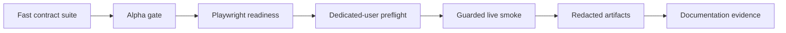

# Testing Strategy

Recursion testing should prove the extension is useful and safe without turning every verification path into a live SillyTavern run. The test framework has three execution layers plus one documentation evidence register:

| Layer | What it proves | Primary evidence |
| --- | --- | --- |
| Fast contract suite | Runtime contracts, schemas, card lifecycle, provider routing, storage, redaction, and prompt packet rules work without a live host. | Maintained deterministic gate: `node tools\scripts\run-alpha-gate.mjs`; focused scripts: `tools/scripts/test-*.mjs`. |
| Playwright readiness | Offline probe proves the local machine can launch/control Chromium through Playwright, use a role locator, switch desktop/phone viewports, and write trace/screenshot artifacts. If Playwright is unavailable, it returns `environment-fail` without contacting SillyTavern. | Current evidence: `check-playwright-readiness` report, trace, and viewport screenshots when Playwright is installed; otherwise a sanitized environment-fail report. |
| Focused live SillyTavern smoke | Current preflight proves dedicated-user rejection, dry-run behavior, report shape, fail-closed semantics, Recursion-owned storage probes, served-extension freshness, no-generation UI mount/open behavior, pipeline dropdown behavior, and opt-in generation bridge prompt-install evidence. | Current evidence: `check-sillytavern-soak-users`, `smoke-sillytavern-live`, and `prove-live-pipelines` reports, no-generation screenshots/trace, live log, served-extension comparison, storage probe artifact, browser snapshot, prompt-key hashes, Standard hand readiness, Rapid packet readiness, and prompt-packet metadata. |
| Documentation render tracking | Open screenshot needs remain visible until promoted; explanatory diagrams stay inline as Mermaid graphs or markdown tables. | [Documentation Render Tracking](DOCUMENTATION_RENDER_TRACKING.md), visible `<Render Needed>` markers, and promoted live UI assets under `assets/documentation/renders/`. |



The fast contract suite is the normal maintained confidence gate in this checkout. The live-harness scripts validate dedicated users, dry-run behavior, report shape, artifact paths, fail-closed semantics, offline Playwright readiness, SillyTavern storage probes when dedicated users are available, no-generation SillyTavern UI evidence, pipeline-specific visible-send proof, and opt-in generation bridge evidence when Recursion is installed for a dedicated user.

## Core Invariants

Highest-priority invariants:

- Power-off performs no chat inspection, provider calls, card updates, or prompt injection.
- Pipeline selection lives as a compact bar dropdown left of Mode and must not be duplicated as a Settings toggle.
- Manual mode uses card scope as a strict whitelist and must remain a distinct selectable mode.
- Auto mode may install prompt packets only through Recursion-owned SillyTavern prompt keys.
- Standard, Rapid, and Fused remain distinct pipelines; Standard keeps the full foreground path, Rapid uses background provider warm plus foreground Utility delta, and Fused uses one foreground card-bundle call. Warm miss escalates to Standard. Fused repairs damaged or missing siblings with targeted Standard card calls when at least one bundle item is trustworthy, and full Standard fallback is reserved for zero-trust bundles.
- Rapid background warm never installs prompt keys.
- Rapid foreground never creates local fallback cards, local scene briefs, local turn briefs, or summary fast-start packs.
- Rapid warm artifacts are exact-source keyed and must not survive source revision, settings/provider/catalog/prompt contract, or pipeline-version mismatch.
- Rapid invalid provider output and mandatory gaps escalate to Standard for the same pending user message.
- Prompt packet installation is replace-or-clear by Recursion metadata, not blind append.
- Stale provider results cannot update the active scene cache or active prompt packet.
- Older SillyTavern swipe changes clear stale Recursion prompts and cannot reuse cards from a different active source revision. Latest-assistant native swipe retries must preserve one assistant row with multiple swipe variants, process `MESSAGE_SWIPED` before the generation interceptor's `generationType: "swipe"`, reinstall the same prompt packet, record a `prepared-generation` cache hit, and perform no provider or storage work. The host-boundary regression must keep the assistant in `SillyTavern.getContext().chat` while the interceptor payload ends on the preceding user row, matching SillyTavern's native swipe payload. Post-generation editorial setting changes must not invalidate that artifact or clear its prompt lanes.
- Utility is the default provider lane for Arbiter and composition work.
- Reasoner composition is optional. Ordinary work must fall back to Utility or local composition when capability is `unconfigured`, `untested`, or `unhealthy`, or when a routed call fails. Medium+ Redirect instead remains unavailable and settles as a pre-generation skip unless Reasoner is `ready`; Low Redirect uses Utility.
- Runtime must trim over-budget `cardJobs` before provider card calls; deterministic tests should prove provider card-call count cannot exceed the effective hand budget for the turn.
- Generated card `promptText` must be instruction-shaped private evidence, not story prose or mini-scene narration.
- `guidanceComposer` provider-call success and prompt packet guidance acceptance are separate; tests should prove fallback reasons persist without raw guidance text.
- Direct endpoint API keys are session-only and never written to settings, cache, journals, reports, screenshots, artifacts, or prompt packets.
- Raw provider prompts and raw provider responses are not persisted by default.
- Character Motivation cards may produce behavior-facing motivation guidance but must not inject private internal-thought dumps.
- Hero Pixel Array progress stages visibly report foreground model calls, cache reuse, card refresh, prompt install, storage progress, fallback paths, warnings, and errors.
- Provider failure, storage failure, or injection failure must not block normal SillyTavern generation.
- Recursion tests must not mutate World Info, Memory Books, Summaryception, VectFox, unrelated SillyTavern data, or non-Recursion extension records.
- Automated live tests must reject `default-user`. Use dedicated test users such as `recursion-soak-a`, `recursion-soak-b`, and `recursion-soak-c`.

## Fast Contract Suite

The contract suite is runnable before any live SillyTavern host work. It uses the installed Playwright dev dependency for offline browser readiness and does not contact SillyTavern. The maintained gate command is:

```powershell
node tools\scripts\run-alpha-gate.mjs
```

The gate calls the focused local suite rather than duplicating test logic. Coverage groups:

- manifest and extension shell identity;
- host adapter fake contracts;
- settings normalization and session-only secret handling;
- pipeline setting normalization and compact pipeline-menu rendering;
- logical storage key safety;
- scene cache schema validation;
- Rapid warm artifact sanitization and exact-source cache validation;
- source-revision and swipe A/B/A cache-variant behavior;
- run journal redaction and ring-buffer pruning;
- provider lane routing, provider-payload normalization, and structured response parsing/repair;
- Utility Arbiter Auto Control Plan validation;
- Rapid turn-delta structured schema validation and warm-miss Standard escalation;
- card catalog, lifecycle, emphasis, detail, and hand-selection contracts;
- pre-generation card-job budgeting, instruction-shaped card text validation, and multiline Card Evidence rendering;
- Utility and Reasoner prompt packet composition;
- provider capability matrices for `unconfigured`, `untested`, `ready`, and `unhealthy`;
- field-scoped provider compare-and-swap updates, configuration revisions, and hash-bound health;
- Provider Test at the configured `8192` default ceiling, same-lane single-flight, and active-lane busy rejection;
- prompt budget trimming and omission reasons;
- prompt injection metadata, replacement, and clearing through a fake host;
- Rapid background warm provider calls, no prompt install, foreground warm-v2 install, warm-miss Standard escalation, hedged Utility winner selection, invalid-output Standard escalation, and mandatory-gap Standard escalation;
- activity event normalization and user-safe status text.

Focused contract tests should use deterministic fixtures and fake provider responses before live providers. `tools/scripts/test-provider-response-parser.mjs` owns provider-envelope extraction and syntax-repair cases. `tools/scripts/test-host.mjs` proves Connection Manager preserves raw responses for `machineJson` rather than collapsing malformed structured content to an extracted `{}`, and maps normalized low reasoning to SillyTavern's native `reasoning_effort: minimal` with private reasoning excluded. `tools/scripts/test-providers.mjs` owns router integration, sanitized repair diagnostics, stable failure codes, retry behavior, and the reviewer-only recovery that may restore omitted request-known schema/source metadata without accepting a wrong nonempty source hash. `tools/scripts/test-generation-review.mjs` owns the second semantic boundary: source hashes, exact target text, non-overlapping patches, installed-card outcome coverage, allowed status values and aliases, safe partial results, and the single shared correction budget. `tools/scripts/test-runtime.mjs` must exercise semantic correction with a populated installed hand in Standard, Rapid, and Fused, including an invalid status followed by a complete corrected ledger. Runtime/card tests own the remaining semantic boundary: repaired JSON still fails when it lacks the expected schema, snapshot hash, role, family, or valid evidence. If a live smoke finds a defect, add a focused contract regression where the behavior can be isolated without browser control.

Generation Review regressions additionally prove that SillyTavern streaming remains visible while review is pending and that exhausted invalid-target and invalid-card-outcome corrections are isolated to a red `Generation review` row. Standard, Rapid, and Fused fixtures must retain the original message and the successful prompt-ready state in that case; no invalid review may append a swipe or downgrade an already-installed prompt. The live enhancement proof must first prepare each pipeline's real installed hand and then require complete valid card-outcome coverage from the reviewer.

Generation Review requests must expose the frozen `sourceHash`, eligible target IDs, and installed card IDs as structured request fields, not prompt prose alone. Provider machine JSON schemas must bind the source hash and constrain patch IDs, evidence target IDs, and card-outcome IDs to those frozen sets before runtime semantic validation.

Editorial regressions must separate mechanical integrity from model-owned semantic judgment. Diagnosis, Transform, and Verification requests expose frozen evidence IDs as structured fields; Transform also exposes installed-card and repair-target IDs. Provider tests bind frozen identities and permit Redirect diagnosis fields to cite any request-known evidence ID while Repair/Recompose preservation remains narrower. Deterministic diagnosis tests reject fabricated IDs, stale hashes, malformed layouts, and unsafe bounds, but must not reject or rewrite known citations because of authority placement, character coverage, or pressure interpretation. Runtime tests prove the complete unfiltered Redirect proposal reaches the mandatory Verifier, whose `diagnosis-evidence-grounded` result decides semantic support together with the other eight checks. An accepted Redirect uses exactly Diagnostician, Transformer, and Verifier calls; semantic rejection ends after those three calls with no swipe and no rewrite loop. Diagnosis, Transform, and Verification share one malformed-output recovery token, limiting every run to at most one additional model call. Tests also require candidate-hash binding, accepted-marker cache reuse, and absence of private diagnosis text from prose, prompt, UI, and journal surfaces. Card lifecycle tests must recreate repeated cached/generated same-role waves and prove that only the newest card for each fixed generated role remains active before hand selection; the live enhancement proof rejects same-family `max-cards` omissions. `npm.cmd run prove:enhancements-live` is the dedicated Playwright gate with real configured model calls; it is intentionally separate from deterministic `npm.cmd test` and must require a `recursion-soak-*` user. Every live proof that claims Editorial Enhancement success must use the shared live-enhancement-run oracle. The oracle captures the run-journal baseline and every rendered progress transition before generation, including removed or replaced rows. It fails on any observed caution, warning, failure, warning/error journal entry, `provider.call.failed`, `prompt.install_skipped`, unmatched provider start, or skipped Enhancement. Success additionally requires final `Editorial diagnosis`, `Editorial candidate`, `Editorial verification`, and `Recursion prompt ready` rows to be `done` plus a validated Recursion-owned swipe or replacement marker.

Repair card-ledger regressions must prepare a real frozen hand from configurable
source cards, preserve only the source-card IDs that contributed to that hand,
and use generated packet text through frozen `packetRefs` without replacing
those IDs. Tests include an explicitly empty configured hand, the full supported
20-card generated packet, and more than 48 configured source-card obligations
to prevent generated-ID fallback or fixed-count truncation. The first Transform
result is validated strictly. A missing,
duplicate, unknown, or invalid outcome may consume exactly one shared correction
request. If the corrected Repair still lacks coverage while its bounded patch
remains independently safe, tests require exactly one applied swipe or
replacement, terminal `partial-failed` status, error journal severity, and red
children only for the dynamically unresolved card IDs. Recompose must continue
to reject incomplete coverage because it is a full rewrite. Redirect's existing
audit reconstruction must remain non-failing. A persisted `partial-failed`
marker must never be reused as a healthy cached Editorial result.

The checked-in `core` evaluation pack contains six Redirect cases covering turn
deferral, wrong focus, unsupported outcome, character pressure, supported
restraint, and unclear character-want evidence. Every explicit Redirect case must
return `proceed`, append exactly one verified swipe, and pass both the production
nine-check verifier and the independent four-criterion effectiveness judge.
Provider-authored Redirect decision noise is pinned to the selected `proceed`
identity when the structural proposal is usable; an empty proposal may spend the
single shared malformed-output correction token. Machine-JSON token exhaustion may
spend that same token on one compact retry. No Redirect operation may exceed four
model calls.
A skipped result never counts as Redirect success.

Run the focused deterministic gates before the real-model proof:

```powershell
npm.cmd run test:providers
node tools\scripts\test-provider-response-parser.mjs
node tools\scripts\test-editorial-transform.mjs
node tools\scripts\test-editorial-runtime.mjs
npm.cmd run test:runtime
npm.cmd run test:ui
npm.cmd run test:model-eval
npm.cmd run test:live-harness
node tools\scripts\test-live-enhancement-run-oracle.mjs
```

Then deploy the checkout only to a dedicated `recursion-soak-*` installation,
hash-check the served files, and run `npm.cmd run prove:enhancements-live`. Its exit
code comes exclusively from the shared strict oracle and semantic effectiveness
evaluation. Screenshots under `artifacts/live-redirect/<run-id>/` are supporting
visual evidence, not a substitute for the machine verdict. Automated proof must
never mutate `default-user`.

For the full live `core` pack, run `tools/scripts/eval-recursion-models.mjs`
directly with `--live --strict`; `npm.cmd run test:model-eval` is the deterministic
harness regression and does not forward CLI arguments into a live evaluation. The
live command must also name an existing dedicated-soak `--character-name` and
`--chat-file`, because its preliminary visible-send traversal is not synthetic.

`npm.cmd run prove:card-progress-live` is the real-model visual health gate for the rendered progress tree. It uses a dedicated `recursion-soak-*` user, selects Fused + Auto + Redirect through the mounted controls, installs the shared live-enhancement-run oracle, sends a real host turn, waits for rendered Editorial rows to become terminal, reopens the popover, and captures desktop and phone screenshots. The proof fails when the tree is empty or closed, when prompt readiness is not `done`, when any current or historical row is caution/warning/failed/skipped, when the run journal is unhealthy or incomplete, or when no validated Recursion-owned Enhancement mutation exists. Valid Recompose/Repair escalation is tested separately because it is intentionally a caution/no-write outcome rather than an Enhancement-success fixture.

## Playwright Readiness

### Editorial transformation UI matrix

`npm.cmd run prove:editorial-ui -- --dry-run` prints the complete no-generation
matrix. A live run requires `SILLYTAVERN_BASE_URL` and drives every editorial
mode (`Off`, `Repair`, `Recompose`, `Redirect`) across Standard, Rapid, and
Fused pipelines at desktop and compact-phone widths:

```powershell
$env:SILLYTAVERN_BASE_URL = 'http://127.0.0.1:8000'
$env:RECURSION_SILLYTAVERN_USER = 'recursion-soak-a'
npm.cmd run prove:editorial-ui
```

Each row opens the visible controls, checks the selected mode and pipeline,
captures a screenshot artifact, and fails on visible caution/error surfaces.
The run writes `artifacts/editorial-ui/report.json`; generation is never
triggered by this matrix. Set `EDITORIAL_UI_VISUAL_BASELINES=1` to enable the
stable screenshot baseline capture and dimension gate; dynamic regions must be
marked `data-recursion-visual-volatile` and are masked before comparison.

The Playwright readiness command must not contact SillyTavern. It proves browser automation is available before any live chat, user file, prompt, or provider state is touched. When Playwright is missing, it returns `environment-fail` with sanitized details.

The readiness probe should:

- launch Chromium through Playwright;
- drive a role or label locator click;
- capture console errors and page errors;
- switch between desktop and phone viewports;
- write screenshots and a trace when artifact capture is enabled;
- emit a concise JSON report and Markdown summary.

Readiness failures are environment failures, not Recursion runtime failures.

## Live SillyTavern Smoke

The current live smoke command is a guardrail script that validates safe user configuration and fails closed before mutation. The target live smoke proves Recursion in the real host. It should be focused and repeatable, not a Directive-style campaign certification run.

Live smoke must start with these gates:

- `SILLYTAVERN_BASE_URL` is configured and reachable.
- The configured SillyTavern user is a dedicated `recursion-soak-*` user.
- `default-user` is rejected before any mutation.
- Served extension manifest and selected source assets match the checkout under test, or the report clearly marks the run as stale/untrusted.
- The dedicated user can write, read, verify, and delete a Recursion-owned storage probe.
- Multi-user runs prove each configured soak user can see its own probe and cannot see another user's probe.
- Playwright readiness has passed in the current environment.

Primary live scenarios:

- extension mount and Recursion Bar render;
- Pipeline dropdown location and behavior: icon-only button left of Mode, Standard/Rapid/Fused rows, no duplicate Settings toggle;
- mode transitions: disabled power, Auto, Manual;
- pipeline transitions: Standard, Rapid, and Fused;
- provider setup display and Test Provider action for Utility and Reasoner;
- Manual prompt-install proof through the strict card-scope path;
- Auto mode Utility Arbiter pass, card refresh, hand selection, prompt packet composition, and prompt installation;
- Rapid warm evidence after assistant/source settle, proving cache-only provider work with no prompt-key installation;
- Rapid foreground evidence for warm-v2 prompt install or warm-miss Standard escalation, with no local fallback card or local brief diagnostics;
- Rapid mandatory-gap evidence, when fixtureable, proving Standard escalation rather than unsafe install;
- Last Brief dropdown reflects the cards used for the last prompt packet;
- Last Brief remains `ready` with the same packet and cards through Repair, Recompose, Redirect, delayed Enhancement-owned `MESSAGE_UPDATED` / `MESSAGE_SWIPED` events, and existing-swipe navigation;
- Last Brief leaves `ready` only after the native send/swipe/regenerate generation interceptor begins, with explicit swipe generation distinguished from a low-level swipe event;
- Hero Pixel Array progress menu shows model-call, cache, storage, composition, injection, fallback, and settled states;
- full viewer opens Now, Deck, Activity, Prompt Packet, Settings, and Providers views;
- prompt packet clear on power-off, chat change, disable, and teardown;
- Utility provider failure falls back without blocking host generation;
- Reasoner failure falls back to Utility or local composition without blocking host generation;
- storage repair and journal pruning report logical progress without leaking physical paths.

Generation-enabled smoke may use real model calls only when explicitly enabled by `RECURSION_LIVE_GENERATION=1` or `RECURSION_LIVE_REASONER=1`. The runner first completes the same dedicated-user, served-extension, storage, and UI checks as no-generation smoke, then switches Recursion to Auto, wraps `setExtensionPrompt` to record only Recursion prompt keys, hashes, lengths, and numeric placement metadata, drives the visible SillyTavern send controls when both input and send button are available and enabled, and asserts visible hand readiness plus prompt-packet metadata. Setter calls alone are not prompt-install proof: the runner also verifies finite numeric metadata in the shared `extensionPrompts` store and records marker-only evidence that the final `/api/backends/chat-completions/generate` request contains Guidance, Card Evidence, and Guardrails. It never persists raw request content. If no visible send controls exist, non-strict runs may use the public `recursionGenerationInterceptor` as a diagnostic direct-bridge fallback and must record that trigger source as `direct-bridge`. Strict generation runs fail direct-bridge fallback with `generation-direct-bridge-diagnostic`; V1 release proof requires visible send controls, serialized Recursion prompt evidence, and host generation continuation. If only one visible send control exists, or controls are visible but disabled, the run fails instead of falling back. Generation-enabled runs suppress screenshots and Playwright traces because those binary artifacts can capture chat/model text. The smoke does not score writing quality or store raw provider prompts/responses.

Pipeline-specific live proof is handled by:

```powershell
node tools\scripts\prove-live-pipelines.mjs --live --pipeline standard
node tools\scripts\prove-live-pipelines.mjs --live --pipeline rapid
node tools\scripts\prove-live-pipelines.mjs --live --pipeline fused
```

The script uses the same `SILLYTAVERN_BASE_URL`, `RECURSION_SILLYTAVERN_USER`, and dedicated-user guardrails as the smoke harness. It drives the real compact Pipeline dropdown, verifies the Pipeline button is left of Mode, verifies no Pipeline control appears in Settings, selects Injection placement, role, and depth through the visible Advanced settings controls, sends through visible SillyTavern controls, proves an assistant message follows the exact proof user message, and fails on browser console warnings/errors or page errors. The default live matrix covers Standard, Rapid, and Fused under both `in_prompt` and `in_chat`, with each placement isolated in its own browser context. Every row inspects the request-time SillyTavern prompt store and the actual `/api/backends/chat-completions/generate` request: `in_prompt` must store numeric position `0`, `in_chat` must store numeric position `1`, and all blocks must preserve the configured depth and role. Guidance, Card evidence, and Guardrails must then appear only in `system`-role outbound messages. Standard proof requires a ready hand. Rapid proof requires a `warm-v2` Rapid packet; a warm miss must be reported as Standard escalation, not as a Rapid summary install. Fused proof requires accepted bundle cards or a reported Standard fallback from an unusable bundle, never a silent empty-card install.

## Dedicated Live Users

Automated live tests use dedicated SillyTavern users:

```text
recursion-soak-a
recursion-soak-b
recursion-soak-c
```

Additional users may follow the same `recursion-soak-*` prefix. Scripts must normalize user handles and reject empty handles, `default-user`, ambiguous aliases for the default profile, and any non-dedicated handle before login, browser navigation, storage probes, chat mutation, prompt injection, or provider calls.

Harness code must not use `default-user` as a convenience fallback when a user is missing. Missing or unsafe user configuration is either a dry-run checklist for non-mutating commands or an `unsafe-user` failure for state-mutating commands.

`default-user` is manual-only. It may be used by a human operator for exploratory checks, but it must not produce automated pass/fail evidence and must not be accepted by state-mutating scripts.

## Artifact Policy

Every live run writes a timestamped report folder under:

```text
artifacts/live-smoke/sillytavern/<run-id>/
```

Required artifact families are defined in [Artifact Contract](ARTIFACT_CONTRACT.md). Normal no-generation UI reports should store hashes, ids, counts, bounded status text, screenshots, and traces. Generation-enabled reports should store text/JSON evidence only. They should not store raw provider prompts, raw provider responses, full transcript archives, API keys, cookies, authorization headers, private notes, or hidden reasoning.

Documentation renders are separate from run artifacts. Draft captures, raw traces, browser profiles, and local renderer output stay under `artifacts/` or `.recursion-doc-renderer/`. Only reviewed final assets move into `assets/documentation/renders/` and only then replace visible `<Render Needed>` markers. The open inventory and promotion rules live in [Documentation Render Tracking](DOCUMENTATION_RENDER_TRACKING.md).

## Pass And Fail Semantics

## Card And Editorial Proof Matrix

The focused suite must cover the live-facing contracts added on `card-system`: bundled Default Deck read-only behavior; custom deck/category/card CRUD; authored-card draft gating; `off`/`active`/`priority` cycles; bulk state actions; category/card drag ordering; Manual scope and Auto priority overflow; Card Assist commit boundaries; exact-source Rapid and swipe reuse; Fused partial repair; and visible normalized failure reasons.

Prepared Generation Artifact coverage is maintained by
`test-prepared-generation.mjs`, `test-runtime.mjs`,
`test-extension-smoke.mjs`, `test-diagnostics.mjs`, and
`test-live-harness.mjs`. The matrix includes exact and host-bounded suffix
identity, leading-deletion rejection, settings/deck/provider drift, artifact
integrity, zero-card hands, atomic install commit, final-snapshot races,
install failure, Force Fresh/Regenerate bypass, stop/retry, repeated swipes in
Standard/Rapid/Fused, zero provider calls, zero storage writes, one final cache
decision per attempt, teardown, and diagnostic redaction. The pure contract
test is part of `npm.cmd test` and the alpha gate, not a standalone optional
check.

Editorial tests must separately prove Repair, Recompose, and Redirect source binding, evidence references, patch bounds, installed-card outcome coverage, shared one-correction recovery, verifier rejection, `As Swipe`, `Replace`, and no-write failure. Redirect coverage must include Low Utility routing, ready Medium+ Reasoner routing, a visibly unavailable Medium+ row, unchanged selection on unavailable click, and a pre-generation blocked path that makes no Editorial calls and settles `skipped`. Capability-journal tests must cover configuration transitions, health transitions, stale results, and redaction. The live UI matrix must include the experimental Redirect label and red failure rows.

Live generation proof remains dedicated-user-only. Before browser navigation,
chat mutation, or provider calls, run
`node tools/scripts/verify-installed-copy.mjs --user <recursion-soak-user>` and
require byte-for-byte SHA-256 identity across the repository production
allowlist, installed user extension, and served public extension. Missing,
extra, mismatched, or symlinked production files fail the proof. Repeat the
verifier for `default-user` before any approved default-user proof.

Use these result categories:

- `pass`: required checks completed and no blocking warnings remain.
- `fail`: Recursion behavior violates a contract.
- `environment-fail`: browser, SillyTavern, auth, provider, filesystem, or network conditions prevented a valid run.
- `stale-extension`: SillyTavern served code does not match the checkout under test.
- `manual-required`: the script cannot safely proceed without a human action.
- `skipped`: a check was intentionally not run because its opt-in flag was absent.

Warnings may be acceptable for exploratory local smoke. Strict mode should promote warnings to failures.

## Non-Goals

V1 testing should not build:

- a 50-turn campaign soak;
- story-quality certification;
- campaign-specific factual-grounding review;
- cross-extension certification for Memory Books, Summaryception, VectFox, or World Info;
- long-form transcript replay;
- save branching proof;
- destructive edit/delete recovery proof beyond Recursion-owned prompt/cache cleanup;
- model-cost benchmarking beyond basic duration and token diagnostics.

Those are useful for Directive because Directive owns campaign state. Recursion owns a current-scene prompt compiler. Its live proof should stay aligned to that boundary.
