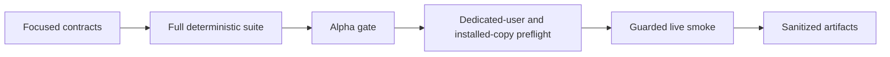

# Testing Strategy

Recursion testing proves the current-scene prompt compiler is resumable, observable, private, and fail-soft without making every verification path a live SillyTavern run.

| Layer | What it proves | Primary evidence |
| --- | --- | --- |
| Focused contract tests | One contract or state transition in isolation with fake providers, storage, and hosts. | `tools/scripts/test-*.mjs` |
| Full deterministic suite | Runtime, storage, provider, UI, documentation, and harness contracts agree. | `npm.cmd test` |
| Alpha gate | Full suite plus offline Playwright readiness. | `node tools/scripts/run-alpha-gate.mjs` |
| Guarded live smoke | Installed/served-copy identity and real SillyTavern UI, prompt, storage, and optional provider behavior. | Dedicated `recursion-soak-*` users and the live proof scripts |


```mermaid
flowchart LR
    Contract["Focused contracts"] --> Suite["Full deterministic suite"]
    Suite --> Alpha["Alpha gate"]
    Alpha --> Preflight["Dedicated-user and installed-copy preflight"]
    Preflight --> Live["Guarded live smoke"]
    Live --> Evidence["Sanitized artifacts"]
```

## Core Invariants

Every release candidate must preserve these boundaries:

- Power Off performs no new chat inspection, provider call, card update, or prompt installation and clears Recursion-owned prompt keys.
- Pipeline selection is an icon-only compact-bar control immediately left of Mode and is not duplicated in Settings.
- Segmented and Fused are the only V1 pipelines. Invalid persisted values normalize to Segmented.
- Segmented uses independently checkpointed, narrow per-card stages.
- Fused validates every requested sibling, uses Segmented repair when any useful item survives, and uses full Segmented fallback only after zero useful cards.
- The Arbiter remains model-authored; deterministic code validates and safely contains its output but does not replace its narrative judgment.
- Every Pre-process and Post-process operation has a durable manifest and separate artifact records.
- A stage advances only after its accepted artifact is durable.
- Only dispatched model calls consume `Attempts per step`; the setting range is one through five and defaults to two total attempts per model stage.
- Recursion has no default production generation timeout. Slow pending calls are not duplicated.
- Recursion never automatically retries SillyTavern's primary story generation.
- Stop aborts the active Recursion call and pauses the operation while preserving accepted checkpoints.
- Resume starts at the earliest incomplete stage. Retry Stage resets only that stage's attempt window and output.
- Reprocess from Here queues next-generation invalidation for the selected stage and its dependents; it does not race the current run.
- Queue a full fresh generation starts no work on click and is consumed once by the next send or swipe.
- Late or stale results cannot mutate artifacts, scene cache, prompt keys, activity truth, or host messages.
- Post-process host commits are idempotent; Resume cannot duplicate a swipe or replacement.
- Normal manifests and diagnostics never contain artifact bodies, raw prompts, raw provider responses, transcript text, draft prose, hidden reasoning, or secrets.
- Reset removes all Recursion-owned scene cache, execution manifests/artifacts, queued intents, prepared/in-memory state, journals, and prompt keys without touching SillyTavern chat history.
- Automated live tests reject `default-user`.

## Deterministic Suite

Run:

```powershell
npm.cmd test
node tools\scripts\run-alpha-gate.mjs
```

Focused tests use deterministic clocks, fake provider responses, fake host mutations, and in-memory or fake user-file storage before live providers.

### Execution Contracts

The execution suite includes:

- `test-execution-contracts.mjs`: operation, stage, artifact, failure, and queued-intent schema validation;
- `test-execution-storage.mjs`: manifest/artifact ordering, indexes, repair, retention, and reset;
- `test-execution-attempt-policy.mjs`: one-to-five attempt normalization, total-attempt semantics, current-operation guards, and model-only consumption;
- `test-execution-scheduler.mjs`: dependency traversal, checkpoints, pause/resume, retry, stale rejection, and completion;
- `test-preprocess-graph.mjs`: Segmented/Fused Pre-process stage graphs and invalidation closures;
- `test-runtime-preprocess.mjs`: runtime integration, accepted checkpoint reuse, full-fresh consumption, and prompt installation;
- `test-queued-reprocess.mjs`: next-generation stage/dependent invalidation and cancellation;
- `test-execution-privacy.mjs`: manifest allowlists, artifact separation, sanitized diagnostics, and cleanup;
- `test-ui-actions.mjs`: contextual action selection, exact labels, and one-action ownership.

Required execution cases:

1. A successful upstream stage is not called again after a later stage fails and Resume runs.
2. Stopping a dispatched model call consumes that attempt but preserves earlier artifacts.
3. Retry Stage resets only the selected stage's configured attempt window.
4. A slow unresolved call never causes a parallel duplicate attempt.
5. A stale late success cannot overwrite a newer operation.
6. A queued reprocess invalidates exactly the selected stage and its dependency closure on the next generation.
7. A full-fresh intent bypasses every reusable Pre-process artifact exactly once.
8. Artifact write followed by manifest commit is repair-safe; repair does not delete the just-written in-flight artifact.
9. Stale runs lose artifacts but keep bounded metadata; abandoned runs are fully pruned.
10. Post-process Resume reconciles the host-commit receipt before any mutation.

### Pipeline Contracts

`test-pipeline-segmented.mjs`, `test-pipeline-fused.mjs`, card tests, and runtime tests prove:

- Segmented creates one independently accepted outcome per requested card family;
- valid siblings survive a failed sibling;
- Fused rejects unrequested, duplicate, malformed, wrong-source, or wrong-family items independently;
- a useful partial bundle checkpoints accepted items before Segmented repair;
- a zero-useful bundle enters the full Segmented card path;
- Manual scope remains a strict whitelist;
- runtime trims over-budget card jobs before provider dispatch;
- generated card text remains instruction-shaped evidence rather than story prose.

### Provider And Attempt Contracts

Provider tests prove:

- Utility/Reasoner routing and capability states;
- Connection Profile routing and profile-backed request shapes;
- session-only secret handling;
- structured response extraction, safe JSON repair, and semantic rejection;
- stable failure classes and sanitized messages;
- production calls have no implicit Recursion deadline;
- Provider Test may use its own explicit bounded diagnostic deadline;
- another attempt is dispatched only after a known failure, while current, with budget remaining;
- provider failure cannot block ordinary SillyTavern chat generation;
- no Recursion path automatically retries the host's primary story request.

### Post-process Contracts

The Post-process suite proves:

- the source assistant response, visible evidence, Pre-process packet, active deck, and settings are frozen before work;
- Unified and Progressive preserve their ordering;
- guidance and each accepted draft are separate resumable artifacts;
- Stop leaves the original response visible and unmodified;
- As Swipe adds exactly one selected source-bound swipe;
- Replace changes only the selected response after complete success;
- host-commit receipts make replay idempotent;
- stale, failed, or exhausted work cannot mutate host text;
- terminal cleanup keeps only the final accepted rewrite and commit receipt.

### UI Contracts

The UI/view-model suite proves:

- Pipeline offers Segmented and Fused only;
- Advanced exposes `Attempts per step` with default two and range one through five;
- every progress row reserves one fixed 24px action slot;
- untouched/ineligible rows have no action;
- active shows Stop;
- paused shows Resume;
- retryable failed shows Retry Stage;
- reusable completed/cached shows Clear Cache;
- eligible completed/stale shows Reprocess from Here;
- only one action is rendered at a time;
- the action is direct, without a secondary expansion/menu;
- selected or queued action state is cyan;
- full-fresh accessible labels are exactly `Queue a full fresh generation` and `Full fresh generation: Queued`;
- mobile truncates stage text before shrinking the action target;
- tooltips and accessible names remain available when buttons are icon-only.

### Storage And Privacy Contracts

Tests must canary raw prompt, response, transcript, secret, and draft values, then prove those canaries do not appear in:

- execution manifests;
- normal diagnostics;
- activity rows;
- journals;
- settings;
- browser storage;
- live report JSON or Markdown.

Explicit diagnostic excerpts remain opt-in, bounded, and redacted. Artifact files may hold the minimum active-operation content required for Resume, but must be chat-scoped, hash-addressed, absent from manifest bodies, and removed by terminal cleanup or Reset.

## Playwright Readiness

`npm.cmd run check:playwright` is offline. It must:

- launch Chromium;
- use an accessible role or label locator;
- capture console and page errors;
- switch between desktop and phone viewports;
- write a concise sanitized report;
- return `environment-fail` without contacting SillyTavern when browser automation is unavailable.

Readiness proves the browser harness works. It does not certify a provider, an installed extension copy, or live host behavior.

## Live SillyTavern Smoke

Live mutation requires:

- a reachable `SILLYTAVERN_BASE_URL`;
- an explicit `recursion-soak-*` user;
- `default-user` rejection before navigation or mutation;
- `verify-installed-copy.mjs` SHA-256 identity across checkout, installed user copy, and served public copy;
- a passing Recursion-owned write/read/delete storage probe;
- a current Playwright readiness result.

Primary scenarios:

- extension mount, compact Recursion Bar, menus, Last Brief, and Full Viewer;
- Segmented/Fused selector location and persistence;
- Auto/Manual and Power Off cleanup;
- exact contextual action matrix at desktop and phone widths;
- queued full-fresh and queued reprocess controls start no work until the next send/swipe;
- Segmented prompt-ready flow;
- Fused success, targeted Segmented repair, and zero-useful Segmented fallback;
- Stop during a Recursion model stage, checkpoint preservation, and Resume without upstream replay;
- Retry Stage after a controlled known failure;
- prompt packet installation with finite numeric SillyTavern placement, role, and depth;
- Post-process As Swipe/Replace mutation shape and commit idempotency;
- chat/source change stale guards;
- terminal artifact cleanup and complete Reset;
- no raw private content in reports.

Generation-enabled smoke is opt-in. It hashes or counts outbound evidence and never persists raw generation request bodies. Setter calls alone are not prompt-install proof: the runner verifies the shared SillyTavern prompt store and marker-only evidence that the outbound request contains Guidance, Card Evidence, and Guardrails.

Pipeline proof commands use current values:

```powershell
node tools\scripts\prove-live-pipelines.mjs --live --pipeline segmented
node tools\scripts\prove-live-pipelines.mjs --live --pipeline fused
```

If the live script has not yet been migrated to accept `segmented`, that is a failing harness gap; do not document or exercise a retired value as a compatibility path.

## Dedicated Live Users

Automated live tests use dedicated users such as:

```text
recursion-soak-a
recursion-soak-b
recursion-soak-c
```

Scripts normalize user handles and reject empty handles, `default-user`, ambiguous default aliases, and non-dedicated handles before login, navigation, storage probes, chat mutation, prompt installation, or provider calls.

`default-user` is manual-only and cannot produce automated pass/fail evidence.

## Artifact Policy

Normal evidence stores hashes, ids, counts, dimensions, bounded lifecycle codes, and sanitized status text. It does not store:

- raw provider prompts or responses;
- full transcripts;
- draft or final story prose;
- API keys, cookies, or authorization headers;
- hidden reasoning;
- artifact bodies;
- unbounded local paths.

No-generation screenshots and traces may be captured after the page is scrubbed of private chat content. Generation-enabled proofs suppress screenshots and traces unless the operator explicitly approves a safe synthetic fixture.

## Result Semantics

- `pass`: every required assertion completed.
- `fail`: Recursion or its harness violated a current contract.
- `environment-fail`: browser, host, provider, auth, filesystem, or network conditions prevented a valid run.
- `stale-extension`: served code differs from the checkout under test.
- `manual-required`: a safety boundary requires human action.
- `skipped`: an optional check was not enabled.

Strict proof promotes warnings to failures. A retained old success row, prior packet, or previous host mutation cannot substitute for current-run evidence.

## Non-Goals

V1 testing does not build a long campaign soak, story-quality benchmark, continuity-memory proof, cross-extension certification, destructive chat recovery suite, or provider-cost benchmark. Those are outside Recursion's current-scene prompt-compiler boundary.
