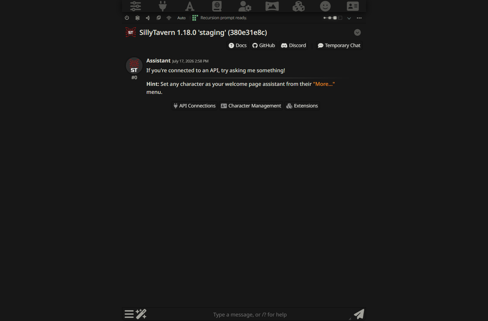
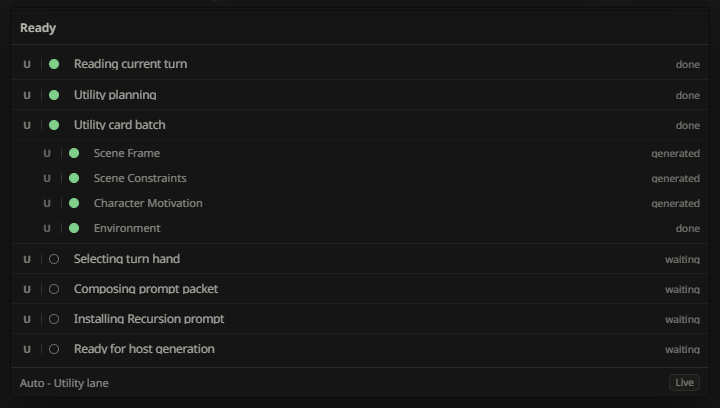
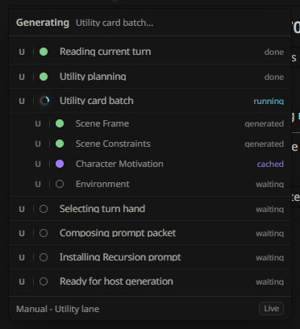
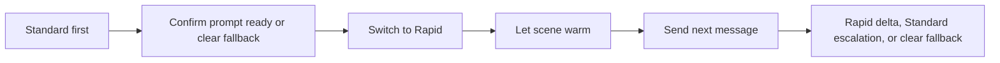
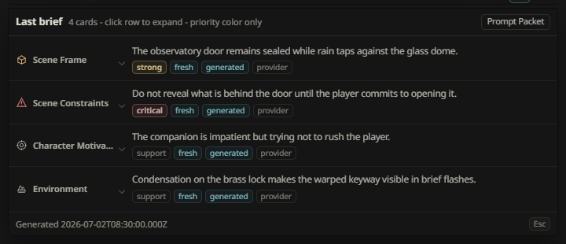

# First Run Workflow

This guide walks through the first useful Recursion session in SillyTavern. It assumes Recursion is installed or served as an extension and that you are using the current V1 pre-alpha contract.

Recursion is a current-scene prompt compiler. It observes the active chat, builds a compact scene deck and turn hand, and installs a bounded prompt packet when Auto or Manual mode is active. Pipeline selection is separate from Auto and Manual: Standard runs the full foreground pass on send, while Rapid warms a provider-generated card packet in the background and uses a shorter foreground delta. Recursion is not a memory manager, lore database, summary engine, vector recall layer, campaign save system, or card-editing workflow.

## 1. Install And Enable

1. Install or serve Recursion as a SillyTavern extension.
2. Open SillyTavern extension settings.
3. Enable `Recursion`.
4. Return to the active chat and confirm the Recursion Bar appears near the chat surface.

The bar should expose the power toggle, icon-only Pipeline control, icon-only mode control, Cards selector, Hero Pixel Array plus current-step text, active-only Stop generation button during a running turn, Reasoning Level chain, Last Brief dropdown arrow, and ellipsis options entry. On narrow screens, extra details may collapse into compact menus.

## 2. Configure Utility

Utility is required. It is the default lane for Arbiter planning, card work, provider tests, guidance composition, and fail-soft fallback guidance.

1. Open the Recursion options menu from the ellipsis.
2. Choose the `Providers` tab.
3. Configure the Utility provider source:
   - Current Host Model;
   - Host Connection Profile; or
   - OpenAI-Compatible Endpoint.
4. If using an OpenAI-compatible endpoint, enter base URL and a session API key.
5. Use `Fetch Models` if the endpoint exposes `/models`, then select a fetched model or type the model id manually.
6. Run `Test Provider`.

Session API keys are memory-only for the browser session. Recursion may remember that a session key is present, but it must not save the key in settings, scene cache, prompt packets, journals, diagnostics, browser local storage, SillyTavern file storage, reports, or test artifacts.

## 3. Optionally Configure Reasoner

Reasoner is optional. Leave it disabled for the first pass unless you intentionally want Medium/High/Ultra routing to use the extra synthesis lane.

Reasoning Level controls how strongly Recursion tries to use Reasoner. Low is Utility-only. Medium uses Reasoner for guidance composition when healthy. High adds Reasoner for Arbiter and priority card families. Ultra is Reasoner-heavy when the lane is healthy. If Reasoner fails, times out, is disabled, lacks credentials, or returns invalid output, Recursion keeps the selected level visible and falls back to Utility.

## 4. Run The First Auto Pass

Auto prepares and installs the next Recursion prompt packet.

1. Confirm the power toggle is on.
2. Set Pipeline to `Standard`.
3. Set mode to `Auto`.
4. Send a safe, ordinary chat message.
5. Watch the Hero Pixel Array progress menu for visible progress.
6. Wait for `Recursion prompt ready.` or a clear fallback state.
7. Confirm the Stop generation button is visible while the host turn remains active.
8. Let SillyTavern generation continue normally.

Use the Last Brief dropdown and Prompt Packet panel when you want to inspect exactly what Recursion installed.

## 5. Try Manual

Manual uses the Cards selector as a strict whitelist. Disabled families stay out of planning, deck reuse, hand selection, composition, and injection.

1. Set mode to `Manual`.
2. Send a safe, ordinary chat message.
3. Confirm the Hero Pixel Array progresses and prompt readiness reflects the selected card scope.

A normal Auto pass may show stages such as reading the current turn, planning the card pass, generating or reusing scene cards, selecting the turn hand, composing the prompt packet, installing the Recursion prompt, saving cache, and ready state.

## 6. Try Rapid

Rapid is useful after Standard is already working. It does not skip provider-authored guidance; instead, it moves card-packet work into a background warm step and uses a short Utility foreground delta on the next send.

1. Confirm Utility is configured and passing provider tests.
2. Set Pipeline to `Rapid`.
3. Let an assistant message land or wait for the scene to settle so Recursion can warm a Rapid scene artifact.
4. Send a safe, ordinary chat message.
5. Confirm the progress text reports Rapid warm, Rapid turn delta, warm-miss Standard escalation, or a clear fallback honestly.

## 7. Inspect Last Brief And Viewer

After Auto or Manual has produced a hand:

1. Open the Last Brief dropdown arrow from the Recursion Bar.
2. Review compact selected cards, emphasis, omission hints, and composition route.
3. Expand card rows when you need full card text.
4. Use `Prompt Packet` when available.
5. Open the Full Viewer from options/settings.
6. Inspect `Now`, `Deck`, `Activity`, `Prompt Packet`, `Settings`, and `Providers`.

The prompt packet should be bounded and inspectable. It should contain current-scene guidance, not raw provider output, hidden reasoning, broad lore, or transcript-scale summaries.

## 8. Clear Or Disable Safely

Use these controls when you want Recursion out of the next generation:

- Click the power toggle off to stop Recursion and clear or skip Recursion-owned prompt lanes.
- During an active generation, click Stop generation to stop the SillyTavern generation, abort Recursion work, and clear Recursion-owned prompt lanes in one action.
- Disable the extension if you want Recursion fully inactive.
- Clear session keys when you are finished with direct endpoint testing.

Prompt cleanup should remove stale Recursion prompt packets. If prompt cleanup fails, normal generation should continue without trusting stale Recursion guidance, and the UI should show a warning.

## First Run Pass Criteria

The first run is healthy when:

- Recursion Bar is mounted and stable.
- Utility provider can be configured and tested.
- Standard Auto mode reaches prompt ready or a clear fail-soft fallback.
- Manual mode respects the selected card scope and reaches prompt ready or a clear fallback.
- Rapid mode reports warm, turn-delta, warm-miss Standard escalation, or clear fallback states without installing local substitute Rapid guidance.
- Active Stop generation cancels both the host generation and Recursion prompt work without showing a provider failure.
- Last Brief and Full Viewer inspection are available.
- Prompt Packet inspection shows bounded current-scene guidance.
- Power-off or extension disable removes Recursion from the next prompt path.

Related docs:

- [Operator Manual](RECURSION_OPERATOR_MANUAL.md)
- [Provider Setup](PROVIDER_SETUP.md)
- [Prompt Privacy And Safety](PROMPT_PRIVACY_AND_SAFETY.md)
- [Live Smoke Test Plan](../testing/LIVE_SMOKE_TEST_PLAN.md)
