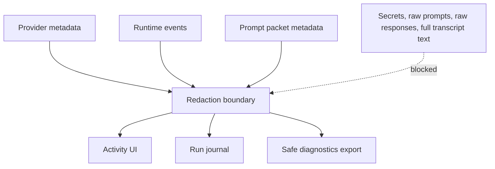
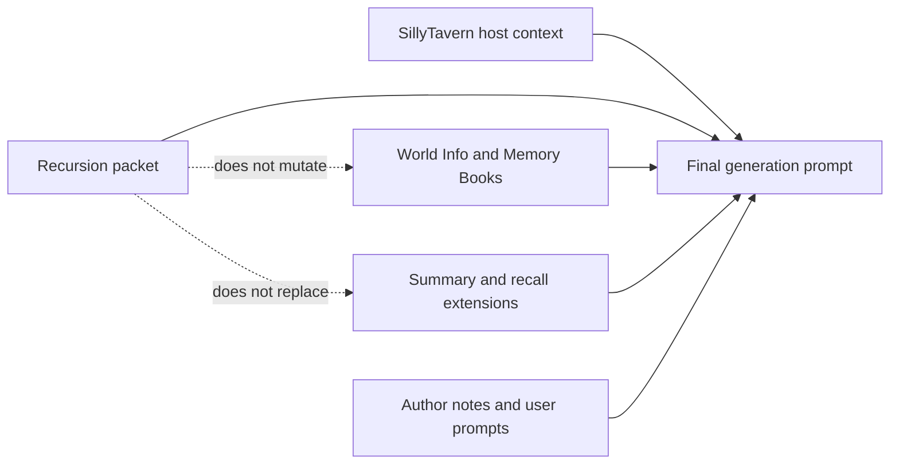

# Prompt Privacy And Safety

Recursion prepares a bounded prompt packet for the next SillyTavern generation. This guide explains what can appear in that packet, what Recursion should not store, how diagnostics are redacted, and how Recursion coexists with other context extensions.

## Prompt Packet Contents

The prompt packet is the complete model-facing Recursion artifact for one generation attempt.

It can contain:

- Guidance: provider-authored direction for using selected evidence in the active generation.
- Card Evidence: full raw selected-card text, grouped as evidence.
- Guardrails: compact constraints that prevent contradictions, hidden-thought leakage, spoilers, or user-message rewriting.
- Rare raw critical guardrail text when exact wording is required.

Inspection metadata can include:

- packet id and version;
- footprint: compact, normal, or rich;
- selected card refs;
- omission reasons;
- source message id ranges and hashes;
- prompt packet hash;
- injection lane and clear status;
- composer route and fallback path.

<Render Needed>: assets/documentation/renders/recursion-prompt-packet-instruction-card-evidence.png - Prompt Packet viewer showing instruction-shaped Card Evidence, Guidance status, and sanitized route metadata.

The packet should stay current-scene oriented. It should not become a lore recap, transcript summary, future plot plan, or memory replacement.

## Prompt Injection Boundary

Recursion owns only its prompt lanes. It should install, replace, or clear Recursion-owned prompt entries without mutating other SillyTavern context systems.

Recursion prompt lanes may include:

- `recursion.guidance`;
- `recursion.cardEvidence`;
- `recursion.guardrails`;
- `recursion.rawCriticalGuardrail`.

Runtime safety rules:

- Validate packet schema before install.
- Match packet fingerprints to the active chat, scene, turn, settings, and provider state.
- Clear stale packet lanes when power-off, extension disable, chat change, source edit, settings change, or provider change invalidates them.
- Prefer no Recursion prompt over an invalid or stale prompt.
- Do not treat Recursion as the top-level system authority over SillyTavern character prompts, presets, author notes, World Info, Memory Books, Summaryception, VectFox, or other context tools.

## What Recursion Does Not Store

Recursion does not store:

- API keys;
- bearer tokens;
- authorization headers;
- cookies;
- session secrets;
- raw provider prompts;
- raw provider responses;
- hidden chain-of-thought;
- private story plans;
- full transcript archives;
- complete character cards;
- World Info, Memory Book, Summaryception, VectFox, or other extension records;
- durable lore memory;
- campaign saves;
- user-authored card catalogs.

Recursion may store bounded cache and diagnostics:

- compact settings without secrets;
- provider preferences without API keys;
- scene cache metadata;
- current-scene card summaries and refs;
- latest hand metadata;
- bounded run journal events;
- prompt packet hashes and omission reasons;
- sanitized diagnostic records and test artifacts.

## Redaction Rules

Recursion diagnostics should prove what happened without leaking sensitive data.

Allowed by default:

- schema and contract versions;
- provider lane and source type;
- resolved model label;
- status categories;
- duration and token counts;
- card ids, families, statuses, and token estimates;
- source message id ranges and text hashes;
- prompt packet hash;
- omission and fallback reasons;
- cache hit, stale, repair, and prune events.

Forbidden by default:

- API keys;
- authorization headers;
- cookies;
- CSRF tokens;
- passwords;
- session ids;
- raw prompts;
- raw provider responses;
- hidden reasoning;
- full transcript text;
- unbounded excerpts;
- private notes copied into prompt logs;
- absolute local paths when a logical key is enough.

Redaction should remove sensitive field names such as `apiKey`, `authorization`, `cookie`, `token`, `password`, `secret`, and `sessionKey`, plus forbidden diagnostic payload fields such as `rawPrompt`, `rawResponse`, `providerPrompt`, `providerResponse`, `hiddenReasoning`, `privateStoryPlan`, `privatePlan`, and `sessionId`. It should also cap strings in diagnostics and artifacts while preserving safe counters such as `tokenCount` and `sessionCount`.

## External Extension Coexistence

Recursion coexists with other SillyTavern context systems. It should not replace or mutate them.

| System | Owns | Recursion Posture |
| --- | --- | --- |
| Character prompts and presets | Baseline persona, style, instruct format, and host generation behavior. | Respect host prompt order and avoid overriding core identity. |
| World Info and Memory Books | Durable lore, facts, and authored background. | Avoid restating broad lore already present elsewhere. |
| Summaryception | Long transcript compression. | Do not duplicate transcript-scale summary work. |
| VectFox or vector recall tools | Similarity recall and retrieval. | Treat retrieved context as external context, not Recursion cache. |
| Author notes or user prompts | User-authored guidance. | Do not rewrite or silently replace user intent. |

Recursion should mark omitted candidates with reasons such as `external_owner` or `already_in_external_context` when the host exposes enough information. If external context conflicts with selected-hand evidence, Recursion should stay conservative and flag a scene-constraint risk rather than silently override another system.

## Diagnostics And Artifact Posture

Normal operation should not create raw diagnostic archives. Diagnostic artifacts use the same redaction boundary as runtime diagnostics.

A safe diagnostic artifact can include:

- settings without secrets;
- provider source and model labels without keys;
- system index summary;
- selected scene cache metadata;
- recent sanitized journal events;
- prompt packet hashes and selected card refs;
- omission and fallback reasons.

A safe diagnostic artifact should not include:

- API keys;
- raw provider prompts or responses;
- hidden reasoning;
- full transcript text;
- complete character cards;
- external extension databases;
- unbounded message excerpts.

Screenshots are allowed as visual evidence, but do not capture provider setup while secret fields are visible.

## Operator Safety Checks

Before using Auto:

1. Confirm Utility is healthy.
2. Confirm Reasoner is intentionally enabled or disabled.
3. Inspect Last Brief and Prompt Packet after a safe Auto or Manual pass if you are unsure what Recursion compiled.
4. Inspect Prompt Packet when output quality or privacy matters.
5. Confirm the packet is current-scene guidance, not lore, memory, or hidden planning.

Before sharing diagnostics or screenshots:

1. Clear or hide session API key fields.
2. Prefer sanitized diagnostics over raw browser logs.
3. Check that no raw provider prompt or response is present.
4. Check that no full transcript text is present unless you intentionally captured a visible screenshot.
5. Check that no private local paths, usernames, cookies, or tokens are present.

Before disabling Recursion:

1. Turn the power toggle off or disable the extension.
2. Confirm Recursion prompt lanes are cleared or skipped.
3. Clear session keys if direct endpoint testing is finished.

Related docs:

- [Operator Manual](RECURSION_OPERATOR_MANUAL.md)
- [Provider Setup](PROVIDER_SETUP.md)
- [Prompt Composition Spec](../architecture/PROMPT_COMPOSITION_SPEC.md)
- [Storage And Diagnostics](../architecture/STORAGE_AND_DIAGNOSTICS.md)
