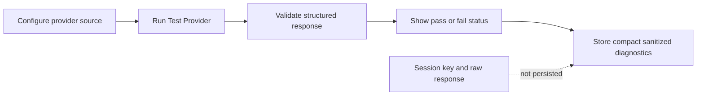
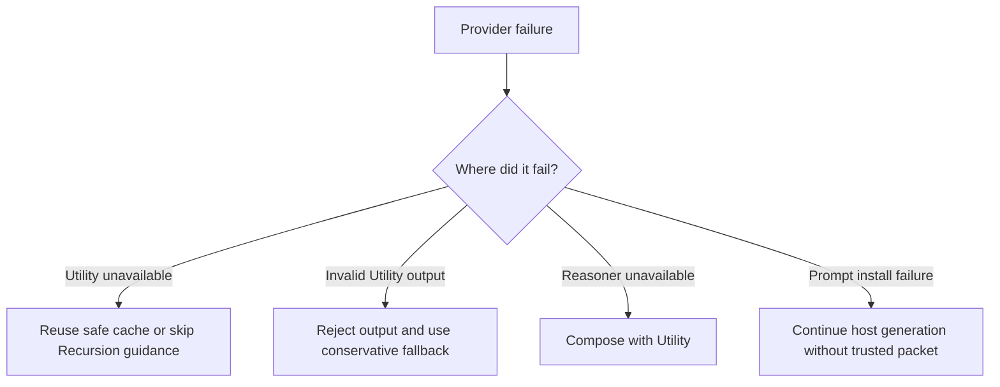
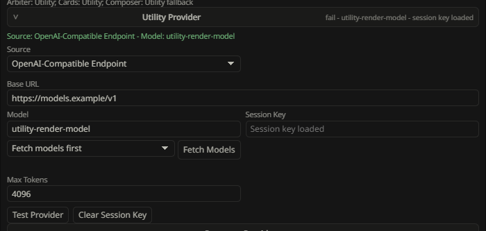

# Provider Setup

Recursion uses two provider lanes:

- Utility: required, default, and used for Arbiter planning, scene/card extraction, card generation, lifecycle support, structured diagnostics, guidance composition, and fail-soft fallback guidance.
- Reasoner: optional, used by Medium/High/Ultra Reasoning Level routing when its capability is `ready`, with Utility fallback for ordinary work when unavailable.

Reasoner is not a better default Utility. Utility remains the required path and the fallback path. The compact-bar Reasoning Level chain controls how much Recursion tries to use Reasoner: Low is Utility-only, Medium uses Reasoner for guidance composition when ready, High adds Reasoner for Arbiter, priority card families, and Fused bundles when ready, and Ultra is Reasoner-heavy when the lane is ready.

## Source Options

Each lane can use one provider source when the host supports it.

| Source | Use When | Notes |
| --- | --- | --- |
| Current Host Model | You want Recursion to use the model currently active in SillyTavern. | Smallest setup surface. Availability depends on host APIs. |
| Host Connection Profile | You want Recursion to use a saved SillyTavern connection profile. | Recursion lists detected host profiles from SillyTavern profile/connection seams without scanning character cards or Recursion cards. Type in the Profile box to filter long profile lists, then choose a listed profile to save it. If the host cannot expose profiles, the Profile box should be unavailable with a clear status. |
| OpenAI-Compatible Endpoint | You want a direct endpoint with base URL, model, and session API key. | Use `Fetch Models` to query `/models`. Session key is memory-only and must be re-entered after session loss. |

## Utility Setup

1. Open the Recursion options menu from the ellipsis.
2. Select the `Providers` tab, or open the Full Viewer Providers section.
3. Select the `Utility` provider card.
4. Choose a provider source.
5. Fill the required fields for that source.
6. For Host Connection Profile, type in the Profile box to filter saved SillyTavern profiles, then select one of the listed profiles.
7. For OpenAI-compatible endpoints, enter base URL and session API key, then use `Fetch Models` if the endpoint exposes a model list.
8. Select a fetched model or type the model id manually.
9. Adjust temperature, top-p, and max tokens only when needed. Utility and Reasoner default to `8192` max tokens.
10. Run `Test Provider`.

Utility is healthy when the test passes and the bar or provider card shows a ready state. If Utility is missing or unhealthy, Recursion may reuse valid cache, skip injection, or continue without Recursion guidance.

## Reasoner Setup

1. Open the Reasoner provider card.
2. Choose a provider source.
3. Fill the required fields.
4. Run `Test Provider`.
5. Use the compact-bar Reasoning Level chain for broad provider bias; Low forces Utility-only behavior, while Medium, High, and Ultra keep their selected level and use Reasoner only when it is ready.

There is no Reasoner enable switch. Its provider card shows one derived state:
`Configure` when the selected route is incomplete, `Untested` when configuration
is complete but lacks current health evidence, `Ready` after a passing test for
the current configuration hash, or `Unhealthy` after a matching failed test.
Reasoner is eligible only when `Ready` and selected by Reasoning Level plus
runtime policy.

Reasoning Level also sets the amount of provider-side reasoning Recursion requests for Reasoner work:

| Level | Guidance augmentation | Other Reasoner work |
| --- | --- | --- |
| Low | minimal | minimal |
| Medium | medium | minimal |
| High | medium | Post-process guidance medium, Arbiter medium, cards and Fused bundles minimal |
| Ultra | high | Post-process guidance high, Arbiter medium, cards and Fused bundles medium |

Post-process guidance routing is lane-sticky: Low and Medium use Utility, while High and Ultra require Reasoner `Ready`. If the required lane is not ready, the operation or category fails soft without crossing lanes. Pre-process work may use Utility fallback according to the selected Reasoning Level policy.

Post-process uses the configured Evidence Messages count to build a bounded, sender-aware frozen operation snapshot. Recent visible transcript messages, character evidence, the generation-time Pre-process Prompt Packet, ordered Post-process cards, pipeline provenance, and the current writable draft become evidence for guidance synthesis. The guidance response is structured and never replaces prose; SillyTavern's native quiet-generation path writes the draft.

The router may repair common JSON formatting damage or make one correction request for an eligible malformed provider response. Repair reserves that single correction for runtime semantic validation: an empty, malformed, stale, overlapping, or otherwise invalid bounded-patch result receives one explicit correction request while provider-authored fallback signals remain untrusted. Repair card audits return only dynamic `failedCardIds`; Recursion derives the complete ledger locally, preserving resolved rows even when the audit rejects. A safe local patch with unresolved card coverage produces explicit `partial-failed`; unsafe patches are rejected and never applied.

Provider tests always use minimal reasoning. Direct OpenAI-compatible endpoints receive native reasoning fields only when Recursion knows the dialect. OpenRouter and OpenAI use an effort field, GLM/Z.AI uses thinking plus `reasoning_effort`, MiniMax M3 uses its thinking mode, and unsupported/unknown endpoints are left alone. SillyTavern connection profiles receive compact reasoning metadata so profile-backed Claude, Gemini, OpenRouter, and other integrations can apply their own native controls.

## Session-Only API Keys

OpenAI-compatible API keys are session-only secrets.

Recursion may persist:

- provider source;
- base URL;
- model;
- temperature;
- top-p;
- max tokens;
- whether a session key is currently present.

Recursion must not persist:

- API keys;
- bearer tokens;
- authorization headers;
- raw provider prompts;
- raw provider responses;
- full transcript text;
- hidden reasoning;
- secrets in errors, diagnostics, journals, prompt packets, cache records, browser local storage, SillyTavern file storage, reports, or test artifacts.

Clear Session Key appears only when the lane source is OpenAI-Compatible Endpoint. Clearing a session key should immediately mark that lane untestable until a key is re-entered.

Provider field changes auto-save on commit. Source, profile, base URL, model, fetched-model selection, and max-token changes apply immediately. Open provider cards stay open while autosave refreshes the settings panel, so expanding Reasoner and editing fields should not collapse the Reasoner section. Session keys are accepted into browser-session memory only and are not written to persisted settings. Hidden alternate-source fields keep their values when the selected source changes, but only the selected source participates in readiness, tests, and generation.

Each committed field sends only its own patch with the displayed
`configRevision`. A newer saved revision wins over a stale panel edit. A
material configuration change increments the revision and invalidates previous
health because the old pass/fail result belongs to a different configuration
hash; a no-op does neither.

## Test Provider Flow

Use `Test Provider` after setup and after changing source, model, base URL, key, or token settings.

Recursion clears stale provider health after source, profile, base URL, model, max token, or session key changes. A previous pass badge should not be treated as current until `Test Provider` passes again.

A safe provider test should:

1. Send a structured request using the lane max-token setting configured by the operator.
2. Validate the response schema.
3. Record pass or fail health bound to the tested configuration hash.
4. Show resolved provider and model labels when available.
5. Store only compact sanitized diagnostics.
6. Show a lane-local `Testing...` state and disable that lane's `Test Provider` button while the request is pending.

Provider tests should not store raw prompt bodies, raw responses, API keys, or unbounded error text. Test requests use the configured lane max-token budget and a bounded timeout; the test does not silently impose a smaller response cap than the operator selected.

Utility and Reasoner default to `8192`, so an untouched provider test uses an
`8192` max-token ceiling. Provider Test is single-flight per lane: duplicate
same-lane clicks share the in-flight test, and a test requested while production
work is using that lane returns a busy result without canceling the active work.
A test result can update health only; it cannot change source, profile, endpoint,
model, generation parameters, or `configRevision`.

## Fallback Behavior

Fallbacks should be visible in the Recursion Bar, Hero Pixel Array progress menu, and Full Viewer Activity section.

Expected fallback behavior:

- Utility auth failure: mark Utility unhealthy and skip or reuse safe cache.
- Utility timeout: retry once for transient transport failure only if the request is not aborted and the current snapshot is still current, then skip or reuse safe cache.
- Utility invalid structured output: repair safe JSON syntax when possible, then reject any output that still misses the required schema or snapshot hash and use conservative local behavior.
- Card job failure: omit failed card and keep valid sibling cards.
- Reasoner unconfigured or untested: Utility composes for ordinary work.
- Reasoner missing key: Utility composes.
- Reasoner timeout or invalid output: Utility composes and the fallback is recorded.
- Prompt install failure after provider success: generation continues without Recursion guidance.

Provider failures should degrade Recursion, not block normal SillyTavern generation.

Post-process recovery is bounded separately from ordinary provider fallback. Guidance receives one same-lane correction retry, and a failed host rewrite may retry with the same guidance without repeating synthesis. Unified failure preserves the original. Progressive records the failed category, keeps the last valid draft, and continues later categories when possible; partial output settles only as a swipe.

## Common Failures

| Symptom | Likely Cause | Operator Action |
| --- | --- | --- |
| Utility not ready | Missing source, model, profile, or session key. | Open Utility provider card, complete setup, run Test Provider. |
| Provider test failed | Bad key, base URL, model name, network, or incompatible response. | Re-enter session key, verify endpoint/model, test again. |
| Reasoner never runs | Unconfigured, untested, unhealthy, or not selected by policy. | Complete its configuration, run Test Provider, and choose an appropriate Reasoning Level. |
| High/Ultra Post-process guidance is unavailable | Reasoner is not `Ready` for the current configuration hash. | Use Test Reasoner or choose Low/Medium so guidance uses Utility. |
| Reasoner failed but generation continued | Expected fallback path. | Inspect Activity and Prompt Packet to confirm Utility guidance plus raw selected Card Evidence. |
| Prompt not installed | Power is off, Utility unavailable, stale run, or injection failure. | Check power state, mode, Activity, Provider status, and Prompt Packet metadata. |
| Session key disappeared | Browser session reset or Clear Session Key used. | Re-enter key and run Test Provider. |
| Provider returned messy JSON | Recursion can strip wrappers and repair common JSON syntax, but cannot invent missing contract fields. | Inspect sanitized Activity details; fix provider prompt/model settings if schema or snapshot errors repeat. |
| Error text looks too vague | Redaction removed sensitive details. | Use sanitized diagnostics and provider-side logs if you need endpoint details. |

## Safe Verification

For manual verification:

1. Do not show provider secret fields in screenshots.
2. Run Utility Test Provider.
3. Run Reasoner Test Provider when you want High/Ultra Post-process guidance or Reasoner-heavy Pre-process routing.
4. Turn power off and confirm no prompt is installed.
5. Set Auto only when you intend Recursion to affect the next prompt.
6. Inspect Activity for route and fallback details.
7. Inspect Prompt Packet metadata, not raw provider payloads.
8. Clear session keys after testing direct endpoints.

Automated live provider evidence should use dedicated `recursion-soak-*` users
and the guarded live smoke flow described in [Live Smoke Test Plan](../testing/LIVE_SMOKE_TEST_PLAN.md).
Before navigation or provider calls, run the installed-copy SHA-256 verifier and
require repository, installed user copy, and served public copy to match.

Related docs:

- [Operator Manual](RECURSION_OPERATOR_MANUAL.md)
- [Prompt Privacy And Safety](PROMPT_PRIVACY_AND_SAFETY.md)
- [Provider And Generation Spec](../architecture/PROVIDER_AND_GENERATION_SPEC.md)
