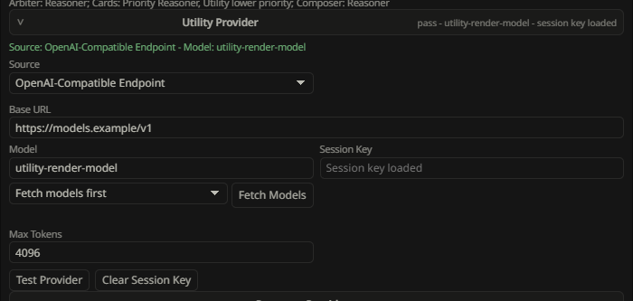
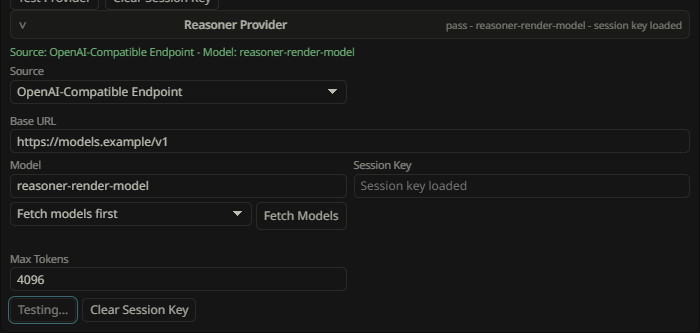
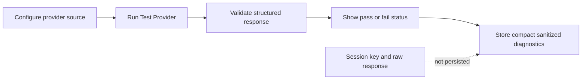
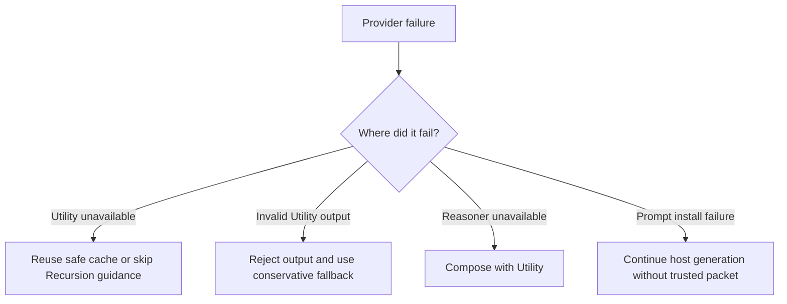

# Provider Setup

Recursion uses two provider lanes:

- Utility: required, default, and used for Arbiter planning, scene/card extraction, card generation, lifecycle support, structured diagnostics, guidance composition, and fail-soft fallback guidance.
- Reasoner: optional, used by Medium/High/Ultra Reasoning Level routing when enabled and healthy, with Utility fallback when unavailable.

Reasoner is not a better default Utility. Utility remains the required path and the fallback path. The compact-bar Reasoning Level chain controls how much Recursion tries to use Reasoner: Low is Utility-only, Medium uses Reasoner for guidance composition when healthy, High adds Reasoner for Arbiter, priority card families, and Fused bundles when healthy, and Ultra is Reasoner-heavy when the lane is healthy.

## Source Options

Each lane can use one provider source when the host supports it.

| Source | Use When | Notes |
| --- | --- | --- |
| Current Host Model | You want Recursion to use the model currently active in SillyTavern. | Smallest setup surface. Availability depends on host APIs. |
| Host Connection Profile | You want Recursion to use a saved SillyTavern connection profile. | Recursion lists detected host profiles from SillyTavern profile/connection seams without scanning character cards or Recursion cards. Type in the Profile box to filter long profile lists, then choose a listed profile to save it. If the host cannot expose profiles, the Profile box should be unavailable with a clear status. |
| OpenAI-Compatible Endpoint | You want a direct endpoint with base URL, model, and session API key. | Use `Fetch Models` to query `/models`. Session key is memory-only and must be re-entered after session loss. |

## Utility Setup

1. Open the Recursion options menu from the ellipsis.
2. Select the `Providers` tab, or open the Full Viewer Providers section.
3. Select the `Utility` provider card.
4. Choose a provider source.
5. Fill the required fields for that source.
6. For Host Connection Profile, type in the Profile box to filter saved SillyTavern profiles, then select one of the listed profiles.
7. For OpenAI-compatible endpoints, enter base URL and session API key, then use `Fetch Models` if the endpoint exposes a model list.
8. Select a fetched model or type the model id manually.
9. Adjust temperature, top-p, and max tokens only when needed. Utility and Reasoner default to `8192` max tokens.
10. Run `Test Provider`.

Utility is healthy when the test passes and the bar or provider card shows a ready state. If Utility is missing or unhealthy, Recursion may reuse valid cache, skip injection, or continue without Recursion guidance.

## Reasoner Setup

1. Open the Reasoner provider card.
2. Enable Reasoner only if you want Medium/High/Ultra routing to use the optional synthesis lane.
3. Choose a provider source.
4. Fill the required fields.
5. Run `Test Provider`.
6. Use the compact-bar Reasoning Level chain for broad provider bias; Low forces Utility-only behavior, while Medium, High, and Ultra keep their selected level and fall back to Utility if the Reasoner lane is unhealthy.

Reasoner is eligible only when enabled, healthy, and selected by Reasoning Level plus runtime policy for a useful reason such as a crowded hand, conflicting cards, high scene-constraint risk, or complex active cast.

Reasoning Level also sets the amount of provider-side reasoning Recursion requests for Reasoner work:

| Level | Guidance augmentation | Other Reasoner work |
| --- | --- | --- |
| Low | minimal | minimal |
| Medium | medium | minimal |
| High | medium | Arbiter medium, cards and Fused bundles minimal |
| Ultra | high | Arbiter medium, cards and Fused bundles medium |

Provider tests always use minimal reasoning. Direct OpenAI-compatible endpoints receive native reasoning fields only when Recursion knows the dialect. OpenRouter and OpenAI use an effort field, GLM/Z.AI uses thinking plus `reasoning_effort`, MiniMax M3 uses its thinking mode, and unsupported/unknown endpoints are left alone. SillyTavern connection profiles receive compact reasoning metadata so profile-backed Claude, Gemini, OpenRouter, and other integrations can apply their own native controls.

## Session-Only API Keys

OpenAI-compatible API keys are session-only secrets.

Recursion may persist:

- provider source;
- base URL;
- model;
- temperature;
- top-p;
- max tokens;
- whether a session key is currently present.

Recursion must not persist:

- API keys;
- bearer tokens;
- authorization headers;
- raw provider prompts;
- raw provider responses;
- full transcript text;
- hidden reasoning;
- secrets in errors, diagnostics, journals, prompt packets, cache records, browser local storage, SillyTavern file storage, reports, or test artifacts.

Clear Session Key appears only when the lane source is OpenAI-Compatible Endpoint. Clearing a session key should immediately mark that lane untestable until a key is re-entered.

Provider field changes auto-save on commit. Source, profile, base URL, model, fetched-model selection, and max-token changes apply immediately. Open provider cards stay open while autosave refreshes the settings panel, so expanding Reasoner and editing fields should not collapse the Reasoner section. Session keys are accepted into browser-session memory only and are not written to persisted settings. Hidden alternate-source fields keep their values when the selected source changes, but only the selected source participates in readiness, tests, and generation.

## Test Provider Flow

Use `Test Provider` after setup and after changing source, model, base URL, key, or token settings.

Recursion clears stale provider health after source, profile, base URL, model, max token, or session key changes. A previous pass badge should not be treated as current until `Test Provider` passes again.

A safe provider test should:

1. Send a minimal bounded structured request.
2. Validate the response schema.
3. Record pass or fail status.
4. Show resolved provider and model labels when available.
5. Store only compact sanitized diagnostics.
6. Show a lane-local `Testing...` state and disable that lane's `Test Provider` button while the request is pending.

Provider tests should not store raw prompt bodies, raw responses, API keys, or unbounded error text. Test requests use a small response budget and a bounded timeout; normal generation still uses the configured lane max tokens.

## Fallback Behavior

Fallbacks should be visible in the Recursion Bar, Hero Pixel Array progress menu, and Full Viewer Activity section.

Expected fallback behavior:

- Utility auth failure: mark Utility unhealthy and skip or reuse safe cache.
- Utility timeout: retry once for transient transport failure only if the request is not aborted and the current snapshot is still current, then skip or reuse safe cache.
- Utility invalid structured output: repair safe JSON syntax when possible, then reject any output that still misses the required schema or snapshot hash and use conservative local behavior.
- Card job failure: omit failed card and keep valid sibling cards.
- Reasoner disabled: Utility composes.
- Reasoner missing key: Utility composes.
- Reasoner timeout or invalid output: Utility composes and the fallback is recorded.
- Prompt install failure after provider success: generation continues without Recursion guidance.

Provider failures should degrade Recursion, not block normal SillyTavern generation.

## Common Failures

| Symptom | Likely Cause | Operator Action |
| --- | --- | --- |
| Utility not ready | Missing source, model, profile, or session key. | Open Utility provider card, complete setup, run Test Provider. |
| Provider test failed | Bad key, base URL, model name, network, or incompatible response. | Re-enter session key, verify endpoint/model, test again. |
| Reasoner never runs | Off, unhealthy, or not needed by Auto. | Enable Reasoner, test it, and use Auto only for suitable complex turns. |
| Reasoner failed but generation continued | Expected fallback path. | Inspect Activity and Prompt Packet to confirm Utility guidance plus raw selected Card Evidence. |
| Prompt not installed | Power is off, Utility unavailable, stale run, or injection failure. | Check power state, mode, Activity, Provider status, and Prompt Packet metadata. |
| Session key disappeared | Browser session reset or Clear Session Key used. | Re-enter key and run Test Provider. |
| Provider returned messy JSON | Recursion can strip wrappers and repair common JSON syntax, but cannot invent missing contract fields. | Inspect sanitized Activity details; fix provider prompt/model settings if schema or snapshot errors repeat. |
| Error text looks too vague | Redaction removed sensitive details. | Use sanitized diagnostics and provider-side logs if you need endpoint details. |

## Safe Verification

For manual verification:

1. Do not show provider secret fields in screenshots.
2. Run Utility Test Provider.
3. Run Reasoner Test Provider only if Reasoner is enabled.
4. Turn power off and confirm no prompt is installed.
5. Set Auto only when you intend Recursion to affect the next prompt.
6. Inspect Activity for route and fallback details.
7. Inspect Prompt Packet metadata, not raw provider payloads.
8. Clear session keys after testing direct endpoints.

Automated live provider evidence should use dedicated `recursion-soak-*` users and the guarded live smoke flow described in [Live Smoke Test Plan](../testing/LIVE_SMOKE_TEST_PLAN.md).

Related docs:

- [Operator Manual](RECURSION_OPERATOR_MANUAL.md)
- [Prompt Privacy And Safety](PROMPT_PRIVACY_AND_SAFETY.md)
- [Provider And Generation Spec](../architecture/PROVIDER_AND_GENERATION_SPEC.md)
