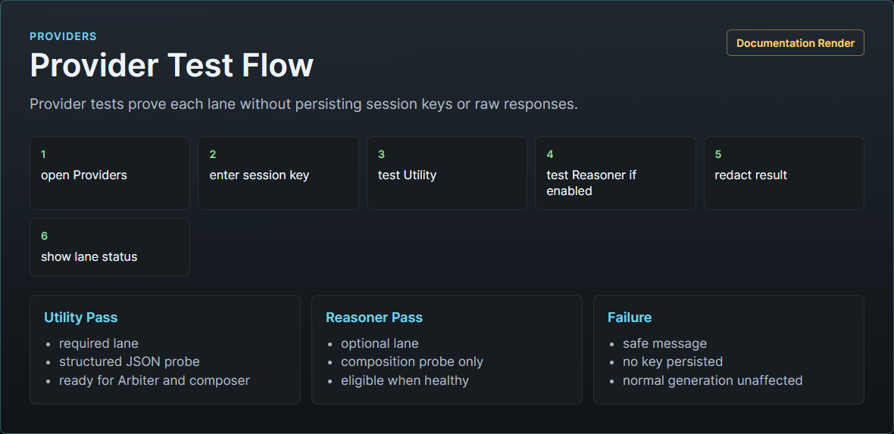
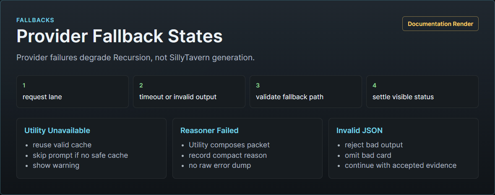

# Provider Setup

Recursion uses two provider lanes:

- Utility: required, default, and used for Arbiter planning, scene/card extraction, card generation, lifecycle support, structured diagnostics, and normal prompt composition.
- Reasoner: optional, used for crowded, conflicted, or subtle prompt composition when enabled and healthy.

Reasoner is not a better default Utility. Utility remains the normal path and the fallback path.

<Render Needed>: assets/documentation/renders/recursion-provider-controls-utility-reasoner.png - Provider controls showing Utility and Reasoner cards with source selector, model fields, session key state, Test Provider, and Clear Session Key.

## Source Options

Each lane can use one provider source when the host supports it.

| Source | Use When | Notes |
| --- | --- | --- |
| Current Host Model | You want Recursion to use the model currently active in SillyTavern. | Smallest setup surface. Availability depends on host APIs. |
| Host Connection Profile | You want Recursion to use a named SillyTavern connection profile. | If the host cannot expose profiles, the option should be unavailable with a clear status. |
| OpenAI-Compatible Endpoint | You want a direct endpoint with base URL, model, and session API key. | Session key is memory-only and must be re-entered after session loss. |

## Utility Setup

1. Open the Recursion options menu from the ellipsis.
2. Select the `Providers` tab, or open the Full Viewer Providers section.
3. Select the `Utility` provider card.
4. Choose a provider source.
5. Fill the required fields for that source.
6. For OpenAI-compatible endpoints, enter base URL, model, and session API key.
7. Adjust temperature, top-p, and max tokens only when needed.
8. Save provider settings.
9. Run `Test Provider`.

Utility is healthy when the test passes and the bar or provider card shows a ready state. If Utility is missing or unhealthy, Recursion may reuse valid cache, skip injection, or continue without Recursion guidance.

## Reasoner Setup

1. Open the Reasoner provider card.
2. Enable Reasoner only if you want the optional composer lane.
3. Choose a provider source.
4. Fill the required fields.
5. Save provider settings.
6. Run `Test Provider`.
7. Use Reasoning Level in the Play tab for broad provider bias; leave it at `High` unless you are deliberately testing lower Utility-only or higher Reasoner-heavy routing.

Reasoner is eligible only when enabled, healthy, and selected by Recursion for a useful reason such as crowded hand, conflicting cards, high continuity risk, or complex active cast.

## Session-Only API Keys

OpenAI-compatible API keys are session-only secrets.

Recursion may persist:

- provider source;
- base URL;
- model;
- temperature;
- top-p;
- max tokens;
- whether a session key is currently present.

Recursion must not persist:

- API keys;
- bearer tokens;
- authorization headers;
- raw provider prompts;
- raw provider responses;
- full transcript text;
- hidden reasoning;
- secrets in errors, diagnostics, journals, prompt packets, cache records, browser local storage, SillyTavern file storage, reports, or test artifacts.

Clearing a session key should immediately mark that lane untestable until a key is re-entered.

## Test Provider Flow

Use `Test Provider` after setup and after changing source, model, base URL, key, or token settings.

Recursion clears stale provider health after source, profile, base URL, model, max token, or session key changes. A previous pass badge should not be treated as current until `Test Provider` passes again.

A safe provider test should:

1. Send a minimal bounded structured request.
2. Validate the response schema.
3. Record pass or fail status.
4. Show resolved provider and model labels when available.
5. Store only compact sanitized diagnostics.

Provider tests should not store raw prompt bodies, raw responses, API keys, or unbounded error text.

## Fallback Behavior

Fallbacks should be visible in the Recursion Bar, Hero Pixel Array progress menu, and Full Viewer Activity section.

Expected fallback behavior:

- Utility auth failure: mark Utility unhealthy and skip or reuse safe cache.
- Utility timeout: retry once for transient transport failure only if the request is not aborted and the current snapshot is still current, then skip or reuse safe cache.
- Utility invalid structured output: reject the output and use conservative local behavior.
- Card job failure: omit failed card and keep valid sibling cards.
- Reasoner off: Utility composes.
- Reasoner missing key: Utility composes.
- Reasoner timeout or invalid output: Utility composes and the fallback is recorded.
- Prompt install failure after provider success: generation continues without Recursion guidance.

Provider failures should degrade Recursion, not block normal SillyTavern generation.

## Common Failures

| Symptom | Likely Cause | Operator Action |
| --- | --- | --- |
| Utility not ready | Missing source, model, profile, or session key. | Open Utility provider card, complete setup, run Test Provider. |
| Provider test failed | Bad key, base URL, model name, network, or incompatible response. | Re-enter session key, verify endpoint/model, test again. |
| Reasoner never runs | Off, unhealthy, or not needed by Auto. | Enable Reasoner, test it, and use Auto only for suitable complex turns. |
| Reasoner failed but generation continued | Expected fallback path. | Inspect Activity and Prompt Packet to confirm Utility composition. |
| Prompt not installed | Power is off, Utility unavailable, stale run, or injection failure. | Check power state, mode, Activity, Provider status, and Prompt Packet metadata. |
| Session key disappeared | Browser session reset or Clear Session Key used. | Re-enter key and run Test Provider. |
| Error text looks too vague | Redaction removed sensitive details. | Use sanitized diagnostics and provider-side logs if you need endpoint details. |

## Safe Verification

For manual verification:

1. Do not show provider secret fields in screenshots.
2. Run Utility Test Provider.
3. Run Reasoner Test Provider only if Reasoner is enabled.
4. Turn power off and confirm no prompt is installed.
5. Set Auto only when you intend Recursion to affect the next prompt.
6. Inspect Activity for route and fallback details.
7. Inspect Prompt Packet metadata, not raw provider payloads.
8. Clear session keys after testing direct endpoints.

Automated live provider evidence should use dedicated `recursion-soak-*` users and the guarded live smoke flow described in [Live Smoke Test Plan](../testing/LIVE_SMOKE_TEST_PLAN.md).

Related docs:

- [Operator Manual](RECURSION_OPERATOR_MANUAL.md)
- [Prompt Privacy And Safety](PROMPT_PRIVACY_AND_SAFETY.md)
- [Provider And Generation Spec](../architecture/PROVIDER_AND_GENERATION_SPEC.md)
