# Recursion Operator Manual

Recursion is a pre-alpha SillyTavern extension that compiles current-scene prompt guidance for the next roleplay generation. It observes the active chat, maintains a short-lived scene deck, selects a turn hand, and installs an inspectable prompt packet when Auto or Manual mode is active. Standard, Rapid, and Fused pipelines control how that work is scheduled: Standard does the full foreground pass on send, Rapid warms a provider-generated card packet in the background and uses a shorter foreground delta, and Fused generates all requested foreground cards in one structured bundle call.

Recursion is not a memory manager, lore database, summary engine, vector recall layer, campaign save system, character database, or card-editing product. It does not own durable canon. It improves the next response by preserving selected scene evidence and adding provider-authored direction for the scene in front of the user.

## Surface Matrix

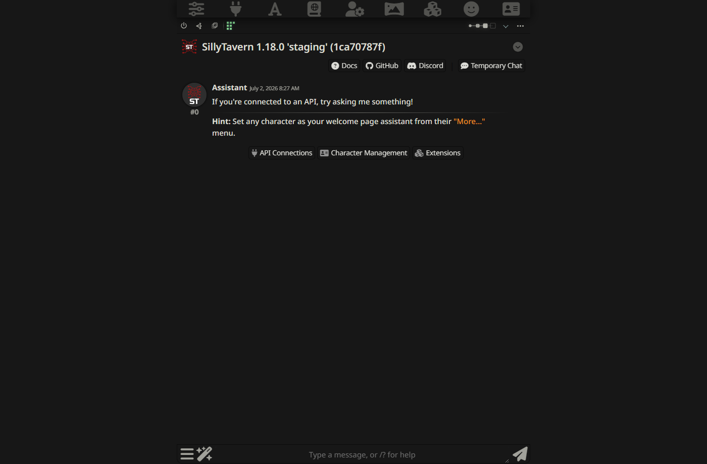

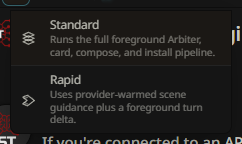

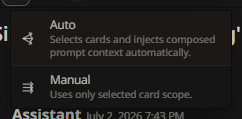

<Render Needed>: assets/documentation/renders/recursion-operator-story-form-controls.png - Tense & PoV selector in the compact Recursion Bar showing Auto plus forced past/present POV options.

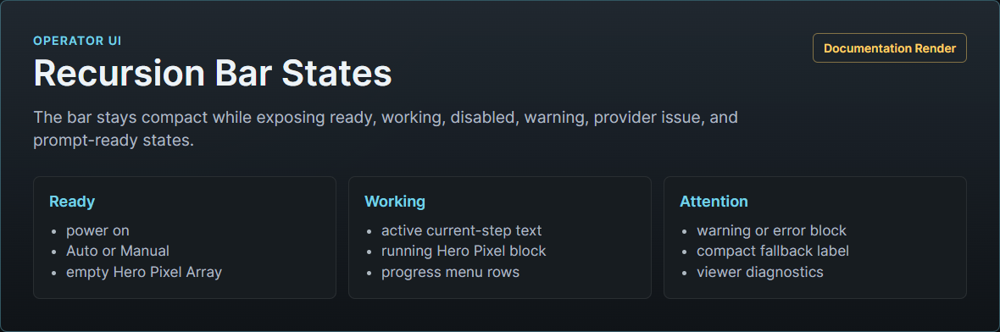

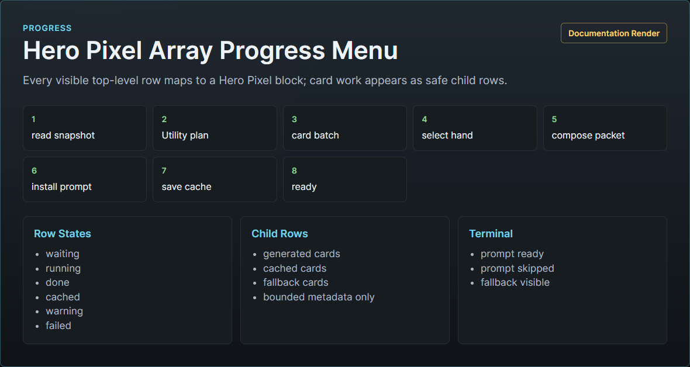

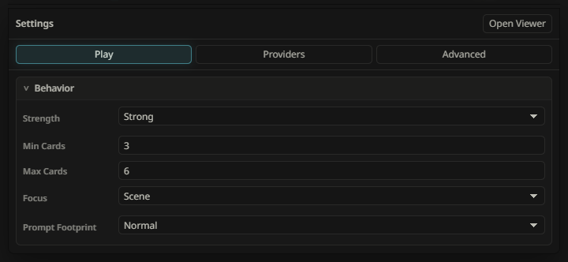

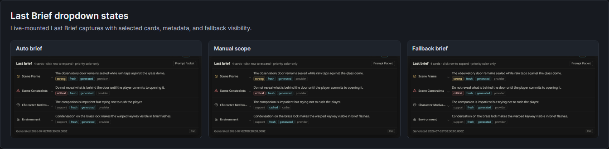

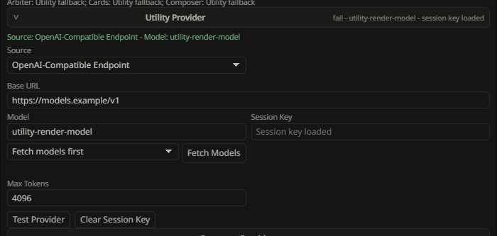

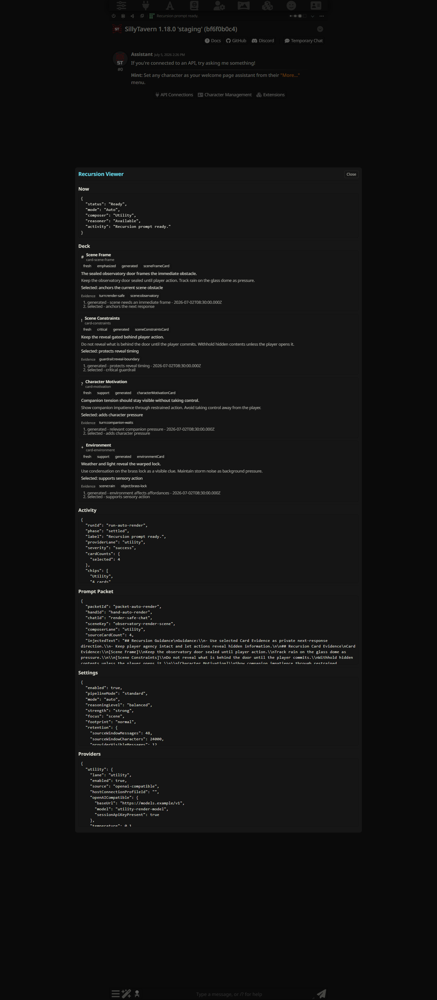

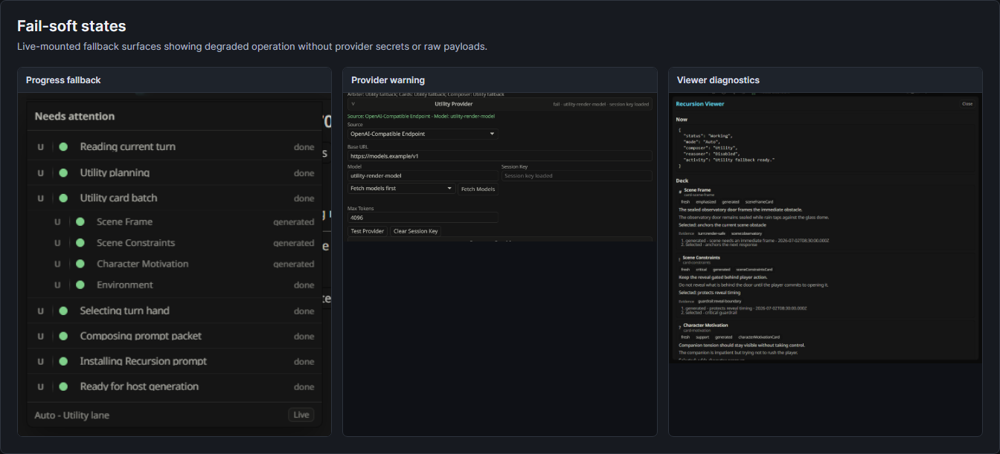

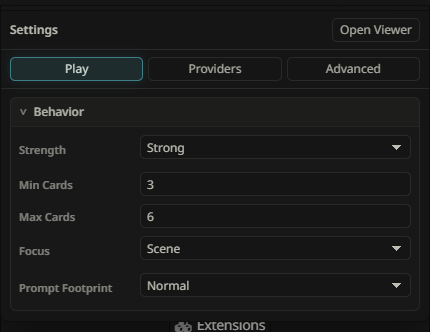

## Main Surfaces

### Recursion Bar

The Recursion Bar is the normal control surface. It sits near the chat surface and shows:

- runtime health: Ready, Working, Paused, Issue, or Off;
- power toggle;
- icon-only Pipeline control: Standard, Rapid, or Fused;
- icon-only mode control: Auto or Manual;
- icon-only Prose Enhancement control: Off, As Swipe, or Replace;
- compact Tense & PoV control;
- Hero Pixel Array plus current-step text;
- command slot: Stop generation while active, Regenerate icon while idle;
- Reasoning Level chain;
- Last Brief dropdown arrow;
- ellipsis options/settings entry.

The bar should be stable. Status changes should not repeatedly resize the transcript or cover message input controls.

The Pipeline control is a small icon-only dropdown immediately to the left of the Mode button. `Standard` uses the full foreground Arbiter, card, hand, compose, validate, and install path on send. `Rapid` warms a provider-generated card packet in the background and uses a short provider delta on send. `Fused` keeps the foreground Arbiter and shared deck/hand/compose/install path, but asks one provider call to generate all requested cards as a bundle. The selected icon updates on the bar, and the dropdown follows the compact Mode-menu pattern. Pipeline is not duplicated in Settings.

The Prose Enhancement control sits immediately to the right of Cards and uses the upgrade icon. It is grey when `Off`. `As Swipe` hides the fresh SillyTavern assistant output until the Utility pass finishes, then keeps the original as one swipe and adds a polished swipe selected by default. `Replace` hides the fresh output until the Utility pass finishes, then replaces the active assistant text with the polished version. If the Utility pass fails validation or the provider is unavailable, Recursion reveals the original unchanged. Valid Utility output is applied even when the edit is minimal or byte-identical.

The Tense & PoV control sits in the compact left-side control cluster after Prose Enhancement. Leave it on `Auto` for normal play. In Auto, the Utility Arbiter infers the active story form from the latest visible assistant narration first, using the pending user message only when no assistant narration exists. Use a forced option only when the Arbiter is clearly steering card evidence or guidance toward the wrong form. Forced options cover past or present tense in first person, second person, third-person limited, or third-person omniscient. A forced selection creates a high-confidence user story-form override for card prompts, guidance composition, Rapid artifacts, and Prompt Packet metadata; it does not rewrite the transcript, change SillyTavern character data, or add style coaching beyond the story-form contract.

The command slot changes by state. Stop generation appears only while Recursion is preparing a prompt or the SillyTavern generation that Recursion prepared is still running. It uses the same idea as SillyTavern's native Stop control: one click stops the host generation, aborts Recursion provider work, prevents late prompt installation, clears Recursion-owned prompt lanes, and marks the canceled attempt as skipped instead of failed. It is not the power toggle; use power when you want Recursion off for future sends.

When Recursion is idle, the same slot shows the Regenerate icon. Use it when Last Brief or Prompt Packet looks stale and you want the next send or swipe to rebuild fresh guidance without deleting chat data. Regenerate arms a one-shot fresh-next-generation token; it does not start provider work or SillyTavern generation on click. While armed, the icon stays visible in a pressed state and Last Brief keeps showing the previous completed packet until the next send or swipe begins; clicking the icon again cancels the token. The next send or swipe consumes the token once, bypasses same-turn packet reinstall, latest-assistant swipe reuse, cached card hand reuse, Fused bundle reuse, and Rapid warm for that generation only. Stop appears only once Recursion preparation or the host generation is actually active.

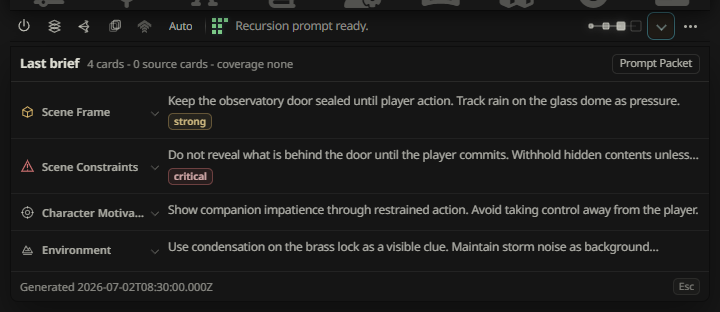

### Hero Pixel Array Progress Menu

The Hero Pixel Array and current-step text are the trust surface for invisible work. Clicking either opens the progress menu. The array shows one block per top-level progress row, with child rows visible inside the menu.

Expected stages include:

- `Reading current turn...`
- `Checking scene shift...`
- `Planning card pass...`
- `Generating scene cards...`
- `Generating fused card bundle...`
- `Selecting turn hand...`
- `Composing prompt packet with Utility...`
- `Reasoner refining guidance...`
- `Installing Recursion prompt...`
- `Recursion prompt ready.`

Fallback states should be equally direct, such as `Reasoner unavailable. Utility composed the packet.` or `Prompt install failed. Generation will continue without Recursion.`

The progress menu must not show raw prompts, raw provider responses, stack traces, provider secrets, hidden reasoning, or private story plans.

### Tense & PoV

Recursion treats story form as a prompt-contract consistency signal. The active story form is the tense and point of view the next reply should preserve, such as past tense third-person limited or present tense second person.

By default, `Auto` lets the Arbiter detect the form from the latest assistant narration. Runtime validates that result and runs a heuristic cross-check before it is used. If the Arbiter result conflicts with obvious narration cues, Recursion drops to unknown story form and tells the host model to match the active chat's established form.

The Tense & PoV menu is an operator override for cases where automatic detection is wrong or where the current chat has unusual player-message style that could confuse the Arbiter. Forced choices are:

- Past 1st, Past 2nd, Past 3rd Limited, Past 3rd Omni;
- Present 1st, Present 2nd, Present 3rd Limited, Present 3rd Omni.

Forced story form applies to the next Recursion prompt contract and persists as a setting until changed back to `Auto`. Use it sparingly: it should preserve an established narration form, not force a new writing style onto a scene.

### Options Menu

The ellipsis opens the integrated settings/options menu. It is configuration-first, not a command drawer.

Main controls:

- Play: a Behavior section containing Strength, Min Cards, Max Cards, Prompt Footprint, and Focus.
- Providers: collapsible Utility and Reasoner provider setup, test controls, and session key controls.
- Advanced: collapsible Injection, UI, Prose Enhancement, Retention, and Diagnostics sections covering final prompt injection placement/role/depth, progress row limits, Prose Enhancement context length, Recursion-owned cap settings, safe excerpts, Reset Scene Cache, Clear Run Journal, Export Diagnostics, and the Full Viewer entry point.

The dropdown arrow opens Last Brief. The ellipsis opens options. The Hero Pixel Array or current-step status opens progress.

### Last Brief

Last Brief is the compact inspection surface for what Recursion used last. It opens from the dropdown arrow in the bar. It shows selected card families, category glyphs, emphasis, concise one-line summaries, bounded meta chips, and a Prompt Packet button.

Cards expand in place to show the full card text. The Prompt Packet button opens the final injected packet text plus route metadata, omitted items, source card refs, and copy control.

Rows are read-only. Recursion V1 is not a card editor.

Cards shown in Last Brief are operational instructions, not draft prose. They should read like private constraints and anchors for the next response. If a card reads like a mini-scene, that is a provider-contract failure rather than the intended card format.

If Last Brief shows stale or wrong context, use the bar Regenerate command. Last Brief stays an inspection surface; it does not grow per-card regenerate controls.

### Full Viewer

The Full Viewer is the complete observatory. It should include:

- `Now`: current mode, active run, latest hand, and prompt packet summary.
- `Deck`: scene-local card state, emphasis, detail profile, provider source, and freshness.
- `Activity`: bounded sanitized runtime, provider, storage, and prompt-install timeline.
- `Prompt Packet`: Guidance, Card Evidence, Guardrails, selected refs, omissions, and injection metadata.
- `Settings`: broad behavior controls.
- `Providers`: Utility and Reasoner setup and test controls.

## Modes

### Power Off

The power toggle stops Recursion from preparing prompt packets. Turning it off should clear or skip Recursion-owned prompt lanes so stale packets do not affect generation.

### Auto

Auto lets Recursion compile and install the next prompt packet. It should finish, reuse valid cache, or fail soft before the next Recursion packet is trusted.

### Manual

Manual uses the Cards selector as a force list. Selected family rows are mandatory cards up to `Max Cards`; disabled families stay out of planning, deck reuse, hand selection, composition, and injection. If the Arbiter omits a selected family, runtime either reuses a valid cached card for that family or generates the missing card.

Sub-items under a selected family are focus facets. They shape that one family card and do not count as extra cards. If `Max Cards` is `5`, Manual allows at most five selected family rows and shows `Max Cards is 5. Change it in Settings to select more.` when another family is blocked.

## Pipelines

Pipeline selection is separate from Auto and Manual. Auto and Manual decide whether Recursion prepares guidance automatically or only on explicit operation; Standard, Rapid, and Fused decide how the preparation work is scheduled.

### Standard

Standard is the default reference pipeline. On send, Recursion captures the turn, runs Arbiter planning, creates or reuses scene cards, selects the hand, composes the prompt packet, validates the packet, and installs the prompt keys before generation continues.

Use Standard when:

- you are testing Recursion for the first time;
- the scene just shifted or the active source is uncertain;
- you want maximum current-scene coverage;
- you need the most debuggable path through Activity, Last Brief, Prompt Packet, and diagnostics.

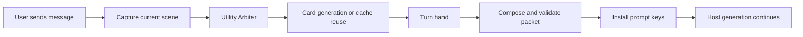

### Rapid

Rapid is the low-latency pipeline. When Rapid is selected and Recursion is enabled, Recursion may warm a provider-generated scene deck after an assistant message lands or the active source settles. That background work writes cache metadata only. It does not install prompt text by itself and does not affect the current assistant response.

On the next send, Rapid uses the exact ready warm packet plus the new user message in a short Utility `rapidTurnDelta` call. If no warm packet is available, Rapid escalates that turn to Standard instead of creating a lower-quality summary path. Rapid does not create local fallback cards, local scene briefs, local turn briefs, or summary fast-start packs. If the provider says a mandatory piece is missing, asks for Standard, or returns invalid Rapid structured output, Recursion escalates that turn to Standard.

Use Rapid when:

- Utility provider work is intended and healthy;
- the scene is ongoing rather than newly reset;
- you want lower send-time latency without abandoning provider-authored guidance;
- you are comfortable with Standard escalation when Rapid cannot safely prepare the turn.

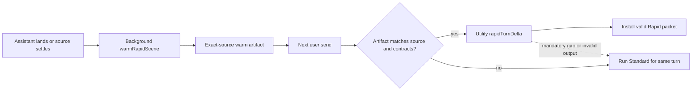

### Fused

Fused is the large foreground card-call pipeline. It runs the same Arbiter, card-scope filtering, Manual forced-card reconciliation, scene deck, hand selection, guidance composition, prompt packet validation, and install flow as Standard. The difference is the card-generation stage: all Arbiter-requested or manually forced card families are appended into one `fusedCardBundle` request and returned as one `recursion.cardBundle.v1` response.

Fused accepts valid requested card items, rejects unrequested or duplicate items, records compact omissions, and repairs damaged or missing requested siblings through individual Standard card calls when at least one Fused item is trustworthy. It runs full Standard card fallback only when no useful bundle item survives. It still obeys Reasoning Level: Low and Medium use Utility, while High and Ultra use Reasoner when the Reasoner lane is healthy.

Fused is designed for stronger reasoning models such as recent DeepSeek, GLM, MiniMax, Kimi, MiMo, Qwen, and similar. Standard is usually better for fast, cheaper utility-class models such as 500B-and-lower models, Nemotron, GPT-OSS, Gemma, and similar.

Use Fused when:

- your selected provider can reliably return larger structured JSON;
- you want one stronger model pass to coordinate multiple scene cards;
- the Reasoner lane is healthy and selected through High or Ultra Reasoning Level;
- you are comfortable with targeted Standard repair for damaged siblings and full Standard fallback if the bundle has no trustworthy cards.

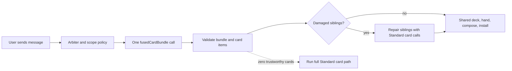

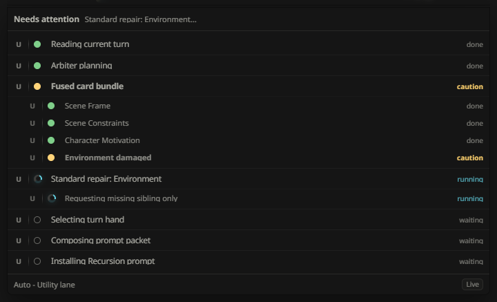

## Settings

Operator settings should stay broad. Pipeline, Mode, and Reasoning Level live in the compact bar, not in Settings.

- Play / Behavior: Strength `Light | Balanced | Strong`, Prompt Footprint `Compact | Normal | Rich`, and Focus `Balanced | Character | Constraints | Scene | Plot`.
- Providers: collapsible Utility and Reasoner setup in the settings panel.
- Advanced / Injection: final-prompt injection compatibility controls: Placement `In Prompt | In Chat`, Role `System | User | Assistant`, and Depth `0..10`.
- Advanced / UI: progress row limits.
- Advanced / Prose Enhancement: context messages for the post-generation Utility polishing pass, default `13`, range `0..35`.
- Advanced / Retention: Source Messages, Source Text Budget, Provider Messages, Scene Caches / Chat, Scene Caches Total, Swipe Variants / Scene, and Journal Entries.
- Advanced / Diagnostics: safe excerpts, Reset Scene Cache, Clear Run Journal, and Export Diagnostics.

Use Regenerate before Reset Scene Cache. Regenerate is the normal play control for "make the next packet fresh." Reset Scene Cache is a diagnostic cleanup action that deletes the current scene cache and clears the installed prompt.

Behavior controls have distinct jobs. Prompt Footprint controls the size and detail of the final composed prompt packet. Min Cards controls Low's selected-card pressure, Max Cards controls Manual selected-family count and Ultra's selected-card pressure, and Medium/High use the Min/Max average. Max Cards also helps avoid unnecessary card model calls: if the Arbiter asks for more card jobs than the effective hand can use, Recursion trims those jobs before generation and records a compact diagnostic. Strength controls intervention pressure inside that budget. Focus changes soft card-family priority without becoming a hard whitelist. The backend contract is defined in [Behavior Settings Policy Spec](../design/BEHAVIOR_SETTINGS_POLICY_SPEC.md).

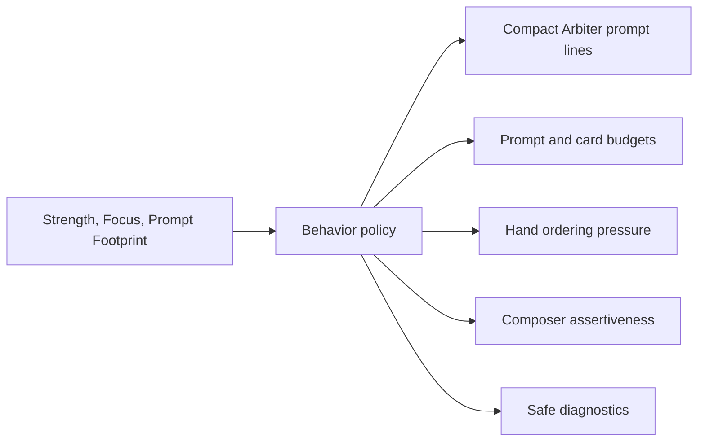

Default injection settings use Recursion's recommended concrete plan: `In Prompt`, `System`, depth `1`. Injection settings apply only to the composed final prompt packet after Utility or Reasoner composition. Users should not need to manage per-turn action, card families, relevance rules, or card-level prompt depths turn by turn.

Retention caps are local Recursion tuning controls. Lower Source Messages or Source Text Budget if a very long chat makes Recursion feel slow. Raise Scene Caches or Journal Entries when debugging. These caps only affect Recursion-owned files and analysis windows; they do not prune SillyTavern chat history.

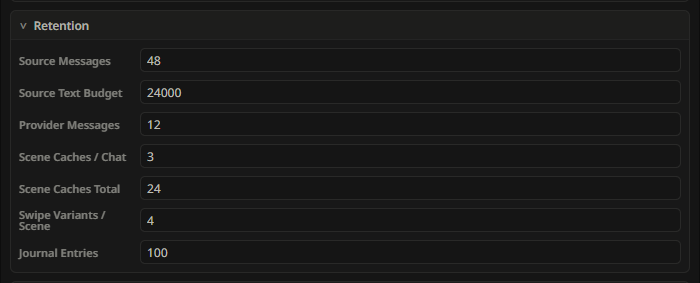

## Provider Controls

Recursion has two provider lanes:

- Utility: required, default, and used for Arbiter planning, structured card work, provider tests, guidance composition, and fail-soft fallback guidance.
- Reasoner: optional, selected by Reasoning Level and lane health for synthesis, priority routing, crowded hands, conflicted cards, or subtle composition work.

Each lane may support:

- Current Host Model;
- Host Connection Profile;
- OpenAI-Compatible Endpoint;
- base URL, model, fetched-model selector, and max token controls;
- session API key field for direct endpoints;
- Test Provider;
- Clear Session Key for OpenAI-compatible endpoints;
- status and resolved model labels.

Provider fields auto-save when changed. Source changes switch the visible field context immediately while preserving hidden alternate-source values. Session API keys stay in browser-session memory and are never persisted.

Utility must be configured for normal operation. Reasoner can remain disabled; if Medium, High, or Ultra is selected while Reasoner is unavailable, Recursion keeps the selected Reasoning Level and falls back through Utility. See [Provider Setup](PROVIDER_SETUP.md).

## First Run

Use this first-run path:

1. Enable Recursion and confirm the bar mounts.
2. Configure Utility.
3. Leave Reasoner disabled unless you need Medium/High/Ultra synthesis; if you enable it, run Test Provider.
4. Confirm the power toggle is on.
5. Leave Tense & PoV on Auto unless the active chat needs a forced story form.
6. Set Pipeline to Standard, then set mode to Auto.
7. Send a safe ordinary turn.
8. Confirm progress reaches prompt ready or a clear fallback.
9. Inspect Last Brief and Prompt Packet.
10. Try Manual with a narrowed Cards scope and confirm selected families are covered while disabled families stay out.
11. Try Rapid only when Utility provider work is intended, then confirm the progress text reports Rapid warm, delta, warm-miss Standard escalation, or clear fallback honestly.
12. Use the power toggle to verify prompt cleanup.

See [First Run Workflow](FIRST_RUN_WORKFLOW.md) for the shorter checklist.

## Normal Operation

During normal play:

1. Keep Recursion in Auto when you want current-scene prompt help.
2. Use Standard when you want the full foreground pass, and Rapid when you want warmed card evidence and guidance plus a short send-time delta.
3. Watch the Hero Pixel Array and current-step text while work runs.
4. Use Last Brief when output quality suggests the wrong scene pressure was selected.
5. Open Prompt Packet when you need to inspect exact model-facing Recursion guidance.
6. Use the progress menu or Full Viewer when you need diagnostic detail.
7. Turn the power toggle off when you want an unassisted generation or prompt cleanup.

Recursion should not require card editing or repeated manual tuning.

## Fail-Soft Behavior

Recursion should degrade itself, not the chat.

Expected behavior:

- Utility unavailable: skip new work, reuse valid cache when safe, or avoid injection.
- Utility invalid output: reject unsafe structured output and use conservative fallback.
- Rapid warm unavailable: escalate to Standard for the same pending user message; do not install local substitute Rapid briefs.
- Rapid invalid output or mandatory gap: escalate the current turn to Standard.
- Bar Regenerate: arm one fresh-next-generation token without starting provider or host generation; the next send or swipe consumes it once, bypasses cached cards, Rapid warm, Fused bundle reuse, and same-turn/swipe packet reuse for that run, then returns to the selected pipeline.
- Card failure: omit failed cards and keep valid siblings.
- Reasoner disabled, unhealthy, missing credentials, or failed: compose with Utility.
- Player Stop / host generation stop, including the Recursion Bar Stop generation button: abort active Recursion work, stop the host generation when the SillyTavern stop seam is available, clear owned prompt keys, and show skipped/canceled progress rather than a provider warning.
- Storage write failure: continue with memory state when safe and report a warning.
- Prompt install failure: allow SillyTavern generation to continue without Recursion guidance.
- Chat, settings, or source change during a run: abort or discard stale results.

Warnings should be visible in the bar, Hero Pixel Array progress menu, Full Viewer, or provider controls without leaking raw provider payloads or secrets.

## Prompt Packet Inspection

The Prompt Packet is the complete model-facing Recursion artifact for one generation attempt. It should be inspectable and bounded.

Main sections:

- Guidance: provider-authored direction for using the selected evidence in the next generation.
- Card Evidence: full raw selected-card text preserved as evidence.
- Guardrails: compact constraints that prevent contradictions, hidden-thought leakage, spoilers, or user-message rewriting.

Inspection should also show selected card refs, omissions, footprint, token estimate, injection metadata, composer route, and fallback path.

The packet should not contain raw provider responses, hidden chain-of-thought, broad plot plans, durable lore, transcript-scale summaries, or provider secrets.

## Diagnostics

Diagnostics are for explaining recent behavior. Normal diagnostics may include:

- provider lane and source type;
- resolved model label;
- status category;
- duration and token counts;
- card ids, families, statuses, and token estimates;
- source message id ranges and hashes;
- prompt packet hashes;
- omission and fallback reasons;
- cache hit, stale, and prune events.

Normal diagnostics must not include API keys, authorization headers, cookies, raw provider prompts, raw provider responses, full transcript text, hidden reasoning, private notes, or unbounded excerpts.

## Storage Ownership

Recursion storage is cache-oriented. The runtime owns scene cache, run journal, prompt metadata, redaction, pruning, and prompt-lane cleanup. Current operator controls are:

- power-toggle cleanup;
- Clear Session Key for OpenAI-compatible provider lanes;
- Retention caps for Recursion-owned source windows, scene caches, source variants, and run journals;
- diagnostics excerpt settings;
- Reset Scene Cache, Clear Run Journal, and Export Diagnostics;
- extension disable when Recursion should be fully inactive.

These controls must touch only Recursion-owned settings, scene caches, journals, prompt lanes, and diagnostics. They must not delete SillyTavern chats, character data, World Info, Memory Books, Summaryception data, VectFox data, or other extension records.

## Mobile Behavior

On narrow viewports:

- mode, card scope, and story-form controls should remain visible in compact form;
- provider and status details may collapse into a menu;
- the viewer should use one-column sections;
- controls should be touch-safe;
- wide tables should be avoided;
- the bar and progress menus must not cover message input or generation controls.

## Live Smoke Checklist

Use this checklist for a practical browser pass:

1. Load SillyTavern with Recursion installed and enabled.
2. Confirm the Recursion Bar appears near the chat surface.
3. Open the Hero Pixel Array progress menu, Last Brief dropdown, Settings, and Full Viewer.
4. Visit Play, Providers, Advanced, Prompt Packet, and Viewer sections.
5. Configure and test Utility when provider work is intended.
6. Confirm the Regenerate icon appears in the bar while idle; click it and confirm the icon stays visible in a pressed armed state, Stop remains hidden, and Last Brief keeps showing the previous completed packet.
7. Send or swipe once and confirm the armed token is consumed, normal generation progress appears, and Stop is available only while Recursion or the host generation is active.
8. Turn power off and confirm prompt lanes are absent or cleared.
9. Set Auto and confirm Recursion is ready to compile.
10. Set Manual and confirm it applies as a distinct mode.
11. Confirm the Pipeline icon dropdown sits immediately left of Mode and offers Standard, Rapid, and Fused.
12. Confirm the Tense & PoV dropdown offers Auto and the forced past/present POV options, then return it to Auto unless the smoke intentionally tests an override.
13. Run a safe Standard Auto pass only when provider and live mutation are intended.
14. Run a safe Rapid Auto pass only when provider and live mutation are intended.
15. Confirm Activity reaches ready, Rapid delta, warm-miss Standard escalation, or a clear fallback.
16. Inspect Last Brief and the final Prompt Packet text.
17. Turn power off and confirm cleanup.
18. Clear session keys before screenshots or exports that might show provider setup.

Automated live evidence must use dedicated `recursion-soak-*` users and must reject `default-user` before mutation. See [Live Smoke Test Plan](../testing/LIVE_SMOKE_TEST_PLAN.md).

## Related Docs

- [First Run Workflow](FIRST_RUN_WORKFLOW.md)
- [Provider Setup](PROVIDER_SETUP.md)
- [Prompt Privacy And Safety](PROMPT_PRIVACY_AND_SAFETY.md)
- [UI Spec](../design/UI_SPEC.md)
- [Prompt Composition Spec](../architecture/PROMPT_COMPOSITION_SPEC.md)
- [Storage And Diagnostics](../architecture/STORAGE_AND_DIAGNOSTICS.md)
