# Recursion Operator Manual

Recursion is an alpha SillyTavern extension that compiles current-scene prompt guidance for the next roleplay generation. It observes the active chat, maintains a short-lived scene deck, selects a turn hand, and installs an inspectable prompt packet when Auto or Manual mode is active. Segmented generates requested card families through a series of narrow model stages; Fused asks a stronger model for one multi-card bundle and uses Segmented repair or fallback when validation requires it.

Recursion is not a memory manager, lore database, summary engine, vector recall layer, campaign save system, character database, or card-editing product. It does not own durable canon. It improves the next response by preserving selected scene evidence and adding provider-authored direction for the scene in front of the user.

## Surface Matrix

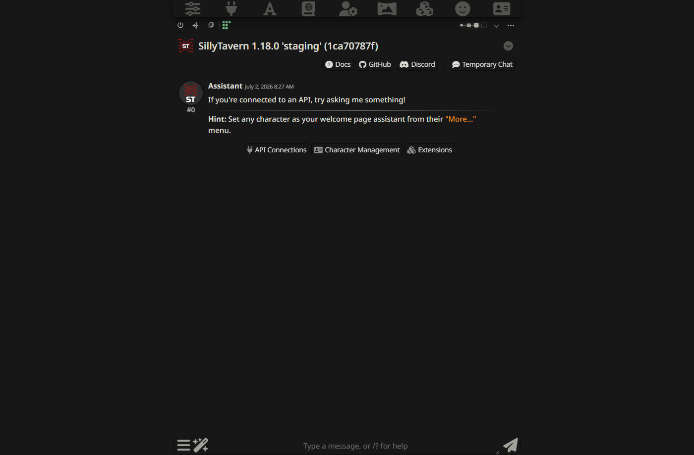

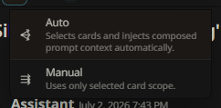

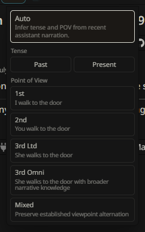

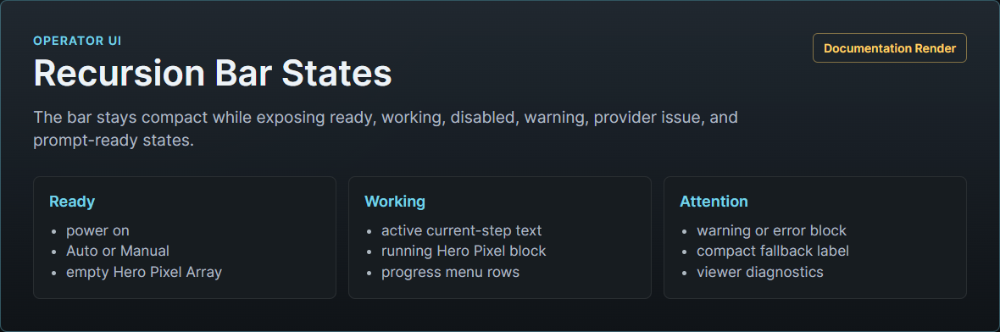

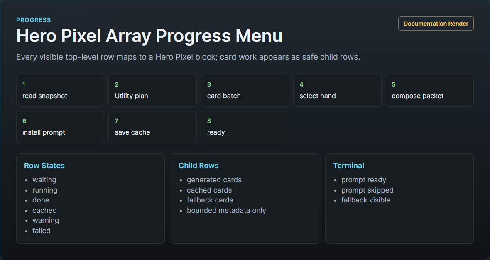

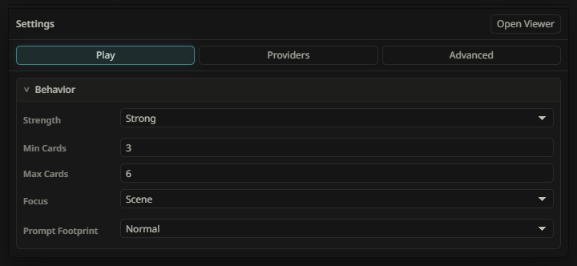

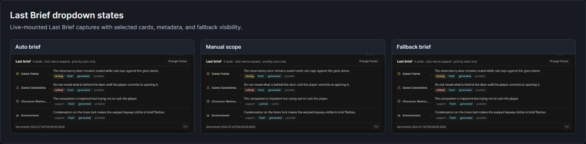

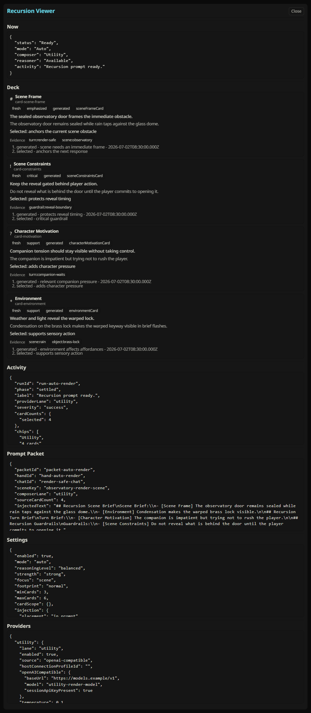

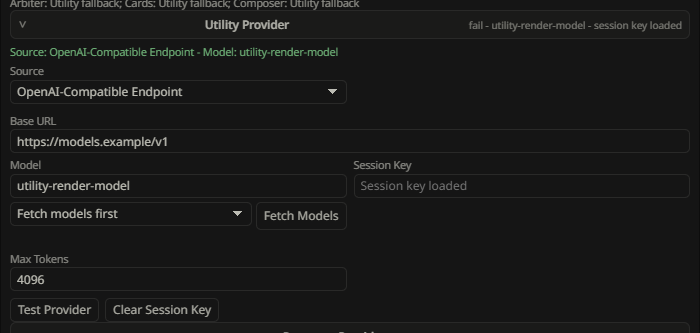

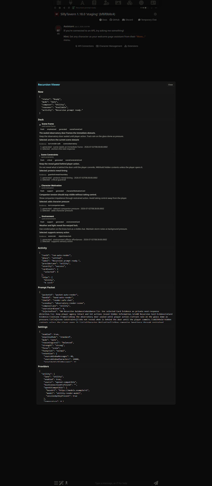

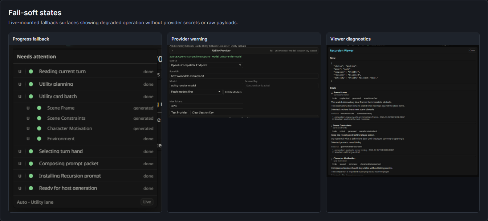

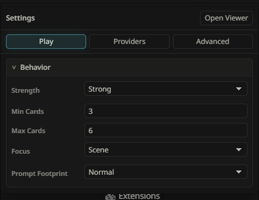

## Main Surfaces

### Recursion Bar

The Recursion Bar is the normal control surface. It sits near the chat surface and shows:

- runtime health: Ready, Working, Paused, Issue, or Off;
- power toggle;
- icon-only Pipeline control: Segmented or Fused;
- icon-only mode control: Auto or Manual;
- adjacent icon-only Pre-process Cards and Post-process Cards controls;
- compact Tense & PoV control;
- Hero Pixel Array plus current-step text;
- command slot: Stop generation while active, Regenerate icon while idle;
- Reasoning Level chain;
- Last Brief dropdown arrow;
- ellipsis options/settings entry.

The bar should be stable. Status changes should not repeatedly resize the transcript or cover message input controls.

The Pipeline control is a small icon-only dropdown immediately to the left of the Mode button. `Segmented` runs requested card families as separate narrow calls and is the default for smaller or simpler models. `Fused` keeps the same Arbiter and shared deck/hand/compose/install path, but asks one provider call to generate all requested cards as a bundle. The selected icon updates on the bar, and the dropdown follows the compact Mode-menu pattern. Pipeline is not duplicated in Settings.

Pre-process Cards and Post-process Cards sit together immediately to the right of Mode. Both use the stacked-card icon with a small inset arrow: left for work before generation and right for work after generation. Pre-process controls the evidence and guidance deck. Post-process controls an independent ordered rewrite deck and is grey when its top-level feature is Off.

When Post-process is On, Recursion synthesizes contextual guidance from the enabled Post-process cards, then gives it to the selected writer: the current SillyTavern model by default, or a separate Connection Profile. `As Swipe` preserves the original and selects the final rewritten swipe; `Replace` withholds replacement until the operation completes successfully. Unified performs one combined guidance-and-rewrite operation. Progressive performs one operation per runnable category and continues from the last valid draft after a category failure.

The progress menu shows `Post-processing response`, guidance synthesis, writer revision, category progress for Progressive, and final swipe or replacement. Green means complete, purple means cached or checkpointed, gray means skipped, amber means unresolved caution or a committed partial Progressive result, and red identifies a failed category or Unified operation. A Unified failure leaves the original response selected. A partial Progressive result is committed As Swipe even when Replace was configured.

The Tense & PoV control sits in the compact left-side control cluster after Post-process Cards. Leave it on `Auto` for normal play. In Auto, the Utility Arbiter infers the active story form from the latest visible assistant narration first, using the pending user message only when no assistant narration exists. Use a forced option only when the Arbiter is clearly steering card evidence or guidance toward the wrong form. The menu uses two axes: Past or Present tense, then first person, second person, third-person limited, third-person omniscient, or mixed POV. A forced selection creates a high-confidence user story-form override for card prompts, guidance composition, checkpoint metadata, and Prompt Packet metadata; it does not rewrite the transcript, change SillyTavern character data, or add style coaching beyond the story-form contract.

The command slot changes by state. While a Recursion stage is active, Stop aborts its current call and pauses the operation while preserving accepted checkpoints. While SillyTavern's host generation is active, Stop follows the native host stop seam, clears Recursion-owned prompt lanes, and prevents a pending Post-process pass from beginning. Recursion never automatically retries the primary story generation. This control is not the power toggle; use power when you want Recursion off for future sends.

When Recursion is idle, the same slot shows the Full Rebuild icon. Use it when you want the next swipe of the active turn to rebuild all Pre-process work without deleting chat data. Its accessible label is `Rebuild all Recursion work on the next swipe`; after one click it becomes `Full rebuild on next swipe: Queued`. The click does not start provider work or SillyTavern generation. Last Brief keeps showing the previous completed packet until the matching swipe consumes the intent once. Clicking again before consumption cancels it. Sending a new user message cancels the intent and starts a fresh turn.

### Hero Pixel Array Progress Menu

The Hero Pixel Array and current-step text are the trust surface for invisible work. Clicking either opens the progress menu. The array shows one block per top-level progress row, with child rows visible inside the menu.

Expected stages include:

- `Reading current turn...`
- `Classifying current turn...`
- `Planning card pass...`
- `Generating turn cards...`
- `Generating fused card bundle...`
- `Selecting turn hand...`
- `Composing prompt packet with Utility...`
- `Reasoner refining guidance...`
- `Installing Recursion prompt...`
- `Recursion prompt ready.`

Fallback states should be equally direct, such as `Reasoner unavailable. Utility composed the packet.` or `Prompt install failed. Generation will continue without Recursion.`

The progress menu must not show raw prompts, raw provider responses, stack traces, provider secrets, hidden reasoning, or private story plans.

Every stage row reserves one 24px contextual action slot. The row shows at most
one direct action: Stop while active, Resume while paused, Retry Stage after a
retryable failure, Reprocess from here on the next swipe for eligible completed
or stale work, or Cancel queued reprocess. There is no row-expansion
requirement, secondary menu, or confirmation flap. The selected action uses the
cyan state; mobile truncates row text before shrinking the action. Tooltips and
accessible labels carry the explanatory wording.

### Tense & PoV

Recursion treats story form as a prompt-contract consistency signal. The active story form is the tense and point of view the next reply should preserve, such as past tense third-person limited or present tense second person.

By default, `Auto` lets the Arbiter detect the form from the latest assistant narration. Runtime validates that result and runs a heuristic cross-check before it is used. If obvious narration cues show stable-tense mixed POV, Recursion preserves that as `Past Mixed` or `Present Mixed`; if cues conflict without strong mixed evidence, Recursion drops to unknown story form and tells the host model to match the active chat's established form.

The Tense & PoV menu is an operator override for cases where automatic detection is wrong or where the current chat has unusual player-message style that could confuse the Arbiter. Forced choices are:

- Past 1st, Past 2nd, Past 3rd Limited, Past 3rd Omni, Past Mixed;
- Present 1st, Present 2nd, Present 3rd Limited, Present 3rd Omni, Present Mixed.

Forced story form applies to the next Recursion prompt contract and persists as a setting until changed back to `Auto`. Use it sparingly: it should preserve an established narration form, not force a new writing style onto a scene.

### Options Menu

The ellipsis opens the integrated settings/options menu. It is configuration-first, not a command drawer.

Main controls:

- Play: a Behavior section containing Strength, Min Cards, Max Cards, Selection variety, Card cooldown (turns), Prompt Footprint, and Focus.
- Providers: collapsible Utility and Reasoner Connection Profile selection, policy controls, and Test Profile actions.
- Advanced: collapsible Injection, Execution, UI, Context Windows, Storage Retention, and Diagnostics sections covering final prompt injection placement/role/depth, attempt windows, progress row limits, Recursion-owned evidence and analysis windows, Journal Entries, safe excerpts, Reset Turn Cache, Clear Run Journal, Export Diagnostics, and the Full Viewer entry point. Reset Defaults at the bottom restores Play and Advanced settings after confirmation while preserving Connection Profile selections and policies, custom decks and scope, compact-bar settings, and viewer visibility.

The dropdown arrow opens Last Brief. The ellipsis opens options. The Hero Pixel Array or current-step status opens progress.

### Last Brief

Last Brief is the compact inspection surface for what Recursion used last. It opens from the dropdown arrow in the bar. It shows selected card families, category glyphs, emphasis, concise one-line summaries, bounded meta chips, and a Prompt Packet button.

Cards expand in place to show the full card text. The Prompt Packet button opens the final injected packet text plus route metadata, omitted items, source card refs, and copy control.

Rows are read-only inspection output. Card authoring happens in the Cards deck editor, not inside Last Brief.

Cards shown in Last Brief are operational instructions, not draft prose. They should read like private constraints and anchors for the next response. If a card reads like a mini-scene, that is a provider-contract failure rather than the intended card format.

If Last Brief shows stale or wrong context, use the bar Regenerate command. Last Brief stays an inspection surface; it does not grow per-card regenerate controls.

### Full Viewer

The Full Viewer is the complete observatory. It should include:

- `Now`: current mode, active run, latest hand, and prompt packet summary.
- `Deck`: scene-local card state, emphasis, detail profile, generation lane, cache state, and freshness.
- `Activity`: bounded sanitized runtime, provider, storage, and prompt-install timeline.
- `Prompt Packet`: Guidance, Card Evidence, Guardrails, selected refs, omissions, and injection metadata.
- `Settings`: broad behavior controls.
- `Providers`: Utility and Reasoner setup and test controls.

## Cards, Decks, And Focus

The Pre-process Cards control is the operator surface for deciding which scene questions Recursion may prepare. The bundled Default Deck contains the fixed V1 catalog. Its card states and both bulk eye actions work immediately. Duplicate it only when you want to edit categories, author cards, or change structure and order.

### Card states

Editable cards use one eye-state cycle:

- `off`: excluded from scope and hand selection;
- `active`: a normal candidate;
- `priority`: selected ahead of normal active cards in Auto;
- `refinement`: always included in both modes, with automatic scene-analysis review before narration.

Auto cycles `off -> active -> priority -> refinement -> off`. Manual cycles `off -> active -> refinement -> off`, because selected Manual families are already forced. Refinement remains mandatory beyond the ordinary card cap. The deck header open eye sets all runnable cards active and clears Priority and Refinement; the slashed eye sets all runnable cards off. Draft cards are left unchanged. These state controls work on the Default Deck even though its content and organization are read-only.

### Decks and authored cards

Custom decks can be created, renamed, duplicated, and deleted. In either card panel, deleting a custom deck opens the same inline confirmation to the right of the deck selector; type `delete`, then use the confirm icon. Within an editable deck, create categories and authored cards, edit their names and content, duplicate or delete them, and drag category/card handles to reorder or move cards between categories. Card Assist can propose bounded authored-card content; review it before committing it to the deck.

The deck is configuration and authoring state. It is separate from the disposable scene-local generated card cache and from the turn hand selected for one prompt.

Deck selection, card participation state, and each category's expanded/collapsed state are global extension settings. They remain the same when you close and reopen a dropdown, change chats, reload SillyTavern, or remount the extension. Category descriptions stay out of the visible list and appear on hover when UI tooltips are enabled; card descriptions remain visible beneath card names.

### Post-process Cards

Post-process Cards uses the same compact deck layout after generation. Its cards are binary On/Off rewrite instructions rather than Pre-process selection candidates. In the upper-right header:

- `Off` / `On` controls the entire Post-process feature;
- `As Swipe` / `Replace` chooses how the rewritten response is applied;
- `Unified` / `Progressive` chooses one combined pass or sequential category passes;
- the open eye enables all runnable cards;
- the slashed eye disables all runnable cards.

Changing Apply, Flow, or the global feature state briefly reports the change in the main status line and mobile status drawer. The concise acknowledgements explain the selected behavior without creating a generation-progress row.

The bundled Starter Post-process Deck is structurally read-only, but its card and bulk enabled states are editable. Duplicate it to rename, add, remove, reorder, rewrite deck content, or edit its style brief/example.

On a fresh starter deck, the six cards under Natural Prose and Follow Through are On. `Strip False Weight`, `Earn the Attraction`, and `Ground the Deflection` are Off, leaving their optional Concrete Meaning and Character-Specific Relationships categories inactive. Categories have no On/Off control in either card phase. Turning on any child card automatically makes its category active; turning every child card Off makes it inactive. Concrete Meaning removes manufactured profundity by restoring concrete meaning, behavior, or consequence. Character-Specific Relationships repairs stock attraction and defensive scripts through established character, relationship, consent, and boundary evidence.

Editable Post-process decks use the same compact `Categories` plus row and the same drag behavior as Pre-process. Add cards with the plus in the owning category header. Category and card rows use different drag-handle shapes so their reorder targets remain visually distinct. Dragging works with mouse or pen; on touch, hold the handle briefly before moving.

### Scope and caps

Auto lets the Arbiter choose relevant cards from the active deck. Manual lets you select family rows directly and use sub-items as focus facets. `Min Cards` and `Max Cards` constrain the resulting hand; every runnable Priority or Refinement card survives in Auto, in deck order, even when that exceeds the effective maximum. Ordinary cards use the remaining capacity. Strict whitelist settings keep unselected families out of planning and reuse.

### Inspecting the result

Last Brief shows the latest selected hand, card families, state/emphasis, concise evidence, omissions, and packet metadata. The Full Viewer expands the deck/hand relationship and shows why cards were omitted. Use Regenerate when the current hand is stale; do not treat the hand as durable memory.

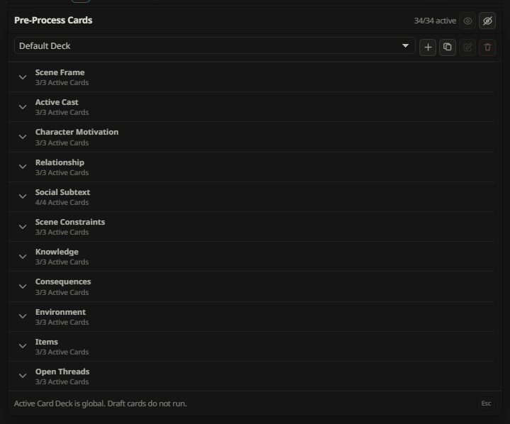

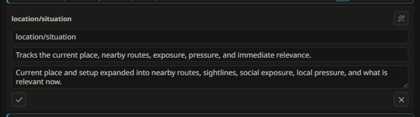

## Post-processing

Post-processing revises the completed assistant response according to the active Post-process Deck. It uses the frozen response, bounded visible context, generation-time Prompt Packet, ordered enabled categories, and ordered enabled cards.

Recursion's Utility lane synthesizes guidance at Low and Medium; Reasoner does so at High and Ultra. That sidecar call does not write prose. The selected prose writer receives the guidance. Current SillyTavern model uses native quiet generation with the active preset and normal host context. Connection Profile uses a separate saved profile without switching the main connection; it receives the full draft and bounded editing evidence, not the entire native prompt.

Unified performs one guidance synthesis and one host rewrite for all runnable categories. Progressive performs one guidance synthesis and one host rewrite per runnable category in deck order. Accepted guidance and drafts are checkpointed. A failed Unified operation writes nothing. A failed Progressive category preserves the last valid draft and exposes contextual recovery. The final host commit uses an idempotent receipt so Resume cannot duplicate a swipe or replacement.

Choose `As Swipe` to preserve the original and select the final rewritten swipe. Choose `Replace` to replace the selected assistant response only after complete success. A partial Progressive result always falls back to As Swipe so the original remains available. Intermediate Progressive drafts never enter chat persistence.

### Writer, scope, and style

Writer defaults to Current SillyTavern model. For a separate prose model, choose Connection Profile and select its saved profile. Advanced writer settings let you inherit its output limit or set 256..65536 tokens, and use profile sampling or explicit temperature/top-p. A missing profile or absent inherited output limit produces an actionable error rather than changing writers.

Polish is the default: it improves narration while preserving spoken dialogue wording. Revise allows restructuring and dialogue rephrasing while preserving intent and events. Both preserve user agency, consent, character knowledge, tense, and viewpoint. Follow Through can tighten actions already in the draft, but cannot complete an action the draft leaves unperformed.

Deck Style holds a brief (up to 2000 characters) and optional example (up to 6000). The sample guides rhythm and texture; its facts, names, commands, and distinctive phrases are not material to import. Oversized text is rejected. Duplicate the bundled deck to edit style; custom deck copies, saves, and JSON import/export preserve it. At least one card must be On for processing.

### Review a revision

Turn on Review before applying to hold the completed candidate for inspection. This setting is Off by default and is independent of As Swipe/Replace. The comparison viewer offers original/revised reading, highlighted changes, Keep original, Use revision, and Edit revision. Inspect meaning as well as wording: the editing rules are model instructions, not a guarantee that meaning cannot change.

Use revision applies only to the still-matching source. Keep original discards pending work; for an applied owned revision it selects the original swipe or restores retained original text, provided the current target has not changed. Missing comparison data or a changed turn/source disables unsafe actions. Large revisions use coarser highlighting to keep the viewer responsive.

Try another revision begins with the retained original, using current writer, scope, style, and cards, and returns the new candidate for review. A previous applied revision stays selected until you accept its replacement. Matching guidance may be reused for writer-only changes; changed editing inputs regenerate guidance. Retry is unavailable after the source or turn changes.

## Modes

### Power Off

The power toggle stops Recursion from preparing prompt packets. Turning it off should clear or skip Recursion-owned prompt lanes so stale packets do not affect generation.

### Auto

Auto lets Recursion compile and install the next prompt packet. It should finish, reuse valid cache, or fail soft before the next Recursion packet is trusted.

### Manual

Manual uses the Pre-process Cards selector as a force list. Selected family rows are mandatory cards up to `Max Cards`; disabled families stay out of planning, deck reuse, hand selection, composition, and injection. If the Arbiter omits a selected family, runtime either reuses a valid cached card for that family or generates the missing card.

Sub-items under a selected family are focus facets. They shape that one family card and do not count as extra cards. If `Max Cards` is `5`, Manual allows at most five selected family rows and shows `Max Cards is 5. Change it in Settings to select more.` when another family is blocked.

## Pipelines

Pipeline selection is separate from Auto and Manual. Auto and Manual decide which card scope is runnable; Segmented and Fused decide how card-generation work is grouped.

### Segmented

Segmented is the default reference pipeline. On send, Recursion captures the turn, runs Arbiter planning, creates or reuses each requested scene card through an independent narrow stage, selects the hand, composes the prompt packet, validates it, and installs the prompt keys before generation continues.

Use Segmented when:

- you are testing Recursion for the first time;
- your model is smaller, local, or more reliable with simple structured calls;
- you need the most debuggable path through Activity, Last Brief, Prompt Packet, and diagnostics.

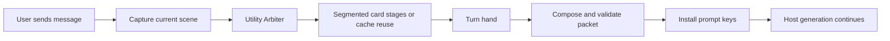
```mermaid
flowchart LR
    Send["User sends message"] --> Snapshot["Capture current scene"]
    Snapshot --> Arbiter["Utility Arbiter"]
    Arbiter --> Cards["Segmented card stages or cache reuse"]
    Cards --> Hand["Turn hand"]
    Hand --> Packet["Compose and validate packet"]
    Packet --> Prompt["Install prompt keys"]
    Prompt --> Host["Host generation continues"]
```

### Fused

Fused is the large foreground card-call pipeline. It runs the same Arbiter, card-scope filtering, Manual forced-card reconciliation, scene deck, hand selection, guidance composition, prompt packet validation, and install flow as Segmented. The difference is the card-generation stage: all Arbiter-requested or manually forced card families are appended into one `fusedCardBundle` request and returned as one `recursion.cardBundle.v1` response.

Fused accepts valid requested card items, rejects unrequested or duplicate items, records compact omissions, and repairs damaged or missing requested siblings through individual Segmented card stages when at least one item is useful. It runs the full Segmented card path only when no useful bundle item survives. It still obeys Reasoning Level: Low and Medium use Utility, while High and Ultra use Reasoner when the required lane is eligible. A physical Fused request does not require a profile test.

Successful automatic retries and card repairs appear as normal completion in Progress. Recovery details and attempt counts remain available through Export Diagnostics. Recursion calls attention to unresolved failures, required action, or incomplete results rather than successful internal recovery.

Fused is designed for stronger reasoning models such as recent DeepSeek, GLM, MiniMax, Kimi, MiMo, Qwen, and similar. Segmented is usually better for smaller or simpler models.

Use Fused when:

- your selected provider can reliably return larger structured JSON;
- you want one stronger model pass to coordinate multiple scene cards;
- the selected lane is configured and Reasoning Level routes the bundle there;
- you are comfortable with targeted Segmented repair for damaged siblings and full Segmented fallback if the bundle has no useful cards.

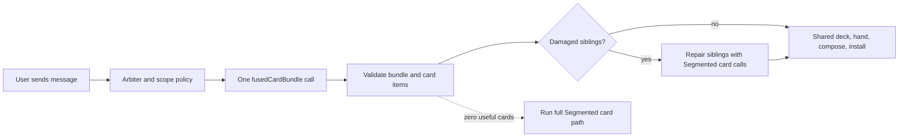
```mermaid
flowchart LR
    Send["User sends message"] --> Arbiter["Arbiter and scope policy"]
    Arbiter --> Bundle["One fusedCardBundle call"]
    Bundle --> Validate["Validate bundle and card items"]
    Validate --> Repair{"Damaged siblings?"}
    Repair -- "no" --> Shared["Shared deck, hand, compose, install"]
    Repair -- "yes" --> Targeted["Repair siblings with Segmented card calls"]
    Targeted --> Shared
    Validate -. "zero useful cards" .-> Segmented["Run full Segmented card path"]
```

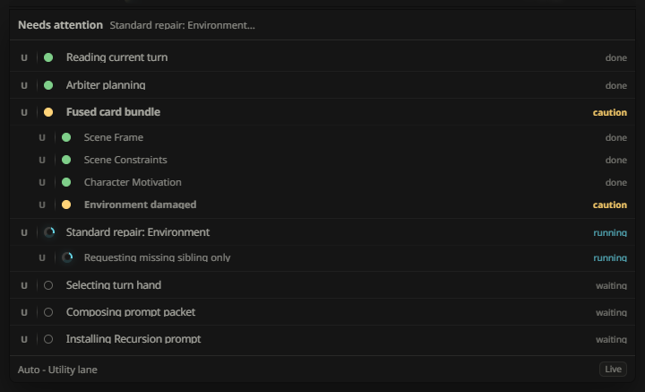

## Settings

Operator settings should stay broad. Pipeline, Mode, and Reasoning Level live in the compact bar, not in Settings.

- Play / Behavior: Strength `Light | Balanced | Strong`, Prompt Footprint `Compact | Normal | Rich`, and Focus `Balanced | Character | Constraints | Scene | Plot`.
- Providers: collapsible Utility and Reasoner setup in the settings panel.
- Advanced / Injection: final-prompt injection compatibility controls: Placement `In Prompt | In Chat`, Role `System | User | Assistant`, and Depth `0..10`.
- Advanced / UI: progress row limits.
- Advanced / Execution: Attempts per step, from one through five total model attempts per stage, default two. Recursion has no default generation timeout.
- Advanced / Context Windows: Post-process Evidence Messages, Source Freshness Messages, Source Freshness Text Budget, and Provider Analysis Messages. Post-process Evidence Messages defaults to `13` and ranges from `0..35`.
- Advanced / Storage Retention: Journal Entries only. Prior-turn generated work is pruned automatically.
- Advanced / Diagnostics: safe excerpts, Reset Turn Cache, Clear Run Journal, and Export Diagnostics.

Use Reprocess from here on the next swipe when one stage and its dependents need rebuilding. Use Full Rebuild to queue a fresh Pre-process pass for one matching swipe. Reset Turn Cache deletes generated work for the active turn, its queued intent, prepared/in-memory state, and prompt keys without touching SillyTavern chat history.

`Selection variety` defaults to **Low**. It keeps the strongest Auto choices and may replace just the last optional slot with another relevant Arbiter candidate. Off preserves ranking; Low has a 25% chance of a replacement from the next two alternatives, Medium a 50% chance from the next four, and High a 100% chance from all remaining relevant alternatives. With no useful alternative, the hand stays unchanged. This does not change provider temperature or add a model call.

`Card cooldown (turns)` defaults to **0 (off)** and accepts whole numbers from 0 to 10. A value of 2 excludes a used source card during the next two completed response turns. Cooldown is strict: if too few cards remain eligible, Recursion uses a smaller or empty optional hand. Both controls apply only in Auto; Manual ignores them. Priority and Refinement cards are mandatory in Auto, included in deck order, and exempt from both variety and cooldown. Refinement also remains mandatory in Manual.

Only completed assistant responses advance usage history; preparation, failed or stopped generation, retries and same-response swipes do not add turns. Selection is saved with the active chat branch, and same-turn resumes reuse the chosen hand. These controls auto-save in Play Behavior and Reset Defaults restores Low/0. Open the Full Viewer and inspect Card selection to see selected reasons, cooldown exclusions with turns remaining, and any variety replacement.

Behavior controls have distinct jobs. Prompt Footprint controls the size and detail of the final composed prompt packet. Min Cards controls Low's selected-card pressure, Max Cards controls Manual selected-family count and Ultra's selected-card pressure, and Medium/High use the Min/Max average. Max Cards also helps avoid unnecessary card model calls: if the Arbiter asks for more card jobs than the effective hand can use, Recursion trims those jobs before generation and records a compact diagnostic. Strength controls intervention pressure inside that budget. Focus changes soft card-family priority without becoming a hard whitelist. The backend contract is defined in [Behavior Settings Policy Spec](../design/BEHAVIOR_SETTINGS_POLICY_SPEC.md).

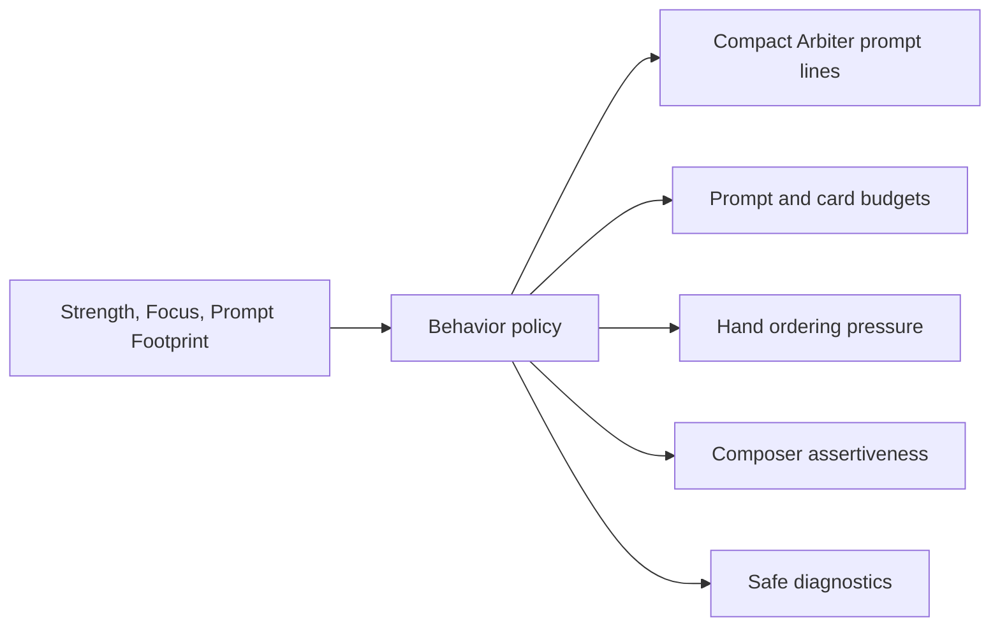
```mermaid
flowchart LR
    Settings["Strength, Focus, Prompt Footprint"] --> Policy["Behavior policy"]
    Policy --> Arbiter["Compact Arbiter prompt lines"]
    Policy --> Budgets["Prompt and card budgets"]
    Policy --> Hand["Hand ordering pressure"]
    Policy --> Composer["Composer assertiveness"]
    Policy --> Diagnostics["Safe diagnostics"]
```

Default injection settings use Recursion's recommended concrete plan: `In Prompt`, `System`, depth `1`. Injection settings apply only to the composed final prompt packet after Utility or Reasoner composition. Users should not need to manage per-turn action, card families, relevance rules, or card-level prompt depths turn by turn.

Context-window caps are local Recursion tuning controls. Lower Source Freshness Messages or Source Freshness Text Budget if a very long chat makes Recursion feel slow. Storage Retention controls only the bounded diagnostic journal. Generated work belongs to one exact turn and prior-turn artifacts are pruned automatically. None of these controls prune SillyTavern chat history.

Selected chat messages retain their full text, including paragraph breaks and endings. Recursion does not apply an additional per-message character cutoff. Window budgets select whole messages; a smaller window includes less history rather than shortening every reply. The newest source message is retained whole even when it exceeds the source-window budget. Complete evidence may use more input tokens than older versions did.

Generated cards and guidance must preserve completed actions and discoveries. Character reactions should respond to new information and practical precautions: an unanswered question about a threat's cause does not erase a reduction in its risk. Earlier fear or resistance does not require repeated escalation, and an update does not force calm, agreement, or trust.

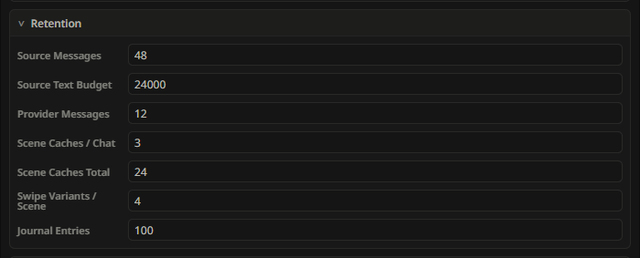

## Provider Controls

Recursion has two Connection Profile-backed lanes:

- Utility: required for Arbiter planning, ordinary card work, validation support, guidance composition, and fail-soft fallback.
- Reasoner: optional and selected by Reasoning Level for synthesis, priority cards, Fused bundles, and difficult editorial work.

Each lane exposes:

- Connection Profile;
- Behavioral Preset: Isolated or Full Profile;
- Instruct Formatting: Auto, On, or Off;
- Samplers: Connection Profile or Recursion Override;
- Structured Output: Auto, Native Schema, or Prompt JSON;
- Temperature and Top P only when Recursion Override is selected;
- Output Token Ceiling;
- Test Profile;
- capability state: Configure, Untested, Segmented, Fused, or Issue.

Recursion does not own endpoint, credential, or model-selection fields. Those remain in SillyTavern's Connection Profile.

The recommended local-model policy is Isolated behavioral preset, Auto instruct formatting, Connection Profile samplers, and Auto structured output. This keeps text-completion framing and sampler tuning while excluding behavioral prompt content that can corrupt JSON.

Test Profile reports connectivity, single-card, and Fused checks. These checks help diagnose a profile; they are not a prerequisite for selecting Fused. Actual bundle failures use the normal repair and fallback paths.

Provider edits auto-save, increment the lane configuration revision, and invalidate old certification. Same-profile model requests run through a FIFO queue with concurrency one. Utility and Reasoner may overlap only when they select different profiles.

See [Provider Setup](PROVIDER_SETUP.md).

## First Run

Use this first-run path:

1. Enable Recursion and confirm the bar mounts.
2. Configure Utility.
3. Select and test a Reasoner Connection Profile when you need Medium/High/Ultra synthesis or High/Ultra Post-process guidance.
4. Confirm the power toggle is on.
5. Leave Tense & PoV on Auto unless the active chat needs a forced story form.
6. Set Pipeline to Segmented, then set mode to Auto.
7. Send a safe ordinary turn.
8. Confirm progress reaches prompt ready or a clear fallback.
9. Inspect Last Brief and Prompt Packet.
10. Try Manual with a narrowed Cards scope and confirm selected families are covered while disabled families stay out.
11. Try Fused only after the selected lane reports Fused, then confirm it reports accepted bundle work, targeted Segmented repair, or full Segmented fallback honestly.
12. Use the power toggle to verify prompt cleanup.

See [First Run Workflow](FIRST_RUN_WORKFLOW.md) for the shorter checklist.

## Normal Operation

During normal play:

1. Keep Recursion in Auto when you want current-scene prompt help.
2. Use Segmented for smaller or simpler models; use Fused when the model reliably handles a larger multi-card JSON contract.
3. Watch the Hero Pixel Array and current-step text while work runs.
4. Use Last Brief when output quality suggests the wrong scene pressure was selected.
5. Open Prompt Packet when you need to inspect exact model-facing Recursion guidance.
6. Use the progress menu or Full Viewer when you need diagnostic detail.
7. Turn the power toggle off when you want an unassisted generation or prompt cleanup.

Recursion should not require card editing or repeated manual tuning.

## Fail-Soft Behavior

Recursion should degrade itself, not the chat.

Expected behavior:

- Utility unavailable: skip new work, use a validated exact-turn packet when eligible, or avoid injection.
- Utility invalid output: reject unsafe structured output and use conservative fallback.
- Fused partial bundle: keep accepted siblings and repair only damaged siblings through Segmented stages.
- Fused bundle with no useful cards: use the full Segmented card path.
- Full Rebuild: queue one fresh Pre-process pass without starting provider or host work; the next matching swipe consumes it once and bypasses reusable work for that turn.
- Card failure: omit failed cards and keep valid siblings.
- Reasoner unconfigured or Issue: compose ordinary Pre-process work with Utility when policy allows; fail High/Ultra Post-process guidance soft without crossing lanes. An Untested profile remains Segmented-routable with caution, while explicit Fused selection requires no Fused certification.
- Recursion Stop: abort the current call, preserve accepted checkpoints, pause the operation, and expose Resume or Retry Stage.
- Guidance failure: automatically retry correctable output within the attempt limit; if composition still fails, stop narration and show the failed Guidance stage. Retry reuses successful planning and cards. Raw cards cannot substitute for missing Guidance.
- SillyTavern host-generation stop: clear owned prompt keys and cancel pending Post-process work without automatically retrying the primary story generation.
- Storage write failure: continue with memory state when safe and report a warning.
- Prompt install failure: allow SillyTavern generation to continue without Recursion guidance.
- Chat, settings, or source change during a run: abort or discard stale results.

Warnings should be visible in the bar, Hero Pixel Array progress menu, Full Viewer, or provider controls without leaking raw provider payloads or secrets.

## Prompt Packet Inspection

The Prompt Packet is the complete model-facing Recursion artifact for one generation attempt. It should be inspectable and bounded.

Main sections:

- Guidance: provider-authored direction for using selected evidence in native generation.
- Card Evidence: full raw selected-card text preserved as evidence.
- Guardrails: compact constraints that prevent contradictions, hidden-thought leakage, spoilers, or user-message rewriting.

Inspection should also show selected card refs, omissions, footprint, token estimate, injection metadata, composer route, and fallback path.

The packet should not contain raw provider responses, hidden chain-of-thought, broad plot plans, durable lore, transcript-scale summaries, or provider secrets.

## Diagnostics

Diagnostics are for explaining recent behavior. Normal diagnostics may include:

- operation and stage ids, states, attempt numbers, and elapsed time;
- provider lane and capability state;
- completion mode and structured-output method;
- status category;
- duration and token counts;
- card ids, families, statuses, and token estimates;
- source message id ranges and hashes;
- prompt packet hashes;
- omission and fallback reasons;
- exact-turn reuse, stale, and prune events;
- artifact hashes and byte counts, but never artifact bodies.

Normal diagnostics must not include API keys, authorization headers, cookies, raw provider prompts, raw provider responses, full transcript text, hidden reasoning, private notes, or unbounded excerpts.

## Storage Ownership

Recursion storage is turn- and checkpoint-oriented. The runtime owns durable V2 execution manifests and artifacts, queued next-swipe intents, the run journal, prompt metadata, redaction, repair, pruning, and prompt-lane cleanup. Current operator controls are:

- power-toggle cleanup;
- Connection Profile selection and generation policy;
- Context-window bounds and Journal Entries retention;
- diagnostics excerpt settings;
- queued Reprocess from here, Reset Turn Cache, Clear Run Journal, and Export Diagnostics;
- extension disable when Recursion should be fully inactive.

Completed Pre-process operations retain only referenced reusable checkpoints. Completed Post-process execution retains the final accepted rewrite and host-commit receipt. Separate comparison records retain original/final text for up to ten completed comparisons per chat, with pending review protected; stale retry inputs are released. Comparison text is excluded from normal diagnostics. Stale operations keep bounded metadata but no artifact bodies; abandoned runs are fully pruned.

These controls must touch only Recursion-owned settings, active-turn execution state, journals, prompt lanes, and diagnostics. They must not delete SillyTavern chats, character data, World Info, Memory Books, Summaryception data, VectFox data, or other extension records.

## Mobile Behavior

On narrow viewports:

- mode, card scope, and story-form controls should remain visible in compact form;
- progress rows should reserve one fixed 24px contextual action target and truncate text first;
- provider and status details may collapse into a menu;
- the viewer should use one-column sections;
- controls should be touch-safe;
- wide tables should be avoided;
- the bar and progress menus must not cover message input or generation controls.

## Live Smoke Checklist

Use this checklist for a practical browser pass:

1. Load SillyTavern with Recursion installed and enabled.
2. Confirm the Recursion Bar appears near the chat surface.
3. Open the Hero Pixel Array progress menu, Last Brief dropdown, Settings, and Full Viewer.
4. Visit Play, Providers, Advanced, Prompt Packet, and Viewer sections.
5. Configure and test Utility when provider work is intended.
6. Confirm the Full Rebuild icon appears while idle; click it and confirm its accessible state is `Full rebuild on next swipe: Queued`, Stop remains hidden, and Last Brief keeps showing the previous packet.
7. Swipe once and confirm the queued intent is consumed and normal generation progress appears.
8. Turn power off and confirm prompt lanes are absent or cleared.
9. Set Auto and confirm Recursion is ready to compile.
10. Set Manual and confirm it applies as a distinct mode.
11. Confirm the Pipeline icon dropdown sits immediately left of Mode and offers Segmented and Fused.
12. Confirm the Tense & PoV dropdown offers Auto and the forced past/present POV options, including Past Mixed and Present Mixed, then return it to Auto unless the smoke intentionally tests an override.
13. Run a safe Segmented Auto pass only when provider and live mutation are intended.
14. Run a safe Fused Auto pass only when provider and live mutation are intended.
15. Confirm Activity reaches ready, targeted Segmented repair, full Segmented fallback, or a clear failure.
16. During a Recursion model stage, confirm the row shows only Stop; after pausing, confirm it shows only Resume or Retry Stage.
17. On an eligible completed row, queue Reprocess from here on the next swipe and confirm the row reports Queued without starting work.
18. Inspect Last Brief and the final Prompt Packet text.
19. Turn power off and confirm cleanup.
20. Export diagnostics and confirm no profile id, endpoint, credential, raw prompt, raw response, or hidden reasoning is present.

Automated soak evidence uses dedicated `recursion-soak-*` users. An explicitly authorized acceptance pass may use the reported `default-user` chats after a production-only sync and must avoid recording raw chat text. See [Live Smoke Test Plan](../testing/LIVE_SMOKE_TEST_PLAN.md).

## Related Docs

- [First Run Workflow](FIRST_RUN_WORKFLOW.md)
- [Provider Setup](PROVIDER_SETUP.md)
- [Prompt Privacy And Safety](PROMPT_PRIVACY_AND_SAFETY.md)
- [UI Spec](../design/UI_SPEC.md)
- [Prompt Composition Spec](../architecture/PROMPT_COMPOSITION_SPEC.md)
- [Storage And Diagnostics](../architecture/STORAGE_AND_DIAGNOSTICS.md)

Export Diagnostics downloads a timestamped `recursion-diagnostics-*.json` file on desktop and mobile. It exports the runtime-sanitized payload without clipboard access or operating-system-specific behavior. The browser controls where the file is saved.

### Why these cards were selected

Auto ranks ordinary cards by their distinct value to the current reply. Priority and Refinement cards are mandatory; the remaining hand follows the Arbiter's order rather than a fixed preference for scene bookkeeping. Diagnostics show proposed families and reasons, mandatory cards, budget omissions, and the actual selected evidence. Repeated swipes can reuse the same prepared hand without a new Arbiter call.

For a surprising claim, the stock cards support character-specific sense-making: clarifying what was meant, reacting to personal stakes, asking answerable questions, and taking proportionate action while still uncertain. They preserve real constraints without requiring a stalled confrontation or impossible proof. Existing custom card wording remains yours; copying the updated Default deck is separate from editing an existing custom deck.

### Missing selected cards

All selected cards must finish before narration. If a selected card still fails after automatic correction or Fused repair, preparation pauses at that card. Retry it to reuse the successful sibling cards. If Selecting turn hand reports missing planned cards without a failed provider stage, use Reset Turn Cache and try again; export Diagnostics if it repeats. A hand below the configured target can still proceed when there are not enough eligible cards and every planned card is present.
