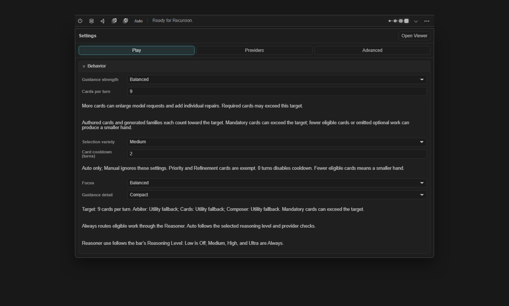
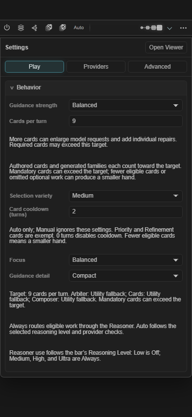
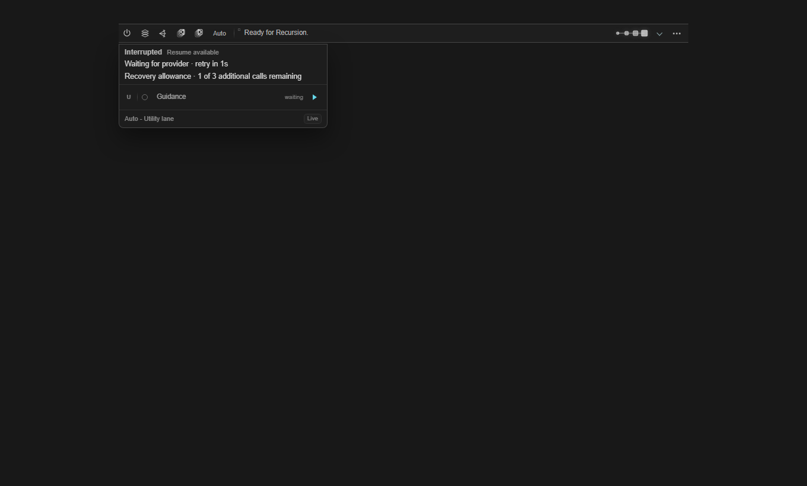
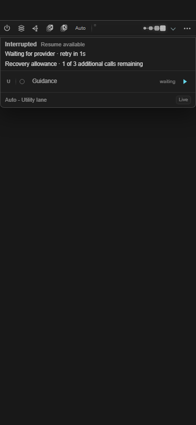

# Failed-run resilience verification — 2026-10-07

Implementation follows the [design specification](../superpowers/specs/2026-10-07-failed-run-resilience-design.md)
and [implementation plan](../superpowers/plans/2026-10-07-failed-run-resilience.md). The
[Default User audit](2026-10-07-default-user-failed-run-review.md) remains dated evidence: the reproduced
Continue defect is synthetic and does not establish the cause of the two audited receipt warnings.

## Regression evidence

| Priority | Verified behavior |
| --- | --- |
| Installed build baseline | Deterministic production hashing, exact inventory staging, bounded immutable metadata reader, missing/invalid/oversized/timeout metadata, symlink guards, and forged-stamp rejection. Runtime declaration never substitutes for installed byte verification. |
| Provider capacity | Shared-profile cooldown survives repeated Retry, queued cancellation, Resume and old timer expiry. Independent profiles remain independent. A real preparation fixture recovers repeated 429s through Fused without segmented fan-out. Status rendering dispatches no requests and adds no timer. |
| Useful history | A parse rejection followed by success clears active failure but preserves the rejection and correction count. 500 ordinary cleanup entries cannot evict retained operation explanations. 20 operations/32 stages/five outcomes bounds preserve aggregate counters. Optional storage failure leaves the verified manifest committed and emits one nonrecursive warning. |
| Cancellation/reload | Abort has fixed cancellation category/copy and trusted or unknown origin. Explained warnings do not receive an invented missing-reason failure. Reload preserves accepted checkpoints, revokes unfinished tokens, dispatches no model call and retains 3,200ms active time without app-closed time. Interrupted is neutral with Resume available. |
| Correct receipts | Actual host/runtime Continue retains the initial reply in model requests and persists selected IDs. Same-deck prior IDs merge at one response position; another deck does not inherit them. Native Normal/placeholder/Swipe/Regenerate layouts, distant edits, target/swipe/chat changes, duplicate/concurrent completion, next-prepare waiting, Stop/incomplete markers and disk rollback are covered. Failed optional receipts do not fail completed narration. |
| Honest measurements/settings | Configuration is captured per operation, including zero-card targets and Low/Off. Read-only analysis excludes unknown timing and non-completed latency samples, separates mixed/unavailable build/config groups, deduplicates overlapping same-chat exports, and uses elapsed preparation rather than summing parallel provider durations. Unsafe paid inputs are rejected before browser imports. |

Focused host, runtime, scheduler/storage/privacy/diagnostics, provider queue/budget, UI and analysis suites pass.
Whole-repository gates and independent review are recorded during final integration below.

## Synthetic production UI

`node tools/scripts/prove-card-selection-settings-ui.mjs` serves production modules/styles against a local
synthetic host. It never contacts SillyTavern or a provider. Desktop **1360×820** and narrow **390×844** passed
with no page or Progress horizontal overflow. Card target 9, variety Medium and cooldown 2 persist across
reload. Keyboard disclosure, field autosave, tab navigation, an uncommitted provider draft during countdown
updates, tooltips-off helpers and the interrupted Resume control are verified. Entry animation settles
before progress screenshots. [Geometry/assertion results](assets/2026-10-07-failed-run-resilience/ui-proof.json).

Current normalization derives Reasoner use as Low → Off and Medium/High/Ultra → Always. The draft
Auto/Always-only experiment was corrected to compare actual Low/Medium levels and state their coupled
routing/reasoning changes. No separate Auto switch or routing default was introduced.

## Final gates and review

Pending final Task 9 verification and independent whole-branch review. The execution plan remains active
until these gates, staging verification, main integration and remote-SHA verification pass.

## Installation and live limits

Use [build staging, account-only verification, reload and rollback instructions](../user/BUILD_INSTALLATION.md).
Final staging records the clean checkout's actual revision and production fingerprint in `build-info.json`.
No Default User live settings, chats, installed extension files, or journals were modified by this goal.
No paid provider benchmark was run. Synthetic passing tests establish the guarded behavior; live latency,
success-rate improvement, and output quality remain unmeasured. The [measurement guide](../testing/LIVE_SMOKE_TEST_PLAN.md#preparation-measurements)
requires explicit dedicated-user/profile/sample opt-in for paid work.
